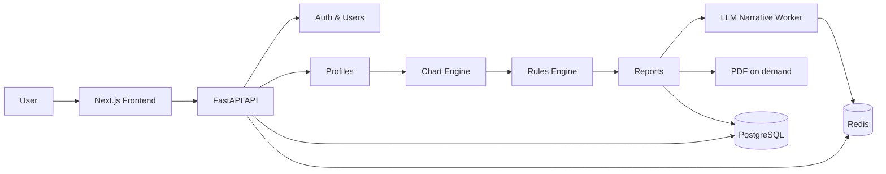

<div align="center">
  <h1>Astrotype</h1>
  <p><strong>Премиальная платформа астрологических self‑reports, соционики и продуктовых вертикалей.</strong></p>

  <p>
    <a href="https://github.com/fixemer90-stack/Archemap/actions/workflows/ci.yml"></a>
    
    
    
    
    
  </p>

  <p>
    <a href="#-быстрый-старт">Быстрый старт</a> ·
    <a href="#-продукт">Продукт</a> ·
    <a href="#-архитектура">Архитектура</a> ·
    <a href="#-документация">Документация</a>
  </p>
</div>

---

## ✨ Что такое Astrotype

Astrotype — это full‑stack SaaS для персональных астрологических отчётов. Платформа соединяет натальную карту, rule‑based интерпретации, соционический движок и narrative‑first UX, чтобы пользователь получал не набор графиков, а понятную историю о себе.

Ключевой принцип проекта: расчёт остаётся проверяемым и объяснимым, а пользовательский интерфейс показывает смысл до raw math, confidence и technical evidence.

```text
birth data → chart snapshot → normalized features → rules → claims + evidence → deep synthesis → staged narrative pipeline → PDF / UI
```

---

## 🧭 Продукт

| Вертикаль            | Что получает пользователь                                             | Статус                  |
| -------------------- | --------------------------------------------------------------------- | ----------------------- |
| **Astrotype Self**   | Натальная карта, личностный портрет, соционика, narrative‑first отчёт | ✅ Реализовано          |
| **Astrotype Career** | Сильные стороны, профессиональные роли, сценарии развития             | ✅ Реализовано          |
| **Astrotype Love**   | Совместимость, паттерны отношений, триггеры конфликтов                | 🧭 Запланировано        |
| **Astrotype Child**  | Профиль ребёнка, семейная интерпретация, рекомендации по воспитанию   | 🧭 Запланировано        |
| **LLM Narrative**    | Staged structured JSON narrative pipeline поверх deterministic report | ✅ Реализовано для Self |

### Почему это не «астро‑гадалка»

- Расчёт строится от исходных данных рождения и астрологических объектов.
- Каждый вывод имеет `evidence trail`: факты → правила → claim.
- Соционический профиль считается отдельным engine‑слоем, а не придумывается текстом.
- Технические детали доступны, но спрятаны в progressive disclosure.
- LLM‑слой пишет валидируемый staged narrative JSON поверх deterministic report и deep synthesis, но не рассчитывает карту и не добавляет факты.

---

## 🖼️ UX отчёта

Self‑report проектируется как связное чтение, а не debug view.

Порядок пользовательского восприятия:

1. **Главное о вас** — 3–5 понятных выводов.
2. **Астрологическая основа** — Солнце, Луна, Асцендент, стихии, модальности, аспекты.
3. **Жизненные проявления** — мышление, эмоции, общение, отношения, фокус.
4. **Сильные стороны и уязвимости** — мягко, без диагнозов и фатализма.
5. **Близость и сексуальность** — как часть Self‑портрета.
6. **Развитие** — практические рекомендации.
7. **Career CTA** — работа затрагивается кратко, глубокий разбор вынесен в Career.
8. **Технические детали** — chart wheel, Model A, raw scores, confidence, evidence.

Подробнее:

- [`docs/design/report-ux-redesign.md`](docs/design/report-ux-redesign.md)
- [`docs/design/self-report-storytelling.md`](docs/design/self-report-storytelling.md)
- [`docs/design/llm-report-narrative-architecture.md`](docs/design/llm-report-narrative-architecture.md)

---

## 🏗️ Архитектура

Astrotype — модульный монолит с domain boundaries и contract‑first подходом.



### Backend

- **FastAPI** + Pydantic v2
- **SQLAlchemy 2.0 async** + Alembic
- **PostgreSQL 16** for users, profiles, reports, payments
- **Redis 7** for cache, rate limiting, Celery broker
- **Swiss Ephemeris / Flatlib** for chart calculations
- **Rule engine** for explainable interpretations
- **Celery** for LLM narrative generation and long‑running tasks
- **WeasyPrint + Jinja2** for PDF rendering
- Report JSON and narrative JSON persisted in PostgreSQL; PDF renders on demand from stored JSON

### Frontend

- **Next.js 16** + React 19
- **Tailwind CSS 4** + shadcn/ui‑style components
- **TanStack Query** for server state
- **Zustand** for client state
- **React Hook Form + Zod** for forms
- Narrative report components, glossary popovers and technical disclosure blocks

### Integrations

- Email/password auth with verification
- Yandex OAuth with HttpOnly cookies
- Password reset and account linking
- YooKassa / Yandex Pay payment architecture
- GitHub Actions CI/CD
- Docker Compose local environment

---

## ⚡ Быстрый старт

### Требования

- Docker + Docker Compose
- Node.js 20+ для локальной frontend‑разработки без контейнера
- Python 3.12+ для локальной backend‑разработки без контейнера

### Запуск через Docker

```bash
git clone git@github.com:fixemer90-stack/Archemap.git
cd Archemap

docker compose up -d --build
```

Сервисы:

| Сервис      | URL                                 |
| ----------- | ----------------------------------- |
| Frontend    | http://localhost:3000               |
| Backend API | http://localhost:8000               |
| API health  | http://localhost:8000/api/v1/health |
| PostgreSQL  | `localhost:5432`                    |
| Redis       | `localhost:6379`                    |
| OpenAPI     | http://localhost:8000/docs          |

### Полезные Docker-команды

```bash
docker compose ps
docker compose logs -f backend
docker compose logs -f frontend
docker compose up -d --build
docker compose down
```

Если локальная база сломалась из‑за старых volume/auth данных:

```bash
docker compose down -v
docker compose up -d --build
```

---

## 🧑‍💻 Разработка без Docker

### Backend

```bash
cd backend
python3 -m venv .venv
source .venv/bin/activate
pip install -e ".[dev]"

alembic upgrade head
uvicorn app.main:app --reload
```

### Frontend

```bash
cd frontend
npm install
npm run dev
```

---

## ✅ Проверки качества

### Backend

```bash
cd backend
ruff check .
ruff format --check .
mypy .
pytest tests/unit -v
pytest tests/integration -v
```

### Frontend

```bash
cd frontend
npx eslint .
npx prettier --check .
npx tsc --noEmit
npm test
npm run build
```

### Report UX regression

```bash
cd frontend
npm test
```

Скрипт проверяет narrative‑first порядок секций, glossary markers и то, что technical/debug components не появляются до advanced details.

---

## 📁 Структура проекта

```text
Astrotype/
├── backend/
│   ├── app/
│   │   ├── api/                 # Versioned API routers
│   │   ├── chart_engine/        # Ephemeris, houses, aspects, socionics
│   │   ├── core/                # Shared kernel: settings, security, base models
│   │   ├── infrastructure/      # DB, Redis, email, storage, geocoding
│   │   └── modules/             # Auth, profiles, charts, reports, narratives, billing, admin
│   ├── alembic/                 # Database migrations
│   ├── rules/                   # Rule sets for product verticals
│   │   ├── self/
│   │   └── career/
│   ├── tests/                   # Unit and integration tests
│   └── workers/                 # Celery tasks
├── frontend/
│   ├── src/
│   │   ├── app/                 # Next.js App Router
│   │   ├── components/          # UI, report, glossary, chart components
│   │   ├── hooks/               # React Query hooks
│   │   ├── lib/                 # API client, report view models, labels
│   │   └── stores/              # Zustand stores
│   └── scripts/                 # UX regression checks
├── contracts/                   # OpenAPI and AsyncAPI contracts
├── docs/
│   ├── design/                  # UX and narrative architecture
│   ├── features/                # Epic/story documentation
│   ├── SRS/                     # Software Requirements Specs
│   └── reviews/                 # Review findings and remediation docs
├── docker-compose.yml
└── README.md
```

---

## 🔐 Безопасность

- JWT хранится в HttpOnly cookies.
- OAuth callback не передаёт токены через URL.
- Refresh tokens поддерживают blacklist.
- Login и geocode endpoints защищены rate limiting.
- Production guard запрещает небезопасные default secrets.
- OAuth access tokens не хранятся в базе.
- Account linking не позволяет отвязать единственный способ входа.

---

## 📚 Документация

| Документ                                                                                                             | Назначение                                             |
| -------------------------------------------------------------------------------------------------------------------- | ------------------------------------------------------ |
| [`PROJECT_INDEX.md`](PROJECT_INDEX.md)                                                                               | Индекс проекта: код, API, docs                         |
| [`docs/SPEC.md`](docs/SPEC.md)                                                                                       | Полная спецификация продукта                           |
| [`docs/ROADMAP.md`](docs/ROADMAP.md)                                                                                 | Дорожная карта                                         |
| [`docs/astrotype_design_code.md`](docs/astrotype_design_code.md)                                                     | Дизайн‑код и визуальная система                        |
| [`docs/design/report-ux-redesign.md`](docs/design/report-ux-redesign.md)                                             | Narrative‑first UX отчёта                              |
| [`docs/design/self-report-storytelling.md`](docs/design/self-report-storytelling.md)                                 | Сторителлинг Self‑отчёта                               |
| [`docs/design/llm-report-narrative-architecture.md`](docs/design/llm-report-narrative-architecture.md)               | Архитектура LLM/staged narrative layer                 |
| [`docs/features/E2-identity/CURRENT-AUTH-FLOW.md`](docs/features/E2-identity/CURRENT-AUTH-FLOW.md)                   | Текущий процесс авторизации                            |
| [`docs/features/E13-report-depth-improvements/FEATURE.md`](docs/features/E13-report-depth-improvements/FEATURE.md)   | Улучшение глубины Self report                          |
| [`docs/SRS/SRS-E13-report-depth-improvements.md`](docs/SRS/SRS-E13-report-depth-improvements.md)                     | SRS для E13 depth-layer отчёта                         |
| [`docs/features/E14-staged-narrative-pipeline/FEATURE.md`](docs/features/E14-staged-narrative-pipeline/FEATURE.md)   | E14: shipped staged pipeline для глубокого Self report |
| [`docs/features/E14-staged-narrative-pipeline/WORKFLOW.md`](docs/features/E14-staged-narrative-pipeline/WORKFLOW.md) | Workflow staged generate → progress → ready → PDF      |
| [`docs/features/E14-staged-narrative-pipeline/API.md`](docs/features/E14-staged-narrative-pipeline/API.md)           | API/state machine staged narrative pipeline            |
| [`docs/SRS/SRS-E14-staged-narrative-pipeline.md`](docs/SRS/SRS-E14-staged-narrative-pipeline.md)                     | SRS для staged narrative pipeline                      |
| [`docs/features/`](docs/features/)                                                                                   | Feature/story документация                             |
| [`contracts/openapi.yaml`](contracts/openapi.yaml)                                                                   | REST API contract                                      |
| [`contracts/asyncapi.yaml`](contracts/asyncapi.yaml)                                                                 | Async/event contract                                   |

---

## 🚢 CI/CD

GitHub Actions запускает:

- backend lint, format check, mypy;
- frontend ESLint, Prettier, TypeScript;
- backend unit/integration tests;
- frontend report UX regression and build;
- OpenAPI / AsyncAPI validation;
- Python and npm security audit;
- Docker image build in the image workflow.

Workflows:

- [`.github/workflows/ci.yml`](.github/workflows/ci.yml) — lint, type checks, tests, contracts, security audit.
- [`.github/workflows/build-push-deploy.yml`](.github/workflows/build-push-deploy.yml) — image build/push path.
- [`.github/workflows/deploy.yml`](.github/workflows/deploy.yml) — deploy path.

---

## 📄 Лицензия

MIT для backend package metadata; отдельный корневой `LICENSE` файл пока не заведён.
