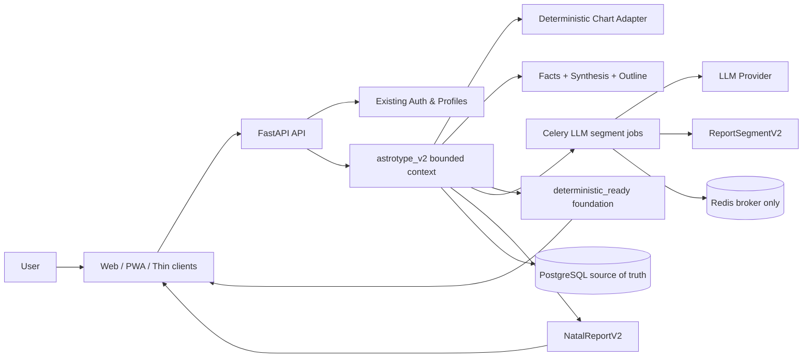

<div align="center">
  <h1>Astrotype</h1>
  <p><strong>Премиальная платформа астрологических self‑reports: active v2 — natal‑only cloud‑core с evidence‑backed LLM‑нарративом.</strong></p>

  <p>
    <a href="https://github.com/fixemer90-stack/Archemap/actions/workflows/ci.yml"></a>
    
    
    
    
    
  </p>

  <p>
    <a href="#-быстрый-старт">Быстрый старт</a> ·
    <a href="#-продукт">Продукт</a> ·
    <a href="#-архитектура">Архитектура</a> ·
    <a href="#-документация">Документация</a>
  </p>
</div>

---

## ✨ Что такое Astrotype

Astrotype — это full‑stack SaaS для персональных натальных отчётов. Активное направление v2 — natal‑only cloud‑core платформа: после регистрации/заполнения профиля backend рассчитывает проверяемую deterministic foundation, сразу показывает пользователю базовую натальную карту/факты/синтез, а LLM‑нарратив догружается асинхронно поверх сохранённых evidence‑backed данных.

Ключевой принцип проекта: расчёт остаётся проверяемым и объяснимым; LLM не рассчитывает карту, не добавляет факты и не блокирует первый полезный экран.

```text
birth/profile data → deterministic_ready foundation → async DeepSeek LLM segments → complete report → UI / PDF
```

---

## 🧭 Продукт

| Вертикаль                | Что получает пользователь                                                                              | Статус                                       |
| ------------------------ | ------------------------------------------------------------------------------------------------------ | -------------------------------------------- |
| **Astrotype Self v2**    | Натальная карта, deterministic foundation, responsive reader, real DeepSeek LLM‑нарратив без соционики | ✅ Web/backend/runtime реализованы, CI green |
| **Astrotype v1 archive** | Исторические Self/Career/LLM narrative документы и идеи для справки                                    | 📦 Архив, не активный контракт               |
| **Astrotype Love**       | Совместимость, паттерны отношений, триггеры конфликтов                                                 | 🧭 После v2 foundation                       |
| **Astrotype Child**      | Профиль ребёнка, семейная интерпретация, рекомендации по воспитанию                                    | 🧭 После v2 foundation                       |

### Почему это не «астро‑гадалка»

- Расчёт строится от исходных данных рождения и астрологических объектов.
- Каждый вывод имеет `evidence trail`: chart rows → facts → synthesis → section evidence ids.
- v2 natal‑only: соционика, Model A, information functions и MBTI не входят в активный v2 отчёт.
- Технические детали доступны, но не превращаются в отдельный dashboard: deterministic foundation — первый полезный экран, LLM‑нарратив догружается позже.
- LLM‑слой пишет валидируемые personality sections поверх persisted facts/synthesis/outline, но не рассчитывает карту и не добавляет факты.

---

## 🖼️ UX отчёта

Self v2 проектируется как progressive report, а не debug view и не ожидание пустого экрана.

Порядок пользовательского восприятия:

1. **Deterministic foundation** — карта, ASC/MC/chart ruler, планеты, дома, аспекты, балансы, акценты домов.
2. **Факты и синтез** — evidence‑backed natal facts, темы, tensions/resources/growth vectors.
3. **Статус нарратива** — `narrative_generating` / `partial` / `complete` без скрытия базовых расчётов.
4. **LLM‑главы** — core pattern, perception/mind, emotions, agency/desire, relationships/intimacy, growth vector.
5. **Компактная техническая база** — calculation details остаются доступны, но не выглядят как отдельный dashboard.

Подробнее:

- [`docs/architecture/astrotype-v2-c4-architecture.md`](docs/architecture/astrotype-v2-c4-architecture.md)
- [`docs/design/astrotype-v2-infographic-db-report-sample.html`](docs/design/astrotype-v2-infographic-db-report-sample.html)
- [`docs/features/E16-v2-e11-web-responsive-reader/FEATURE.md`](docs/features/E16-v2-e11-web-responsive-reader/FEATURE.md)

---

## 🏗️ Архитектура

Astrotype v2 — cloud‑core bounded context поверх существующей платформенной авторизации/профилей. v2 не реиспользует legacy report/socionics REST методы и не импортирует v1 narrative DTO.



### Backend

- **FastAPI** + Pydantic v2
- existing auth/profile infrastructure remains the platform layer
- `backend/app/modules/astrotype_v2/` is the new natal‑only bounded context
- **SQLAlchemy 2.0 async** + Alembic
- **PostgreSQL 16** for canonical v2 chart/fact/report artifacts
- **Redis 7** as broker/runtime only, not durable report storage
- deterministic chart adapter over the existing low-level chart calculator
- **Celery** for async LLM segment generation
- report/calculation JSON persisted in PostgreSQL; PDF renders on demand from stored JSON

### Frontend

- **Next.js 16** + React 19
- **Tailwind CSS 4** + shadcn/ui‑style components
- **TanStack Query** for server state
- **Zustand** for client state
- **React Hook Form + Zod** for forms
- progressive report reader: deterministic foundation first, LLM sections inserted when ready

### Integrations

- Existing email/password auth, verification and OAuth remain platform capabilities
- Yandex OAuth with HttpOnly cookies
- Password reset and account linking
- YooKassa / Yandex Pay payment architecture
- GitHub Actions CI/CD
- Docker Compose local environment

---

## ⚡ Быстрый старт

### Требования

- Docker + Docker Compose
- Node.js 20+ для локальной frontend‑разработки без контейнера
- Python 3.12+ для локальной backend‑разработки без контейнера

### Запуск через Docker

```bash
git clone git@github.com:fixemer90-stack/Archemap.git
cd Archemap

docker compose up -d --build
```

Сервисы:

| Сервис      | URL                                 |
| ----------- | ----------------------------------- |
| Frontend    | http://localhost:3000               |
| Backend API | http://localhost:8000               |
| API health  | http://localhost:8000/api/v1/health |
| PostgreSQL  | `localhost:5432`                    |
| Redis       | `localhost:6379`                    |
| OpenAPI     | http://localhost:8000/docs          |

### Полезные Docker-команды

```bash
docker compose ps
docker compose logs -f backend
docker compose logs -f frontend
docker compose up -d --build
docker compose down
```

Если локальная база сломалась из‑за старых volume/auth данных:

```bash
docker compose down -v
docker compose up -d --build
```

---

## 🧑‍💻 Разработка без Docker

### Backend

```bash
cd backend
uv sync --extra dev
EMAIL_PROVIDER=console uv run alembic upgrade head
EMAIL_PROVIDER=console uv run uvicorn app.main:app --host 127.0.0.1 --port 8000
```

### Worker

```bash
cd backend
EMAIL_PROVIDER=console uv run celery -A workers.celery_app.app worker --loglevel=INFO
```

### Frontend

```bash
cd frontend
npm install
npm run dev -- --hostname 0.0.0.0 --port 3000
```

---

## ✅ Проверки качества

### Backend

```bash
cd backend
uv run ruff check .
uv run ruff format --check .
uv run mypy .
uv run pytest tests/unit -q
```

### Frontend

```bash
cd frontend
npx eslint .
npx prettier --check .
npx tsc --noEmit
npm test
npm run build
```

### Report UX regression

```bash
cd frontend
npm test
```

Скрипт проверяет narrative‑first порядок секций, glossary markers и то, что technical/debug components не появляются до advanced details.

---

## 📁 Структура проекта

```text
Astrotype/
├── backend/
│   ├── app/
│   │   ├── api/                 # Versioned API routers
│   │   ├── chart_engine/        # Ephemeris, houses, aspects, socionics
│   │   ├── core/                # Shared kernel: settings, security, base models
│   │   ├── infrastructure/      # DB, Redis, email, storage, geocoding
│   │   └── modules/             # Auth, profiles, charts, reports, narratives, billing, admin
│   ├── alembic/                 # Database migrations
│   ├── rules/                   # Rule sets for product verticals
│   │   ├── self/
│   │   └── career/
│   ├── tests/                   # Unit and integration tests
│   └── workers/                 # Celery tasks
├── frontend/
│   ├── src/
│   │   ├── app/                 # Next.js App Router
│   │   ├── components/          # UI, report, glossary, chart components
│   │   ├── hooks/               # React Query hooks
│   │   ├── lib/                 # API client, report view models, labels
│   │   └── stores/              # Zustand stores
│   └── scripts/                 # UX regression checks
├── contracts/                   # OpenAPI and AsyncAPI contracts
├── docs/
│   ├── ROADMAP-v2.md             # Active v2 roadmap
│   ├── SRS/                      # Software Requirements Specs
│   ├── architecture/             # v2 C4, DB, cloud-core and calculation docs
│   ├── design/                   # v2 report samples/mockups
│   ├── features/                 # Active v2 epic/story documentation
│   ├── archive/                  # Historical v1 docs, reference-only
│   └── reviews/                  # Review findings and remediation docs
├── docker-compose.yml
└── README.md
```

---

## 🔐 Безопасность

- JWT хранится в HttpOnly cookies.
- OAuth callback не передаёт токены через URL.
- Refresh tokens поддерживают blacklist.
- Login и geocode endpoints защищены rate limiting.
- Production guard запрещает небезопасные default secrets.
- OAuth access tokens не хранятся в базе.
- Account linking не позволяет отвязать единственный способ входа.

---

## 📚 Документация

| Документ                                                                                                                                       | Назначение                                                 |
| ---------------------------------------------------------------------------------------------------------------------------------------------- | ---------------------------------------------------------- |
| [`docs/ROADMAP-v2.md`](docs/ROADMAP-v2.md)                                                                                                     | Активная дорожная карта v2                                 |
| [`docs/SRS/SRS-E16-astrotype-v2-cloud-core.md`](docs/SRS/SRS-E16-astrotype-v2-cloud-core.md)                                                   | Umbrella SRS для v2 cloud-core natal platform              |
| [`docs/architecture/astrotype-v2-c4-architecture.md`](docs/architecture/astrotype-v2-c4-architecture.md)                                       | C4 architecture, progressive delivery, v1 quarantine       |
| [`docs/architecture/astrotype-v2-database-design.md`](docs/architecture/astrotype-v2-database-design.md)                                       | v2 PostgreSQL source-of-truth schema                       |
| [`docs/architecture/astrotype-v2-natal-report-architecture.md`](docs/architecture/astrotype-v2-natal-report-architecture.md)                   | Natal report pipeline and section architecture             |
| [`docs/architecture/astrotype-v2-cloud-core-mobile-desktop-strategy.md`](docs/architecture/astrotype-v2-cloud-core-mobile-desktop-strategy.md) | Cloud-core, Android/PWA and thin desktop strategy          |
| [`docs/architecture/current-payment-confirmation-flow.md`](docs/architecture/current-payment-confirmation-flow.md)                             | Current YooKassa payment confirmation and entitlement flow |
| [`docs/architecture/astrotype-v2-derived-calculations/README.md`](docs/architecture/astrotype-v2-derived-calculations/README.md)               | Derived deterministic calculation references               |
| [`docs/architecture/astrotype-v2-balance-calculation.md`](docs/architecture/astrotype-v2-balance-calculation.md)                               | Balance calculation rules                                  |
| [`docs/design/astrotype-v2-infographic-db-report-sample.html`](docs/design/astrotype-v2-infographic-db-report-sample.html)                     | Canonical v2 report visual sample                          |
| [`docs/design/astrotype-v2-infographic-db-report-data.json`](docs/design/astrotype-v2-infographic-db-report-data.json)                         | Sample data for v2 report visual contract                  |
| [`docs/features/README.md`](docs/features/README.md)                                                                                           | Active v2 feature/story index                              |
| [`docs/features/E16-v2-e15-llm-runtime-integration/FEATURE.md`](docs/features/E16-v2-e15-llm-runtime-integration/FEATURE.md)                   | Real-provider LLM runtime integration and smoke gates      |
| [`docs/features/E16-v2-e16-narrative-depth-quality/FEATURE.md`](docs/features/E16-v2-e16-narrative-depth-quality/FEATURE.md)                   | Narrative depth quality contract and validation gates      |
| [`docs/archive/README.md`](docs/archive/README.md)                                                                                             | Archive rules: v1 is reference-only                        |
| [`docs/archive/v1/`](docs/archive/v1/)                                                                                                         | Historical v1 docs retained away from active contracts     |
| [`contracts/openapi.yaml`](contracts/openapi.yaml)                                                                                             | REST API contract, when present                            |
| [`contracts/asyncapi.yaml`](contracts/asyncapi.yaml)                                                                                           | Async/event contract, when present                         |

---

## 🚢 CI/CD

GitHub Actions запускает:

- backend lint, format check, mypy;
- frontend ESLint, Prettier, TypeScript;
- backend unit/integration tests;
- frontend report UX regression and build;
- OpenAPI / AsyncAPI validation;
- Python and npm security audit;
- Docker image build in the image workflow.

Workflows:

- [`.github/workflows/ci.yml`](.github/workflows/ci.yml) — lint, type checks, tests, contracts, security audit.
- [`.github/workflows/build-push-deploy.yml`](.github/workflows/build-push-deploy.yml) — image build/push path.
- [`.github/workflows/deploy.yml`](.github/workflows/deploy.yml) — deploy path.

---

## 📄 Лицензия

MIT для backend package metadata; отдельный корневой `LICENSE` файл пока не заведён.
