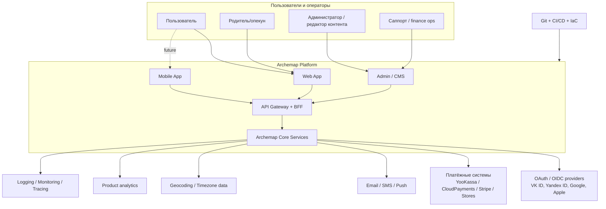
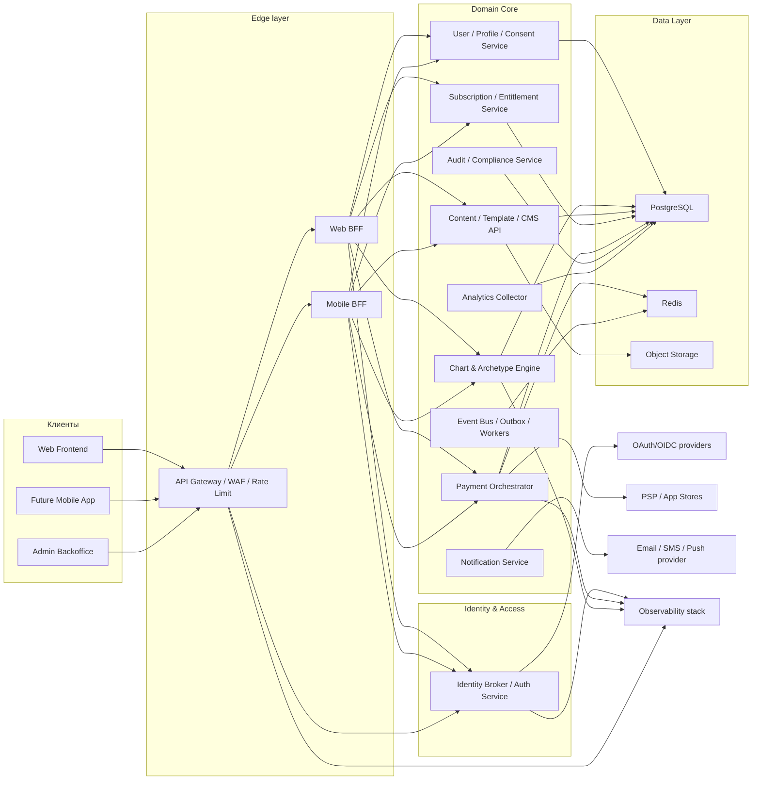
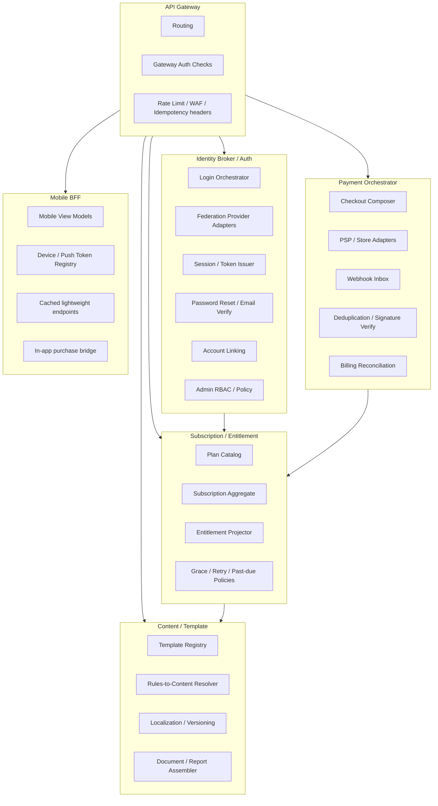
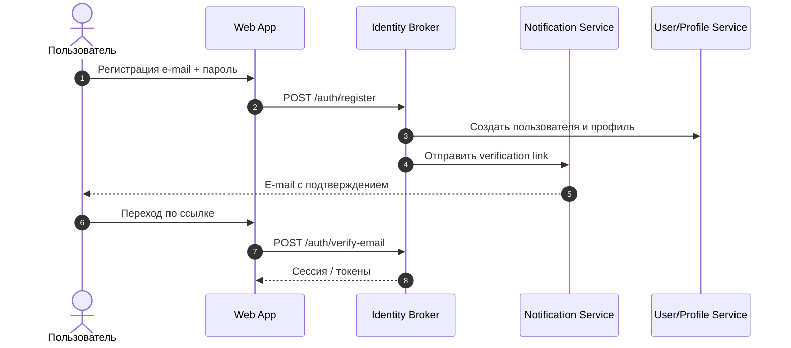
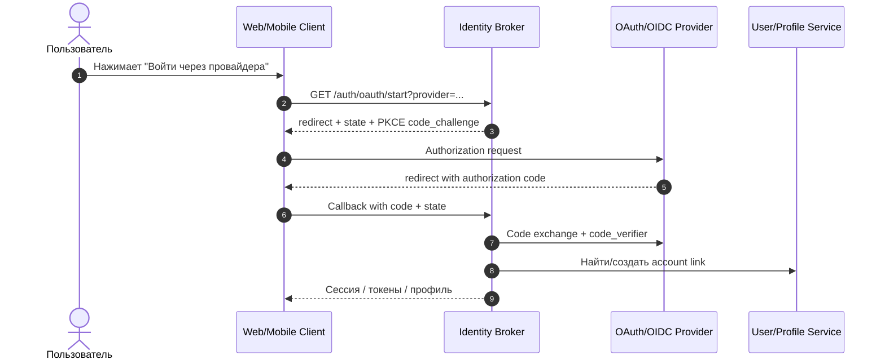
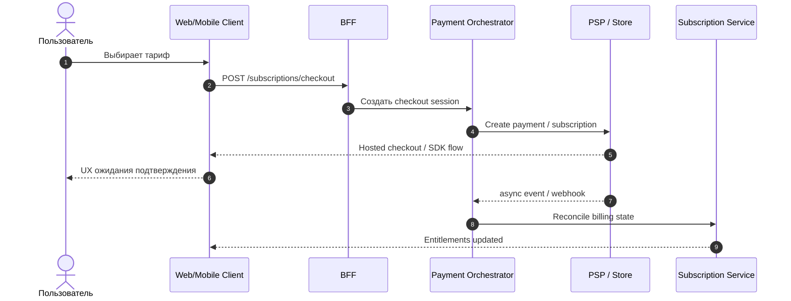
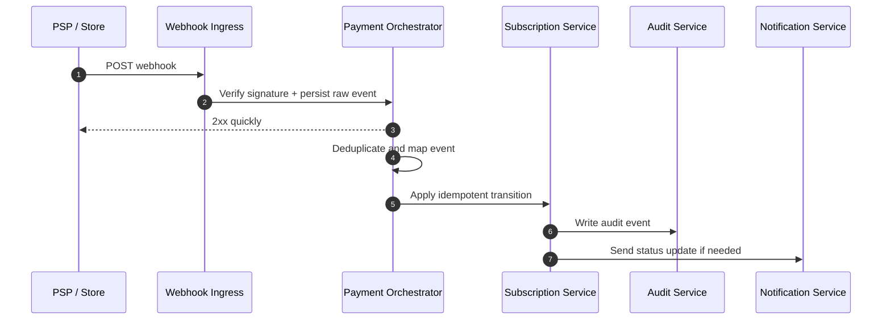
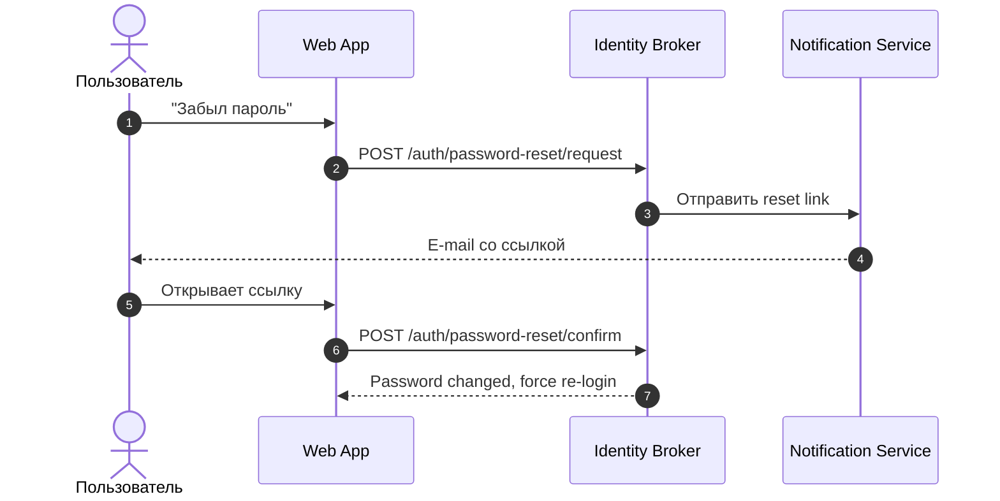
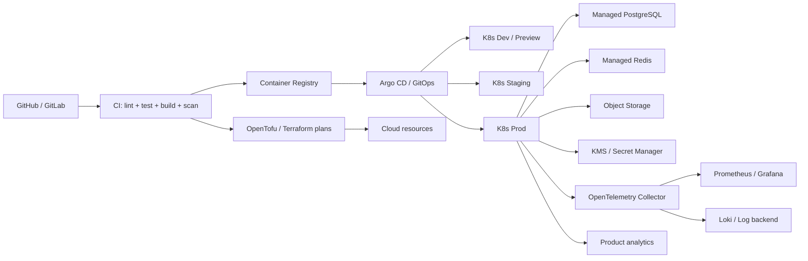
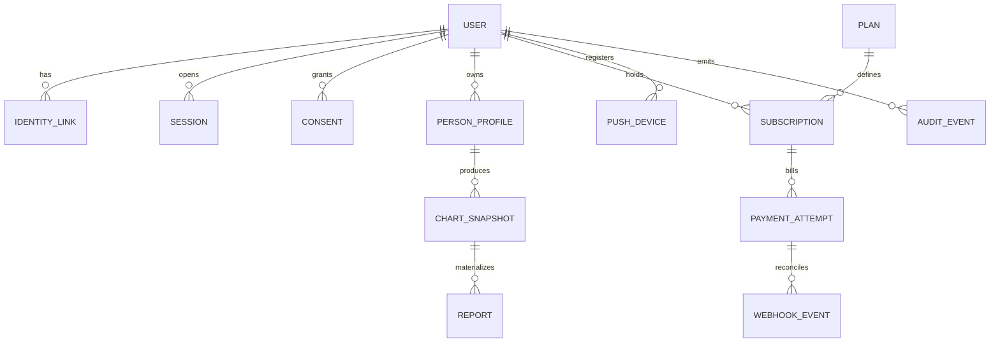

# C4 архитектура SaaS-платформы Archemap

## Резюме для руководства

Для Archemap разумно проектировать не четыре разрозненных продукта, а одну платформу с единым доменным ядром и четырьмя продуктовыми вертикалями: **Archemap Self**, **Archemap Love**, **Archemap Child**, **Archemap Career**. Общая часть должна включать идентификацию пользователя, профиль и согласия, расчёт натальной карты и нормализованных признаков, rule-based интерпретацию, контент/шаблоны, подписки, платежи, уведомления, аналитику и наблюдаемость. Это особенно важно потому, что в исходной концепции уже зафиксирован детерминированный конвейер: вычисление карты, нормализация, rule-based scoring и шаблонная интерпретация, а LLM-слой допускается только как необязательная надстройка и может быть полностью отключён. fileciteturn0file0

С учётом неуточнённого масштаба и требования «без экспресс-решений» оптимальная стартовая форма — **модульная платформа с жёстко разделёнными bounded contexts и контрактами**, разворачиваемая как несколько контейнеров, но без преждевременного дробления бизнес-логики на десятки микросервисов. На внешнем контуре нужны API Gateway и отдельные **BFF для web и future mobile**, потому что BFF-паттерн снижает конфликт требований между интерфейсами, а API gateway даёт единый вход, маршрутизацию и вынос cross-cutting concerns вроде аутентификации, rate limit и TLS termination. Для последующего выделения «горячих» модулей безопаснее использовать эволюционный путь в духе **Strangler Fig**. citeturn39view0turn40view1turn40view2turn40view3

Аутентификация должна строиться через **identity broker** с поддержкой локальной учётной записи и федерации через OAuth/OIDC-провайдеров. Для всех публичных клиентов, включая web SPA и будущее mobile-приложение, нужен **Authorization Code Flow + PKCE**; implicit flow сейчас считается нежелательным из-за рисков утечки и replay/access-token leakage. Для OIDC-провайдеров нужна проверка `state` и `nonce`, а для браузерных сессий — защищённые cookies с `Secure`, `HttpOnly` и `SameSite`. Если в iOS-приложении будет любой social login, Apple требует предоставить эквивалентный privacy-preserving логин-сервис с ограничением собираемых данных до имени и e-mail и возможностью скрыть e-mail. citeturn3view0turn3view3turn3view4turn11view0turn21view1turn8view2turn8view3

Подписки и платежи должны быть выделены в отдельный биллинговый контур: **каталог планов → оркестрация checkout → платёжный адаптер → webhook inbox → reconciliation → entitlement projection**. Это снимает жёсткую связность между поставщиком платежей и правами доступа. Официальные материалы YooKassa, CloudPayments и Stripe сходятся в том, что recurring/subscription-платежи и жизненный цикл подписки завязаны на асинхронные события и webhook/event endpoints; значит, нельзя выдавать доступ «по UI-факту оплаты», только по подтверждённому биллинговому состоянию. Для native mobile нужно сразу спроектировать **двойной биллинг-контур**: web billing через PSP и in-app billing через store adapters, потому что digital goods в iOS/Google Play часто подпадают под store billing rules. citeturn18view0turn19view0turn19view3turn20view0turn20view1turn21view2turn23view0turn23view3

Безопасность следует закладывать как архитектурный baseline, а не как «добавку после MVP»: OWASP ASVS как каркас требований, OWASP API Security Top 10 как ориентир для публичных API, TLS 1.3 by default, центральное secrets management, envelope encryption/KMS, password hashing через Argon2id, защита forgot-password от enumeration, строгая авторизация на уровне объекта и свойства данных, отдельный webhook perimeter и централизованная наблюдаемость через traces/metrics/logs. Для **Archemap Child** отдельно важны data minimization и юридическая модель consent/parental consent по рынкам запуска. citeturn4view3turn4view4turn4view1turn4view2turn6view4turn5view0turn7view0turn6view0turn41view0turn42view2turn38view2turn38view3

## Функциональный контур и допущения

Функционально платформа должна выглядеть так: **Self** отвечает за первичный «архетипический портрет» пользователя; **Love** — за совместимость, паттерны близости, конфликтные триггеры и сценарии взаимодействия; **Child** — за профиль ребёнка, рекомендации по стилю взаимодействия и семейную интерпретацию; **Career** — за сильные стороны, роли, рабочие сценарии и формат профессионального развития. Все четыре сервиса должны использовать одно и то же вычислительное ядро и один и тот же каталог признаков, а различаться — слоями правил, контентом, планами подписки, UX-оркестрацией и разрешениями на доступ. Такой подход убирает дублирование, повышает explainability и позволяет масштабировать линейку продуктов без хардкода по каждому сервису. Это согласуется с внутренней идеей Archemap как explainable deterministic pipeline, а не как heavy-runtime-AI продукта. fileciteturn0file0

Чтобы выполнить требование «минимум или ноль AI в runtime», расчётный слой лучше строить на **детерминированных астрономических и символических библиотеках**, а не на генеративной модели. Для этой роли хорошо подходят Swiss Ephemeris как высокоточная эфемеридная база и Flatlib как Python-библиотека для построения астрологических объектов и карт. Для корректной исторической локализации времени рождения нужны актуальные time-zone rules, а значит — нормальная работа с IANA Time Zone Database; для геокодирования/обратного геокодирования места рождения можно использовать внешний сервис класса GeoNames на этапе ввода, после чего сохранять нормализованный гео-снапшот внутри платформы. citeturn33view0turn34view0turn32view0turn32view1

«Без хардкода» в этой системе означает, что в базе и конфигурации должны жить минимум следующие сущности: каталог OAuth-провайдеров; матрица ролей и entitlements; продуктовые планы и цены; правила расчёта и их версии; текстовые шаблоны и контент-паки; таблицы локализации; feature flags; маршруты уведомлений; параметры PSP/store-провайдеров; правила ретраев и дедупликации событий; схемы документов и API-контрактов. Секреты при этом не хранятся ни в коде, ни в `.env`, зашитых в контейнер, а централизуются в vault/secret manager. OWASP отдельно подчёркивает, что секреты часто оказываются захардкоженными в коде и конфигурации, а практикой по умолчанию должны быть централизация, стандартизация и аудит жизненного цикла секретов. citeturn6view0turn6view1

Ниже — базовые доменные сервисы и их общие зависимости.

| Продуктовый домен | Основные сценарии | Общие платформенные зависимости |
|---|---|---|
| Archemap Self | онбординг, базовый архетипический профиль, персональный отчёт, обновления контента | identity, chart engine, rules, content, subscription, notifications |
| Archemap Love | пары, совместимость, сценарии общения, отношения | identity, chart engine, relationship rules, content, billing, entitlements |
| Archemap Child | детский профиль, родительский кабинет, семейные рекомендации | identity, parental consent, chart engine, child-safe content, audit |
| Archemap Career | роли, способности, профили развития, карьерные пакеты | identity, chart engine, career rules, content, billing, analytics |

## C4 уровень System Context

Ниже — уровень **System Context**: кто взаимодействует с платформой и какие внешние системы неизбежны.



Внешний контур здесь неслучайно широк. Для social login платформа будет зависеть от внешних identity providers; для платных подписок — от PSP и, в мобильном сценарии, от App Store / Google Play billing; для доставки сервисных событий — от e-mail/SMS/push-провайдера; для ввода натальных параметров — от geocoding/timezone-resolution; для эксплуатационной зрелости — от observability stack и Git-centric delivery chain. Google прямо документирует OIDC-поток для логина, Yandex — собственную OAuth-реализацию, Apple — platform rules для логина и подписок, а платежные провайдеры — recurring billing и webhook/event lifecycle. citeturn11view0turn11view3turn21view1turn21view2turn18view0turn19view0turn20view0turn20view1

Контекст авторизации должен разделять **identity** и **entitlements**. Провайдер входа только подтверждает личность и выдаёт claims; право видеть Love/Child/Career и конкретные платные отчёты определяется уже внутренним subscription/entitlement слоем. Это уменьшает coupling между OAuth-провайдерами и монетизацией, упрощает миграцию между провайдерами и позволяет сохранять единый access model для web и mobile. Дополнительно это снижает риск одной из ключевых API-ошибок — broken object level authorization — потому что доступ к каждому ресурсу проверяется не «по факту логина», а по комбинации subject, role, ownership и entitlement. citeturn4view2turn4view1

Для iOS/Android важно сразу принять архитектурное решение: **web-подписка и store-подписка — это не один и тот же checkout**, а два параллельных канала, сходящихся в общей модели подписки. Apple требует disclosure для recurring payments, а Google для in-app digital goods на Play требует Google Play billing system в рамках своей policy, с исключениями только для отдельных программ и случаев. Следовательно, в System Context надо считать App Store и Google Play не «частностью клиента», а отдельными внешними платежными системами платформы. citeturn21view2turn23view0turn23view3

## C4 уровень Container

На контейнерном уровне лучший баланс между масштабируемостью и сложностью даёт архитектура «**platform core + dedicated edge/integration containers**». Ниже — рекомендуемая логическая раскладка.



Эта модель использует BFF-паттерн строго по назначению: web и mobile могут иметь разные response shapes, pagination policies, кеширование, device/session semantics и политику деградации, не превращая backend в компромисс для всех клиентов сразу. Microsoft прямо описывает BFF как слой между интерфейсом и backend, который снимает competing demands разных клиентов, а cross-cutting concerns вроде authorization, routing и monitoring эффективнее выносить в gateway. citeturn39view0turn40view1

Для identity есть два зрелых класса опций. **Self-hosted broker** на базе Keycloak удобен, если нужен полный контроль, on-prem или российское размещение, кастомизация login UX, identity brokering, vault integration и HA в Kubernetes. **Managed CIAM** наподобие Auth0 уместен, если приоритет — скорость запуска, готовые quickstarts для web/mobile/API и уменьшение собственной операционной нагрузки. Keycloak официально документирует production configuration, Kubernetes deployment, distributed cache, observability, vault usage, OIDC security и high-availability architectures; Auth0 — идентичностную платформу для web, mobile и backend/API. citeturn35view0turn35view1turn36view1turn36view2

Рекомендуемый набор контейнеров и их ответственность выглядит так:

| Контейнер | Ответственность | Основные данные | Технологический класс |
|---|---|---|---|
| Web Frontend | web UI, onboarding, checkout initiation, account area | нет долговременного хранилища | SPA/SSR web stack |
| Mobile App | future native UX, offline-aware flows, in-app purchase entry | device-local cache | iOS / Android / KMP |
| API Gateway | единая ingress-точка, TLS termination, WAF, routing, throttling, coarse auth checks | конфигурация gateway | managed gateway / ingress |
| Web BFF | web-oriented aggregation, session endpoints, view models | краткоживущий кэш | server-side API |
| Mobile BFF | mobile-optimized payloads, device registration, push bootstrap, lighter contracts | краткоживущий кэш | server-side API |
| Identity Broker | local auth, OAuth/OIDC federation, account linking, sessions, password reset | users, provider links, sessions | Keycloak/Auth0/эквивалент |
| User/Profile/Consent | birth profiles, consents, parental flags, account preferences | PostgreSQL | typed backend service |
| Chart & Archetype Engine | deterministic chart calculation, normalized features, rule evaluation | PostgreSQL + object snapshots | typed backend service |
| Content/Template Service | версии шаблонов, локализация, CMS, explainable snippets | PostgreSQL + object storage | CMS/API |
| Subscription/Entitlement | планы, subscriptions, grace periods, access grants | PostgreSQL | billing domain service |
| Payment Orchestrator | checkout sessions, provider adapters, idempotency, webhook inbox | PostgreSQL + Redis | integration service |
| Notification Service | e-mail/SMS/push delivery orchestration | delivery logs, templates | async worker/service |
| Analytics Collector | product events, consent-aware analytics normalization | events store / warehouse sink | event ingestion service |
| Audit/Compliance | immutable-ish audit trail, admin actions, consent history | PostgreSQL / archive | security/compliance service |

На уровне хранилищ базовая тройка — **PostgreSQL + Redis + Object Storage** — обычно достаточна. PostgreSQL хранит транзакционные доменные агрегаты; Redis нужен для session-adjacent data, idempotency keys, short-lived rate-limit buckets и очередей/locks; object storage полезно использовать для report artifacts, static template assets и архивов событий. Шифрование на уровне at-rest storage не должно быть единственной защитой: OWASP рекомендует начинать с threat model, минимизировать хранение чувствительных данных, а ключи держать отдельно от данных и управлять ими через dedicated secrets/key systems, которыми облака обычно уже располагают. citeturn41view0turn42view2turn24view1turn24view5

## C4 уровень Component и ключевые sequence flows

Компонентный уровень нужно нормализовать вокруг шести core-контейнеров: **API Gateway, Identity Broker, Payment Orchestrator, Subscription/Entitlement, Content Service, Mobile BFF**. Ниже — их рекомендуемая детализация.



Внутри **Auth** сервис должен различать четыре потока: local account lifecycle, federated login, account linking и privileged/admin access. Внутренние subject identifiers лучше делать не зависящими от внешнего провайдера: `user_id` остаётся внутренним, а provider identities хранятся как `identity_links`. Это упрощает смену провайдера и предотвращает «прорастание» социальных ID по всей модели данных. Для **authorization** достаточно не только RBAC: лучше сочетать `role + ownership + entitlement + policy flags` по API-ресурсу. Это защищает от BOLA/BOPLA-класса ошибок, которые OWASP отдельно выделяет в API Top 10. citeturn4view2turn4view1

Внутри **Payment Orchestrator** критичны вовсе не SDK, а компоненты над ними: canonical checkout model, mapping provider-specific statuses в internal billing states, входной webhook inbox, дедупликация, сигнатурная проверка, идемпотентные transitions и отделение «получили внешнее событие» от «раздали права пользователю». Stripe рекомендует быстро отвечать `2xx` до тяжёлой логики, CloudPayments документирует типы уведомлений и recurrent/fail-signals для подписок, а YooKassa отдельно описывает автоплатежи и входящие уведомления в своём API. citeturn20view1turn19view2turn19view3turn18view0

Внутри **Subscription/Entitlement** должен существовать не один объект «подписка», а минимум три слоя: `plan catalog`, `billing subscription`, `effective entitlements`. Это позволяет поддерживать trials, grace period, family-style plans, промо-пакеты и временное отключение доступа без ломки биллинговой модели. В мобильном сценарии сюда же сходятся store receipts/renewals и web-PSP renewals. citeturn20view0turn23view3

Ниже — ключевые sequence flows.



Для локальной регистрации пароль хранится только как безопасный hash; само подтверждение учётной записи должно идти по one-time token через side-channel. OWASP рекомендует современные медленные password-hashing algorithms, такие как Argon2id, и подчёркивает, что пароли нельзя хранить ни в plaintext, ни в reversible encryption. citeturn5view0



Для federated login критичны `state`, `nonce` и PKCE с `S256`; implicit flow использовать не стоит. Google отдельно описывает server flow с anti-forgery state token, RFC 7636 — защиту authorization code через `code_verifier`, а OAuth security BCP прямо фиксирует, что PKCE полезен для всех классов клиентов и что implicit grant следует избегать. citeturn11view0turn3view0turn3view3turn3view4





Подписочный доступ должен активироваться не после фронтендового callback, а после биллингового подтверждения. Для webhook handling обязательно: проверка подписи, сырое сохранение события, дедупликация, идемпотентный state machine и быстрый ответ провайдеру до тяжёлой обработки. Это необходимо и для адекватной работы recurring lifecycle, и для последующего расследования спорных транзакций. citeturn20view1turn19view2turn19view3turn20view0



OWASP для forgot-password рекомендует одинаковые ответы для существующих и несуществующих аккаунтов, равномерное время ответа, side-channel delivery, криптографически стойкие одноразовые токены и отсутствие автоматического логина сразу после сброса. citeturn7view0

Для code-level mapping удобно держать репозиторий так, чтобы доменная декомпозиция была читаема и людьми, и AI-инструментами:

```text
/apps
  /web
  /admin
  /mobile-bff
  /web-bff
/services
  /identity
  /billing
  /subscription
  /notifications
  /analytics-collector
/modules
  /domain-self
  /domain-love
  /domain-child
  /domain-career
  /chart-engine
  /content-catalog
  /policy-authz
/packages
  /contracts-openapi
  /contracts-events
  /shared-observability
  /shared-security
  /shared-db-migrations
/docs
  /c4
  /adr
  /openapi
  /asyncapi
  /examples
  /glossary
```

## Безопасность и контрольный список

В этой платформе основной риск-профиль задают: публичные API, вход через federated providers, локальные пароли, recurring billing, обработка webhook’ов, Child-данные и админский контур. OWASP ASVS даёт каркас требований для secure development и проверки технических контролей; OWASP API Security Top 10 напоминает, что для SaaS с множеством сущностей особенно опасны object-level authorization bugs, broken authentication и excessive data exposure. citeturn4view3turn4view4turn4view1turn4view2

| Область | Базовая мера | Почему это обязательно | Основание |
|---|---|---|---|
| OAuth/OIDC | Authorization Code + PKCE `S256`, `state`, `nonce`, без implicit | снижает риск code interception, injection и token leakage | citeturn3view0turn3view3turn3view4turn11view0 |
| Сессии браузера | `Secure` + `HttpOnly` + `SameSite=Strict/Lax`, префикс `__Host-` | снижает риск MitM, cookie theft, CSRF и subdomain forgery | citeturn8view2turn8view3 |
| Пароли | Argon2id, уникальная соль, при необходимости pepper | plaintext/reversible storage неприемлемы | citeturn5view0 |
| Forgot password | единый ответ, одинаковое время ответа, одноразовые expiry tokens, без auto-login | защищает от enumeration и упрощает безопасный recovery | citeturn7view0 |
| TLS | TLS 1.3 по умолчанию, TLS 1.2 для совместимости, запрет TLS 1.0/1.1 и SSL | современный минимум для публичных сервисов и webhook endpoints | citeturn6view3turn6view4 |
| Secrets | централизованный secrets manager/vault, ротация, аудит доступа, никаких секретов в коде | секреты часто утекают через код/конфиги, нужен lifecycle control | citeturn6view0turn6view1turn24view1turn24view5 |
| Encryption at rest | KMS/envelope encryption, отдельные ключи по назначению, ключи отдельно от данных | снижает blast radius и упрощает ротацию/восстановление | citeturn41view0turn42view1turn42view2 |
| API authorization | ownership checks + entitlements + field/property authorization | закрывает BOLA/BOPLA-класс ошибок | citeturn4view2turn4view1 |
| Webhooks | signature verification, raw-event storage, fast `2xx`, idempotency, dedupe | платежные события асинхронны и могут приходить повторно | citeturn20view1turn19view2turn19view3 |
| Logging | не логировать персональные и чувствительные данные без правового основания; логировать auth failures, lockouts и admin actions | баланс между расследованием и privacy | citeturn6view2turn8view0 |
| SSRF/egress | allowlist для внутренних и внешних вызовов, отдельный egress policy | особенно важно для webhook callbacks, media fetch и geocoding | citeturn8view4 |
| Child-данные | минимизация данных, parental-consent workflow, отдельные retention rules | детские данные требуют усиленной защиты; в ЕС статья 8 GDPR прямо задаёт рамку child consent | citeturn38view2turn38view3 |

Дополнительно я бы закладывал **ASVS L2** как общий baseline для продукта и относил auth, payments и admin surface к повышенному внутреннему профилю контроля. Не потому, что так «требует стандарт» в данной формулировке, а как архитектурный вывод: эти поверхности в Archemap одновременно и публичные, и финансово, и репутационно критичные. citeturn4view3turn4view4

Для Archemap Child стоит отдельно развести три вида данных: данные взрослого владельца аккаунта, данные ребёнка как доменный профиль и derived interpretations/reports. Хранить нужно только то, что действительно необходимо для расчёта и UX; лишние аналитические трекеры, session replay на формах ввода даты/времени/места рождения и broad data sharing здесь лучше отключать или сильно редактировать. GDPR требует data minimisation и даёт специальную рамку для child consent при информационных сервисах. citeturn38view2turn38view3turn6view2

## Развёртывание, CI/CD, данные, API, масштабирование и тестирование

По deployment topology оптимален **multi-environment managed-Kubernetes/GitOps** вариант: `dev → preview → staging → prod` с раздельными доменами, OAuth redirect URIs, payment terminals/projects, secrets и telemetry namespaces. Yandex Managed Service for Kubernetes и Amazon EKS официально позиционируются как managed Kubernetes среды для развёртывания, масштабирования и управления контейнерными приложениями; Argo CD — как declarative GitOps CD для Kubernetes; GitHub Actions и GitLab CI/CD — как платформы автоматизации build/test/deploy; Helm и OpenTofu/Terraform — как инструменты декларативной упаковки и IaC. citeturn24view0turn24view4turn27view1turn26view0turn27view0turn27view2turn27view3turn27view4



Практически pipeline должен быть таким: pull request запускает линтеры, unit/integration tests, schema checks, OpenAPI diff, migration validation, SAST/SCA и построение образов; после merge в main публикуются артефакты и декларативные manifests/charts; Argo CD подтягивает нужный git state в окружение; database migrations идут в управляемом, повторяемом шаге, а rollout сопровождается smoke checks и автootкатом по health criteria. Разделение CI и CD особенно полезно для traceability и AI-friendly docs: архитектура, контракты и инфраструктура лежат в version control и воспроизводимы из git. citeturn26view0turn27view0turn27view1turn27view2turn27view3

Для данных я бы закладывал следующую каноническую модель:



Минимальный набор сущностей: `User`, `IdentityLink`, `Session`, `Consent`, `PersonProfile`, `ChartSnapshot`, `RuleSetVersion`, `TemplateVersion`, `Report`, `Plan`, `Subscription`, `PaymentAttempt`, `WebhookEvent`, `Entitlement`, `Notification`, `AuditEvent`, `PushDevice`. Важно отделить **PersonProfile** от **ChartSnapshot**: пользователь может менять данные профиля, но уже сгенерированный отчёт должен указывать, по какой именно версии исходных данных, библиотеки, ruleset и template он был создан. Это даёт воспроизводимость для саппорта, аналитики и будущих миграций контента. Архитектурно это также сильно помогает AI-friendly документации: у каждого вычислительного шага и у каждой версионности есть стабильный идентификатор и прозрачная цепочка артефактов. fileciteturn0file0

Для API лучше придерживаться нескольких принципов: resource-oriented REST для синхронного продукта, event contracts для асинхронных интеграций, versioned schemas, idempotency для write-операций, явное разделение user-facing и admin APIs, независимые audiences для web/mobile, а также отдельные callback/webhook endpoints без смешивания с пользовательским API. Gateway-паттерны здесь особенно полезны, потому что one endpoint плюс routing/aggregation/offloading уменьшают coupling фронтов к внутреннему составу сервисов. citeturn40view1turn40view4turn39view0

Примеры внешних endpoint’ов могут выглядеть так:

```http
POST   /v1/auth/register
POST   /v1/auth/login
GET    /v1/auth/oauth/providers
GET    /v1/auth/oauth/start/{provider}
POST   /v1/auth/oauth/callback/{provider}
POST   /v1/auth/password-reset/request
POST   /v1/auth/password-reset/confirm

GET    /v1/me
PATCH  /v1/me
GET    /v1/me/consents
POST   /v1/me/consents

POST   /v1/profiles
GET    /v1/profiles/{profileId}
PATCH  /v1/profiles/{profileId}

POST   /v1/reports/self/generate
POST   /v1/reports/love/generate
POST   /v1/reports/child/generate
POST   /v1/reports/career/generate
GET    /v1/reports/{reportId}

GET    /v1/plans
POST   /v1/subscriptions/checkout
GET    /v1/subscriptions/current
POST   /v1/subscriptions/{id}/cancel

POST   /v1/payments/webhooks/{provider}
POST   /v1/mobile/stores/apple/notifications
POST   /v1/mobile/stores/google/notifications
```

Наблюдаемость я бы делал стандартной и переносимой: **OpenTelemetry** как общий vendor-neutral слой сигналов, **Prometheus** для метрик и alerting, **Loki** или эквивалент для логов, а для product analytics — consent-aware инструмент вроде **PostHog**, который штатно покрывает product analytics, session replay, feature flags и error tracking. OpenTelemetry прямо описывает себя как open-source, vendor-agnostic framework для traces/metrics/logs; Prometheus — как systems monitoring and alerting toolkit; Loki — как cost-effective logging stack с индексированием labels; PostHog — как набор developer/product analytics возможностей. citeturn30view0turn30view1turn30view2turn30view3turn30view4

Масштабирование стоит планировать поэтапно. На старте достаточно horizontal scaling для stateless edge/BFF/worker containers, read-replica для аналитически тяжёлых чтений, Redis-caching для frequently accessed payloads и асинхронной генерации отчётов. При росте нагрузки выносятся первыми, как правило, три зоны: биллинг/webhooks, content/report assembly и analytics pipeline. Переход выполнять через Strangler Fig: выделять функциональность за фасадом/gateway, переводить трафик постепенно, держать совместимость контрактов и только после стабилизации удалять старую реализацию. citeturn40view2turn40view3

Тестирование должно быть многоуровневым. Для Archemap особенно важны **golden tests** на доменную интерпретацию: один и тот же профиль, timezone snapshot, library version, ruleset version и template version должны давать предсказуемый результат. Поверх этого нужны contract tests на OAuth callbacks и webhooks, интеграционные тесты для provider adapters, e2e сценарии для signup/login/purchase/cancel/grace/renewal, security tests по ASVS/API Top 10, а также нагрузочные тесты на checkout, вход и генерацию отчётов. ASVS полезен здесь как систематический baseline проверки security controls, а Strangler-стратегия снижает риск миграций именно потому, что позволяет тестировать приращениями. citeturn4view3turn40view2

## Рекомендуемые провайдеры, сервисы, библиотеки и развилки выбора

Ниже — компактный набор практических сравнений, который можно использовать как decision matrix до выбора конкретного стека.

| OAuth / login provider | Когда уместен | Сильные стороны | Риски / ограничения | Источники |
|---|---|---|---|---|
| **VK ID** | обязателен по бизнес-требованию для RU-аудитории | высокая узнаваемость в RU-контуре; важен как social login канал | протокольные детали и policy-поведение нужно верифицировать по актуальной документации на этапе интеграции | бизнес-требование проекта |
| **Yandex ID** | RU-сценарий, локальный рынок | официальная OAuth-реализация, русскоязычная документация | зависимость от внешнего IdP и его доступности | citeturn11view3 |
| **Google** | международная аудитория, web/mobile | OIDC, официальный server flow, client libraries, anti-forgery state guidance | для iOS social login в app-сценарии придётся учитывать Apple rules | citeturn11view0turn21view1 |
| **Apple** | обязателен/почти обязателен для iOS-social-login сценариев | privacy-oriented UX, совместимость с Apple platform rules | дополнительная сложность настройки, особенно если web+android+iOS | citeturn21view1turn21view2 |
| **Локальная учётная запись** | fallback и password-reset сценарии | независимость от внешних IdP, полный контроль recovery | самый высокий security burden: passwords, brute force, reset, session hygiene | citeturn5view0turn7view0turn8view0 |

| Платёжный вариант | Recurring / subscription | Webhooks / async events | Когда выбирать | Источники |
|---|---|---|---|---|
| **YooKassa** | есть автоплатежи и сохранение способа оплаты | есть входящие уведомления в API | сильный кандидат для RU web-billing | citeturn18view0 |
| **CloudPayments** | есть рекуррентные платежи, подписки и смена графика/суммы | есть Pay/Fail/Recurrent и др. уведомления | хороший выбор для подписочной модели в RU | citeturn19view0turn19view2turn19view3 |
| **Stripe** | зрелый subscription lifecycle, invoices, entitlements | развитая webhook/event модель | международный сценарий и богатая биллинговая логика | citeturn20view0turn20view1 |
| **Apple / Google in-app billing** | да, для native mobile subscriptions | store notifications / lifecycle events | обязательно учитывать, если подписка продаётся как digital good внутри mobile app | citeturn21view2turn23view0turn23view3 |

| Hosting option | Плюсы | Минусы | Кому подходит | Источники |
|---|---|---|---|---|
| **Yandex Managed Service for Kubernetes** | русскоязычная документация, managed k8s, интеграция с Lockbox, соответствие RU data-localization контексту | меньшая глобальная экосистема, чем у hyperscalers | RU-first запуск, локальный data residency | citeturn24view0turn24view1 |
| **Amazon EKS** | mature managed Kubernetes, масштабируемость и широкий ecosystem fit | выше complexity/cost profile, возможные jurisdictional ограничения проекта | международный запуск и мульти-регион | citeturn24view4turn24view5 |
| **Self-managed Kubernetes / on-prem** | полный контроль, удобно для жёстких требований по локализации и интеграции | максимальная операционная нагрузка и самая высокая цена ошибок | если compliance или инфраструктурный контроль доминируют над скоростью | архитектурный вариант |

| Категория | Предпочтительные варианты | Комментарий | Источники |
|---|---|---|---|
| Identity broker | **Keycloak** / **Auth0** | Keycloak — контроль и self-host; Auth0 — managed CIAM | citeturn35view0turn35view1turn36view1turn36view2 |
| Domain engine | **Swiss Ephemeris** + **Flatlib** | deterministic runtime без heavy AI | citeturn33view0turn34view0 |
| Geo/Timezone | **IANA TZ DB** + **GeoNames** | корректность исторических часовых правил и нормализация места | citeturn32view0turn32view1 |
| Observability | **OpenTelemetry** + **Prometheus** + **Loki** | переносимая telemetry stack | citeturn30view0turn30view1turn30view2 |
| Product analytics | **PostHog** | product analytics + session replay + feature flags, но Child-формы лучше маскировать/исключать | citeturn30view3turn30view4 |
| Delivery | **GitHub Actions** или **GitLab CI/CD** + **Argo CD** + **Helm** + **OpenTofu/Terraform** | declarative version-controlled pipeline | citeturn26view0turn27view0turn27view1turn27view2turn27view3turn27view4 |

Открытые вопросы и ограничения остаются такими. Технический стек приложения не задан, поэтому выше предложен **stack-agnostic** контейнерный и компонентный дизайн, а не выбор конкретного языка/фреймворка. Целевой масштаб не указан, поэтому я сознательно рекомендую эволюционную архитектуру с чёткими контрактами и будущим выделением hot paths, а не «чистые микросервисы с первого дня». Комплаенс-рамка не определена; если платформа будет работать с данными детей в ЕС, Великобритании или США, юридическую модель consent/retention/access нужно утверждать отдельно до продакшена. И наконец, интеграция с **VK ID** должна быть заложена архитектурно уже сейчас, но точные протокольные и policy-параметры этого провайдера следует перепроверить по актуальной документации непосредственно перед реализацией.