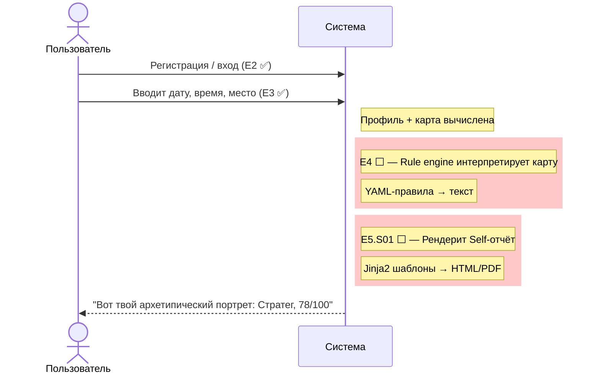

# Archemap — MVP Status

> Когда я смогу вбить дату рождения и получить результат?

**Ответ:** после завершения E4 (Rules) + E5.S01 (Self Report). Сейчас E3 готова — карта считается, но интерпретации нет.

---

## Что сделано и зачем

### E1: Foundation ✅
**Бизнес-смысл:** без инфраструктуры ничего не работает. CI, Docker, миграции — это фундамент для быстрой итерации.

### E2: Identity ✅ (7/9 stories)
**Бизнес-смысл:** пользователь может зарегистрироваться, войти, подтвердить email. Без этого нет доступа к продукту. OAuth (Yandex) позволяет входить без пароля.

### E3: Chart Engine ✅ (6/6 stories)
**Бизнес-смысл:** ядро продукта. По дате/времени/месту рождения вычисляется натальная карта (позиции планет, дома, аспекты) и нормализованный вектор признаков. Это детерминированная, воспроизводимая основа для всех четырёх вертикалей (Self, Love, Child, Career).

**Что уже работает:**
- `POST /profiles` — создать профиль с данными рождения
- `POST /profiles/{id}/chart` — вычислить натальную карту
- `GET /profiles/geocode?q=Москва` — найти координаты места
- Chart engine считает 12 планет, 12 домов, аспекты
- Feature extraction: стихии, модальности, дома, аспекты

**Что НЕ работает (пока):**
- Нет интерпретации — карта есть, но текстового отчёта нет
- Нет frontend-страницы для ввода данных
- Нет PDF-отчёта

---

## Путь до MVP: "Ввёл дату → увидел результат"



---

## Что нужно для первого кликабельного демо

| # | Что сделать | Зачем | Оценка |
|---|-------------|-------|--------|
| 1 | **E4.S03: Rule engine** | Правила интерпретируют карту в текст | 2 нед |
| 2 | **E4.S01-02: Rules + Templates** | YAML-правила + Jinja2 шаблоны | 1 нед |
| 3 | **E5.S01: Self report** | Сборка отчёта из правил + шаблонов | 1 нед |
| 4 | **Frontend: страница ввода** | Форма: дата, время, место → результат | 1 нед |
| 5 | **Frontend: страница отчёта** | Отображение карты + интерпретации | 1 нед |

**Итого: ~5-6 недель до кликабельного демо.**

---

## MVP (полный запуск)

| Эпик | Статус | Что нужно |
|------|--------|-----------|
| E1 Foundation | ✅ | — |
| E2 Identity | 🟡 7/9 | VK OAuth (S06), Account linking (S07) |
| E3 Chart Engine | ✅ | — |
| E4 Rules & Content | ⬜ | Rule engine, templates, localization |
| E5 Self Report | ⬜ | Отчёт, PDF, API |
| E6 Billing | ⬜ | 1 план, 1 PSP (YooKassa) |
| E7 Notifications | ⬜ | Email-уведомления |
| E8 Production | ⬜ | Rate limiting, observability |

**MVP-estimate:** 12-16 недель от текущего состояния (ROADMAP.md).

---

## Как проверить прямо сейчас (без frontend)

```bash
# 1. Зарегистрироваться
curl -X POST http://localhost:8000/api/v1/auth/register \
  -H "Content-Type: application/json" \
  -d '{"email":"test@example.com","password":"password123"}'

# 2. Войти (после верификации email)
curl -X POST http://localhost:8000/api/v1/auth/login \
  -H "Content-Type: application/json" \
  -d '{"email":"test@example.com","password":"password123"}'

# 3. Найти координаты места
curl "http://localhost:8000/api/v1/profiles/geocode?q=Москва" \
  -H "Authorization: Bearer <token>"

# 4. Создать профиль
curl -X POST http://localhost:8000/api/v1/profiles \
  -H "Authorization: Bearer <token>" \
  -H "Content-Type: application/json" \
  -d '{"name":"Тест","birth_date":"1990-05-15","birth_time":"14:30",
       "birth_time_accuracy":"exact","birth_place":"Москва",
       "latitude":55.7558,"longitude":37.6173,"timezone":"Europe/Moscow"}'

# 5. Вычислить карту
curl -X POST http://localhost:8000/api/v1/profiles/<profile_id>/chart \
  -H "Authorization: Bearer <token>"
```

**Результат:** JSON с позициями 12 планет, 12 домов, аспектами. Но без текстовой интерпретации — это следующий шаг (E4).
