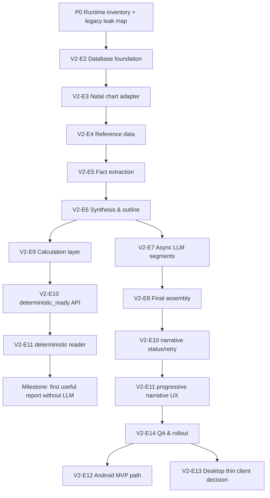

# Astrotype v2 Roadmap

## Product direction

Astrotype v2 is a cloud-core, natal-only, multi-client report platform.

The goal is not to patch the legacy Self report. The goal is to build a clean v2 pipeline:

```text
birth/profile data
→ deterministic natal chart calculation
→ normalized PostgreSQL storage
→ evidence-backed natal facts
→ deterministic synthesis
→ deterministic ReportOutlineV2
→ deterministic_ready foundation returned to client
→ curated async LLM requests per personality segment
→ partial/complete LLM section generation
→ progressive NatalReportV2 assembly
→ report + calculation layer + infographics
```

Target clients:

1. responsive web first;
2. Android MVP via PWA/Capacitor;
3. optional Windows `.exe` as thin Tauri/Electron client;
4. native mobile later only if product needs justify it.

---

## Non-goals for v2 foundation

v2 foundation is not:

- socionics;
- Model A;
- information functions;
- MBTI or a typology replacement;
- a hidden-field variant of legacy Self;
- a v1 REST/report compatibility layer;
- a rewrite of existing platform auth/profile infrastructure;
- desktop-local-first architecture;
- local SQLite as primary product storage;
- client-side LLM calls with embedded keys;
- fully offline Android generation.

---

## Roadmap overview

| Epic   | Name                             | Status                   | Goal                                                                                                    | Feature doc                                                        |
| ------ | -------------------------------- | ------------------------ | ------------------------------------------------------------------------------------------------------- | ------------------------------------------------------------------ |
| V2-E1  | Architecture & contracts         | ✅ Contract docs aligned | Freeze boundaries, contracts, storage, progressive delivery and multi-client strategy.                  | `docs/features/E16-v2-e1-architecture-contracts/FEATURE.md`        |
| V2-E2  | Database foundation              | ⬜ Planned               | Add normalized v2 PostgreSQL tables and migrations.                                                     | `docs/features/E16-v2-e2-database-foundation/FEATURE.md`           |
| V2-E3  | Natal chart adapter              | ⬜ Planned               | Convert chart engine output into v2 rows/contracts without socionics.                                   | `docs/features/E16-v2-e3-natal-chart-adapter/FEATURE.md`           |
| V2-E4  | Reference data                   | ⬜ Planned               | Add aspect/sign/planet/house meaning reference data.                                                    | `docs/features/E16-v2-e4-reference-data/FEATURE.md`                |
| V2-E5  | Fact extraction                  | ⬜ Planned               | Generate persisted evidence-backed natal facts.                                                         | `docs/features/E16-v2-e5-fact-extraction/FEATURE.md`               |
| V2-E6  | Synthesis & outline              | ⬜ Planned               | Build themes and ownership-based section plans.                                                         | `docs/features/E16-v2-e6-synthesis-outline/FEATURE.md`             |
| V2-E7  | Modular LLM generation           | ⬜ Planned               | Generate long detailed personality segments from curated facts.                                         | `docs/features/E16-v2-e7-modular-llm-generation/FEATURE.md`        |
| V2-E8  | Final report assembly            | ⬜ Planned               | Assemble full report and validate evidence/duplication boundaries.                                      | `docs/features/E16-v2-e8-final-report-assembly/FEATURE.md`         |
| V2-E9  | Infographics & calculation layer | ⬜ Planned               | Show deterministic natal visuals and calculation/fact data without LLM.                                 | `docs/features/E16-v2-e9-infographics-factual-basis/FEATURE.md`    |
| V2-E10 | API & async runtime              | ⬜ Planned               | Expose deterministic readiness, generation status and report APIs.                                      | `docs/features/E16-v2-e10-api-async-runtime/FEATURE.md`            |
| V2-E11 | Web responsive reader            | ⬜ Planned               | Build mobile-friendly web report UX.                                                                    | `docs/features/E16-v2-e11-web-responsive-reader/FEATURE.md`        |
| V2-E12 | Android MVP path                 | ⬜ Planned               | Prepare PWA/Capacitor Android shell.                                                                    | `docs/features/E16-v2-e12-android-mvp-path/FEATURE.md`             |
| V2-E13 | Desktop thin client decision     | ✅ Completed             | `.exe` is not required for core launch; if built, it remains a thin API client with cache-only storage. | `docs/features/E16-v2-e13-desktop-thin-client-decision/FEATURE.md` |
| V2-E14 | QA, smoke, rollout               | ⬜ Planned               | Verify generation quality, runtime reliability and rollout safety.                                      | `docs/features/E16-v2-e14-qa-smoke-rollout/FEATURE.md`             |
| V2-E15 | LLM runtime integration          | ⬜ Planned               | Connect V2 narrative segments to the configured real LLM provider with honest progress/failure states.  | `docs/features/E16-v2-e15-llm-runtime-integration/FEATURE.md`      |

---

## V2-E1: Architecture & contracts

Status: ✅ Contract docs aligned

Goal: freeze the architecture before implementation.

Deliverables:

- C4 architecture document;
- database design document;
- cloud-core mobile/desktop strategy document;
- Pydantic/domain contract draft;
- section taxonomy and ownership rules;
- progressive delivery/status contract;
- v1 quarantine/archive boundary;
- API surface draft.

Tasks:

| #   | Task                           | Output                                | Acceptance criteria                                                                    |
| --- | ------------------------------ | ------------------------------------- | -------------------------------------------------------------------------------------- |
| 1.1 | Align architecture docs        | `docs/architecture/astrotype-v2-*.md` | Docs agree on cloud-core, LLM boundaries, infographics and facts.                      |
| 1.2 | Define domain contracts        | contract draft                        | `NatalChartV2`, `NatalFactV2`, `NatalSynthesisV2`, `ReportOutlineV2`, `NatalReportV2`. |
| 1.3 | Define segment taxonomy        | section spec                          | Sections have owned/reference/forbidden semantics.                                     |
| 1.4 | Define mobile/desktop strategy | strategy doc                          | Android is client-first; `.exe` is thin client if needed.                              |

---

## V2-E2: Database foundation

Status: ⬜ Planned

Goal: create normalized durable storage for v2.

Tables:

- `natal_charts`
- `natal_planet_positions`
- `natal_houses`
- `aspect_definitions`
- `aspect_pair_interpretations`
- `natal_aspects`
- `natal_chart_balances`
- `natal_chart_patterns`
- `natal_facts`
- `natal_syntheses`
- `report_outlines`
- `report_segment_generations`
- `natal_infographic_data`
- `natal_reports`

Acceptance criteria:

- migrations are reversible;
- canonical aspect order is enforced;
- chart/fact rows are queryable with SQL;
- Redis is not used as durable fact/report storage;
- legacy tables remain untouched unless explicitly migrated later.

---

## V2-E3: Natal chart adapter

Status: ⬜ Planned

Goal: convert existing chart calculation output into v2 normalized entities.

Tasks:

| #   | Task                      | Acceptance criteria                                              |
| --- | ------------------------- | ---------------------------------------------------------------- |
| 3.1 | Build `chart_adapter.py`  | Produces `NatalChartV2` without socionics/function strengths.    |
| 3.2 | Persist planet positions  | Mars/Taurus/10/retrograde style rows saved.                      |
| 3.3 | Persist houses            | 12 house cusps saved with signs/longitudes.                      |
| 3.4 | Persist aspects           | Aspects saved with canonical planet order, orb, angle, strength. |
| 3.5 | Persist balances/patterns | Elements/modalities/house emphasis/pattern rows saved.           |

Verification:

- one known profile creates complete v2 chart rows;
- no v2 module imports socionics;
- chart can be reloaded from DB into `NatalChartV2`.

---

## V2-E4: Reference data

Status: ⬜ Planned

Goal: create reusable meaning/reference tables so interpretations are not hardcoded in scattered Python dictionaries.

Reference tables:

- `aspect_definitions`: sextile/square/trine/opposition/etc.
- `aspect_pair_interpretations`: Mercury sextile Saturn, Mars opposition Uranus, etc.
- later: planet/sign/house interpretation tables.

Acceptance criteria:

- `Mercury sextile Saturn` exists once as canonical reference data;
- `Mars opposition Uranus` exists once as canonical reference data;
- calculated `natal_aspects` can link to reference interpretations;
- reference rows have versioning;
- disabled/deprecated interpretations can be excluded from generation.

---

## V2-E5: Fact extraction

Status: ⬜ Planned

Goal: generate persisted `NatalFactV2` rows from chart entities and reference data.

Fact examples:

```text
Mars in Taurus
Mars in 10th house
Mars retrograde
Mercury sextile Saturn
fixed modality emphasis
10th house emphasis
```

Acceptance criteria:

- facts are stored before synthesis/LLM;
- every fact has `source_table` + `source_id`;
- every interpretive seed has evidence;
- facts can be shown to the user;
- facts can be reused for report regeneration without recalculating the chart.

---

## V2-E6: Synthesis & outline

Status: ⬜ Planned

Goal: turn facts into themes and assign themes to report segments before LLM generation.

Core contracts:

```text
NatalFactV2[]
→ NatalSynthesisV2
→ ReportOutlineV2
```

Segment taxonomy:

- `core_pattern`
- `perception_and_mind`
- `emotional_regulation`
- `agency_and_desire`
- `relationships_and_intimacy`
- `growth_vector`
- `technical_basis`

Acceptance criteria:

- every theme has one primary section;
- allowed references are explicit;
- forbidden expansions are explicit;
- no section receives full unrestricted fact set;
- outline can be rendered without LLM for debug/preview.

---

## V2-E7: Modular LLM generation

Status: ⬜ Planned

Goal: generate detailed report prose by personality segment from curated evidence-backed inputs.

Pipeline:

```text
ReportOutlineV2
→ SectionRenderInputV2
→ LLM section prompt
→ ReportSegmentV2
→ persisted report_segment_generations row
```

Acceptance criteria:

- each segment request contains only owned facts/themes plus allowed references;
- each segment output returns evidence ids;
- failed segments can be retried individually;
- prompt/model/input hash are persisted;
- no segment can invent placements/aspects/facts;
- report length is not arbitrarily capped; completeness is evidence-driven.

---

## V2-E8: Final report assembly

Status: ⬜ Planned

Goal: assemble section outputs into one large detailed `NatalReportV2`.

Acceptance criteria:

- final report includes all generated personality segments;
- report has no semantic duplicate expansions of forbidden themes;
- evidence index is included;
- technical basis is separate from narrative prose;
- report is persisted and retrievable by stable id;
- regeneration creates a new version/artifact, not a silent overwrite.

---

## V2-E9: Infographics & calculation layer

Status: ⬜ Planned

Goal: produce the deterministic lower calculation layer from the canonical sample, not a separate evidence/factual-basis dashboard.

Canonical visual/data reference:

- `docs/design/astrotype-v2-infographic-db-report-sample.html`

Calculation-layer outputs:

- key indicators: ASC, MC, ASC ruler;
- planet positions table;
- element and modality balance bars;
- house emphasis chart and labelled house accent cards;
- aspect network;
- key aspect table;
- compact calculation matrix: house mode, hemispheres, quadrants, aspect profile.

Deferred from MVP UI:

- archetype cards;
- theme maps;
- standalone factual-basis/evidence cards;
- most-aspected planet rankings.

Acceptance criteria:

- infographics are generated without LLM;
- data comes from stored chart/fact rows;
- frontend can render the canonical sample blocks from API JSON;
- evidence/provenance remains compact/progressive and does not become a separate dashboard.

---

## V2-E10: API & async runtime

Status: ⬜ Planned

Goal: expose v2 report generation to all clients through a stable API.

Endpoints:

```text
POST /api/v1/astrotype-v2/reports
GET  /api/v1/astrotype-v2/reports/{report_id}
GET  /api/v1/astrotype-v2/reports/{report_id}/status
GET  /api/v1/astrotype-v2/reports/{report_id}/calculation-layer
GET  /api/v1/astrotype-v2/reports/{report_id}/segments
POST /api/v1/astrotype-v2/reports/{report_id}/regenerate
GET  /api/v1/astrotype-v2/reports/{report_id}/pdf
```

Acceptance criteria:

- API is usable from web and Android;
- long generation runs async;
- report status is pollable;
- progress exposes segment-level state;
- auth and entitlement checks are server-side.

---

## V2-E11: Web responsive reader

Status: ⬜ Planned

Goal: implement the web report reader to match the canonical sample, not the existing legacy product report/dashboard UI.

Canonical visual reference:

- `docs/design/astrotype-v2-infographic-db-report-sample.html`
- `docs/design/astrotype-v2-canonical-report-ui-contract.md`

Acceptance criteria:

- report reader matches the sample's dark full-width report surface;
- first screen is the sample-style hero cover with compact action pills;
- long narrative sections use prose cards with right-side asides;
- report order is hero → narrative sections → deterministic calculation layer;
- no dashboard/sidebar/legacy report metric layout defines the v2 reader;
- no socionics/Model A/function-strength components render in v2;
- status/progress UX supports long generation without changing the canonical ready-state layout;
- PDF/share flows are accessible from mobile web.

---

## V2-E12: Android MVP path

Status: ⬜ Planned

Goal: ship Android as a client to the same backend API, likely via Capacitor first.

Tasks:

| #    | Task                         | Acceptance criteria                                                  |
| ---- | ---------------------------- | -------------------------------------------------------------------- |
| 12.1 | PWA readiness                | App metadata, icons, mobile nav, installability baseline.            |
| 12.2 | Capacitor shell              | Android project opens Astrotype UI and authenticates.                |
| 12.3 | Secure session handling      | Tokens/session handled using platform-safe storage/cookies strategy. |
| 12.4 | Report status UX             | Android can start report and return later to ready report.           |
| 12.5 | Push notification foundation | Optional: report-ready notification through FCM.                     |
| 12.6 | Google Play Billing bridge   | Mobile receipt verification maps to backend entitlements.            |

Acceptance criteria:

- no LLM key is present in Android app;
- Android uses backend report APIs;
- generated report is identical to web for the same report id;
- local storage is cache/draft only.

---

## V2-E13: Desktop thin client decision

Status: ✅ Completed

Goal: decide whether a Windows `.exe` is worth building and, if yes, keep it thin.

Decision: `.exe` is not required for v2 core launch; desktop is optional and must use the same backend API/report ids with cache-only local storage. See `docs/architecture/astrotype-v2-desktop-thin-client-decision.md`.

Recommended approach:

```text
Tauri/Electron shell
→ same web UI
→ same backend API
→ local cache only
```

Acceptance criteria if implemented:

- no local DB as source of truth;
- no embedded production LLM key;
- report cache is disposable;
- same account/report works on web and Android;
- app can update without migrating canonical report data locally.

---

## V2-E14: QA, smoke, rollout

Status: ⬜ Planned

Goal: verify quality, runtime and multi-client consistency before rollout.

Acceptance criteria:

- smoke profile generates complete v2 report;
- chart facts are visible and match report evidence;
- infographics render from deterministic data;
- no socionics appears in v2 payloads/prompts/UI;
- web and Android/PWA read same report id;
- report generation can recover from one failed segment;
- logs/metrics show LLM cost, latency and failures by segment;
- live smoke verifies actual report readiness, not infra health only.

---

## Implementation priorities

The implementation priority is deterministic-first. The first shippable milestone is not a complete LLM report; it is a user-visible `deterministic_ready` report foundation after registration/profile completion.

### P0 — Repository/runtime inventory before feature code

Inventory document: `docs/implementation/astrotype-v2-p0-inventory.md`.

Goal: start from the actual codebase state instead of assuming routes/modules exist from old docs.

Do before V2-E2 code:

- locate current auth/register/login/profile routers and keep them as platform infrastructure;
- locate current chart calculation entrypoint that can be adapted without socionics/function strengths;
- locate currently registered FastAPI routers/OpenAPI paths and identify old v1 report/socionics endpoints to remove or leave unregistered;
- locate frontend route/navigation entrypoints and identify legacy report/socionics screens that must not be exposed in v2;
- locate database migration tooling, current revision and environments that contain real client data;
- classify data into: platform identity/access, current profile input needed by v2, legacy v1 product artifacts, and new v2 artifacts;
- define backup/snapshot and restore verification steps before any migration or purge touches a real-user database;
- inventory old v1 report/socionics product artifacts that can be purged from active storage;
- run a baseline test/build smoke if the repo has runnable backend/frontend packages.

Exit criteria:

- implementation knows where auth/profile integration happens;
- v2 will not create a second auth stack;
- legacy-leak removal list exists before new v2 routers are added;
- data-safety preflight exists: backup plan, staging migration/purge plan, row-count/checksum plan for platform tables that must survive, and explicit inventory of v1 product artifacts that may be deleted.

### P1 — Deterministic foundation, storage and chart rows

Epics: V2-E2, V2-E3, V2-E4.

Goal: create durable normalized v2 chart storage and prove one profile can produce reloadable chart rows with no LLM and no socionics.

Order:

1. V2-E2 database foundation;
2. V2-E3 natal chart adapter;
3. V2-E4 minimal reference data needed by facts.

Exit criteria:

- migrations are reversible and additive for platform/current-profile data by default;
- migration upgrade preserves users/auth/profile/billing row counts and current birth/profile input in staging;
- old v1 report/socionics artifacts may be deleted only by the explicit purge runbook, not accidentally by foundation migrations;
- one known profile writes `natal_charts`, positions, houses, aspects, balances and patterns;
- canonical aspect order is enforced;
- chart rows can be reloaded into v2 contracts;
- v2 imports no `socionics`, `function_strengths`, legacy `NarrativeInput` or `report_narratives`.

### P2 — User-visible `deterministic_ready`

Epics: V2-E5, V2-E6, V2-E9, the deterministic subset of V2-E10 and V2-E11.

Goal: after registration/profile completion has enough birth data, the user can see deterministic natal data while LLM narrative is still absent.

Order:

1. V2-E5 fact extraction;
2. V2-E6 synthesis and outline;
3. V2-E9 calculation layer / infographics from stored rows;
4. V2-E10 endpoints/status for `deterministic_ready`;
5. V2-E11 first frontend reader state for deterministic foundation.

Exit criteria:

- facts are stored before synthesis and before LLM;
- synthesis and outline are persisted;
- calculation layer renders without LLM;
- API returns or exposes `deterministic_ready` separately from narrative completion;
- frontend can render the first useful report screen without waiting for LLM.

### P3 — Async LLM narrative and final assembly

Epics: V2-E7, V2-E8, remaining V2-E10 and V2-E11.

Goal: add narrative depth without risking the deterministic base report.

Order:

1. V2-E7 segment input builder + LLM segment generation;
2. segment persistence, status and retry;
3. V2-E8 final `NatalReportV2` assembly over the deterministic foundation;
4. frontend progressive insertion of ready sections.

Exit criteria:

- LLM receives only curated section JSON;
- failed sections can be retried individually;
- `partial`, `complete` and `failed` are distinct from `deterministic_ready`;
- LLM failure does not hide deterministic output;
- final report has evidence ids and no forbidden-theme duplication.

### P4 — Quality, rollout, mobile path

Epics: V2-E14, then V2-E12, then V2-E13 only if still needed.

Goal: make the v2 path reliable enough to ship and keep Android/desktop as thin clients.

Order:

1. V2-E14 quality gates, runtime smoke, legacy-leak checks and observability;
2. V2-E12 PWA/Capacitor Android readiness after web report UX is stable;
3. V2-E13 desktop thin-client decision after web/Android direction is proven.

Exit criteria:

- smoke profile reaches deterministic and complete narrative states;
- no socionics/v1 REST/report aliases appear in v2 payloads, prompts, OpenAPI or frontend navigation;
- web and Android/PWA read the same report id;
- runtime smoke verifies real readiness, not infrastructure health alone.

---

## Suggested timeline

Rough estimate for MVP-quality v2 foundation and web-ready delivery:

```text
Phase 0:     Runtime/code inventory + legacy-leak removal list
Phase 1:     V2-E2 DB foundation + V2-E3 chart adapter + V2-E4 reference data
Phase 2:     V2-E5 facts + V2-E6 synthesis/outline + V2-E9 calculation layer
Phase 3:     V2-E10 deterministic_ready API + V2-E11 deterministic reader
Phase 4:     V2-E7 async LLM segments + V2-E8 final assembly
Phase 5:     V2-E10/V2-E11 narrative progress UX + V2-E14 quality/smoke/rollout
Phase 6:     V2-E12 Android PWA/Capacitor path; V2-E13 desktop only if justified
```

Web-first v2 can ship after Phase 5. Android shell should wait until the web report/status UX is stable. Desktop is explicitly not on the MVP critical path.

---

## Critical path



---

## MVP definition

v2 MVP includes:

- one Self/natal report product;
- server-side generation;
- existing auth/profile infrastructure reused;
- PostgreSQL chart/facts/report source of truth;
- `deterministic_ready` user-visible foundation before LLM completion;
- calculation layer/infographics generated without LLM;
- detailed LLM report by modular sections after deterministic foundation;
- responsive web UI with progressive report status;
- no old v1 REST/report/socionics methods in the active v2 API/frontend surface;
- PWA/Android path prepared after web v2 is stable, even if Play Store release follows later.

v2 MVP excludes:

- local-first Windows `.exe`;
- desktop app as a critical-path deliverable;
- offline LLM generation;
- full native React Native rewrite;
- Love/Child/Career v2 expansion;
- user-editable interpretation CMS unless needed for content ops;
- v1 compatibility aliases or hidden migration bridges.

---

## Open decisions

1. Android MVP: pure PWA first or immediate Capacitor wrapper?
2. Report segment count/depth: keep 6 narrative segments + technical basis or split further?
3. Infographic rendering: custom SVG/Canvas in frontend or chart library?
4. PDF export: server-side Playwright or frontend print/export flow?
5. Billing before Android: web billing first, Google Play Billing later, or both before Android release?
6. Reference-data authoring: migrations/seeds only or admin editor in v2?
