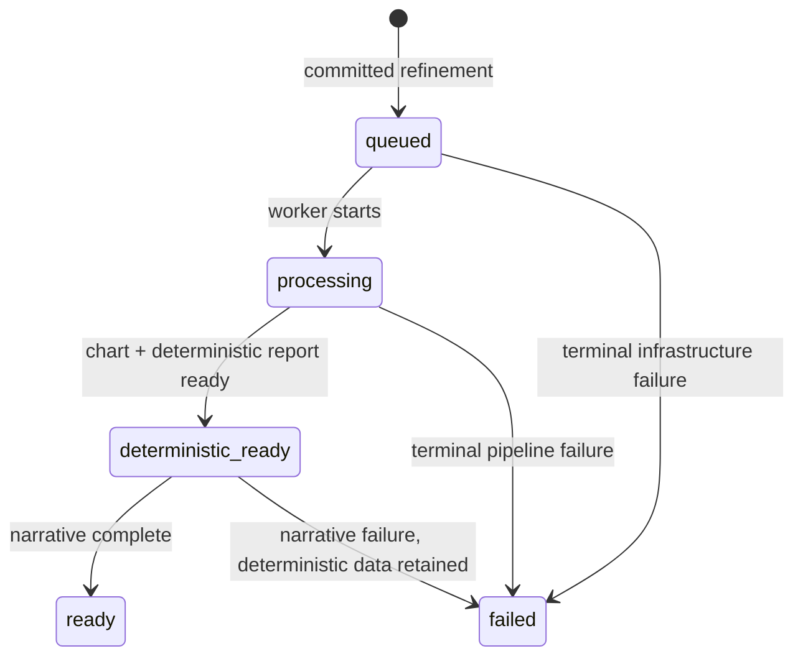

# SRS-E10: Уточнение времени и места рождения

Статус: целевой контракт; реализация не начата

Feature: `docs/features/E10-birth-data-refinement/FEATURE.md`

## 1. Назначение

Система должна позволить авторизованному пользователю уточнять время и место рождения в Settings и безопасно пересчитывать зависимые натальную карту и отчёт. Операция ограничена одним успешным изменением на аккаунт за скользящие 24 часа.

## 2. Термины

| Термин              | Определение                                                  |
| ------------------- | ------------------------------------------------------------ |
| Уточнение           | Материальное изменение времени/точности и/или места рождения |
| Birth-data snapshot | time, accuracy, place, latitude, longitude, timezone         |
| Ревизия             | Неизменяемая запись снимков до/после и результата пересчёта  |
| Cooldown            | Интервал `[last_success, last_success + 24h)`                |
| Активный отчёт      | Последняя готовая версия, доступная пользователю             |
| Deterministic ready | Новая карта и детерминированный слой готовы к отображению    |

## 3. Текущее состояние

- `/settings` обновляет только имя через `PATCH /api/v1/users/me`.
- `PATCH /api/v1/profiles/{profile_id}` технически принимает birth-data fields, но не обеспечивает cooldown, revision ledger, concurrency control и полный пересчёт.
- `/profiles/geocode` возвращает место/координаты, а registration UI использует опасный default timezone для ручного ввода.
- V2 хранит versioned charts/reports по input hash, но profile-update workflow не связывает изменение с безопасной регенерацией.

## 4. Функциональные требования

### FR-E10.1 Просмотр

- Settings должен получать и отображать текущие time, accuracy и place выбранного профиля.
- При нескольких профилях пользователь должен явно выбрать профиль.
- Backend должен возвращать `can_refine`, `last_refined_at`, `next_available_at` и `retry_after_seconds`.

### FR-E10.2 Редактируемые данные

- Операция изменяет только `birth_time`, `birth_time_accuracy`, `birth_place`, `latitude`, `longitude`, `timezone`.
- Date of birth не должна приниматься endpoint уточнения.
- Можно изменить время, место или оба блока.
- No-op должен отклоняться и не расходовать cooldown.

### FR-E10.3 Time accuracy

- Допустимы `exact`, `approximate`, `unknown`.
- `exact` и `approximate` требуют непустое время.
- `unknown` допускает `birth_time=null` и не должен отображаться как точное 12:00.

### FR-E10.4 Place contract

- Место выбирается из backend geocoder results.
- Place/latitude/longitude/timezone образуют согласованный блок.
- Backend возвращает/валидирует IANA timezone для выбранных координат.
- Значение `Europe/Moscow` не может быть универсальным fallback для любого места.

### FR-E10.5 Ограничение частоты

- Разрешено не более одного успешного уточнения на `user_id` за скользящие 24 часа.
- Проверка выполняется по серверному UTC времени в durable DB-транзакции.
- Все профили аккаунта входят в одно окно.
- Ровно в `next_available_at` операция разрешается.
- Validation/no-op/enqueue-precondition failure и идемпотентный replay не создают вторую ревизию.
- Конкурентные запросы дают максимум один успех.

### FR-E10.6 Идемпотентность

- POST требует `Idempotency-Key`.
- Повтор ключа с тем же payload возвращает исходный результат.
- Повтор ключа с другим payload возвращает conflict.

### FR-E10.7 Пересчёт

- Успешная операция создаёт новую натальную карту по новому input snapshot/hash.
- Детерминированные и narrative артефакты строятся заново из новой карты.
- Worker retry должен быть идемпотентным.
- Статусы: `queued`, `processing`, `deterministic_ready`, `ready`, `failed`.

### FR-E10.8 Сохранность результата

- Предыдущая карта, отчёт, сегменты и PDF не удаляются и не перезаписываются.
- Старый активный отчёт остаётся доступен до `deterministic_ready` новой версии.
- Failed generation не переключает активный отчёт.
- Операция не создаёт платёж и не изменяет entitlement/subscription.

### FR-E10.9 UI

- Settings содержит отдельную карточку данных рождения.
- UI объясняет влияние на карту/отчёт до подтверждения.
- Cooldown отображается по backend `next_available_at`.
- После `202` UI показывает прогресс и сохраняет ссылку на текущий отчёт.
- Технический жаргон (`LLM`, `v2`, `input_hash`) пользователю не показывается.

## 5. Нефункциональные требования

| ID        | Требование                                                                 |
| --------- | -------------------------------------------------------------------------- |
| NFR-E10.1 | Ownership/auth проверяются сервером для status и mutate endpoints.         |
| NFR-E10.2 | Cooldown устойчив к рестарту Redis/API и конкурентным запросам.            |
| NFR-E10.3 | Миграции additive; существующие данные не удаляются и не backfill-mutated. |
| NFR-E10.4 | Birth snapshots, время и координаты не попадают в логи/metrics labels.     |
| NFR-E10.5 | POST идемпотентен; фоновые retries не создают дубликаты.                   |
| NFR-E10.6 | UI доступен с клавиатуры и адаптирован для мобильного экрана.              |
| NFR-E10.7 | Время ответа синхронного POST не включает выполнение генерации отчёта.     |
| NFR-E10.8 | Старый отчёт остаётся читаемым при деградации worker/LLM provider.         |

## 6. Модель данных

Новая `profile_birth_data_revisions`:

- `id UUID PK`;
- `user_id UUID FK users`;
- `profile_id UUID FK person_profiles`;
- `previous_snapshot JSONB NOT NULL`;
- `new_snapshot JSONB NOT NULL`;
- `changed_fields JSONB NOT NULL`;
- `status VARCHAR NOT NULL`;
- `generation_id UUID UNIQUE NOT NULL`;
- `chart_id UUID NULL`;
- `report_id UUID NULL`;
- `error_code VARCHAR NULL`;
- timestamps из базовой модели.

Индексы: `(user_id, created_at desc)`, `(profile_id, created_at desc)`, `generation_id` unique.

Если для атомарной активации требуется явная ссылка на активную версию, она добавляется additive-полем/таблицей; нельзя вычислять active report из неготовых или failed rows.

## 7. API

| Method | Path                                                         | Назначение                   |
| ------ | ------------------------------------------------------------ | ---------------------------- |
| GET    | `/api/v1/profiles/{id}/birth-data-refinement-status`         | Доступность/cooldown         |
| POST   | `/api/v1/profiles/{id}/birth-data-refinements`               | Уточнить и запустить rebuild |
| GET    | `/api/v1/profiles/{id}/birth-data-refinements/{revision_id}` | Статус пересчёта             |

POST success: `202`; cooldown: `429` + `Retry-After`; validation: `400/422`; ownership must not leak another user's profile existence.

## 8. Состояния

Для narrative failure допускается отдельный безопасный terminal status, если текущий v2 контракт различает `narrative_failed`; UI обязан сохранить deterministic result.

## 9. Верификация

1. Schema/migration tests и downgrade safety.
2. Unit matrix для валидации/cooldown/idempotency.
3. PostgreSQL concurrency test с двумя одновременными транзакциями.
4. Pipeline tests на новый chart/report lineage и retry.
5. Frontend tests всех UI states и accessibility.
6. Staging smoke: 202 → status progression → new report.
7. Второй staging POST: 429 с точным `Retry-After`/`next_available_at`.
8. DB evidence: одна ревизия, старые rows сохранены.
9. Payment evidence: новые payment rows отсутствуют, entitlement неизменён.
10. Production rollout за feature flag с метриками failures/stuck jobs.

## 10. Зависимости и риски

### Зависимости

- Profile ownership и geocoder.
- V2 chart/report generation pipeline.
- Celery/Redis и durable generation state.
- Settings web client.

### Риски

- Неверный timezone меняет UTC birth datetime и дома.
- Race condition создаёт несколько дорогих генераций.
- Mutable overwrite лишает пользователя старого оплаченного отчёта.
- Только frontend cooldown легко обходится.
- Failed enqueue после profile update создаёт несогласованное состояние; нужен transaction/outbox pattern.

## 11. Безопасность миграции и rollout

- Перед production migration: backup/snapshot и restore drill на staging.
- Зафиксировать row counts профилей/карт/отчётов до и после.
- Не выполнять drop/rename/truncate существующих таблиц.
- Feature flag выключен по умолчанию до staging evidence.
- Rollback выключает новые операции, но не удаляет созданные ревизии/версии.
