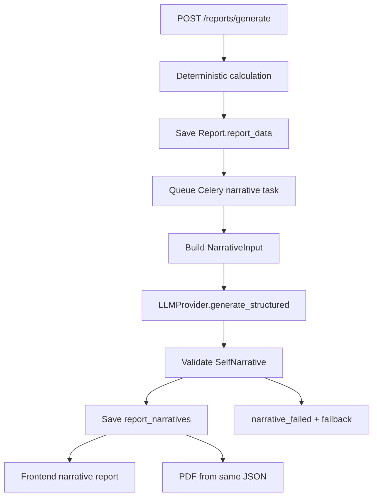

# SRS: E11 — LLM Report Narrative

**Версия:** 1.0
**Дата:** 2026-06-04
**Статус:** Implemented
**Источник:** `docs/design/llm-report-narrative-architecture.md`

---

## 1. Введение

### 1.1 Назначение

Документ описывает программные требования к модулю **LLM Report Narrative**: контролируемому LLM-слою, который преобразует deterministic report facts в структурированный narrative JSON для frontend и PDF.

### 1.2 Область применения

E11 применяется к report generation pipeline:

```text
Deterministic chart/rules/socionics/report_data
  -> NarrativeInput
  -> LLMProvider structured generation
  -> validators
  -> ReportNarrative storage
  -> frontend/PDF rendering
```

### 1.3 Определения

| Термин | Определение |
|---|---|
| Deterministic report | Проверяемый расчёт карты, соционики, архетипов, scores, claims, evidence |
| NarrativeInput | Очищенный DTO для LLM, собранный из deterministic facts |
| SelfNarrative | Структурированный JSON-ответ LLM для Self report |
| LLMProvider | Backend abstraction над real/mock LLM provider |
| Prompt version | Версия prompt contract, например `self_story_v1` |
| input_hash | SHA256 hash от normalized NarrativeInput для cache/idempotency |
| narrative_failed | Состояние, когда deterministic report доступен, но LLM narrative не создан |

### 1.4 Ссылки

| Документ | Путь |
|---|---|
| Technical design | `docs/design/llm-report-narrative-architecture.md` |
| Workflow explainer | `docs/features/E11-llm-report-narrative/WORKFLOW.md` |
| API explainer | `docs/features/E11-llm-report-narrative/API.md` |
| Feature docs | `docs/features/E11-llm-report-narrative/` |
| Report UX redesign | `docs/features/E10-report-ux-redesign/` |
| Self storytelling | `docs/design/self-report-storytelling.md` |
| Report UX design | `docs/design/report-ux-redesign.md` |

---

## 2. Общее описание

### 2.1 Product perspective

E11 не заменяет existing report engine. Модуль добавляет narrative renderer после deterministic calculation:



### 2.2 Функции

| Функция | Описание | Story |
|---|---|---|
| F11.1 | Narrative input/output schemas | S01 |
| F11.2 | Separate narrative storage/versioning | S02 |
| F11.3 | Provider abstraction and mock provider | S03 |
| F11.4 | Versioned prompt contract | S04 |
| F11.5 | NarrativeInput builder and hash/cache | S05 |
| F11.6 | Validation/repair/fallback | S06 |
| F11.7 | Async Celery generation/statuses | S07 |
| F11.8 | API integration and regenerate endpoint | S08 |
| F11.9 | Frontend status/polling/fallback | S09 |
| F11.10 | Frontend narrative rendering | S10 |
| F11.11 | PDF from saved narrative JSON | S11 |
| F11.12 | Tests, quality gates, observability | S12 |

### 2.3 Ограничения

| ID | Ограничение |
|---|---|
| C11.1 | LLM calls allowed only on backend |
| C11.2 | Automated tests must not call real LLM/network provider |
| C11.3 | LLM output must be JSON validated by Pydantic, not Markdown |
| C11.4 | Self report must not include career deep dive |
| C11.5 | PDF must reuse saved narrative JSON and not call LLM again |
| C11.6 | Deterministic report must remain available when narrative fails |

---

## 3. Функциональные требования

### 3.1 Contracts (FR-11.1)

**FR-11.1.1** Система ДОЛЖНА иметь Pydantic schema `NarrativeInput` для очищенного LLM input.

**FR-11.1.2** `NarrativeInput` ДОЛЖЕН включать product, language, profile summary, calculation_quality, key facts, aspects, socionics summary, archetype summary, evidence-backed claims and product boundaries.

**FR-11.1.3** Система ДОЛЖНА иметь Pydantic schema `SelfNarrative` для LLM output.

**FR-11.1.4** `SelfNarrative` ДОЛЖЕН включать title, hero, ordered sections, career_cta, final_summary and evidence notes.

### 3.2 Storage (FR-11.2)

**FR-11.2.1** Система ДОЛЖНА хранить narrative отдельно от `reports.report_data`.

**FR-11.2.2** `report_narratives` ДОЛЖНА хранить `report_id`, `product`, `prompt_version`, `model_provider`, `model_name`, `status`, `content`, `input_hash`, `error_message`, timestamps and attempt metadata.

**FR-11.2.3** Система ДОЛЖНА поддерживать несколько prompt versions для одного report.

### 3.3 Provider (FR-11.3)

**FR-11.3.1** Business logic ДОЛЖНА зависеть от `LLMProvider` protocol, а не от provider SDK.

**FR-11.3.2** Система ДОЛЖНА иметь `MockLLMProvider` для dev/test.

**FR-11.3.3** Provider settings ДОЛЖНЫ управляться через backend config/env.

### 3.4 Prompt contract (FR-11.4)

**FR-11.4.1** Prompt ДОЛЖЕН быть versioned file `self_story_v1.md`.

**FR-11.4.2** Prompt ДОЛЖЕН запрещать новые facts, diagnoses, fatalism, mystic language, graphic sexuality and Self career deep dive.

**FR-11.4.3** Prompt ДОЛЖЕН требовать JSON structured output according to `SelfNarrative`.

### 3.5 Input builder/cache (FR-11.5)

**FR-11.5.1** Система ДОЛЖНА строить `NarrativeInput` из existing deterministic report data.

**FR-11.5.2** Система НЕ ДОЛЖНА передавать весь raw `report_data` без фильтрации.

**FR-11.5.3** Система ДОЛЖНА вычислять stable `input_hash`.

**FR-11.5.4** Система ДОЛЖНА использовать cache/idempotency lookup перед LLM call.

### 3.6 Validation/fallback (FR-11.6)

**FR-11.6.1** Система ДОЛЖНА валидировать LLM output до сохранения как ready narrative.

**FR-11.6.2** Validator ДОЛЖЕН проверять required sections, section order, evidence refs, forbidden language and product boundaries.

**FR-11.6.3** При validation/provider failure система ДОЛЖНА выставлять `narrative_failed` или deterministic fallback, а не бесконечную генерацию.

### 3.7 Async generation/statuses (FR-11.7)

**FR-11.7.1** LLM generation ДОЛЖНА идти в Celery task, не в HTTP request.

**FR-11.7.2** Система ДОЛЖНА использовать explicit statuses: `generating_narrative`, `ready`, `narrative_failed`.

**FR-11.7.3** Retry ДОЛЖЕН применяться только для transient provider/network errors.

### 3.8 API (FR-11.8)

**FR-11.8.1** `POST /api/v1/reports/generate` ДОЛЖЕН возвращать report id/product/status после enqueue.

**FR-11.8.2** `GET /api/v1/reports/{report_id}` ДОЛЖЕН возвращать deterministic data and nullable narrative.

**FR-11.8.3** `POST /api/v1/reports/{report_id}/narrative/regenerate` ДОЛЖЕН регенерировать только narrative layer.

### 3.9 Frontend (FR-11.9/11.10)

**FR-11.9.1** Frontend ДОЛЖЕН poll status while narrative is generating.

**FR-11.9.2** After 90 seconds frontend ДОЛЖЕН show timeout guidance, refresh and deterministic fallback.

**FR-11.9.3** Ready narrative ДОЛЖЕН render narrative-first: hero, summary/sections, relationships/sexuality/development, career CTA, then collapsed technical details.

**FR-11.9.4** `narrative_failed` ДОЛЖЕН show warning, fallback and retry.

### 3.10 PDF (FR-11.11)

**FR-11.10.1** PDF ДОЛЖЕН render from saved narrative JSON.

**FR-11.10.2** PDF task НЕ ДОЛЖЕН call LLM.

---

## 4. Нефункциональные требования

| ID | Требование | Значение |
|---|---|---|
| NFR-11.1 | Security | LLM API key never exposed to frontend/logs |
| NFR-11.2 | Reliability | No endless generation state; failures become explicit statuses |
| NFR-11.3 | Testability | All tests pass with mock provider and no real network calls |
| NFR-11.4 | Cost control | Duplicate generation prevented by input_hash cache |
| NFR-11.5 | Latency | HTTP generate endpoint does not wait for LLM |
| NFR-11.6 | Safety | No medical diagnosis, fatalism, graphic sexuality, unsupported facts |
| NFR-11.7 | Auditability | Store prompt_version, model_provider, model_name, input_hash, attempts/errors |

---

## 5. Модель данных

### 5.1 ReportNarrative

```text
report_narratives
  id UUID PK
  report_id UUID FK reports.id ON DELETE CASCADE
  product varchar not null
  prompt_version varchar not null
  model_provider varchar not null
  model_name varchar not null
  status varchar not null
  content jsonb nullable
  input_hash varchar not null
  error_message text nullable
  generation_started_at timestamptz nullable
  generation_finished_at timestamptz nullable
  generation_attempts int not null default 0
  created_at timestamptz not null
  updated_at timestamptz not null
```

### 5.2 Status enum

```text
pending
deterministic_ready
generating_narrative
ready
failed
narrative_failed
```

### 5.3 Cache key

```text
report_id + product + prompt_version + input_hash + model_name
```

---

## 6. API specification

### 6.1 Generate report

```http
POST /api/v1/reports/generate
```

Response:

```json
{
  "id": "report_uuid",
  "product": "self",
  "status": "generating_narrative",
  "narrative": null
}
```

### 6.2 Get report

```http
GET /api/v1/reports/{report_id}
```

Generating response:

```json
{
  "id": "report_uuid",
  "product": "self",
  "status": "generating_narrative",
  "deterministic": {},
  "narrative": null
}
```

Ready response:

```json
{
  "id": "report_uuid",
  "product": "self",
  "status": "ready",
  "deterministic": {},
  "narrative": {
    "prompt_version": "self_story_v1",
    "model_name": "gpt-4.1-mini",
    "title": "Ваш внутренний портрет",
    "hero": {},
    "sections": [],
    "career_cta": {},
    "final_summary": "..."
  }
}
```

Failed narrative response:

```json
{
  "id": "report_uuid",
  "product": "self",
  "status": "narrative_failed",
  "deterministic": {},
  "narrative": null,
  "message": "Не удалось создать текстовую версию отчёта. Базовый расчёт доступен."
}
```

### 6.3 Regenerate narrative

```http
POST /api/v1/reports/{report_id}/narrative/regenerate
```

Response:

```json
{
  "report_id": "report_uuid",
  "status": "generating_narrative"
}
```

---

## 7. Frontend Integration

| State | UI behavior |
|---|---|
| `generating_narrative` < 90s | Progress UI, no raw debug first viewport |
| `generating_narrative` >= 90s | Message, refresh, deterministic fallback link/button |
| `ready` + narrative | Narrative-first report UI |
| `narrative_failed` | Warning, deterministic fallback, retry button |
| `ready` without narrative | Treat as degraded/fallback state and log/report bug |

---

## 8. Verification criteria

### 8.1 Backend tests

- Schema validation tests.
- Model/migration tests.
- Provider factory/mock tests.
- Prompt guardrail tests.
- Input builder/hash/cache tests.
- Validators/fallback tests.
- Task/status/retry tests.
- API tests for generate/detail/regenerate.
- PDF tests proving no LLM call.

### 8.2 Frontend tests/regression

- Narrative-first section order.
- Technical details collapsed after narrative.
- Generation timeout UI.
- Narrative failed fallback.
- Retry action wiring.

### 8.3 Quality gates

```bash
cd backend
python3 -m ruff check .
python3 -m ruff format --check .
python3 -m mypy .
python3 -m pytest tests/unit -q

cd ../frontend
npm test
npx tsc --noEmit --pretty false
npx prettier --check .
npx eslint .
```

---

## 9. Dependencies

### 9.1 Internal dependencies

| Dependency | Reason |
|---|---|
| Reports module | Report model, generation service, PDF pipeline |
| Rules module | Evidence-backed claims and archetype outputs |
| Chart engine | Deterministic chart/socionics source facts |
| Workers/Celery | Async narrative generation |
| Frontend report page | Narrative rendering and statuses |

### 9.2 External dependencies

| Dependency | Reason |
|---|---|
| OpenAI/OpenRouter/Anthropic compatible API | Real LLM provider for production |
| Redis/Celery broker | Async tasks and retries |
| Pydantic | Structured output validation |

---

## 10. Rollout plan

1. Ship contracts/storage/provider/mock with tests.
2. Ship prompt/input builder/validators with tests.
3. Enable async generation behind `LLM_ENABLED`.
4. Integrate API and frontend fallback states.
5. Enable narrative rendering and PDF from JSON.
6. Turn on real provider only after mock path is green locally and in CI.

---

## 11. Risks and mitigations

| Risk | Mitigation |
|---|---|
| Hallucinated facts | NarrativeInput filtering + evidence ref validation |
| Endless spinner | Explicit statuses + timeout UI + narrative_failed |
| Provider outage | Retry for transient errors + deterministic fallback |
| High cost | input_hash cache + low retry count + MVP single style |
| Secrets leak | Backend-only provider + sanitized logs |
| Unsafe sexuality text | Prompt guardrails + deterministic validators |
| Career cannibalizes Self | Product boundaries + validator for career deep dive |
