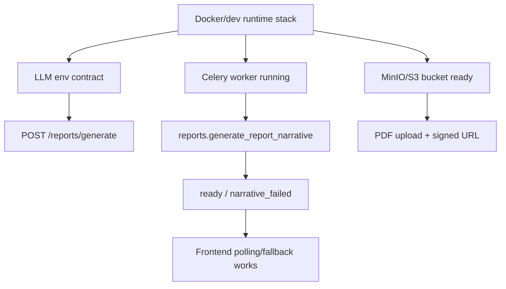

# SRS: E12 — LLM Report Runtime Readiness

**Версия:** 1.0
**Дата:** 2026-06-07
**Статус:** Active
**Источник:** `docs/features/E12-llm-report-runtime-readiness/FEATURE.md`

---

## 1. Введение

### 1.1 Назначение

Документ описывает программные и операционные требования к E12: доведению narrative report pipeline до реально запускаемого состояния в локальном/dev/staging runtime.

### 1.2 Область применения

E12 применяется к operational path вокруг уже реализованного E11:

```text
Runtime services + env + worker + storage bootstrap
  -> E11 report generate flow
  -> narrative task execution
  -> status polling/fallback
  -> PDF artifact delivery
```

### 1.3 Определения

| Термин | Определение |
|---|---|
| Runtime-ready | Состояние, в котором все обязательные сервисы и env настроены для запуска narrative flow |
| Mock provider path | Проверка pipeline с `LLM_PROVIDER=mock` без внешнего LLM |
| Real provider path | Проверка с реальным LLM API и ключом |
| Worker runtime | Отдельный Celery process/service, исполняющий report tasks |
| Storage bootstrap | Гарантия существования bucket до первой PDF upload операции |
| Launch readiness checklist | Конечный список проверок, подтверждающий готовность к запуску LLM report |

### 1.4 Ссылки

| Документ | Путь |
|---|---|
| E11 feature | `docs/features/E11-llm-report-narrative/FEATURE.md` |
| E11 workflow | `docs/features/E11-llm-report-narrative/WORKFLOW.md` |
| E11 API | `docs/features/E11-llm-report-narrative/API.md` |
| E12 feature | `docs/features/E12-llm-report-runtime-readiness/FEATURE.md` |
| E12 runbook | `docs/features/E12-llm-report-runtime-readiness/S05-local-runbook-start-logs-smoke.md` |
| E12 stories | `docs/features/E12-llm-report-runtime-readiness/` |

---

## 2. Общее описание

### 2.1 Product perspective

E12 не меняет narrative contract. Он закрывает runtime gaps между существующим кодом E11 и реальным запуском:



### 2.2 Функции

| Функция | Описание | Story |
|---|---|---|
| F12.1 | Runtime inventory/gap analysis | S01 |
| F12.2 | Dev orchestration with worker | S02 |
| F12.3 | LLM env contract: disabled/mock/real | S03 |
| F12.4 | Object storage/PDF bootstrap | S04 |
| F12.5 | Local runbook and smoke flow | S05 |
| F12.6 | Failure triage and launch checklist | S06 |

### 2.3 Ограничения

| ID | Ограничение |
|---|---|
| C12.1 | E12 не должен подменять E11 product contract новым функционалом |
| C12.2 | Mock path обязателен для локального smoke даже без real API key |
| C12.3 | Real provider path должен быть описан отдельно от mock path |
| C12.4 | Narrative workflow не считается runtime-ready без worker |
| C12.5 | PDF deliverable path не считается закрытым без storage bootstrap |

---

## 3. Функциональные требования

### 3.1 Runtime inventory (FR-12.1)

**FR-12.1.1** Система документации ДОЛЖНА явно перечислять все обязательные сервисы для narrative runtime.

**FR-12.1.2** Документация ДОЛЖНА отделять code-complete E11 от runtime gaps, мешающих запуску.

### 3.2 Dev orchestration (FR-12.2)

**FR-12.2.1** Для narrative-ready dev stack ДОЛЖЕН существовать отдельный worker runtime.

**FR-12.2.2** Документация ДОЛЖНА содержать однозначную команду запуска полного narrative stack.

**FR-12.2.3** Документация ДОЛЖНА описывать, как проверить, что worker реально обрабатывает queue.

### 3.3 LLM environment contract (FR-12.3)

**FR-12.3.1** ДОЛЖНЫ быть документированы режимы disabled, mock и real provider.

**FR-12.3.2** ДОЛЖНЫ быть перечислены обязательные env-переменные narrative provider layer.

**FR-12.3.3** ДОЛЖНО быть явно указано, что mock narrative не подтверждает качество real LLM output.

### 3.4 Storage/PDF bootstrap (FR-12.4)

**FR-12.4.1** Документация ДОЛЖНА описывать bootstrap bucket до первой PDF upload операции.

**FR-12.4.2** ДОЛЖЕН быть определён smoke path проверки PDF artifact delivery.

### 3.5 Runbook (FR-12.5)

**FR-12.5.1** ДОЛЖЕН существовать пошаговый runbook локального запуска.

**FR-12.5.2** Runbook ДОЛЖЕН покрывать generate, polling, regenerate и PDF checks.

**FR-12.5.3** Runbook ДОЛЖЕН содержать команды для чтения backend/worker logs.

### 3.6 Triage/checklist (FR-12.6)

**FR-12.6.1** ДОЛЖНА существовать таблица symptom → probable cause → next check.

**FR-12.6.2** ДОЛЖЕН существовать launch readiness checklist для dev/staging.

**FR-12.6.3** Документация ДОЛЖНА отделять блокирующие rollout проблемы от допустимых degraded состояний для локального smoke.

---

## 4. Нефункциональные требования

| ID | Требование | Значение |
|---|---|---|
| NFR-12.1 | Clarity | Новый участник команды поднимает flow по документации без чтения исходников как единственного источника истины |
| NFR-12.2 | Reliability | Runtime path должен быть детерминированно воспроизводим в локальном/dev окружении |
| NFR-12.3 | Safety | Real provider secrets документируются как backend-only runtime config |
| NFR-12.4 | Testability | Mock smoke path доступен без реального API key |
| NFR-12.5 | Operability | Основные failure modes narrative workflow диагностируются по runbook/triage |

---

## 5. Runtime model

### 5.1 Обязательные сервисы

```text
postgres
redis
minio/s3-compatible storage
backend api
frontend ui
celery worker
real or mock llm provider
```

### 5.2 Обязательные narrative env variables

```text
LLM_ENABLED
LLM_PROVIDER
LLM_MODEL
LLM_API_KEY
LLM_TIMEOUT_SECONDS
LLM_MAX_RETRIES
CELERY_BROKER_URL
CELERY_RESULT_BACKEND
S3_ENDPOINT_URL
S3_ACCESS_KEY_ID
S3_SECRET_ACCESS_KEY
S3_BUCKET_NAME
```

---

## 6. Verification criteria

### 6.1 Mock pipeline verification

Reference runbook:
- `docs/features/E12-llm-report-runtime-readiness/S05-local-runbook-start-logs-smoke.md`

1. `LLM_ENABLED=true`
2. `LLM_PROVIDER=mock`
3. stack поднят с worker
4. bucket bootstrap выполнен до PDF path
5. generate report returns `generating_narrative` or `deterministic_ready`
6. worker finishes task
7. detail endpoint returns `ready` with narrative payload
8. `narrative.model_provider=mock`

Live verification note (2026-06-07):
- controlled fallback/local readiness была подтверждена живым compose smoke;
- `register -> verify -> login -> generate -> poll -> pdf` завершился успешно;
- финальный report дошёл до `ready`, `pdf_generated=true`, `/pdf` отдал `307`.

### 6.2 Real provider verification

1. valid API key configured
2. provider reachable from backend/worker runtime
3. generate report
4. detail endpoint transitions to `ready`
5. `narrative.model_provider=openrouter`
6. narrative payload differs from mock contract and contains real generated content
7. PDF path reaches `pdf_generated=true` or working `/pdf` redirect

### 6.3 Failure-path verification

1. broken provider config produces diagnosable failure
2. `narrative_failed` or `deterministic_ready` is visible to frontend
3. regenerate flow is documented and testable
4. missing bucket / upload failure is diagnosable separately from narrative generation
5. `LLM_ENABLED=false` degraded path preserves readable deterministic deliverable

Live verification note (2026-06-07):
- disabled-provider degraded path действительно сохранил читабельный deterministic narrative deliverable;
- worker log подтвердил `used_fallback=True`, а report не застрял в `generating_narrative`.

---

## 7. Dependencies

### 7.1 Internal dependencies

| Dependency | Reason |
|---|---|
| E11 report narrative module | Core narrative logic already implemented |
| Reports module | Generate/detail/regenerate/PDF endpoints and tasks |
| Workers/Celery | Async task execution |
| Frontend report page | Polling, timeout, fallback, narrative rendering |
| Config layer | Env-driven provider/runtime toggles |

### 7.2 External dependencies

| Dependency | Reason |
|---|---|
| Redis | Celery broker/result backend |
| MinIO / S3 | PDF artifact storage |
| LLM API provider | Real narrative generation |
| Docker Compose | Reproducible local/dev runtime stack |

---

## 8. Rollout plan

1. Зафиксировать gaps и runtime inventory.
2. Сделать narrative-ready compose/runtime contract.
3. Описать env modes для mock/real provider.
4. Закрыть storage bootstrap path.
5. Подготовить runbook.
6. Зафиксировать triage и launch readiness checklist.
7. После этого запускать end-to-end smoke и объявлять E11 operationally ready.

---

## 9. Risks and mitigations

| Risk | Mitigation |
|---|---|
| Worker не поднят, report зависает | Явный worker service + readiness checks |
| Команда думает, что mock = real provider | Отдельные verification paths и env examples |
| PDF ломается после narrative success | Storage bootstrap contract + PDF smoke step |
| Missing API key / bad provider config | Failure triage + explicit env contract |
| Разрозненная документация | E12 consolidates runbook/checklist around E11 |
