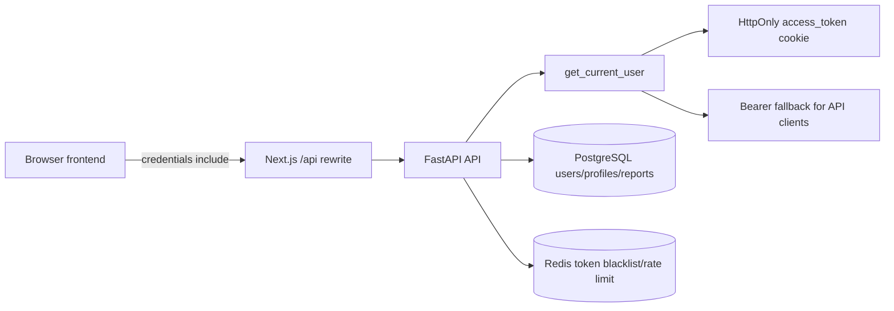

# SRS-E2: Identity & Cookie-first Authentication

## 1. Введение

### 1.1 Назначение

Документ фиксирует требования к модулю Identity/Auth Astrotype после обнаруженного класса ошибок `401` из-за рассинхрона browser JWT state и cookie-backed session.

Цель — привести web authentication к cookie-first модели, где browser app авторизуется через HttpOnly cookies, а `Authorization: Bearer` остаётся совместимым fallback для API-клиентов.

### 1.2 Scope

Входит в scope:

- email/password login;
- OAuth/Yandex callback session;
- JWT access/refresh tokens;
- refresh token rotation;
- logout/session cleanup;
- protected endpoint authorization;
- frontend session bootstrap;
- report page resilience к поздним `401`.

Не входит в scope:

- VK OAuth implementation;
- email verification redesign;
- password reset redesign;
- full CSRF implementation, если она выделяется в E8 security-hardening;
- removal of Bearer support for external API clients.

### 1.3 References

- Feature: `docs/features/E2-identity/FEATURE.md`
- Story: `docs/features/E2-identity/S10-cookie-first-session-auth.md`
- Workflow: `docs/features/E2-identity/WORKFLOW.md`
- API contract: `docs/features/E2-identity/API.md`
- Runtime pitfall: `docs/features/E12-llm-report-runtime-readiness/FEATURE.md`

## 2. Общее описание

### 2.1 Current problem

Текущий код исторически смешивает:

- JS-readable JWT cookies (`astrotype_token`, `astrotype_refresh_token`);
- HttpOnly OAuth cookies (`access_token`, `refresh_token`);
- Zustand auth token state;
- backend `Authorization` header validation.

Если frontend отправляет протухший Bearer token, backend может вернуть `401`, даже если browser одновременно отправляет валидный `access_token` cookie. Для report page это приводит к пустому экрану и ложному ощущению, что отчёт исчез.

### 2.2 Target architecture



Principles:

- Web session is cookie-first.
- Frontend does not read JWT.
- Refresh is cookie-native.
- Bearer is fallback, not browser source of truth.
- Protected UI screens handle session expiry explicitly.

## 3. Functional requirements

| ID | Requirement | Acceptance |
|---|---|---|
| FR-E2.10.1 | Backend auth dependency must evaluate multiple token candidates. | Stale Bearer + valid cookie returns authenticated user. |
| FR-E2.10.2 | Browser login must set HttpOnly `access_token` and `refresh_token` cookies. | `POST /auth/login` response contains Set-Cookie headers with HttpOnly. |
| FR-E2.10.3 | OAuth and email/password login must converge to the same cookie names. | Both flows result in valid `/users/me` with cookie only. |
| FR-E2.10.4 | Refresh endpoint must read refresh token from HttpOnly cookie. | `POST /auth/refresh` with cookie only returns 200 and rotates cookies. |
| FR-E2.10.5 | Refresh token must rotate. | Old refresh jti is blacklisted/revoked after successful refresh. |
| FR-E2.10.6 | Logout must revoke tokens and clear cookies. | `POST /auth/logout` sets Max-Age=0 for `access_token`, `refresh_token`, and legacy cookies. |
| FR-E2.10.7 | Frontend auth store must not store JWT as source of truth. | Zustand state contains user/session state only. |
| FR-E2.10.8 | Browser API client must use `credentials: "include"`. | Protected calls succeed without manually passing token. |
| FR-E2.10.9 | Browser API client must retry once after `401` via `/auth/refresh`. | Expired access + valid refresh recovers without user-visible error. |
| FR-E2.10.10 | Report page must not clear loaded data on late polling `401`. | Loaded report remains visible with session-expired banner. |
| FR-E2.10.11 | Legacy `astrotype_*` cookies must be migration-only. | Final browser flow does not write them after login/refresh. |
| FR-E2.10.12 | Bearer auth must remain supported for explicit API clients. | Direct request with valid `Authorization: Bearer` still works. |

## 4. Non-functional requirements

| Category | Requirement |
|---|---|
| Security | JWT must be signed with configured `SECRET_KEY` and include `type`, `sub`, `exp`, `jti`. |
| Security | Auth cookies must be `HttpOnly`, `SameSite=Lax`, `Path=/`, and `Secure=true` in production. |
| Security | Refresh tokens must be revocable/blacklistable by `jti`. |
| Security | CSRF posture must be explicit before production launch. |
| Reliability | A stale auth artifact must not invalidate a valid session artifact. |
| UX | Session expiry must show explicit message, not blank page. |
| Compatibility | Existing API-client Bearer use must keep working during migration. |
| Testability | Auth behavior must be covered by unit tests and live cookie smoke checks. |

## 5. Data model

No new persistent table is required for the cookie-first cleanup.

Existing data/state:

| Entity | Role |
|---|---|
| `users` | Identity source; `is_active`, `is_verified` must be enforced. |
| JWT access token | Short-lived authentication token, includes `sub`, `type=access`, `jti`, `exp`. |
| JWT refresh token | Long-lived refresh token, includes `sub`, `type=refresh`, `jti`, `exp`. |
| Redis token blacklist | Revocation list for access/refresh jti. |
| `identity_links` | OAuth provider links for Yandex/VK/etc. |

## 6. API specification

Full contract: `docs/features/E2-identity/API.md`.

Required endpoints:

| Endpoint | Purpose | Auth/session behavior |
|---|---|---|
| `POST /api/v1/auth/login` | Email/password login | Sets HttpOnly access/refresh cookies. |
| `POST /api/v1/auth/refresh` | Refresh access | Reads refresh cookie, rotates refresh token, sets new cookies. |
| `POST /api/v1/auth/logout` | Logout | Blacklists tokens and clears cookies. |
| `GET /api/v1/users/me` | Session bootstrap | Reads access cookie or Bearer fallback. |
| Protected report/profile/chart endpoints | Product data | Must work with cookies only. |

## 7. Frontend integration

### 7.1 Session store

Frontend state shape should be session-oriented:

```ts
type AuthState = {
  user: User | null;
  isAuthenticated: boolean;
  isLoadingSession: boolean;
};
```

JWT fields are not part of final browser state.

### 7.2 API client behavior

```ts
const response = await fetch(endpoint, {
  ...init,
  credentials: "include",
});
```

On `401`:

1. call `/api/v1/auth/refresh` once;
2. retry original request once;
3. if still unauthorized, raise `ApiError(401, "Сессия истекла...")`.

### 7.3 Report page behavior

Report page must distinguish:

- initial unauthenticated state: show error/login prompt;
- late polling unauthenticated state: keep already loaded data visible;
- narrative failure: deterministic fallback;
- PDF/download action unauthenticated: show session-expired message and require login.

## 8. Security and CSRF

Cookie auth requires explicit CSRF posture.

MVP acceptable baseline:

- `SameSite=Lax`;
- `Secure=true` in production;
- strict CORS allowed origins;
- OAuth state validation;
- no unsafe wildcard credentialed CORS.

Production requirement:

- create E8 security story for CSRF/double-submit protection on mutating browser routes if not implemented in E2.10.

Mutating routes to include in CSRF review:

- auth logout;
- password change;
- profile update;
- report generate/regenerate;
- payment create/webhook-facing user actions;
- account unlink/link provider.

## 9. Verification criteria

### 9.1 Unit tests

Required tests:

- `get_current_user` accepts valid Bearer.
- `get_current_user` accepts valid `access_token` cookie.
- `get_current_user` falls back to valid cookie if Bearer is stale.
- `get_current_user` rejects all invalid candidates.
- `/auth/refresh` reads refresh cookie.
- `/auth/refresh` rotates refresh and blacklists old jti.
- `/auth/logout` clears cookies.

### 9.2 Frontend structural checks

Add/extend scripts:

- `frontend/scripts/check-auth-ux.mjs`
- `frontend/scripts/check-report-ux.mjs`

Checks should assert:

- no default browser `Authorization` injection from Zustand token;
- report API helpers do not require token parameter;
- report page does not clear `data/currentReport` on polling-only `401`;
- auth store does not persist JWT.

### 9.3 Live smoke

Minimum local smoke:

```bash
curl -i -X POST http://localhost:3000/api/v1/auth/login \
  -H 'Content-Type: application/json' \
  --data '{"email":"...","password":"..."}'
```

Expected:

- `Set-Cookie: access_token=...; HttpOnly`
- `Set-Cookie: refresh_token=...; HttpOnly`

Then:

```bash
curl -i 'http://localhost:3000/api/v1/reports?product=self&limit=100' \
  -H 'Authorization: Bearer stale.invalid.token' \
  -H 'Cookie: access_token=<valid>'
```

Expected: `200 OK`.

## 10. Rollout and migration

1. Keep Bearer compatibility in backend.
2. Add cookie-native login while still returning JSON tokens if needed.
3. Migrate frontend to stop writing/reading JS JWT.
4. Remove token params from API helpers.
5. Delete or deprecate `astrotype_*` auth cookie helpers.
6. Add structural checks to prevent regression.
7. Later: remove legacy browser token plumbing after one stable release.

## 11. Risks

| Risk | Mitigation |
|---|---|
| Existing browser sessions carry stale JS cookies. | Candidate-token fallback and logout clears legacy cookies. |
| API clients depend on JSON tokens. | Keep transitional JSON response and Bearer support. |
| CSRF risk increases when relying on cookies. | SameSite baseline + explicit E8 CSRF story. |
| Report page hides auth bugs by keeping old data visible. | Show clear session-expired banner and disable update/download actions. |
| Refresh loop creates request storms. | Retry refresh once per original request, share refresh promise. |

## 12. Definition of done

- All FR-E2.10 requirements are implemented or explicitly deferred with a linked story.
- Backend and frontend targeted gates pass.
- Browser and curl smoke prove cookie-only protected access.
- Report page no longer blanks from late `401`.
- Docs (`FEATURE.md`, `S10`, `API.md`, `WORKFLOW.md`, this SRS) match actual code.
