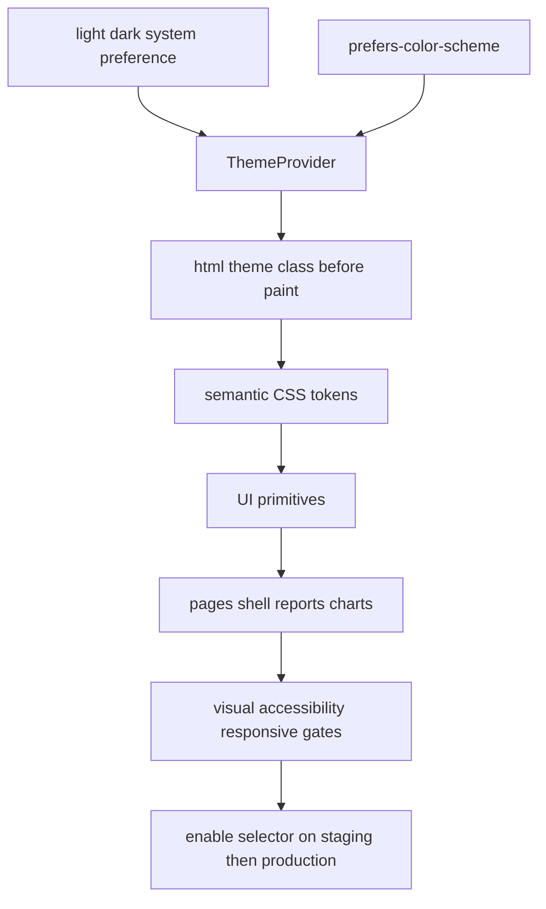

# SRS E21: Цельная светлая тема Astrotype

**Версия:** 1.0
**Дата:** 2026-10-10
**Статус:** Implemented locally; CI/staging rollout pending
**Feature:** `docs/features/E21-light-theme/FEATURE.md`

## 1. Введение

### 1.1 Назначение

Документ определяет требования к production-ready светлой теме web-приложения Astrotype и к безопасному возврату выбора `light/dark/system`.

### 1.2 Область применения

Требования распространяются на все активные публичные, auth, account, product и report surfaces, общие UI primitives, charts, overlays и граничные состояния.

### 1.3 Текущий baseline

Semantic migration, selector и локальные browser gates реализованы. Staging продолжает считаться fail-closed до доставки точного green SHA, authenticated smoke и проверки rollback к dark lock.

## 2. Общее описание

### 2.1 Продуктовая цель

Светлая тема является дневной версией того же визуального языка, а не белой альтернативной админкой. Она сохраняет Cormorant/Inter, фиолетовые и золотые акценты, спокойную глубину и narrative-first hierarchy.

### 2.2 Ограничения

- Чистый белый canvas запрещён.
- Частичная поддержка темы запрещена.
- Switcher запрещён до green completeness gate.
- Theme-sensitive styles должны использовать semantic tokens.
- Product accents могут оставаться отдельными токенами, но обязаны иметь light/dark presentation variants при необходимости.
- Theme preference может храниться локально, так как не содержит чувствительных данных.

## 3. Функциональные требования

### 3.1 Theme modes

**FR-E21.1.1** Система ДОЛЖНА поддерживать режимы `light`, `dark`, `system` после завершения rollout gate.

**FR-E21.1.2** Режим `system` ДОЛЖЕН следовать `prefers-color-scheme` и реагировать на изменение системной настройки.

**FR-E21.1.3** Выбранный режим ДОЛЖЕН сохраняться между reload и переходами по маршрутам.

**FR-E21.1.4** До прохождения completeness gate система ДОЛЖНА оставаться принудительно тёмной и не показывать недоступный switcher; dark lock остаётся обязательным rollback-путём.

### 3.2 Theme initialization

**FR-E21.2.1** Правильная тема ДОЛЖНА применяться до первого пользовательского paint.

**FR-E21.2.2** Система НЕ ДОЛЖНА показывать flash другой темы или hydration warnings.

**FR-E21.2.3** Theme change НЕ ДОЛЖЕН сбрасывать формы, navigation state или server-state cache.

### 3.3 Theme selector

**FR-E21.3.1** Selector ДОЛЖЕН явно показывать три русских режима: «Светлая», «Тёмная», «Как в системе».

**FR-E21.3.2** Selector ДОЛЖЕН иметь accessible name, keyboard navigation, focus-visible и current-state indication.

**FR-E21.3.3** Один неоднозначный icon-only control НЕ ДОЛЖЕН использоваться как единственный интерфейс трёх режимов.

### 3.4 Surface completeness

**FR-E21.4.1** Обе темы ДОЛЖНЫ полностью покрывать public, auth, shell, account, product и report surfaces из E21 matrix.

**FR-E21.4.2** Loading, empty, locked, failed, retry, disabled, hover, focus, modal и tooltip states ДОЛЖНЫ быть покрыты в обеих темах.

**FR-E21.4.3** Система НЕ ДОЛЖНА смешивать dark-only surfaces со светлым canvas.

### 3.5 Charts and infographics

**FR-E21.5.1** Grid, labels, series, highlights, tooltip и selected states ДОЛЖНЫ иметь theme-aware tokens.

**FR-E21.5.2** Значение chart state НЕ ДОЛЖНО кодироваться только цветом.

**FR-E21.5.3** Chart labels и tooltip text ДОЛЖНЫ соответствовать contrast requirements.

## 4. Нефункциональные требования

### 4.1 Accessibility

- **NFR-E21.1:** обычный текст — contrast ratio не ниже 4.5:1.
- **NFR-E21.2:** крупный текст — не ниже 3:1.
- **NFR-E21.3:** UI boundaries/focus indicators — не ниже применимых WCAG 2.1 AA требований.
- **NFR-E21.4:** keyboard и screen-reader behavior одинаково работоспособны в обеих темах.

### 4.2 Visual quality

- **NFR-E21.5:** light canvas не равен чистому белому.
- **NFR-E21.6:** surfaces отделяются через tint, border и restrained shadow, а не через максимальную белизну.
- **NFR-E21.7:** theme change не меняет layout geometry и не создаёт CLS выше существующего budget.

### 4.3 Responsive quality

- **NFR-E21.8:** обязательные viewport: 390, 820, 1440 px.
- **NFR-E21.9:** `document.documentElement.scrollWidth <= document.documentElement.clientWidth` для каждой обязательной theme/viewport комбинации.

### 4.4 Performance

- **NFR-E21.10:** theme support не должна добавлять тяжёлую runtime UI library.
- **NFR-E21.11:** переключение темы выполняется через class/variables без полного reload.

## 5. Семантическая модель токенов

Минимальные группы:

```text
canvas
surface / surface-elevated / surface-subtle
overlay / scrim
text-primary / text-secondary / text-muted / text-inverse
border-default / border-strong
control / control-hover / control-active / control-disabled
focus-ring
link / link-hover
success / warning / error / info
shadow-soft / shadow-elevated
chart-grid / chart-label / chart-series-* / chart-highlight
product-self / product-love / product-child / product-career
```

Конкретные CSS names и итоговые значения фиксируются S01. Компоненты используют семантику, а не знание о конкретном HEX.

## 6. Архитектура



## 7. Данные и API

Backend API и database migration не требуются. Preference хранится клиентом через механизм `next-themes`. Запрещено включать в theme storage auth tokens, profile data или другие чувствительные данные.

## 8. Verification criteria

1. Static theme-contract check проходит.
2. Frontend unit/UX scripts проходят.
3. ESLint, Prettier, TypeScript и production build проходят.
4. Playwright behavior tests проходят для `light/dark/system`.
5. Screenshot matrix проходит на 390/820/1440.
6. axe/contrast checks не имеют критических нарушений.
7. Horizontal overflow отсутствует.
8. Authenticated staging smoke пройден в обеих темах.
9. Rollback к dark lock проверен.

## 9. Rollout

1. Доставить tokens и migrations при сохранённом dark lock.
2. Проверить staging visual matrix внутренним параметром/тестовым harness без публичного switcher.
3. После green gate снять forced lock и включить selector на staging.
4. Выполнить authenticated smoke.
5. Выпустить production только с точным green SHA.
6. При дефекте вернуть forced dark lock и скрыть selector; данные и preference migration не требуются.

## 10. Зависимости

- `next-themes`
- Tailwind semantic tokens
- Playwright или эквивалентный browser runner
- axe-core integration для accessibility checks
- E21 Feature/Stories
- V2-E18 product surfaces
- V2-E11 report reader
