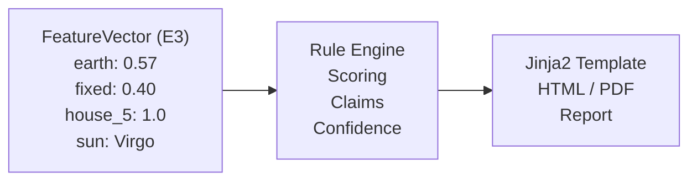
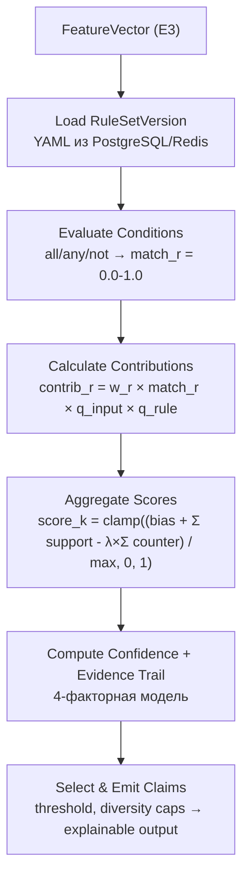

# SRS: E4 — Rules & Content

**Версия:** 1.0
**Дата:** 2026-05-30
**Статус:** Implemented (S06 CMS — backlog)
**Автор:** Astrotype Team

---

## 1. Введение

### 1.1 Назначение

Документ описывает программные требования к модулю **Rules & Content** — rule-based движку интерпретации натальных карт. Модуль преобразует нормализованный FeatureVector (из E3) в человекочитаемые интерпретации через версионированные YAML-правила и Jinja2-шаблоны.

### 1.2 Область применения

E4 — это **интерпретационный слой** между вычислительным ядром (E3) и рендерингом отчётов (E5). Без E4 карта есть, но текстовой интерпретации нет.

```
E3 (Chart Engine)  →  E4 (Rules & Content)  →  E5 (Reports)
  FeatureVector         интерпретация             отчёт
```

Модуль используется всеми четырьмя вертикалями:

| Вертикаль | Что E4 интерпретирует |
|---|---|
| **Self** | Архетипы, сильные стороны, тени, стресс-стиль |
| **Love** | Совместимость, коммуникация, конфликты, ремонт |
| **Child** | Темперамент, рутина, чувствительность, социализация |
| **Career** | Роли, рабочая среда, anti-patterns, рост |

### 1.3 Определения и сокращения

| Термин | Определение |
|---|---|
| **RuleSet** | Набор YAML-правил для одной вертикали (self, love, child, career) |
| **RuleSetVersion** | Иммутабельная версия правил (semver + effective_from) |
| **Rule** | Единица логики: условия → вклады в score/claim |
| **Claim** | Единица интерпретации: score + confidence + evidence + текст |
| **Archetype** | Категория личности (напр. "Стратег", "Творец") |
| **TemplateVersion** | Версия Jinja2-шаблона для рендеринга отчёта |
| **Evidence Trail** | Прозрачная цепочка: факты → правила → выводы |
| **Confidence** | Мера надёжности вывода (0.0-1.0) |

### 1.4 Ссылки

| Документ | Путь |
|---|---|
| Product Spec | `docs/SPEC.md` |
| Business Logic Spec | `docs/Спецификация бизнес-логики и доменных правил Astrotype.md` |
| E3 SRS | `docs/SRS-E3-chart-engine.md` |
| Feature Stories | `docs/features/E4-rules-content/` |
| Rule Examples | `docs/Спецификация бизнес-логики...md` §3 |

---

## 2. Общее описание

### 2.1 Перспектива продукта

E4 получает на вход FeatureVector (из E3) и выдаёт набор Claim'ов — структурированных интерпретаций с score, confidence, evidence и текстом. E5 (Reports) рендерит эти Claim'ы в финальный отчёт.



### 2.2 Функции продукта

| Функция | Описание | Story |
|---|---|---|
| **F4.1** | Версионирование наборов правил (RuleSetVersion) | S01 |
| **F4.2** | Версионирование шаблонов (TemplateVersion) | S02 |
| **F4.3** | Rule engine: условия → вклады → score → claim | S03 |
| **F4.4** | Content Resolver: claim'ы → текст отчёта | S04 |
| **F4.5** | Локализация RU/EN с fallback | S05 |
| **F4.6** | CMS для редакторов (опционально) | S06 |

### 2.3 Ограничения

| Ограничение | Описание |
|---|---|
| **C1** | Правила — YAML-файлы, не хардкод в Python |
| **C2** | Все scoring-параметры версионируются отдельно от кода |
| **C3** | Runtime AI запрещён в scoring loop (rule-first) |
| **C4** | Контрдоказательства не теряются — идут в evidence trail |
| **C5** | Confidence не зависит от score — независимые сущности |

### 2.4 Предположения

- E3 (Chart Engine) предоставляет валидный FeatureVector
- FeatureVector содержит значения в [0.0, 1.0]
- Правила создаются редакторами, не разработчиками
- Изменение правил не требует деплоя кода

---

## 3. Функциональные требования

### 3.1 RuleSetVersion (FR-4.1)

**FR-4.1.1** Система ДОЛЖНА хранить наборы правил как YAML-файлы.

**FR-4.1.2** Каждый набор правил ДОЛЖЕН иметь версию (semver: major.minor.patch).

**FR-4.1.3** Версии ДОЛЖНЫ быть иммутабельными — после публикации изменение запрещено.

**FR-4.1.4** Система ДОЛЖНА поддерживать несколько одновременно существующих версий.

**FR-4.1.5** Каждая версия ДОЛЖНА иметь `effective_from` (дата активации).

**FR-4.1.6** Версии ДОЛЖНЫ быть привязаны к вертикали (self, love, child, career).

### 3.2 TemplateVersion (FR-4.2)

**FR-4.2.1** Шаблоны ДОЛЖНЫ использовать Jinja2.

**FR-4.2.2** Шаблоны ДОЛЖНЫ быть версионированы (semver).

**FR-4.2.3** Шаблоны ДОЛЖНЫ быть привязаны к вертикали.

**FR-4.2.4** Система ДОЛЖНА поддерживать несколько версий шаблонов одновременно.

### 3.3 Rule Engine (FR-4.3)

**FR-4.3.1** Система ДОЛЖНА загружать правила из YAML-файлов.

**FR-4.3.2** Каждое правило ДОЛЖНО содержать:
- `rule_id` — уникальный идентификатор
- `product` — вертикаль (self/love/child/career)
- `conditions` — условия срабатывания (all/any/not)
- `effects` — вклады в archetype/claim scores
- `confidence_adjustments` — корректировки confidence
- `counter_rules` — ссылки на противоречащие правила
- `evidence` — шаблон объяснения

**FR-4.3.3** Условия ДОЛЖНЫ поддерживать операторы:
- `gte`, `lte`, `gt`, `lt`, `eq`, `neq` — сравнения
- `in`, `not_in` — принадлежность множеству
- `between` — диапазон

**FR-4.3.4** Scoring ДОЛЖЕН использовать формулу:
```
contrib_r = w_r × match_r × q_input × q_rule
score_k = clamp((bias_k + Σ support_r − λ × Σ counter_r) / max_possible_k, 0, 1)
```

**FR-4.3.5** Confidence ДОЛЖЕН вычисляться по четырёхфакторной модели:
```
confidence = 0.35×q_input + 0.30×q_coverage + 0.20×q_margin + 0.15×q_consistency
```

**FR-4.3.6** Система ДОЛЖНА генерировать evidence trail для каждого claim:
- какие факты использованы
- какие правила сработали
- какие были контрдоказательства
- какая версия движка

**FR-4.3.7** Scoring ДОЛЖЕН быть детерминированным.

**FR-4.3.8** При отсутствии birth_time система ДОЛЖНА отключать правила, зависящие от домов/ASC, и снижать confidence.

### 3.4 Content Resolver (FR-4.4)

**FR-4.4.1** Система ДОЛЖНА маппить сработавшие правила на текстовые шаблоны.

**FR-4.4.2** При пустых правилах система ДОЛЖНА использовать fallback-шаблон.

**FR-4.4.3** Система ДОЛЖНА поддерживать free/preview и paid/full режимы:
- Free: 2-3 claim'а, teaser-архетипы
- Full: все claim'ы, evidence trail, PDF

### 3.5 Локализация (FR-4.5)

**FR-4.5.1** Система ДОЛЖНА поддерживать RU и EN локали.

**FR-4.5.2** Правила и шаблоны ДОЛЖНЫ иметь locale-specific версии.

**FR-4.5.3** При отсутствии запрошенной локали система ДОЛЖНА использовать fallback на RU.

### 3.6 CMS (FR-4.6, optional)

**FR-4.6.1** Система ДОЛЖНА предоставлять UI для редактирования правил.

**FR-4.6.2** Система ДОЛЖНА предоставлять preview генерации отчёта.

**FR-4.6.3** Система ДОЛЖНА валидировать YAML-правила перед сохранением.

---

## 4. Нефункциональные требования

### 4.1 Производительность

| Требование | Значение |
|---|---|
| **NFR-4.1.1** | Scoring одного FeatureVector < 500 мс |
| **NFR-4.1.2** | Загрузка правил из YAML < 100 мс (с кэшем) |
| **NFR-4.1.3** | Рендеринг шаблона < 200 мс |

### 4.2 Надёжность

| Требование | Значение |
|---|---|
| **NFR-4.2.1** | Невалидное правило → ошибка валидации, не crash |
| **NFR-4.2.2** | Отсутствие шаблона → fallback, не crash |
| **NFR-4.2.3** | Правила кэшируются в Redis, invalidate при публикации новой версии |

### 4.3 Безопасность

| Требование | Значение |
|---|---|
| **NFR-4.3.1** | YAML-правила валидируются по JSON Schema перед сохранением |
| **NFR-4.3.2** | CMS endpoints требуют admin-роли |
| **NFR-4.3.3** | Jinja2 sandbox mode — запрет arbitrary code execution |

### 4.4 Тестируемость

| Требование | Значение |
|---|---|
| **NFR-4.4.1** | Golden tests: фиксированные FeatureVector → ожидаемые Claim'ы |
| **NFR-4.4.2** | При изменении правил golden tests требуют явного обновления snapshot |
| **NFR-4.4.3** | Rule simulation CLI: прогон старой и новой версии на одном наборе данных |

---

## 5. Модель данных

### 5.1 RuleSetVersion (PostgreSQL)

```
rule_set_versions
├── id              UUID PK
├── product_code    VARCHAR(20) — "self"|"love"|"child"|"career"
├── semver          VARCHAR(20) — "1.0.0"
├── effective_from  TIMESTAMP WITH TZ
├── status          VARCHAR(20) — "draft"|"published"|"deprecated"
├── rules_json      JSON — весь набор правил
├── flags           JSON — feature flags
├── template_refs   JSON — ссылки на версии шаблонов
├── published_at    TIMESTAMP WITH TZ (nullable)
├── created_at      TIMESTAMP WITH TZ
└── updated_at      TIMESTAMP WITH TZ
```

### 5.2 TemplateVersion (PostgreSQL)

```
template_versions
├── id              UUID PK
├── product_code    VARCHAR(20)
├── semver          VARCHAR(20)
├── locale          VARCHAR(10) — "ru-RU"|"en-US"
├── template_type   VARCHAR(20) — "full"|"preview"|"email"
├── content         TEXT — Jinja2 шаблон
├── status          VARCHAR(20) — "draft"|"published"
├── published_at    TIMESTAMP WITH TZ (nullable)
├── created_at      TIMESTAMP WITH TZ
└── updated_at      TIMESTAMP WITH TZ
```

### 5.3 Rule (YAML structure)

```yaml
rule_id: self.strateg.v1
product: self
status: active
version: 1.0.0
effective_from: 2026-01-01
depends_on:
  - feature.earth
  - feature.fixed
  - feature.house_emphasis_10
conditions:
  all:
    - fact: feature.earth
      op: gte
      value: 0.40
    - fact: feature.fixed
      op: gte
      value: 0.35
    - fact: feature.house_emphasis.10
      op: gte
      value: 0.60
effects:
  archetype.strateg: 0.25
  claim.self.structure_strength: 0.18
confidence_adjustments:
  - when:
      fact: quality.birth_time_quality
      op: lt
      value: 0.50
    delta: -0.10
counter_rules:
  - self.spontaneous_creator.v1
evidence:
  template_key: ev.self.strateg
  show_basis_features:
    - feature.earth
    - feature.fixed
    - feature.house_emphasis.10
localization:
  locale: ru-RU
```

### 5.4 Claim (output structure)

```json
{
  "claim_id": "self.structure_strength",
  "section": "strengths",
  "archetype": "Стратег",
  "score": 0.78,
  "confidence": {
    "value": 0.72,
    "label": "medium_high",
    "reason_codes": ["GOOD_MARGIN", "HIGH_COVERAGE"]
  },
  "message_template": "Выражена способность к структурированию и системному мышлению.",
  "basis": [
    {
      "rule_id": "self.strateg.v1",
      "feature": "feature.earth",
      "value": 0.57,
      "contribution": 0.25
    },
    {
      "rule_id": "self.strateg.v1",
      "feature": "feature.fixed",
      "value": 0.40,
      "contribution": 0.18
    }
  ],
  "counter_evidence": [
    {
      "rule_id": "self.spontaneous_creator.v1",
      "feature": "feature.fire",
      "value": 0.19,
      "contribution": -0.05
    }
  ],
  "provenance": {
    "ruleset_version": "self-1.0.0",
    "template_version": "self-ru-1.0.0",
    "feature_schema_version": "features-1.0.0"
  }
}
```

### 5.5 Confidence reason codes

| Код | Значение |
|---|---|
| `GOOD_INPUT` | birth_time точный, контекст полный |
| `MISSING_BIRTH_TIME` | время рождения неизвестно |
| `LOW_RULE_COVERAGE` | мало правил сработало |
| `HIGH_CONTRADICTION` | много контрдоказательств |
| `GOOD_MARGIN` | top claim чётко отделён от конкурентов |
| `LOW_MARGIN` | top claim и конкурент близки по score |
| `PAIR_CONTEXT_MISSING` | нет данных о партнёре (Love) |
| `GUARDIAN_UNVERIFIED` | опекун не подтверждён (Child) |

---

## 6. Архитектура rule engine

### 6.1 Pipeline



### 6.2 Self vertical — стартовый каталог архетипов

| Архетип | Ключевые признаки |
|---|---|
| **Стратег** | earth ≥ 0.40, fixed ≥ 0.35, house_10 emphasis |
| **Творец** | fire ≥ 0.35, mutable ≥ 0.30, house_5 emphasis |
| **Исследователь** | air ≥ 0.35, mutable ≥ 0.30, house_9 emphasis |
| **Опора** | earth ≥ 0.40, cardinal ≥ 0.30, house_4 emphasis |
| **Дипломат** | air ≥ 0.35, cardinal ≥ 0.30, house_7 emphasis |
| **Катализатор** | fire ≥ 0.35, cardinal ≥ 0.30, house_1 emphasis |
| **Наставник** | water ≥ 0.35, mutable ≥ 0.30, house_12 emphasis |
| **Строитель** | earth ≥ 0.45, fixed ≥ 0.35, saturn aspects |

---

## 7. API Specification

### 7.1 Endpoints

| Метод | Путь | Описание |
|---|---|---|
| `POST` | `/api/v1/interpret` | Интерпретировать FeatureVector |
| `GET` | `/api/v1/rulesets` | Список версий правил |
| `GET` | `/api/v1/rulesets/{id}` | Получить версию правил |
| `POST` | `/api/v1/rulesets` | Создать версию правил (admin) |
| `GET` | `/api/v1/templates` | Список версий шаблонов |
| `GET` | `/api/v1/templates/{id}` | Получить версию шаблона |
| `POST` | `/api/v1/templates` | Создать версию шаблона (admin) |

### 7.2 Пример запроса

```http
POST /api/v1/interpret
Authorization: Bearer <jwt>
Content-Type: application/json

{
  "profile_id": "uuid",
  "product": "self",
  "ruleset_version": "1.0.0",
  "locale": "ru-RU",
  "mode": "full"
}
```

### 7.3 Пример ответа

```json
{
  "product": "self",
  "archetype": {
    "primary": "Стратег",
    "score": 0.78,
    "confidence": {"value": 0.72, "label": "medium_high"}
  },
  "claims": [
    {
      "section": "strengths",
      "score": 0.78,
      "message": "Выражена способность к структурированию и системному мышлению.",
      "basis": [...],
      "counter_evidence": [...]
    }
  ],
  "quality_warning": null,
  "provenance": {
    "ruleset_version": "self-1.0.0",
    "template_version": "self-ru-1.0.0",
    "engine_version": "0.1.0"
  }
}
```

---

## 8. Критерии верификации

### 8.1 Golden Tests

| Тест | Описание |
|---|---|
| `test_self_archetype_strateg` | earth≥0.40 + fixed≥0.35 → "Стратег" |
| `test_self_archetype_creator` | fire≥0.35 + mutable≥0.30 → "Творец" |
| `test_confidence_missing_time` | birth_time_quality=0 → confidence снижен |
| `test_counter_evidence_present` | fire+earth конфликт → counter_evidence не пуст |
| `test_deterministic` | одинаковый вход → одинаковый вывод |
| `test_free_preview` | mode=preview → 2-3 claim'а, нет evidence |

### 8.2 Quality Gates

| Проверка | Статус |
|---|---|
| YAML Schema validation | запланировано |
| Golden tests | запланировано |
| Rule simulation CLI | запланировано |
| ruff + mypy | запланировано |

---

## 9. Зависимости

### 9.1 Внешние зависимости

| Пакет | Назначение |
|---|---|
| `pyyaml` | Парсинг YAML-правил |
| `jinja2` | Рендеринг шаблонов отчётов |
| `jsonschema` | Валидация YAML-правил |

### 9.2 Внутренние зависимости

| Модуль | Что использует из E4 |
|---|---|
| `E3: Chart Engine` | FeatureVector — входные данные |
| `E3: Chart Engine` | ChartSnapshot — provenance |

### 9.3 Downstream consumers

| Модуль | Что использует из E4 |
|---|---|
| **E5: Reports** | Claim'ы → рендеринг HTML/PDF |
| **E6: Billing** | Entitlement → free/prepaid/full режим |
| **E7: Notifications** | "Отчёт готов" → email/push |
