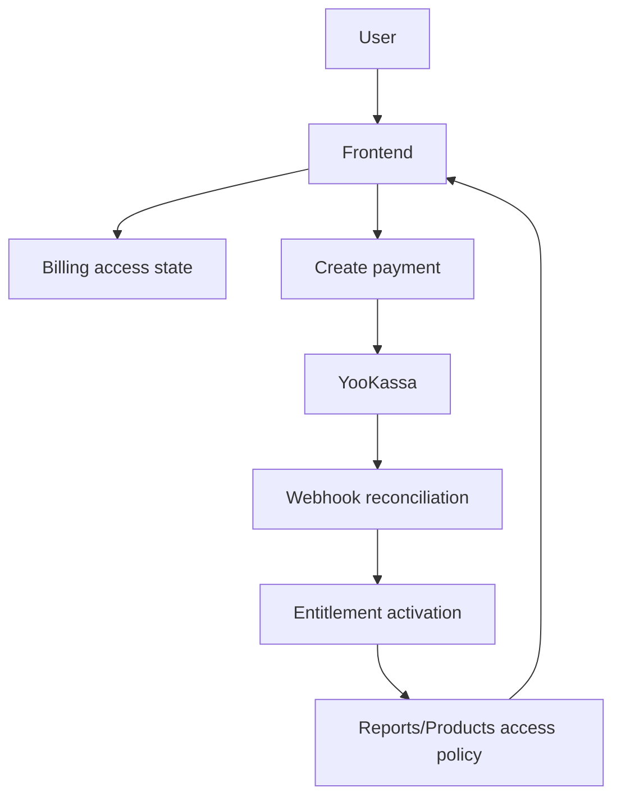

# SRS: E6 — Billing & Subscriptions

Версия: 1.0
Дата: 2026-06-07
Статус: Partially implemented — checkout/webhook/entitlement grant implemented; access-state API and report/product gates still pending
Источник: `docs/features/E6-billing-subscriptions/`

---

## 1. Введение

### 1.1 Назначение

Документ описывает программные требования к модулю Billing & Subscriptions для Astrotype как к системе управления коммерческим доступом Free vs Plus.

### 1.2 Область применения

E6 покрывает не только payment processing, но и весь access contract:

- pricing/catalog;
- checkout creation;
- payment confirmation;
- entitlement activation;
- preview/full gating в reports и products;
- billing/account state для frontend.

### 1.3 Определения

| Термин       | Определение                                                                                    |
| ------------ | ---------------------------------------------------------------------------------------------- |
| Free         | Базовый бесплатный режим доступа                                                               |
| Plus         | Платный режим доступа с полным контентом                                                       |
| Access state | Текущее коммерческое состояние пользователя (`free`, `checkout_pending`, `plus_active` и т.д.) |
| Entitlement  | Backend-запись, подтверждающая доступ пользователя к продукту/плану                            |
| Preview      | Ограниченная бесплатная версия контента                                                        |
| Full         | Полная платная версия контента                                                                 |
| PSP          | Payment service provider, в MVP — YooKassa                                                     |

### 1.4 Ссылки

| Документ                     | Путь                                                     |
| ---------------------------- | -------------------------------------------------------- |
| Feature docs                 | `docs/features/E6-billing-subscriptions/`                |
| Workflow explainer           | `docs/features/E6-billing-subscriptions/WORKFLOW.md`     |
| API explainer                | `docs/features/E6-billing-subscriptions/API.md`          |
| Current implementation audit | `docs/architecture/current-payment-confirmation-flow.md` |
| Reports feature              | `docs/features/E5-products-reports/`                     |
| Report UX                    | `docs/features/E10-report-ux-redesign/`                  |
| LLM narrative                | `docs/features/E11-llm-report-narrative/`                |

---

## 2. Общее описание

### 2.1 Product perspective

E6 — слой коммерческого доступа между auth/profile/report flows и frontend UX:

### 2.2 Функции

| Функция | Описание                           | Story |
| ------- | ---------------------------------- | ----- |
| F6.1    | Плановый каталог и access matrix   | S01   |
| F6.2    | Lifecycle access state             | S02   |
| F6.3    | YooKassa checkout baseline         | S03   |
| F6.4    | Billing/account summary API        | S04   |
| F6.5    | Payment-to-access orchestration    | S05   |
| F6.6    | Report/product preview/full gating | S06   |
| F6.7    | Entitlement policy engine          | S07   |
| F6.8    | Frontend billing/upsell flow       | S08   |

### 2.3 Ограничения

| ID   | Ограничение                                                                                |
| ---- | ------------------------------------------------------------------------------------------ |
| C6.1 | Коммерческие параметры принадлежат backend catalog, а не frontend                          |
| C6.2 | MVP использует единый план Plus и YooKassa как primary PSP                                 |
| C6.3 | Free доступ не должен раскрывать full paid content через API                               |
| C6.4 | Direct route access не должен обходить entitlement checks                                  |
| C6.5 | Возврат с PSP не считается активацией доступа без backend-confirmed webhook/reconciliation |

---

## 3. Функциональные требования

### 3.1 Catalog and access matrix (FR-6.1)

FR-6.1.1 Система ДОЛЖНА иметь server-owned коммерческий каталог планов.

FR-6.1.2 MVP каталог ДОЛЖЕН содержать единый основной план Plus.

FR-6.1.3 Для каждого плана система ДОЛЖНА хранить цену, валюту, интервал и grants/access matrix.

FR-6.1.4 Billing UI и checkout API ДОЛЖНЫ ссылаться на один и тот же catalog contract.

### 3.2 Access lifecycle (FR-6.2)

FR-6.2.1 Система ДОЛЖНА различать состояния `free`, `checkout_pending`, `plus_active`, `payment_failed`, `plus_inactive`.

FR-6.2.2 Переходы между состояниями ДОЛЖНЫ управляться backend-событиями, а не только frontend state.

FR-6.2.3 При неуспешной оплате пользователь ДОЛЖЕН оставаться в Free-compatible режиме.

### 3.3 Checkout (FR-6.3)

FR-6.3.1 `POST /api/v1/payments` ДОЛЖЕН принимать только server-owned identifier плана/продукта и `return_url`.

FR-6.3.2 Клиент НЕ ДОЛЖЕН задавать amount, currency, description и коммерческое metadata.

FR-6.3.3 Backend ДОЛЖЕН создавать локальный payment record до вызова PSP.

### 3.4 Billing/account state (FR-6.4)

FR-6.4.1 Система ДОЛЖНА иметь endpoint для чтения текущего access state пользователя.

FR-6.4.2 Этот endpoint ДОЛЖЕН возвращать текущий plan/access status, grants и summary последней активной попытки оплаты при необходимости.

### 3.5 Payment confirmation and access activation (FR-6.5)

FR-6.5.1 Webhook handler ДОЛЖЕН сохранять raw webhook payload.

FR-6.5.2 Backend ДОЛЖЕН сверять canonical provider object перед активацией доступа.

FR-6.5.3 Успешная оплата ДОЛЖНА приводить к созданию или обновлению entitlement.

FR-6.5.4 Повторная доставка одного webhook не ДОЛЖНА дублировать entitlement.

Текущее состояние реализации: YooKassa checkout, webhook storage, server-side reconciliation, `succeeded + paid=true` success rule and entitlement grant are implemented and covered by `backend/tests/unit/test_payments.py`. See `docs/architecture/current-payment-confirmation-flow.md` for the current audited flow.

### 3.6 Report/product gating (FR-6.6)

FR-6.6.1 Report endpoints ДОЛЖНЫ поддерживать `preview` и `full` access modes.

FR-6.6.2 Career и другие платные вертикали НЕ ДОЛЖНЫ быть доступны бесплатно через прямой вызов route/API.

FR-6.6.3 Free-ответ НЕ ДОЛЖЕН содержать полный закрытый payload с расчётом на визуальное скрытие на frontend.

FR-6.6.4 API ДОЛЖЕН возвращать `upgrade_required`, `locked_sections` и CTA metadata там, где это нужно UX.

### 3.7 Entitlement policy (FR-6.7)

FR-6.7.1 Система ДОЛЖНА иметь backend policy-check, отвечающий, есть ли у пользователя доступ к конкретному продукту/режиму.

FR-6.7.2 Policy-check ДОЛЖЕН учитывать user, product, access mode, статус entitlement и срок действия.

FR-6.7.3 Policy-check ДОЛЖЕН использоваться и в billing/account flows, и в report/product endpoints.

### 3.8 Frontend flow (FR-6.8)

FR-6.8.1 `/billing` ДОЛЖЕН показывать реальный access state пользователя, а не только маркетинговую заглушку.

FR-6.8.2 После возврата с PSP frontend ДОЛЖЕН перечитывать backend access state.

FR-6.8.3 Locked report sections ДОЛЖНЫ иметь понятный upgrade CTA.

FR-6.8.4 Frontend ДОЛЖЕН различать состояния ожидания подтверждения, активного доступа и неуспешной оплаты.

---

## 4. Нефункциональные требования

| ID      | Требование   | Значение                                                                |
| ------- | ------------ | ----------------------------------------------------------------------- |
| NFR-6.1 | Security     | Коммерческие параметры не доверяются frontend                           |
| NFR-6.2 | Reliability  | Повторный webhook не создаёт дубли доступа                              |
| NFR-6.3 | UX clarity   | Пользователь всегда понимает, есть ли у него доступ или только preview  |
| NFR-6.4 | Auditability | Payment и entitlement события имеют проверяемый trail                   |
| NFR-6.5 | Consistency  | Billing page, checkout и grants используют один catalog source of truth |

---

## 5. Модель данных

### 5.1 Payment

Существующая сущность платежа хранит:

- provider
- provider_payment_id
- amount/currency
- status
- metadata_json
- timestamps (`paid_at`, `failed_at`, `cancelled_at`)

### 5.2 PaymentWebhook

Хранит raw provider event, processing status, idempotency marker и error trail.

### 5.3 Entitlement

Сущность entitlement хранит:

- user_id
- product
- status
- source_payment_id
- starts_at
- expires_at
- metadata_json

### 5.4 Planned logical access model

Для MVP достаточно следующей логики:

- `free` — entitlement отсутствует
- `plus_active` — active entitlement существует
- `plus_inactive` — entitlement истёк или отключён
- `checkout_pending` — payment создан/обновляется, но доступ ещё не активирован

---

## 6. Архитектура и backend responsibilities

### 6.1 Слои

| Слой                          | Ответственность                                 |
| ----------------------------- | ----------------------------------------------- |
| Catalog                       | Коммерческая truth-модель планов и grants       |
| Payments                      | Create/list/get payment, webhook reconciliation |
| Authorization/Entitlements    | Активация и проверка доступа                    |
| Reports/Products              | Применение access policy к данным и ответам     |
| Frontend billing/report pages | Рендер access state, preview/full и CTA         |

### 6.2 Backend decision rule

Backend должен принимать решение о full-доступе по формуле:

`confirmed payment + active entitlement + allowed grant for product`

---

## 7. API

### 7.1 Required endpoints

| Endpoint                                  | Назначение                            |
| ----------------------------------------- | ------------------------------------- |
| `GET /api/v1/catalog/plans`               | Читать server-owned plan catalog      |
| `POST /api/v1/payments`                   | Создать checkout по plan/product id   |
| `GET /api/v1/payments/{id}`               | Получить статус попытки оплаты        |
| `POST /api/v1/payments/webhooks/yookassa` | Подтвердить оплату через webhook      |
| `GET /api/v1/billing/access`              | Получить current access state         |
| `GET /api/v1/reports/...`                 | Получить preview/full report contract |

### 7.2 Response principles

API ДОЛЖЕН возвращать:

- access status отдельно от UI copy;
- grants/access mode явно;
- locked sections явно;
- upgrade CTA metadata там, где это нужно frontend.

---

## 8. Frontend integration

Frontend должен строиться вокруг трёх проверок:

1. какой access state у пользователя;
2. какой access mode разрешён для этого продукта;
3. нужно ли перезагрузить данные после оплаты.

Особенно важно:

- `/billing` читает не только каталог, но и user access state;
- report page не предполагает full access заранее;
- direct route в Career не раскрывает контент без backend-grant.

---

## 9. Критерии верификации

Минимальный набор проверок перед закрытием MVP:

- unit/integration tests на catalog lookup и запрет client-owned pricing;
- webhook reconciliation tests;
- entitlement idempotency tests;
- backend tests на preview/full gating;
- frontend regression checks на free/plus billing states и locked report sections;
- ручной smoke flow: free user → upgrade → webhook → plus active → full report.

---

## 10. Зависимости

- `modules/payments/`
- `modules/catalog/`
- `modules/authorization/`
- `modules/reports/`
- `frontend/src/app/(dashboard)/billing/page.tsx`
- `frontend/src/app/(dashboard)/report/[profileId]/page.tsx`
- `frontend/src/app/(dashboard)/products/*.tsx`

---

## 11. Риски и открытые вопросы

1. Текущий backend catalog описывает разовые продукты `self_full` и `career_full`, а frontend продаёт единый Plus — это нужно унифицировать до активной реализации checkout UX.
2. Нужно решить, является ли Plus действительно подпиской с renew/cancel, или на первом этапе это membership/entitlement без полного recurring lifecycle.
3. Нужно определить точный состав preview для Self и точный locked-mode для Career, чтобы backend не раздавал лишние данные.
4. Нужно выбрать единственный source of truth для `plan_code/product_id` naming, чтобы billing page, catalog и payment API не разъехались.
