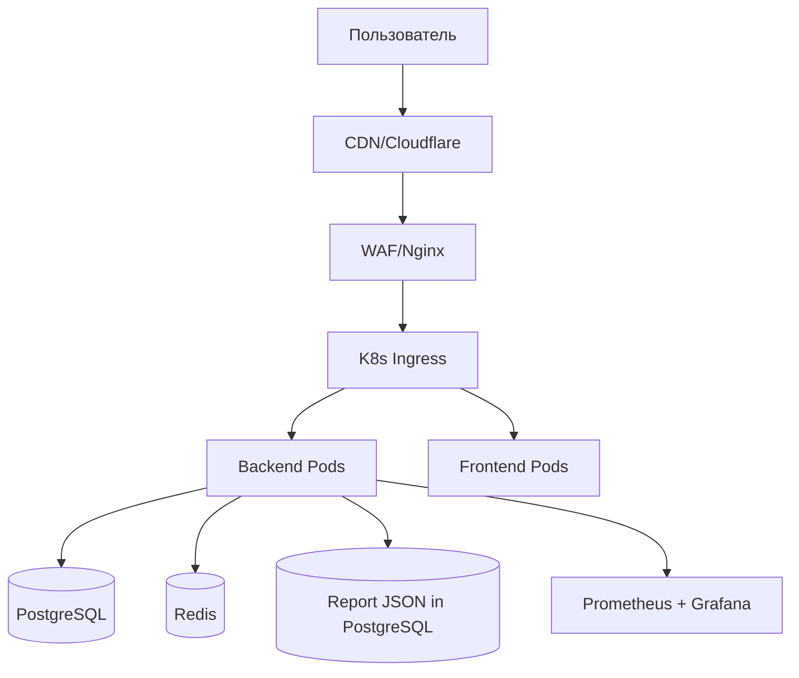

# SRS: E8 — Production & Scale

**Версия:** 1.0
**Дата:** 2026-06-02
**Статус:** Planned
**Автор:** Astrotype Team

---

## 1. Введение

### 1.1 Назначение

Документ описывает программные требования к модулю **Production & Scale** — инфраструктуре для production-деплоя, безопасности, мониторинга и масштабирования.

### 1.2 Область применения

E8 — это **инфраструктурный слой** для production-готовности:

```
E1-E7 (Application)  →  E8 (Production & Scale)  →  Production
  бизнес-логика           rate limiting, WAF,         живые
  API, UI                 observability, K8s          пользователи
```

### 1.3 Определения

| Термин | Определение |
|---|---|
| **WAF** | Web Application Firewall — защита от SQLi, XSS, path traversal |
| **HPA** | Horizontal Pod Autoscaler — автомасштабирование подов |
| **GitOps** | Деплой через Git: push → CI → Argo CD → K8s |
| **SLO** | Service Level Objective — целевые метрики доступности |
| **Blueprint deploy** | Декларативное описание сервисов для Render (`render.yaml`) |

### 1.4 Ссылки

| Документ | Путь |
|---|---|
| Product Spec | `docs/SPEC.md` |
| E8 Feature | `docs/features/E8-production-scale/` |
| Docker Compose | `docker-compose.yml` |
| CI/CD | `.github/workflows/ci.yml` |

---

## 2. Общее описание

### 2.1 Перспектива продукта

E8 не содержит бизнес-логики. Это набор инфраструктурных компонентов для production-деплоя:



### 2.2 Функции

| Функция | Описание | Story |
|---|---|---|
| **F8.1** | Rate limiting: глобальный + per-endpoint | S01 |
| **F8.2** | WAF: блокировка атак | S02 |
| **F8.3** | Secrets management | S03 |
| **F8.4** | Observability: traces, metrics, logs | S04 |
| **F8.5** | Load testing | S05 |
| **F8.6** | K8s deployment | S06 |
| **F8.7** | GitOps: push-to-deploy | S07 |
| **F8.8** | Render MVP deployment contract | S08 |
| **F8.9** | Artifact storage strategy for Render / S3 replacement | S09 |

### 2.3 Ограничения

| Ограничение | Описание |
|---|---|
| **C1** | Yandex Cloud как primary cloud (Россия) |
| **C2** | PostgreSQL — managed service (не self-hosted в K8s) |
| **C3** | Минимум 2 replicas для backend/frontend |
| **C4** | Zero-downtime deploys |
| **C5** | До K8s нужен более простой managed deployment path для MVP (Render) |

---

## 3. Функциональные требования

### 3.1 Rate Limiting (FR-8.1)

**FR-8.1.1** Система ДОЛЖНА ограничивать количество запросов per user/IP.

**FR-8.1.2** Лимиты:
- Auth endpoints: 5 req/15min per email
- Geocode: 30 req/min per IP
- Global: 100 req/min per authenticated user
- Global: 20 req/min per anonymous user

**FR-8.1.3** Система ДОЛЖНА возвращать rate limit headers:
- `X-RateLimit-Limit`
- `X-RateLimit-Remaining`
- `X-RateLimit-Reset`

**FR-8.1.4** При превышении — 429 с `Retry-After` header.

### 3.2 WAF (FR-8.2)

**FR-8.2.1** Система ДОЛЖНА блокировать SQL injection.

**FR-8.2.2** Система ДОЛЖНА блокировать XSS.

**FR-8.2.3** Система ДОЛЖНА блокировать path traversal.

**FR-8.2.4** Система ДОЛЖНА логировать заблокированные запросы.

### 3.3 Secrets Management (FR-8.3)

**FR-8.3.1** Секреты ДОЛЖНЫ храниться в централизованном manager.

**FR-8.3.2** Backend ДОЛЖЕН читать секреты из manager при старте.

**FR-8.3.3** Ротация секретов ДОЛЖНА быть автоматизирована через CI/CD.

### 3.4 Observability (FR-8.4)

**FR-8.4.1** Система ДОЛЖНА собирать distributed traces (OpenTelemetry → Jaeger/Tempo).

**FR-8.4.2** Система ДОЛЖНА экспортировать метрики (Prometheus).

**FR-8.4.3** Система ДОЛЖНА агрегировать логи (Loki/ELK).

**FR-8.4.4** Система ДОЛЖНА алертить при нарушении SLO.

### 3.5 Load Testing (FR-8.5)

**FR-8.5.1** Система ДОЛЖНА выдерживать 500 concurrent users.

**FR-8.5.2** p95 latency ДОЛЖЕН быть < 500ms для API endpoints.

**FR-8.5.3** p95 latency ДОЛЖЕН быть < 2s для chart computation.

### 3.6 K8s Deploy (FR-8.6)

**FR-8.6.1** Backend ДОЛЖЕН иметь минимум 2 replicas.

**FR-8.6.2** Система ДОЛЖНА поддерживать autoscaling (HPA).

**FR-8.6.3** Деплой ДОЛЖЕН быть zero-downtime (rolling updates).

**FR-8.6.4** Health checks: readiness + liveness probes.

### 3.7 GitOps (FR-8.7)

**FR-8.7.1** Merge в main ДОЛЖЕН автоматически деплоить на staging.

**FR-8.7.2** Revert commit ДОЛЖЕН откатывать деплой.

**FR-8.7.3** Notifications ДОЛЖНЫ отправляться при деплое и rollback.

### 3.8 Render Deploy (FR-8.8)

**FR-8.8.1** Система ДОЛЖНА иметь Render deployment contract для backend web service, worker, managed Postgres и managed Redis/Valkey.

**FR-8.8.2** Backend start command ДОЛЖЕН использовать production runtime без `--reload` и учитывать Render `$PORT`.

**FR-8.8.3** Worker ДОЛЖЕН деплоиться как отдельный background worker с тем же env contract, что и backend для `DATABASE_URL`, `REDIS_URL`, `CELERY_*`, `LLM_*`.

**FR-8.8.4** Frontend deployment mode ДОЛЖЕН быть явно определён: текущий код либо идёт как Render Web Service, либо перед этим выполняется отдельный refactor под static hosting.

**FR-8.8.5** PDF/report flow НЕ ДОЛЖЕН требовать внешний S3-compatible storage для MVP: persisted source of truth — JSON в PostgreSQL, а PDF рендерится на лету из `reports.report_data` и `report_narratives.content`.

### 3.9 Artifact Storage Strategy (FR-8.9)

**FR-8.9.1** Документация ДОЛЖНА явно фиксировать storage decision для Render MVP: готовые PDF не хранятся как artifacts, source of truth хранится как JSON в PostgreSQL.

**FR-8.9.2** Система НЕ ДОЛЖНА считать локальный filesystem Render валидным persisted storage для PDF/report artifacts; если caching понадобится позже, он должен быть отдельной архитектурной задачей.

**FR-8.9.3** `/reports/{id}/pdf` ДОЛЖЕН работать без `pdf_generated=true`, без `pdf_url`, без bucket/container bootstrap и без `S3_*` секретов.

**FR-8.9.4** Deployment/runbook contract ДОЛЖЕН включать smoke check: persisted report JSON exists -> optional narrative JSON exists -> `/reports/{id}/pdf` returns `200 application/pdf`.

---

## 4. Нефункциональные требования

### 4.1 Производительность

| Требование | Значение |
|---|---|
| **NFR-8.1.1** | API p95 < 500ms |
| **NFR-8.1.2** | Chart computation p95 < 2s |
| **NFR-8.1.3** | Report generation p95 < 5s |
| **NFR-8.1.4** | 500 concurrent users без ошибок |

### 4.2 Доступность

| Требование | Значение |
|---|---|
| **NFR-8.2.1** | Uptime 99.5% (4.38h downtime/month) |
| **NFR-8.2.2** | Zero-downtime deploys |
| **NFR-8.2.3** | Automatic failover (K8s) |

### 4.3 Безопасность

| Требование | Значение |
|---|---|
| **NFR-8.3.1** | WAF блокирует OWASP Top 10 |
| **NFR-8.3.2** | Secrets не в коде или .env файлах |
| **NFR-8.3.3** | TLS для всех endpoints |

---

## 5. SLO (Service Level Objectives)

| SLO | Цель | Измерение |
|---|---|---|
| **Availability** | 99.5% uptime | Prometheus uptime |
| **Latency** | p95 < 500ms | Prometheus histogram |
| **Error Rate** | < 1% 5xx | Prometheus counter |
| **Chart Computation** | p95 < 2s | Custom metric |
| **Report Generation** | p95 < 5s | Custom metric |

---

## 6. Инфраструктура

### 6.1 Архитектура деплоя

```
Render MVP path:
Internet → Render edge / CDN
                    ├── Frontend (web service или static после refactor)
                    ├── Backend web service
                    ├── Worker background service
                    ├── PostgreSQL (managed)
                    ├── Redis/Valkey (managed)
                    └── S3-compatible storage (external provider; not Render local disk)

Later target:
Internet → CDN → Load Balancer → K8s Ingress
                                    ├── Backend (2+ pods)
                                    ├── Frontend (2+ pods)
                                    ├── PostgreSQL (managed)
                                    ├── Redis (managed)
                                    └── S3/MinIO (managed)
```

### 6.2 Environments

| Environment | Namespace | Replicas | Autoscaling |
|---|---|---|---|
| **Staging** | `astrotype-staging` | 1 | No |
| **Production** | `astrotype-prod` | 2+ | Yes (HPA) |

---

## 7. Критерии верификации

### 7.1 Тесты

| Тип | Описание |
|---|---|
| Load tests | k6 сценарии: smoke, load, stress, soak |
| Security tests | OWASP ZAP scan |
| Chaos tests | Pod deletion, network partition |

### 7.2 Quality Gates

| Проверка | Статус |
|---|---|
| Rate limiting работает | запланировано |
| WAF блокирует атаки | запланировано |
| Load test 500 users pass | запланировано |
| Zero-downtime deploy | запланировано |
| GitOps push-to-deploy | запланировано |

---

## 8. Зависимости

### 8.1 Внешние зависимости

| Пакет | Назначение |
|---|---|
| k6 / Locust | Load testing |
| Argo CD | GitOps |
| Prometheus | Metrics |
| Grafana | Dashboards |
| Loki | Log aggregation |
| Jaeger / Tempo | Distributed tracing |

### 8.2 Инфраструктурные зависимости

| Сервис | Назначение |
|---|---|
| Yandex Managed K8s | Kubernetes cluster |
| Yandex Managed PostgreSQL | Database |
| Yandex Managed Redis | Cache |
| Yandex Object Storage | S3-compatible storage |
| Yandex Lockbox | Secrets management |
