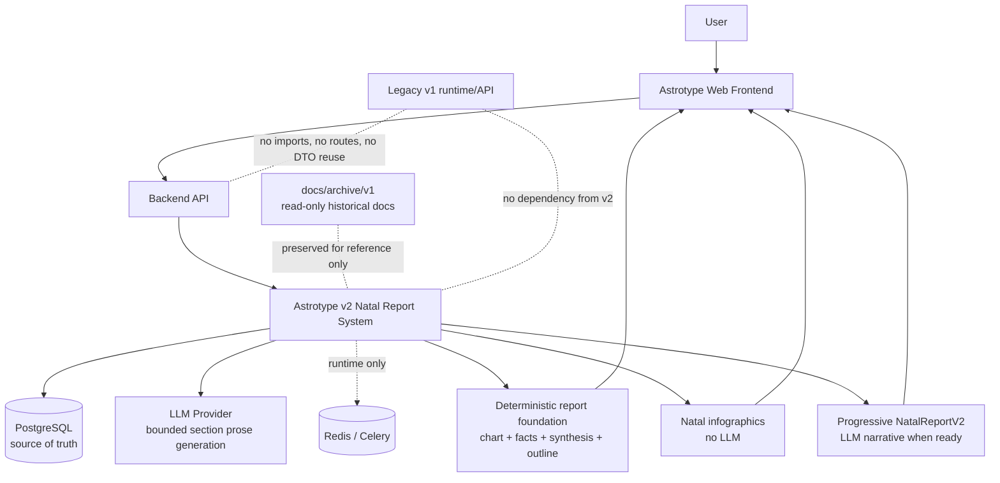
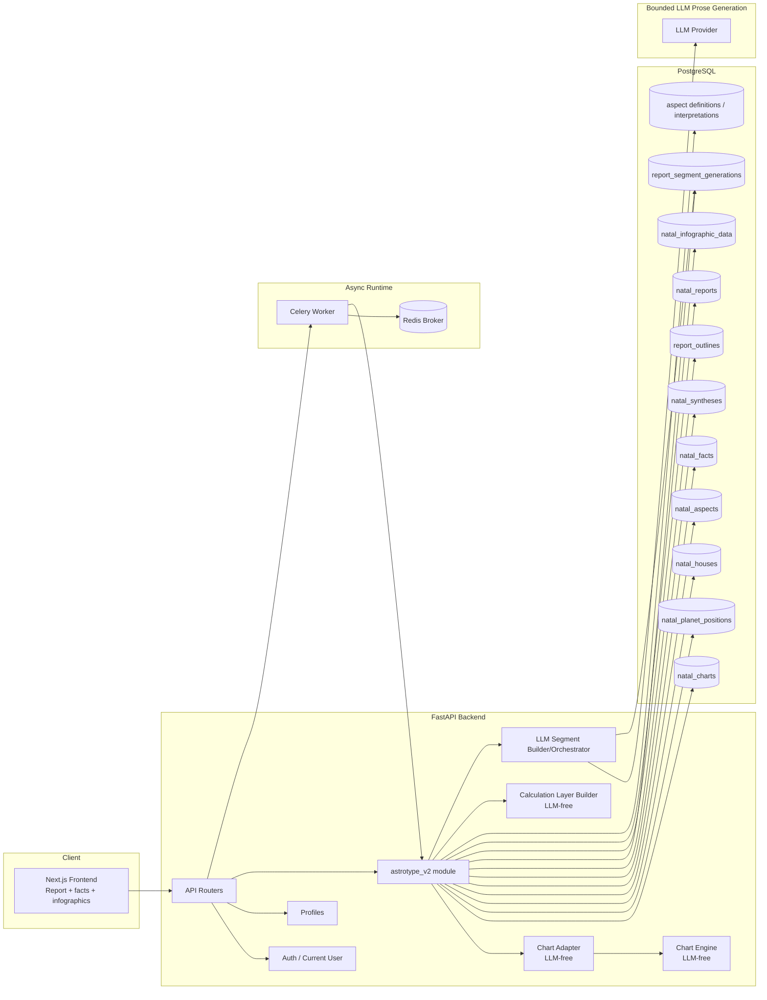
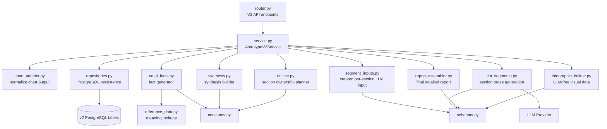
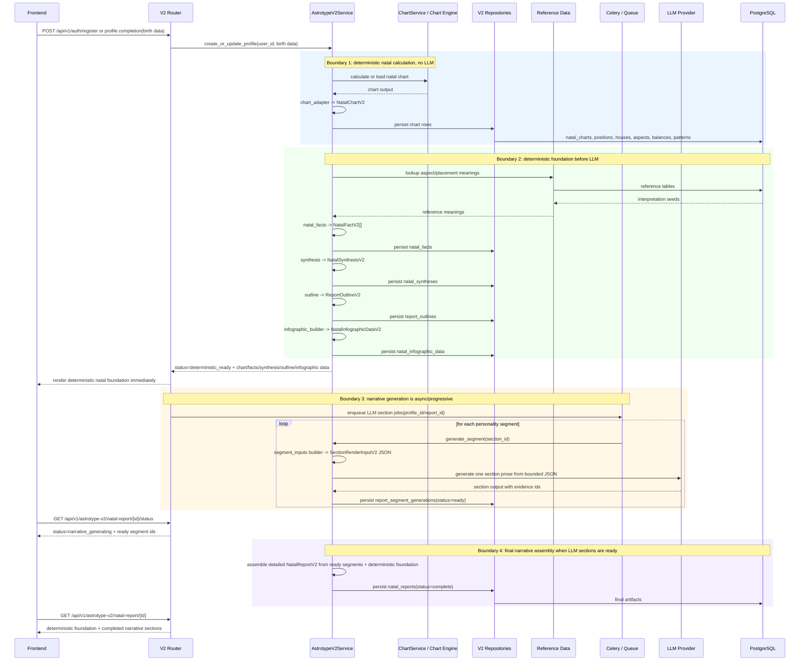
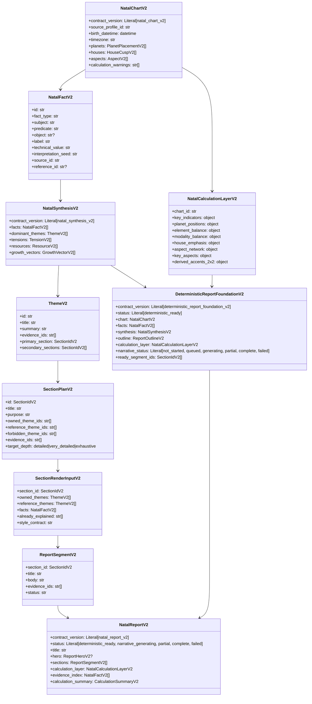
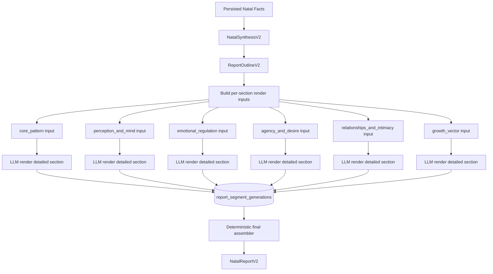
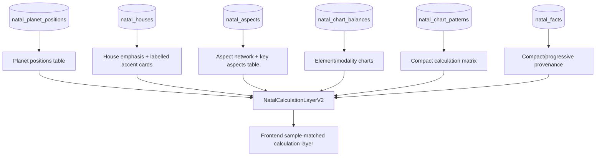
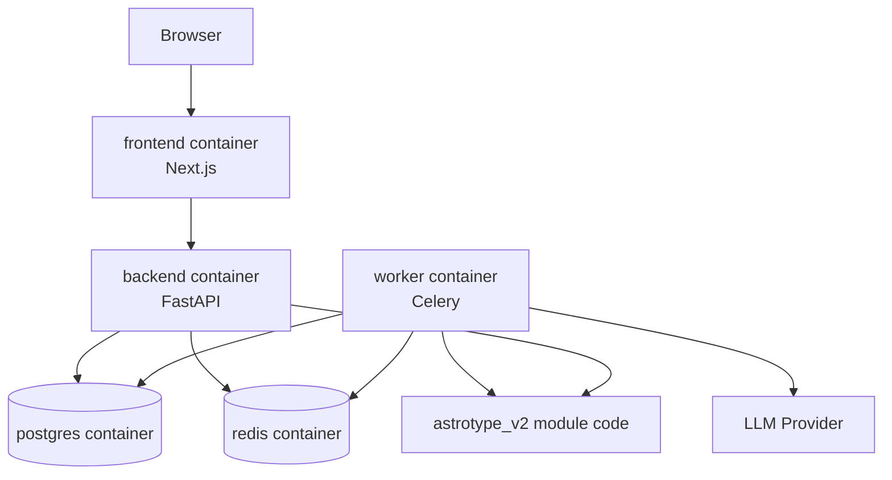

# Astrotype v2 C4 Architecture

## Purpose

This document describes Astrotype v2 using the C4 model: System Context, Containers, Components, and key code-level domain objects.

Astrotype v2 has strict architectural boundaries:

1. Registration/profile completion collects enough birth data to calculate the base natal chart immediately.
2. Natal chart calculation is deterministic and does not use LLM.
3. The calculated chart, derived facts, deterministic synthesis, outline and calculation layer are persisted before any LLM request.
4. The deterministic report foundation can be returned to the client as soon as it is ready; the user can study it while narrative LLM sections continue in the background.
5. The LLM request is generated only from persisted, evidence-backed natal facts, synthesis and section outline.
6. The final narrative report is assembled modularly by personality segments after LLM segment completion.
7. The report can be very detailed and is not artificially capped; depth is constrained by evidence, not by arbitrary length limits.
8. The lower calculation layer of the report is generated without LLM from stored chart/fact data.
9. The user sees deterministic natal facts/calculations first, then progressively receives the LLM-written narrative when it is ready.

Astrotype v2 is natal-only. It does not include socionics, Model A, information functions, MBTI, or any other typology system.

Legacy v1 artifacts are archive-only. Historical documents may be retained under `docs/archive/v1/`, but active v2 code, API routes, schemas, OpenAPI contracts, frontend routes and development docs must not depend on v1 report/socionics artifacts.

Related documents:

- `docs/architecture/astrotype-v2-natal-report-architecture.md`
- `docs/architecture/astrotype-v2-database-design.md`
- `docs/architecture/astrotype-v2-cloud-core-mobile-desktop-strategy.md`
- `docs/design/astrotype-v2-infographic-db-report-sample.html`
- `docs/design/astrotype-v2-infographic-db-report-data.json`
- `docs/ROADMAP-v2.md`

---

## C4 Level 1 — System Context

### Scope

Astrotype v2 receives birth/profile data during registration/profile completion, calculates a natal chart, persists normalized astrological entities, creates evidence-backed facts, builds deterministic synthesis, report outline and calculation/infographic data, returns this deterministic foundation to the client immediately, then generates modular builder-created JSON inputs for bounded asynchronous LLM section requests and progressively completes the large detailed upper narrative report.

### External actors and systems

- User: completes registration/profile data, immediately receives deterministic natal calculations, and reads LLM narrative sections as they become ready.
- Web Frontend: UI for profile creation and report reading: deterministic natal facts/calculations first, narrative sections progressively loaded above/around the final report view.
- Backend API: owns auth, profile access, deterministic report foundation generation, async narrative generation endpoints, status polling and report retrieval.
- PostgreSQL: source of truth for v2 chart entities, facts, synthesis, outline, deterministic foundation, LLM segment artifacts, final report and infographic data.
- Redis/Celery: runtime infrastructure for async LLM segment generation and progress only; not source of truth.
- LLM Provider: bounded prose generation service. It receives builder-created JSON inputs for one personality section at a time. It does not calculate, invent facts, decide report structure, or render deterministic chart/calculation data.



### Context rules

- PostgreSQL is the source of truth.
- Redis is not used to store durable facts or reports.
- Registration/profile completion should provide the birth date, time, place/timezone and profile ownership needed for deterministic natal calculation.
- Natal chart calculation is deterministic and LLM-free.
- The deterministic foundation is user-visible as soon as chart rows, facts, synthesis, outline and infographic/calculation data are persisted.
- The frontend must not wait for LLM narrative completion before rendering deterministic natal facts/calculations.
- The lower calculation layer is deterministic and LLM-free.
- The LLM receives only curated, persisted facts/themes/section plans through builder-created JSON inputs.
- The LLM never calculates chart data.
- The LLM never decides which themes belong to which report sections.
- The LLM never introduces facts that are absent from evidence.
- The upper narrative report is assembled from modular personality segments after they complete; missing/in-progress segments are represented by explicit statuses, not by blocking deterministic output.
- Legacy v1 documents may be preserved only under `docs/archive/v1/` as read-only historical reference.
- Active v2 implementation must not expose old v1 REST methods, compatibility aliases, old report DTOs, socionics fields, legacy frontend routes or migration bridges unless a separate deprecation story explicitly requires them.
- Any useful requirement copied from v1 must be rewritten into a v2 feature/SRS contract; active code/docs must not import archived v1 documents as normative references.
- Legacy v1 may still exist externally as a historical product line, but v2 must not import or depend on legacy socionics/report narrative modules.

---

## C4 Level 2 — Containers

### Containers

| Container | Responsibility |
|---|---|
| Frontend App | User-facing progressive report reader: deterministic natal facts/calculations first, LLM narrative sections loaded when ready. |
| Backend API | Authenticated endpoints for registration/profile data, deterministic foundation generation/retrieval, async narrative generation status and final report retrieval. |
| Astrotype v2 Module | Natal-only bounded context and orchestration. |
| Chart Calculation Adapter | Converts chart engine output into v2 storage/domain contracts. No LLM. |
| PostgreSQL | Durable storage for chart rows, aspects, facts, synthesis, outline, segment artifacts, final report and infographic data. |
| Celery Worker | Async execution for modular report segment generation and progress. |
| Redis | Broker/runtime state only. |
| LLM Provider | Bounded prose generator for one section-level personality segment from builder-created JSON input. |



### Container boundaries

The `astrotype_v2` module may use:

- profile/user IDs from existing backend;
- existing chart calculation output as raw input;
- PostgreSQL repositories/tables dedicated to v2;
- LLM provider only after facts, synthesis and outline have been persisted.

The `astrotype_v2` module must not use:

- `app.chart_engine.socionics`;
- legacy `report_narratives`;
- legacy `NarrativeInput`;
- `function_strengths`;
- Model A or socionics tables/fields as v2 inputs;
- legacy v1 REST routers, endpoints or URL aliases;
- legacy v1 frontend pages/routes/components as active v2 routes;
- archived docs under `docs/archive/v1/` as executable or normative implementation contracts.

### V1 quarantine / archive boundary

V1 artifacts are split into two categories:

| Category | Allowed location | Allowed use | Forbidden use |
|---|---|---|---|
| Historical docs and screenshots | `docs/archive/v1/` | Read-only reference for product history and ideas that may be rewritten into v2 docs. | Active roadmap/story links, implementation contracts, API promises, imported examples. |
| Legacy runtime code | Outside `backend/app/modules/astrotype_v2/` and outside active v2 frontend routes | Temporary reference only while deleting or replacing old behavior. | Registered FastAPI routers, OpenAPI paths, DTO reuse, imports from v2, fallback execution. |
| Legacy data | Separate export/archive tables or offline dumps, if retention is needed | Compliance/debug archive with explicit owner and retention policy. | Source of truth for v2 reports, automatic migration into v2 facts, hidden compatibility reads. |

Isolation rules:

1. Active v2 API must have its own router namespace and must not include old v1 report endpoints or compatibility aliases.
2. OpenAPI for the v2 surface must not contain v1 report/socionics methods.
3. Frontend navigation must not expose legacy report pages, socionics result screens or old dashboard/report routes.
4. Shared backend utilities are allowed only when they are domain-neutral, tested and have no socionics/report-v1 imports.
5. Archived v1 documents must not live under `docs/features/`; that tree is reserved for active implementation contracts.
6. If a v1 concept is intentionally reused, the source idea must be copied into an active v2 Story/SRS in v2 terms and the code must depend on the v2 contract only.
7. CI should include a legacy-leak check before v2 release: no active imports of `report_narratives`, `NarrativeInput`, `function_strengths`, `socionics`, old REST router paths or frontend legacy report routes from v2 entrypoints.

---

## C4 Level 3 — Components inside `astrotype_v2`

Recommended module layout:

```text
backend/app/modules/astrotype_v2/
  __init__.py
  router.py
  service.py
  schemas.py
  repositories.py
  chart_adapter.py
  natal_facts.py
  synthesis.py
  outline.py
  segment_inputs.py
  llm_segments.py
  report_assembler.py
  infographic_builder.py
  reference_data.py
  constants.py
```

### Component responsibilities

| Component | Responsibility |
|---|---|
| `router.py` | HTTP endpoints for v2 generation, status and retrieval. |
| `service.py` | Use-case orchestration. Coordinates calculation, persistence, facts, synthesis, outline, LLM segments, assembly and infographics. |
| `schemas.py` | Pydantic domain/API contracts. |
| `repositories.py` | SQLAlchemy data access for v2 tables. |
| `chart_adapter.py` | Converts chart engine output into normalized v2 entities. No LLM. |
| `natal_facts.py` | Generates evidence facts from positions, houses, aspects, balances, patterns and reference interpretations. |
| `synthesis.py` | Builds themes, tensions, resources and growth vectors from facts. |
| `outline.py` | Assigns each theme to one owning section and creates reference/forbidden maps. |
| `segment_inputs.py` | Builds the JSON input for one bounded personality-section LLM request from outline + facts. |
| `llm_segments.py` | Calls LLM for section prose and validates evidence usage. |
| `report_assembler.py` | Assembles section outputs into one large detailed `NatalReportV2`. |
| `infographic_builder.py` | Builds the deterministic lower calculation layer from stored chart/fact rows. No LLM. |
| `reference_data.py` | Lookup helpers for aspect/planet/sign/house meanings. |
| `constants.py` | Canonical planet order, section IDs, aspect codes, sign maps. |



---

## C4 Level 3 — Main generation flow



---

## Progressive delivery contract

Astrotype v2 uses progressive report delivery instead of waiting for the full LLM narrative before the first useful screen.

### Trigger

The trigger is registration/profile completion when the client has enough data for deterministic natal calculation:

- profile/user id;
- birth date;
- birth time, including whether it is exact, approximate or unknown;
- birth place and resolved timezone/coordinates;
- consent/ownership context required to persist the chart.

If the birth time is unknown or approximate, the deterministic payload must include calculation warnings and confidence flags instead of blocking the whole report.

### Status model

| Status | Meaning | Client behavior |
|---|---|---|
| `deterministic_ready` | Chart rows, facts, synthesis, outline and calculation/infographic data are persisted. LLM narrative is not required yet. | Render the natal calculation/foundation screen immediately and show narrative sections as pending. |
| `narrative_generating` | One or more LLM segment jobs are queued/running. | Keep deterministic content visible; poll or subscribe for segment progress. |
| `partial` | At least one LLM segment is ready, but the final narrative report is incomplete. | Insert ready narrative sections progressively without hiding deterministic content. |
| `complete` | All required LLM sections are ready and final `NatalReportV2` is assembled. | Render the full report and keep deterministic calculation details available as the compact factual basis. |
| `failed` | LLM generation failed or timed out after deterministic foundation was persisted. | Keep deterministic output available and offer retry/regenerate for narrative only. |

### API behavior

- Registration/profile completion may synchronously return `deterministic_ready` if calculation is fast enough.
- If deterministic calculation is moved to a job, the first terminal useful state is still `deterministic_ready`, not `complete`.
- LLM segment generation starts only after `deterministic_ready` artifacts are persisted.
- Status/retrieval endpoints must distinguish deterministic readiness from narrative completion.
- Retry/regenerate must target LLM segment artifacts only; it must not recalculate or overwrite chart/fact rows unless the user changes birth/profile data.

### UX rule

The frontend should treat deterministic natal data as the first report screen, not as a loading placeholder. While the user studies chart positions, balances, house accents, aspect network and factual synthesis, LLM sections load progressively into the narrative area.

---

## C4 Level 4 — Key domain objects



---

## Personality segment architecture

The modular report uses these initial segments:

```text
core_pattern
perception_and_mind
emotional_regulation
agency_and_desire
relationships_and_intimacy
growth_vector
technical_basis
```

Each segment has one clear job:

| Segment | Job |
|---|---|
| `core_pattern` | Central identity pattern and main personal formula. |
| `perception_and_mind` | Thinking, perception, interpretation of experience, communication. |
| `emotional_regulation` | Emotional rhythm, triggers, protection and restoration. |
| `agency_and_desire` | Action, will, anger, initiative, desire, boundaries. |
| `relationships_and_intimacy` | Attachment, closeness, trust, attraction, conflict/repair in contact. |
| `growth_vector` | Mature expression, practices, developmental direction. |
| `technical_basis` | Facts, chart details, evidence, calculation parameters. Not personality prose. |

The final report should be large and detailed. Do not enforce arbitrary max length. The generation contract should instead require:

- every owned theme is fully explained;
- every claim has evidence ids;
- reference themes are not expanded again;
- each section includes concrete lived manifestations;
- growth advice is derived from already explained tensions/resources;
- technical basis exposes the factual evidence used.

---

## Section ownership architecture

```mermaid
flowchart TD
    ThemeA[theme: depth_control] --> Core[core_pattern<br/>owned]
    ThemeA -. short reference .-> Emotional[emotional_regulation<br/>reference]
    ThemeA -. short reference .-> Relations[relationships_and_intimacy<br/>reference]
    ThemeA -. forbidden expansion .-> Growth[growth_vector<br/>forbidden]

    ThemeB[theme: moon_saturn_regulation] --> Emotional2[emotional_regulation<br/>owned]
    ThemeB -. short reference .-> Relations2[relationships_and_intimacy<br/>reference]
    ThemeB -. short reference .-> Growth2[growth_vector<br/>reference]
    ThemeB -. forbidden expansion .-> Core2[core_pattern<br/>forbidden]

    ThemeC[theme: venus_mars_intimacy] --> Relations3[relationships_and_intimacy<br/>owned]
    ThemeC -. short reference .-> Agency[agency_and_desire<br/>reference]
    ThemeC -. forbidden expansion .-> Emotional3[emotional_regulation
forbidden]
```



Renderer rules:

- `owned_theme_ids`: expand fully.
- `reference_theme_ids`: mention briefly only for continuity.
- `forbidden_theme_ids`: do not paraphrase or expand.
- `technical_basis`: list evidence and calculation details, not personality prose.

---

## LLM boundary

LLM is part of final report generation, but only behind a strict boundary.

Wrong:

```text
full chart facts + full synthesis → LLM writes every block from scratch
```

Correct:

```text
SectionPlanV2
+ owned themes
+ allowed reference themes
+ exact facts/evidence for this segment
→ LLM writes one detailed section
```



The LLM is allowed to:

- write detailed human prose;
- connect facts into lived experience;
- explain owned themes deeply;
- use allowed references for continuity.

The LLM is not allowed to:

- calculate placements;
- invent new astrological facts;
- ignore evidence ids;
- move themes between sections;
- duplicate forbidden themes;
- introduce socionics or typology.

---

## Infographic architecture

Infographics are generated without LLM from stored chart/fact rows. The canonical visual target is `docs/design/astrotype-v2-infographic-db-report-sample.html`; the existing product report/dashboard UI is not the v2 design source.



User-visible calculation-layer outputs should include:

- key indicators: ASC, MC, ASC ruler;
- planet positions table;
- element and modality balance bars;
- house emphasis chart and labelled house accent cards;
- aspect network;
- key aspect table;
- compact calculation matrix: house mode, hemispheres, quadrants, aspect profile.

Deferred from the current MVP UI:

- standalone factual-basis/evidence dashboard;
- archetype/theme-map blocks;
- most-aspected planet rankings.

---

## Deployment view

Local development deployment remains Docker Compose initially.



Runtime note:

- registration/profile completion is the preferred trigger for deterministic natal calculation because the client already provides the required birth data there;
- chart calculation/fact persistence can run synchronously or as a short async job;
- deterministic readiness is a user-visible milestone and should not wait for LLM narrative generation;
- modular LLM generation should run asynchronously when reports are long;
- PostgreSQL remains durable storage;
- Redis remains queue/runtime only.

---

## Architecture decisions

### ADR-001: v2 is a separate bounded context

Decision: create `backend/app/modules/astrotype_v2/` instead of modifying legacy `report_narratives`.

Reason: legacy report code already contains assumptions that caused duplication and socionics leakage. v2 must start from a clean natal-only model.

Consequences:

- v2 has its own routers, schemas, repositories and frontend routes;
- old REST methods are deleted or left unregistered, not wrapped as compatibility endpoints;
- archived v1 docs live under `docs/archive/v1/` and are reference-only;
- any reused idea must be copied into v2 docs/contracts before implementation.

### ADR-002: PostgreSQL is source of truth

Decision: store canonical chart entities and facts in PostgreSQL relational tables.

Reason: facts need durability, traceability, SQL queryability, migrations and reproducibility.

### ADR-003: JSONB is allowed for variable artifacts

Decision: use JSONB for raw calculation payload, synthesis content, outline content, LLM segment artifacts, infographic datasets and rendered report content, but not as the only storage for placements/aspects/facts.

Reason: core chart/fact entities must be queryable and linkable; report artifacts can evolve more freely.

### ADR-004: ReportOutlineV2 is mandatory before LLM generation

Decision: always build outline between synthesis and LLM rendering.

Reason: section-level duplication is solved by deterministic theme ownership, not by asking the LLM to “avoid duplicates”.

### ADR-005: Aspect meanings are reference data

Decision: store `aspect_definitions` and `aspect_pair_interpretations` separately from user `natal_aspects`.

Reason: `sextile` as an aspect type and `Mercury sextile Saturn` as a meaning are reusable knowledge, while `natal_aspects` is a concrete chart result.

### ADR-006: Infographics are deterministic

Decision: natal infographic data is built from stored chart/fact rows, not from LLM output.

Reason: visuals must be explainable, reproducible and directly tied to facts shown to the user.

### ADR-007: Progressive delivery starts with deterministic readiness

Decision: after registration/profile completion provides enough birth data, Astrotype v2 calculates and persists the deterministic natal foundation first and returns it to the client as `deterministic_ready`. LLM narrative sections are generated asynchronously and attached later as `partial` or `complete` narrative artifacts.

Reason: the user should not stare at an empty loading state while slow or failed LLM calls run. Chart positions, houses, balances, aspects, facts, synthesis and infographic data are deterministic, reproducible and useful immediately. LLM failures should degrade narrative depth, not block the base natal report.

Consequences:

- frontend report loading is progressive rather than all-or-nothing;
- API/status contracts distinguish deterministic readiness from narrative completion;
- LLM retry/regenerate works on segment artifacts and does not recalculate chart/fact rows;
- final `NatalReportV2` assembly depends on LLM segment completion, but deterministic calculation/foundation retrieval does not.

### ADR-008: Astrotype v2 is cloud-core multi-client

Decision: the canonical v2 pipeline runs on the backend. Web, Android and Windows desktop are clients over the same API and same persisted reports.

Reason: Android is a future target, reports must persist across devices, LLM keys/cost/retries must be server-side, and one canonical pipeline is cheaper to maintain than separate desktop/mobile runtimes.

Consequences:

- PostgreSQL remains source of truth.
- Android MVP should be PWA/Capacitor first.
- Windows `.exe`, if built, should be a thin Tauri/Electron client.
- SQLite is local cache/draft storage only unless a separate offline product is explicitly planned.

### ADR-009: Temporary hard-fail segment depth validation must be replaced

Decision: the current string-marker depth validator for v2 LLM segments is accepted only as a temporary production guard. Hard validation remains appropriate for objective contract violations, but semantic depth checks such as mechanism / lived manifestation / tension / protection / mature expression must move to a layered repair/degraded-state policy instead of blocking report assembly by brittle lexical markers.

Reason: production report `548049cd-99d3-4186-ae5b-fc53a64b05e7` showed that valid Russian prose can fail a narrow marker check and leave the user-facing report unassembled. The immediate fix widened markers and fixed worker failure handling, but this does not remove the architectural bottleneck.

Consequences:

- `_validate_required_depth_moves` is temporary as a hard exception;
- replacement work must separate objective contract validation, technical completeness, semantic quality rubric and runtime recovery;
- deterministic and partial narrative state must remain persisted and readable even when one segment needs repair;
- API/frontend states need to support degraded/partial/fallback behavior before prose-quality gates are tightened further.

Standalone ADR: `docs/architecture/ADR-009-v2-segment-depth-validation-policy.md`.

---

## Verification checklist

Before implementing v2, the architecture is accepted when:

- `astrotype_v2` has a clear container/component boundary.
- C4 diagrams describe context, containers, components and domain objects.
- Database design links to the same concepts: charts, positions, houses, aspects, facts, synthesis, outline, LLM segments, infographics and report.
- Report outline ownership is explicitly represented.
- LLM is shown as bounded prose generation after persisted facts and outline, not as calculator/planner.
- Infographics are represented as deterministic, LLM-free outputs.
- Registration/profile completion is documented as the trigger for deterministic natal calculation when enough birth data is present.
- Deterministic readiness is explicitly separated from LLM narrative completion.
- The frontend can render chart/fact/synthesis/infographic data at `deterministic_ready` without waiting for `complete`.
- LLM retry/failure does not block already persisted deterministic output.
- V1 historical docs are quarantined under `docs/archive/v1/`, not active `docs/features/`.
- V2 active API/frontend contracts explicitly forbid old v1 REST methods, compatibility aliases, socionics/report DTO reuse and legacy frontend routes.
- Redis is not described as durable storage.
- Legacy v1 is shown as separate and not a dependency of v2.
