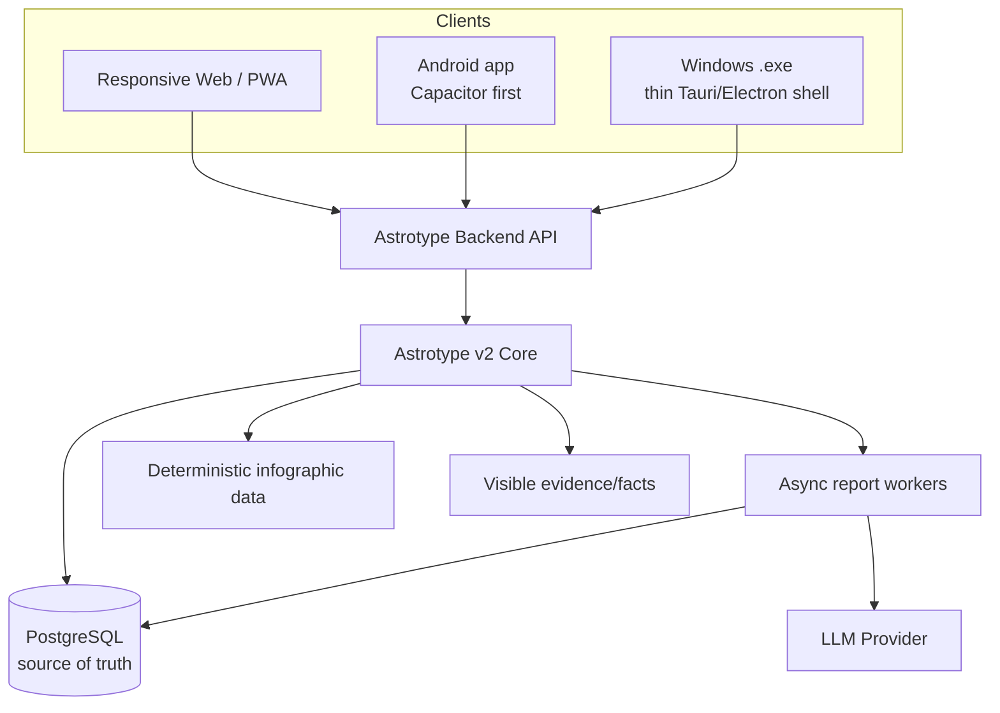
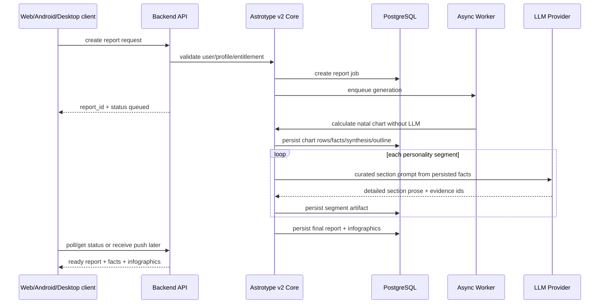

# Astrotype v2 Cloud-Core Mobile/Desktop Strategy

## Purpose

This document fixes the product and architecture direction for Astrotype v2 with future Android support in mind.

Decision: Astrotype v2 should be cloud-core and multi-client, not desktop-local-first.

The core report pipeline lives on the backend. Web, Android and possible Windows desktop clients are thin clients over the same API and the same persisted reports.

Related documents:

- `docs/architecture/astrotype-v2-natal-report-architecture.md`
- `docs/architecture/astrotype-v2-database-design.md`
- `docs/architecture/astrotype-v2-c4-architecture.md`
- `docs/ROADMAP-v2.md`

---

## Decision

Choose this architecture:

```text
Astrotype v2 backend core
+ PostgreSQL source of truth
+ async modular LLM report generation
+ deterministic natal infographics
+ responsive web frontend
+ Android app as API client
+ optional Windows .exe as thin client
```

Do not choose this as the main direction:

```text
local desktop-first .exe
+ local SQLite as primary storage
+ local backend as primary product
+ later separate Android implementation
```

Reason: local desktop-first creates duplicated storage, synchronization problems, separate report runtimes and a much harder Android path.

---

## Architecture principle

The product has one canonical backend pipeline and many clients.



Backend owns:

- natal chart calculation;
- normalized chart persistence;
- aspect/reference-data lookup;
- natal facts;
- deterministic synthesis;
- deterministic report outline;
- curated LLM requests per personality segment;
- report segment validation;
- final report assembly;
- deterministic infographic datasets;
- user-visible evidence basis;
- entitlements and report access control.

Clients own:

- birth/profile input UX;
- report reading UX;
- infographic rendering;
- evidence/facts disclosure UI;
- status/progress display;
- local cache only;
- push/share/PDF UX.

---

## Why this is the right choice for Android

Android should not calculate and store the whole product locally in phase 1.

A mobile app has constraints:

- long LLM generation should not depend on the app staying foregrounded;
- API keys must not be shipped to the device;
- report generation cost and retries should be controlled server-side;
- reports should be available across devices;
- purchases/subscriptions must map to server-side entitlements;
- user data needs account-level backup and recovery;
- app updates should not require report-pipeline redeployment.

Cloud-core solves this:

```text
Android requests report generation
→ backend queues/generates segments
→ user can leave the app
→ backend persists report
→ Android shows ready status/push notification
→ same report is available on web/desktop
```

---

## Recommended client strategy

### Phase 1: Web-first responsive UI

Make the existing Next.js frontend fully usable on mobile web:

- registration/login;
- profile creation;
- generation status;
- long report reader;
- collapsible evidence cards;
- natal infographic components;
- PDF/share/export.

This is the fastest path to validate the new product.

### Phase 2: PWA-ready web app

Add mobile app characteristics to web:

- responsive navigation;
- installable PWA metadata;
- offline cached report reading;
- service worker for static assets and already-generated reports;
- deep links to reports;
- push notification foundation if needed.

### Phase 3: Android MVP via Capacitor

Wrap the mobile web/PWA in Capacitor:

```text
Next.js mobile frontend
→ Capacitor Android project
→ APK/AAB
→ Play Store distribution
```

Capacitor is recommended first because Astrotype is mainly:

- forms;
- long-form reading;
- generated content;
- infographics;
- account/report management.

That product shape does not require a full native rewrite for MVP.

### Phase 4: Native mobile later if proven necessary

Move to React Native/Expo only if the product needs:

- highly native navigation;
- complex offline authoring;
- heavy device integrations;
- advanced push/deep-link flows;
- iOS/Android native parity with custom UX.

---

## Windows .exe strategy

If a Windows `.exe` is needed, make it a thin client by default.

Recommended:

```text
Tauri/Electron shell
→ embedded webview
→ same Astrotype Backend API
→ local cache only
```

Do not make the `.exe` the source of truth.

A desktop-local version with SQLite can exist later as a special offline/export mode, but it should not define the main v2 architecture.

### Thin `.exe` responsibilities

- open Astrotype UI in a desktop shell;
- store session token securely;
- cache already generated reports for reading;
- provide desktop PDF/export/share helpers;
- show generation status from backend;
- never own canonical report generation or storage.

---

## Storage decision

Canonical storage:

```text
PostgreSQL on backend
```

Allowed local storage on clients:

```text
cache only
```

Examples:

- cached report JSON for offline reading;
- cached infographic data;
- draft profile input before submission;
- UI preferences.

Not allowed as source of truth in main product:

- Android SQLite report database;
- Windows SQLite report database;
- local LLM artifacts as canonical report state.

Reason: local source-of-truth creates sync, backup, entitlement, migration and consistency problems.

---

## LLM and API key decision

LLM calls happen server-side.

Do not put production LLM keys into Android or Windows clients.

Correct:

```text
client → backend authenticated request → backend calls LLM provider → backend stores segment/report
```

Wrong:

```text
client directly calls LLM provider with app-embedded key
```

Benefits:

- keys are protected;
- generation can be retried;
- costs are observable;
- abuse can be rate-limited;
- prompts and versions stay consistent;
- reports remain reproducible from stored inputs and outputs.

---

## Offline behavior

Do not promise full offline generation in v2 MVP.

Supported offline/light offline:

- read already downloaded report;
- show cached infographics;
- edit local draft profile input;
- queue a generation request until network returns.

Not supported in MVP:

- full chart calculation offline;
- full LLM report generation offline;
- local source-of-truth report database.

---

## API surface needed for multi-client v2

Initial endpoints:

```text
POST /api/v1/astrotype-v2/reports
GET  /api/v1/astrotype-v2/reports/{report_id}
GET  /api/v1/astrotype-v2/reports/{report_id}/status
GET  /api/v1/astrotype-v2/reports/{report_id}/facts
GET  /api/v1/astrotype-v2/reports/{report_id}/infographics
GET  /api/v1/astrotype-v2/reports/{report_id}/segments
POST /api/v1/astrotype-v2/reports/{report_id}/regenerate
GET  /api/v1/astrotype-v2/reports/{report_id}/pdf
```

Mobile-specific later:

```text
POST /api/v1/devices/register
POST /api/v1/mobile/purchases/verify
GET  /api/v1/mobile/bootstrap
```

---

## Data flow



---

## Consequences for implementation

Implement these boundaries early:

1. `astrotype_v2` core is backend-owned.
2. Report generation is addressable by stable `report_id` and job status.
3. Every LLM segment request is persisted.
4. Every final claim references evidence ids.
5. Infographic data is separate from report prose.
6. API returns the same report to web and Android.
7. Frontend components are responsive and reusable in Capacitor.
8. No domain logic depends on browser-only APIs.
9. No product-critical generation depends on a desktop shell.
10. Client local storage is cache/draft only.

---

## Trade-off summary

| Option | Pros | Cons | Decision |
|---|---|---|---|
| Cloud-core + web/PWA + Capacitor Android | Fastest Android path, one backend, one report source, shared data | Requires hosted backend and account model | Choose |
| React Native/Expo first | Best native UX | More code, separate mobile UI, slower MVP | Later if needed |
| Desktop-local `.exe` first | Good local demo/offline story | Bad Android path, sync problems, duplicated runtime | Do not choose as main path |
| Fully local Android + local LLM | Offline dream | Huge app, weaker quality, device constraints, key/model issues | Do not choose |

---

## ADR-007: Astrotype v2 is cloud-core multi-client

Decision: Astrotype v2 core report generation and storage live on backend; web, Android and desktop are clients.

Status: accepted for v2 planning.

Reason:

- Android is a future target;
- reports must persist across devices;
- LLM calls must be server-side;
- subscriptions/entitlements are easier server-side;
- one canonical report pipeline is cheaper to maintain than separate web/desktop/mobile runtimes.

Consequences:

- PostgreSQL remains canonical storage.
- Redis remains runtime only.
- Android MVP should use responsive web/PWA via Capacitor.
- Windows `.exe`, if needed, should be thin Tauri/Electron client.
- SQLite is allowed only for local cache/drafts unless a separate offline product is explicitly planned.
