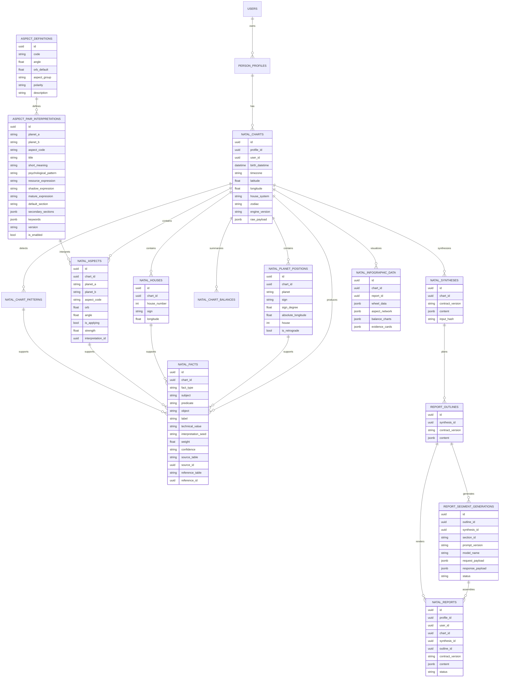
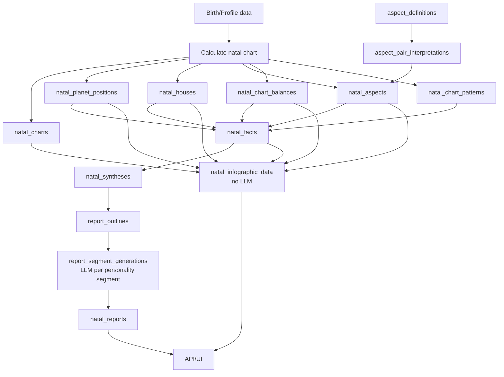

# Astrotype v2 Database Design

## Цель

Спроектировать хранение Astrotype v2 так, чтобы фундамент отчёта был не большим непрозрачным JSON, а нормализованной базой натальной карты, аспектов, интерпретационных фактов, синтеза и outline-слоя.

Главная идея:

```text
канонические расчётные сущности и evidence trail → реляционные таблицы
вариативные/debug/render payloads → JSONB
Redis → только runtime/cache/queue, не источник истины
LLM → только генерация текста сегментов после сохранения фактов/outline
```

Astrotype v2 не должен хранить или использовать соционику, Model A, function strengths или любую типологию.

---

## Почему не Redis

Redis подходит для:

- Celery broker/result backend;
- временный progress generation;
- locks;
- short-lived cache;
- rate limits.

Redis не подходит как source of truth для фактов карты и отчёта, потому что:

- данные должны быть долговечными;
- нужна воспроизводимость отчёта;
- нужны связи между фактами, аспектами, темами и секциями;
- нужны SQL-запросы и аналитика;
- нужна миграционная история.

Поэтому v2 facts, aspects, chart entities, synthesis, outline и report должны храниться в PostgreSQL.

---

## Уровни хранения

### 1. Расчётный слой карты

Это почти “астрономический” слой: что было рассчитано из birth data.

Хранить таблично:

- карта;
- положения планет;
- дома;
- аспекты;
- балансы стихий/модальностей;
- detected chart patterns.

### 2. Reference / knowledge слой

Это справочники интерпретаций:

- определения аспектов;
- интерпретации пар планет по аспектам;
- значения планет в знаках;
- значения планет в домах;
- значения домов/знаков;
- позже: dignities, rulers, configurations.

### 3. Evidence facts слой

Это мост между расчётом и отчётом:

```text
calculated row + reference meaning → NatalFactV2
```

Пример:

```text
natal_planet_positions: Mars, Taurus, house 10, retrograde true
→ natal_facts:
  - Mars in Taurus
  - Mars in 10th house
  - Retrograde Mars
```

### 4. Synthesis слой

Это уже смысловые узлы:

- dominant themes;
- tensions;
- resources;
- growth vectors.

### 5. Outline слой

Это anti-duplication planner:

- какой смысл в какой секции раскрывается полностью;
- где можно сослаться коротко;
- где запрещено повторять.

### 6. LLM segment layer

Модульная генерация верхних больших текстовых секций личности. Builder собирает отдельный JSON-вход для каждого LLM-запроса из persisted facts + synthesis + outline. Каждый запрос отвечает только за один блок личности и не получает всю карту как свободный контекст.

### 7. Deterministic calculation layer

Нижняя часть отчёта строится без LLM из таблиц карты, аспектов, балансов, фактов и derived calculations. Это не dashboard и не отдельный evidence-essay, а компактная расчётная часть в порядке текущего canonical sample:

- `docs/design/astrotype-v2-infographic-db-report-sample.html`
- `docs/design/astrotype-v2-infographic-db-report-data.json`

Balance calculation contract: `docs/architecture/astrotype-v2-balance-calculation.md` defines the deterministic balance method used for both element and modality balances.

Derived calculation contracts: `docs/architecture/astrotype-v2-derived-calculations/README.md` defines the current deterministic lower-layer calculations. Current MVP UI includes house emphasis, house mode balance, hemispheres/orientation, quadrants, chart ruler and aspect profile. Most-aspected planets and thematic indicator bundles are deferred and must not be rendered in the current sample.

### 8. Rendered report слой

Финальный пользовательский отчёт: верх собирается из проверенных LLM-сегментов, низ — из deterministic calculation layer. LLM не пишет и не переставляет нижнюю расчётную часть.

---

## Предлагаемые таблицы

## `natal_charts`

Одна рассчитанная натальная карта.

```sql
create table natal_charts (
    id uuid primary key,
    profile_id uuid not null references person_profiles(id) on delete cascade,
    user_id uuid not null references users(id) on delete cascade,

    birth_datetime timestamptz not null,
    timezone text not null,
    latitude double precision not null,
    longitude double precision not null,

    house_system text not null default 'P',
    zodiac text not null default 'tropical',
    engine_version text not null,
    contract_version text not null default 'natal_chart_v2',

    calculation_status text not null default 'ready',
    calculation_warnings jsonb not null default '[]'::jsonb,
    raw_payload jsonb not null default '{}'::jsonb,

    created_at timestamptz not null default now(),
    updated_at timestamptz not null default now()
);
```

Recommended indexes:

```sql
create index ix_natal_charts_profile_id on natal_charts(profile_id);
create index ix_natal_charts_user_id on natal_charts(user_id);
create index ix_natal_charts_profile_engine on natal_charts(profile_id, engine_version);
```

Notes:

- `raw_payload` stores original chart engine output for debugging/reproducibility.
- Canonical queryable entities live in child tables, not only in `raw_payload`.

---

## `natal_planet_positions`

Положения планет и точек.

Example domain row:

```text
Mars, Taurus, house 10, retrograde true
```

```sql
create table natal_planet_positions (
    id uuid primary key,
    chart_id uuid not null references natal_charts(id) on delete cascade,

    planet text not null,
    sign text not null,
    sign_degree double precision not null,
    absolute_longitude double precision not null,
    latitude double precision,
    speed double precision,
    house integer,
    is_retrograde boolean not null default false,

    created_at timestamptz not null default now(),

    constraint ck_natal_planet_positions_house
        check (house is null or (house >= 1 and house <= 12))
);
```

Recommended indexes:

```sql
create index ix_natal_planet_positions_chart_id on natal_planet_positions(chart_id);
create index ix_natal_planet_positions_planet on natal_planet_positions(planet);
create index ix_natal_planet_positions_sign on natal_planet_positions(sign);
create index ix_natal_planet_positions_house on natal_planet_positions(house);
create index ix_natal_planet_positions_lookup
    on natal_planet_positions(planet, sign, house, is_retrograde);
```

Example query:

```sql
select *
from natal_planet_positions
where planet = 'Mars'
  and sign = 'Taurus'
  and house = 10
  and is_retrograde = true;
```

---

## `natal_houses`

Куспиды домов.

```sql
create table natal_houses (
    id uuid primary key,
    chart_id uuid not null references natal_charts(id) on delete cascade,

    house_number integer not null,
    sign text not null,
    longitude double precision not null,

    created_at timestamptz not null default now(),

    constraint ck_natal_houses_number check (house_number >= 1 and house_number <= 12),
    constraint uq_natal_houses_chart_number unique (chart_id, house_number)
);
```

Recommended indexes:

```sql
create index ix_natal_houses_chart_id on natal_houses(chart_id);
create index ix_natal_houses_sign on natal_houses(sign);
```

---

## `aspect_definitions`

Справочник типов аспектов.

```sql
create table aspect_definitions (
    id uuid primary key,
    code text not null unique,
    angle double precision not null,
    orb_default double precision not null,
    aspect_group text not null,
    polarity text not null,
    description text not null,
    is_enabled boolean not null default true,

    created_at timestamptz not null default now(),
    updated_at timestamptz not null default now()
);
```

Examples:

```text
code        angle  aspect_group   polarity
conjunction 0      conjunction    mixed
sextile     60     harmonious     supportive
square      90     tense          challenging
trine       120    harmonious     supportive
opposition  180    tense          challenging
quincunx    150    adjustment     mixed
```

---

## `aspect_pair_interpretations`

Справочник значений конкретных связей:

```text
Mercury sextile Saturn
Mars opposition Uranus
```

Это не пользовательская карта. Это knowledge base.

```sql
create table aspect_pair_interpretations (
    id uuid primary key,

    planet_a text not null,
    planet_b text not null,
    aspect_code text not null references aspect_definitions(code),

    title text not null,
    short_meaning text not null,
    psychological_pattern text not null,
    resource_expression text,
    shadow_expression text,
    mature_expression text,

    default_section text not null,
    secondary_sections jsonb not null default '[]'::jsonb,
    keywords jsonb not null default '[]'::jsonb,

    intensity text not null default 'medium',
    version text not null default 'v1',
    is_enabled boolean not null default true,

    created_at timestamptz not null default now(),
    updated_at timestamptz not null default now(),

    constraint uq_aspect_pair_interpretations
        unique (planet_a, planet_b, aspect_code, version)
);
```

Recommended indexes:

```sql
create index ix_aspect_pair_interpretations_lookup
    on aspect_pair_interpretations(planet_a, planet_b, aspect_code)
    where is_enabled = true;

create index ix_aspect_pair_interpretations_default_section
    on aspect_pair_interpretations(default_section);
```

### Canonical planet order

Аспект симметричен:

```text
Mercury sextile Saturn == Saturn sextile Mercury
```

Поэтому перед записью и lookup нужно канонизировать порядок планет.

Recommended order:

```text
Sun
Moon
Mercury
Venus
Mars
Jupiter
Saturn
Uranus
Neptune
Pluto
NorthNode
SouthNode
Chiron
Lilith
Ascendant
Midheaven
```

Rule:

```text
planet_a = earlier planet by canonical order
planet_b = later planet by canonical order
```

Example:

```text
Input: Saturn sextile Mercury
Stored/lookup: Mercury sextile Saturn
```

### Example: Mercury sextile Saturn

```text
planet_a: Mercury
planet_b: Saturn
aspect_code: sextile
title: Структурное мышление и дисциплина речи
short_meaning: Мысль легче становится формой: человеку проще собирать идеи в систему, выдерживать логику и говорить по делу.
psychological_pattern: Восприятие проходит через внутреннюю проверку на точность, уместность и доказательность.
resource_expression: Способность концентрироваться, учиться последовательно, объяснять сложное простым языком.
shadow_expression: Риск чрезмерной осторожности в высказывании или задержки мысли из-за страха ошибиться.
mature_expression: Использовать строгость мышления как опору, не превращая её в самоцензуру.
default_section: perception_and_mind
secondary_sections: ["growth_vector"]
intensity: medium
```

### Example: Mars opposition Uranus

```text
planet_a: Mars
planet_b: Uranus
aspect_code: opposition
title: Импульс действия против потребности в свободе
short_meaning: Действие включается резко, особенно когда человек чувствует давление, ограничение или попытку управлять его темпом.
psychological_pattern: Внутри есть конфликт между желанием действовать прямо и невозможностью выдерживать навязанный ритм.
resource_expression: Смелость резко менять ситуацию, высокая реактивность, способность запускать нестандартные решения.
shadow_expression: Вспышки раздражения, резкие разрывы, сопротивление контролю даже там, где нужна координация.
mature_expression: Заранее создавать пространство для свободы, чтобы не добывать её через взрыв.
default_section: agency_and_desire
secondary_sections: ["growth_vector", "relationships_and_intimacy"]
intensity: high
```

---

## `natal_aspects`

Конкретные рассчитанные аспекты в карте пользователя.

```sql
create table natal_aspects (
    id uuid primary key,
    chart_id uuid not null references natal_charts(id) on delete cascade,

    planet_a text not null,
    planet_b text not null,
    aspect_code text not null references aspect_definitions(code),

    orb double precision not null,
    angle double precision not null,
    is_applying boolean not null default false,
    strength double precision not null default 0,
    exactness_weight double precision not null default 0,
    applying_weight double precision not null default 0,

    interpretation_id uuid references aspect_pair_interpretations(id),

    created_at timestamptz not null default now(),

    constraint uq_natal_aspects_chart_pair
        unique (chart_id, planet_a, planet_b, aspect_code)
);
```

Recommended indexes:

```sql
create index ix_natal_aspects_chart_id on natal_aspects(chart_id);
create index ix_natal_aspects_pair on natal_aspects(planet_a, planet_b, aspect_code);
create index ix_natal_aspects_interpretation_id on natal_aspects(interpretation_id);
create index ix_natal_aspects_strength on natal_aspects(strength desc);
```

Lookup flow:

```sql
select api.*
from aspect_pair_interpretations api
where api.planet_a = :canonical_planet_a
  and api.planet_b = :canonical_planet_b
  and api.aspect_code = :aspect_code
  and api.is_enabled = true
order by api.version desc
limit 1;
```

---

## `natal_chart_balances`

Агрегаты карты: стихии, модальности, полярность.

```sql
create table natal_chart_balances (
    id uuid primary key,
    chart_id uuid not null references natal_charts(id) on delete cascade,

    balance_type text not null,
    key text not null,
    score double precision not null,
    weight double precision not null default 1,

    created_at timestamptz not null default now(),

    constraint uq_natal_chart_balances unique (chart_id, balance_type, key)
);
```

Examples:

```text
balance_type: element, key: earth, score: 0.42
balance_type: modality, key: fixed, score: 0.55
```

---

## `natal_chart_patterns`

Detected patterns of variable structure: stellium, house emphasis, angular planet, aspect cluster.

```sql
create table natal_chart_patterns (
    id uuid primary key,
    chart_id uuid not null references natal_charts(id) on delete cascade,

    pattern_type text not null,
    title text not null,
    weight double precision not null default 0,
    payload jsonb not null default '{}'::jsonb,

    created_at timestamptz not null default now()
);
```

Use JSONB here because pattern shapes vary.

Examples:

```text
pattern_type: house_emphasis
title: Акцент 10 дома
payload: {"house": 10, "planet_ids": [...]}
```

```text
pattern_type: aspect_cluster
title: Марс-Сатурн-Уран напряжение
payload: {"aspect_ids": [...], "planets": ["Mars", "Saturn", "Uranus"]}
```

---

## `natal_facts`

Evidence facts generated from chart rows + reference meanings.

```sql
create table natal_facts (
    id uuid primary key,
    chart_id uuid not null references natal_charts(id) on delete cascade,

    fact_type text not null,
    subject text not null,
    predicate text not null,
    object text,

    label text not null,
    technical_value text not null,
    interpretation_seed text not null,

    weight double precision not null default 0,
    confidence text not null default 'medium',

    source_table text not null,
    source_id uuid not null,
    reference_table text,
    reference_id uuid,

    created_at timestamptz not null default now()
);
```

Recommended indexes:

```sql
create index ix_natal_facts_chart_id on natal_facts(chart_id);
create index ix_natal_facts_type on natal_facts(fact_type);
create index ix_natal_facts_subject_predicate on natal_facts(subject, predicate);
create index ix_natal_facts_source on natal_facts(source_table, source_id);
create index ix_natal_facts_reference on natal_facts(reference_table, reference_id);
```

Examples:

```text
fact_type: planet_sign
subject: Mars
predicate: in_sign
object: Taurus
label: Марс в Тельце
technical_value: Mars in Taurus, 18.42°
interpretation_seed: действие проявляется устойчиво, телесно, через накопление силы и сопротивление давлению
source_table: natal_planet_positions
source_id: <mars_position_id>
```

```text
fact_type: aspect
subject: Mercury
predicate: sextile
object: Saturn
label: Меркурий секстиль Сатурн
technical_value: Mercury sextile Saturn, orb 1.8°
interpretation_seed: Мысль легче становится формой: человеку проще собирать идеи в систему, выдерживать логику и говорить по делу.
source_table: natal_aspects
source_id: <aspect_id>
reference_table: aspect_pair_interpretations
reference_id: <mercury_saturn_sextile_interpretation_id>
```

---

## `natal_syntheses`

Смысловой слой поверх фактов.

```sql
create table natal_syntheses (
    id uuid primary key,
    chart_id uuid not null references natal_charts(id) on delete cascade,

    contract_version text not null default 'natal_synthesis_v2',
    input_hash text not null,
    content jsonb not null,

    created_at timestamptz not null default now(),
    updated_at timestamptz not null default now()
);
```

`content` contains:

```json
{
  "dominant_themes": [],
  "tensions": [],
  "resources": [],
  "growth_vectors": []
}
```

Why JSONB here is acceptable:

- synthesis shape can evolve quickly;
- source facts remain relational and stable;
- synthesis can be regenerated from `natal_facts`.

---

## `report_outlines`

Anti-duplication ownership map.

```sql
create table report_outlines (
    id uuid primary key,
    synthesis_id uuid not null references natal_syntheses(id) on delete cascade,

    contract_version text not null default 'report_outline_v2',
    content jsonb not null,

    created_at timestamptz not null default now(),
    updated_at timestamptz not null default now()
);
```

`content` contains section plans:

```json
{
  "sections": [
    {
      "id": "emotional_regulation",
      "owned_theme_ids": ["theme:moon_saturn_regulation"],
      "reference_theme_ids": ["theme:depth_control"],
      "forbidden_theme_ids": ["theme:venus_mars_intimacy"],
      "evidence_ids": []
    }
  ]
}
```

---

## `report_segment_generations`

LLM artifacts for modular personality segments.

Each row is one bounded LLM generation for one section of the report. It is generated only after `natal_facts`, `natal_syntheses` and `report_outlines` exist.

```sql
create table report_segment_generations (
    id uuid primary key,
    outline_id uuid not null references report_outlines(id) on delete cascade,
    synthesis_id uuid not null references natal_syntheses(id) on delete cascade,

    section_id text not null,
    prompt_version text not null,
    model_provider text not null,
    model_name text not null,
    input_hash text not null,

    status text not null default 'pending',
    request_payload jsonb not null,
    response_payload jsonb,
    rendered_title text,
    rendered_body text,
    evidence_ids jsonb not null default '[]'::jsonb,
    error_message text,

    generation_started_at timestamptz,
    generation_finished_at timestamptz,
    generation_attempts integer not null default 0,

    created_at timestamptz not null default now(),
    updated_at timestamptz not null default now(),

    constraint uq_report_segment_generations_attempt
        unique (outline_id, section_id, prompt_version, model_name, input_hash)
);
```

Recommended indexes:

```sql
create index ix_report_segment_generations_outline_id on report_segment_generations(outline_id);
create index ix_report_segment_generations_section_id on report_segment_generations(section_id);
create index ix_report_segment_generations_status on report_segment_generations(status);
```

Purpose:

- preserve the exact curated LLM input for each segment;
- preserve LLM output before final assembly;
- allow selective retry of failed or weak segments;
- prove that each section was generated from explicit evidence ids.

---

## `natal_infographic_data`

Deterministic infographic datasets for frontend rendering.

```sql
create table natal_infographic_data (
    id uuid primary key,
    chart_id uuid not null references natal_charts(id) on delete cascade,
    report_id uuid references natal_reports(id) on delete cascade,

    contract_version text not null default 'natal_infographic_v2',
    wheel_data jsonb not null default '{}'::jsonb,
    planet_table jsonb not null default '[]'::jsonb,
    house_table jsonb not null default '[]'::jsonb,
    aspect_network jsonb not null default '{}'::jsonb,
    balance_charts jsonb not null default '{}'::jsonb,
    emphasis_cards jsonb not null default '[]'::jsonb,
    evidence_cards jsonb not null default '[]'::jsonb,

    created_at timestamptz not null default now(),
    updated_at timestamptz not null default now()
);
```

Infographics are built from chart/fact rows, not from LLM prose.


---

## `natal_reports`

Rendered report output.

```sql
create table natal_reports (
    id uuid primary key,
    profile_id uuid not null references person_profiles(id) on delete cascade,
    user_id uuid not null references users(id) on delete cascade,

    chart_id uuid not null references natal_charts(id) on delete restrict,
    synthesis_id uuid not null references natal_syntheses(id) on delete restrict,
    outline_id uuid not null references report_outlines(id) on delete restrict,

    contract_version text not null default 'natal_report_v2',
    status text not null default 'ready',
    content jsonb not null,

    created_at timestamptz not null default now(),
    updated_at timestamptz not null default now()
);
```

Recommended indexes:

```sql
create index ix_natal_reports_profile_id on natal_reports(profile_id);
create index ix_natal_reports_user_id on natal_reports(user_id);
create index ix_natal_reports_chart_id on natal_reports(chart_id);
create index ix_natal_reports_status on natal_reports(status);
```

---

## ERD



---

## Data flow



---

## Why this reduces report duplicates

Duplicates are not solved only by prompt wording. They are solved by ownership in storage and synthesis.

The chain should be:

```text
natal_facts
→ themes/resources/tensions
→ report_outline section ownership
→ rendered report
```

A fact can support several themes, but a theme should have one primary owner section.

Example:

```text
Fact: Mercury sextile Saturn
Theme: structured_mind
primary_section: perception_and_mind
secondary_sections: growth_vector
```

Then:

```text
perception_and_mind → expands structured_mind fully
growth_vector → can reference it briefly
relationships_and_intimacy → must not re-explain it
```

This is why `report_outlines.content` is a persisted artifact, not just a prompt note.

---

## Data safety and migration guardrails

The product decision is to remove old v1 product artifacts from the active system, not to preserve old reports forever. Data safety still matters because platform data and deliberate purge steps must be separated.

Data categories:

| Category | Examples | v2 policy |
|---|---|---|
| Platform identity/access data | users, auth credentials, sessions/tokens where applicable, OAuth links, billing/entitlements | Preserve and reuse. v2 must not replace auth/profile infrastructure. |
| Current profile input needed by v2 | profile ownership, birth date/time/place/timezone/coordinates | Preserve or normalize into v2 inputs. This is needed to calculate the natal chart. |
| Legacy v1 product artifacts | old reports, old narrative JSON, socionics outputs, Model A/function-strength payloads, old report caches | May be purged from active storage after optional archive/export. They are not v2 source of truth. |
| New v2 artifacts | natal chart rows, facts, synthesis, outline, calculation layer, LLM segment artifacts, final report versions | Preserve as PostgreSQL source of truth with explicit version/lineage semantics. |

Initial v2 foundation migrations should be additive for platform/current-profile data:

- create new v2 tables, indexes and reference data;
- do not drop, rename, truncate or backfill-mutate existing users/auth/profile/billing tables;
- do not make old platform columns nullable/non-nullable or reinterpret existing values unless a separate migration story owns the data plan;
- do not use Redis, Celery result backend or local files as source of truth for user-facing report artifacts.

Legacy v1 product-data purge is allowed, but only as an explicit cleanup story/runbook separate from foundation migrations:

1. Inventory legacy v1 report/socionics tables, object-storage keys, cached payloads and frontend/API references.
2. Decide whether to export/archive them first. If no archive is needed, record that as a product decision.
3. Disable/unregister old v1 API/frontend entrypoints before destructive deletion.
4. Run deletion on staging or a restored copy first.
5. Verify that users can still authenticate, profiles still exist, and v2 can calculate `deterministic_ready` from profile/birth data.
6. Only then run production purge with backup/snapshot available.

Backup requirements before running migrations or purge scripts on any environment with real users:

1. Take a database backup or managed snapshot.
2. Record the exact migration revision before upgrade/purge.
3. Run migrations/purge first on a staging copy or restored dump.
4. Verify row counts/checksums for platform tables that must survive: users, auth/profile/billing/entitlement tables.
5. Verify purge counts for legacy v1 product tables separately, so intentional deletion is visible and auditable.
6. Verify rollback/restore strategy before production execution.

Client-data preservation rules:

- Existing auth/profile rows are reused, not replaced.
- Existing v1 report/socionics product artifacts are not required for v2 and may be deleted after the explicit purge gate.
- v2 writes new artifacts keyed by existing `user_id`/`profile_id`; it must not overwrite old report JSON or old narrative payloads during foundation generation.
- If a v2 artifact is regenerated, create a new version/artifact lineage instead of silently overwriting the previous one.
- `on delete cascade` from user/profile to v2 chart/report rows is acceptable only for intentional account/profile deletion flows. It must not be triggered by cleanup jobs, migration scripts, v1 purge scripts or report-regeneration paths.
- Any operation that can remove user/profile/current-birth-data/v2 chart/report rows must be protected by tests and an operator-facing confirmation/runbook.

Minimum data-safety tests for V2-E2/V2-E3 and v1 purge:

- migration upgrade preserves existing user/auth/profile/billing row counts;
- optional v1 purge deletes only inventoried legacy report/socionics artifacts;
- optional v1 purge preserves users, auth data, profile ownership and birth data needed by v2;
- v2 chart generation inserts new rows without updating unrelated existing rows;
- rerunning deterministic generation is idempotent or creates explicit new versions, not duplicate ambiguous records;
- deleting/regenerating a v2 report does not delete auth/profile rows or current birth data.

---

## Implementation sequence

0. Run data-safety preflight:
   - backup/snapshot plan documented;
   - staging migration tested;
   - existing users/auth/profile/billing row counts captured;
   - legacy v1 product purge inventory captured separately;
   - foundation migration mutation list confirms platform/current-profile tables are not dropped, renamed, truncated or backfill-mutated.

1. Add reference tables:
   - `aspect_definitions`
   - `aspect_pair_interpretations`

2. Add calculated chart tables:
   - `natal_charts`
   - `natal_planet_positions`
   - `natal_houses`
   - `natal_aspects`
   - `natal_chart_balances`
   - `natal_chart_patterns`

3. Add fact/synthesis/report tables:
   - `natal_facts`
   - `natal_syntheses`
   - `report_outlines`
   - `report_segment_generations`
   - `natal_infographic_data`
   - `natal_reports`

4. Add canonicalization utilities:
   - planet order;
   - aspect pair order;
   - aspect code normalization;
   - sign/planet constants.

5. Add seed data for aspect definitions.

6. Add seed data examples:
   - Mercury sextile Saturn;
   - Mars opposition Uranus.

7. Add adapter:

```text
existing ChartSnapshot or chart engine output
→ natal_charts + child rows
```

8. Add fact generator:

```text
positions/houses/aspects/reference interpretations
→ natal_facts
```

9. Add synthesis + outline + report generation.

10. Add API endpoint or service method for v2 preview.

---

## Open decisions

1. Should v2 reuse existing `chart_snapshots` as source input, or immediately write a new `natal_charts` row from chart calculation?

Recommendation: for foundation, adapt from existing `ChartSnapshot`; soon after, split chart calculation into clean v2 storage.

2. Should `natal_facts` use polymorphic `source_table/source_id`, or separate join tables?

Recommendation: start with `source_table/source_id` for speed; if it becomes painful, normalize later.

3. Should `aspect_pair_interpretations` contain long prose or only seeds?

Recommendation: store structured seeds, not final report prose. Final prose belongs to deterministic renderer or later LLM section renderer.

4. Should knowledge tables be edited by admin UI later?

Recommendation: yes eventually. In foundation, seed via Alembic or fixture scripts.

5. Should rendered report be fully relational?

Recommendation: no. Rendered report can stay JSONB because it is an artifact. The evidence and chart facts underneath should be relational.
