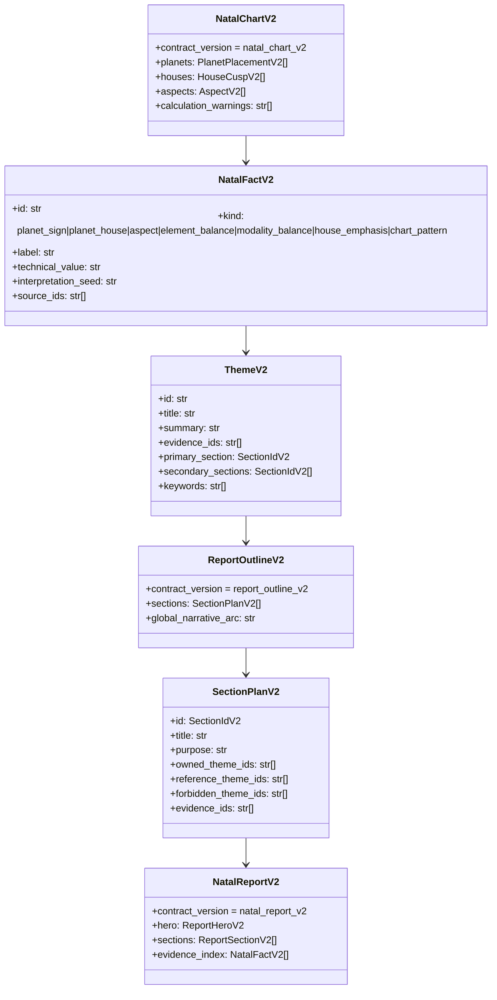

# Astrotype v2 Natal-Only Foundation Implementation Plan

> **For Hermes:** Use subagent-driven-development skill to implement this plan task-by-task.

**Goal:** Подготовить фундамент Astrotype v2 как нового сервиса расчёта и сборки natal-only отчёта: v2 должен исходно работать только с натальной картой и её астрологической интерпретацией, без соционики как концепта, зависимости или совместимого поля.

**Architecture:** Не строить v2 как “v1 минус соционика”. Сделать отдельный bounded context `astrotype_v2`, который получает birth/profile data или готовый chart snapshot, строит нормализованный `NatalChartV2`, извлекает астрологические факты, собирает `NatalSynthesisV2`, затем строит `ReportOutlineV2` с ownership-моделью тем (`owned/reference/forbidden`) и только после этого отдаёт `NatalReportV2`. Legacy v1 остаётся рядом до миграции, но v2 не импортирует legacy narrative DTO, socionics engine, function strengths, Model A и старую сборку `NarrativeInput`.

**Tech Stack:** FastAPI, Pydantic v2, SQLAlchemy async where persistence is needed, existing chart engine only for natal chart calculation, pytest, Next.js/TypeScript only for minimal v2 entry/rendering after backend contract is ready.

---

## Ключевая поправка к предыдущему плану

Предыдущий план ошибочно был сфокусирован на guard-тестах против протекания соционики из legacy pipeline. Это неправильная архитектурная рамка.

Правильная рамка:

- v2 — это новый natal-chart-first engine.
- В v2 соционика не “запрещается гардами”, а отсутствует в модели мира.
- Guard-тесты допустимы только как boundary/contract regression tests, но не как основной механизм качества.
- v2 не должен переиспользовать legacy `build_narrative_input()`, потому что тот уже концептуально знает про соционику.
- v2 не должен зависеть от `report_data.socionics`, `function_strengths`, `SocionicsSummary`, `evaluate_socionics`, `MODEL_A`.

---

## Current context / assumptions

- Canonical repo: `/mnt/d/Python/Balthier/Archemap/` (`D:\Python\Balthier\Archemap`).
- Current stack already has legacy report flow under:
  - `backend/app/modules/reports/`
  - `backend/app/modules/report_narratives/`
  - `backend/app/chart_engine/socionics.py`
- Existing chart calculation is still useful and can be reused as low-level natal chart infrastructure.
- Existing socionics code must not be deleted in foundation pass unless explicitly requested later, because legacy registration/report flows may still depend on it.
- v2 should be developed side-by-side and become the new direction after it is independently verifiable.

---

## Product definition for v2 phase 1

Astrotype v2 phase 1 is:

1. Birth/profile data → natal chart calculation.
2. Natal chart → normalized chart contract.
3. Normalized chart → deterministic astrological facts.
4. Facts → natal synthesis: темы, напряжения, ресурсы, векторы роста.
5. Synthesis → report outline: deterministic ownership map, где каждая тема получает один основной раздел.
6. Outline → structured report sections without semantic duplication.
7. Generate curated LLM requests per personality segment from persisted facts + synthesis + outline.
8. LLM writes detailed section prose, one bounded segment at a time.
9. Deterministically assemble the final large report from validated segments.
10. Build natal-chart infographics without LLM and expose the factual basis used by the report. Element and modality balances follow `docs/architecture/astrotype-v2-balance-calculation.md`.
11. MVP derived chart calculations are specified in `docs/architecture/astrotype-v2-derived-calculations/README.md`.
12. Upper narrative sections follow the depth contract in `docs/architecture/astrotype-v2-narrative-depth-contract.md`: evidence must become mechanism, lived manifestation, tension, protection/shadow and mature expression rather than a shallow overview.

Astrotype v2 phase 1 is not:

- socionics;
- Model A;
- information functions;
- MBTI or any typology replacement;
- “legacy self report with fields hidden”.

---

## Proposed module boundary

Create a new backend module:

```text
backend/app/modules/astrotype_v2/
  __init__.py
  schemas.py
  service.py
  natal_facts.py
  synthesis.py
  outline.py
  report_builder.py
  router.py                  # optional in foundation; can be added when API is wired
  segment_inputs.py          # curated prompt inputs per personality segment
  llm_segments.py            # bounded LLM section generation
  report_assembler.py        # final report assembly
  infographic_builder.py     # LLM-free infographic datasets
```

Recommended responsibilities:

- `schemas.py`: Pydantic contracts for v2 input/output.
- `service.py`: orchestration; no socionics imports.
- `natal_facts.py`: convert normalized chart into evidence-backed astrological facts.
- `synthesis.py`: deterministic synthesis from facts/aspects/houses/elements/modalities.
- `outline.py`: deterministic anti-duplication planner; assigns each theme to exactly one owning section and defines allowed short references.
- `report_builder.py`: convert outline + synthesis into structured user-facing report sections.
- `router.py`: optional API endpoints after core is tested.

---

## Report assembly logic and anti-duplication model

The central v2 change is the addition of `ReportOutlineV2` between synthesis and LLM rendering. The report is not assembled by asking the LLM to independently write several personality blocks from the same full fact set. Instead, deterministic code first decides where each theme belongs, then generates a curated LLM request for each personality segment. The final report is large and detailed, but every section is grounded in owned facts/themes and validated evidence ids.

```mermaid
flowchart TD
    A[Birth/Profile data] --> B[ChartService / natal calculation]
    B --> C[NatalChartV2<br/>clean chart contract]
    C --> D[NatalFactV2[]<br/>placements, houses, aspects, balances]
    D --> E[NatalSynthesisV2<br/>themes, tensions, resources, growth vectors]
    E --> F[ReportOutlineV2<br/>owned/reference/forbidden theme map]
    F --> H[Curated section LLM inputs<br/>one segment at a time]
    H --> I[LLM section generation<br/>detailed prose from facts]
    I --> G[NatalReportV2 assembler]
    C --> K[Infographic datasets<br/>no LLM]
    D --> M[Visible factual basis]
    G --> J[API / UI]
    K --> J
    M --> J

    subgraph Legacy_v1[Legacy v1 remains separate]
      L1[report_narratives]
      L2[chart_engine.socionics]
      L3[NarrativeInput legacy]
    end

    L1 -. no import .- F
    L2 -. no import .- C
    L3 -. no import .- E
```



### Section taxonomy for Self v2

Use these sections first; do not bring back old v1 sections such as global `strengths`, global `vulnerabilities`, separate `sexuality`, or separate `house_scenarios` in phase 1.

```text
core_pattern
perception_and_mind
emotional_regulation
agency_and_desire
relationships_and_intimacy
growth_vector
technical_basis
```

Reasoning:

- `strengths` and `vulnerabilities` as separate global sections cause duplicates because every major pattern has both a resource and a risk. In v2 each content section should contain its own resource/tension/mature expression.
- `relationships` and `sexuality` should be one phase-1 section because Venus, Mars, Moon, 7th house and 8th house otherwise repeat the same intimacy material.
- `technical_basis` is not a personality section and must not become a separate dashboard/evidence essay. In the current canonical sample it is the lower deterministic calculation layer: chart/key indicators, planet positions, balances, house emphasis, aspect network, key aspects and compact derived accents.

### Theme ownership rules

Every synthesized theme must have exactly one `primary_section`. Other sections may only reference it briefly.

Examples:

```text
Theme: Sun in Scorpio / depth-control pattern
primary_section: core_pattern
secondary_sections: emotional_regulation, relationships_and_intimacy
forbidden expansion: growth_vector
```

```text
Theme: Moon-Saturn emotional regulation
primary_section: emotional_regulation
secondary_sections: relationships_and_intimacy, growth_vector
forbidden expansion: core_pattern
```

```text
Theme: Venus-Mars intimacy tension
primary_section: relationships_and_intimacy
secondary_sections: agency_and_desire
forbidden expansion: emotional_regulation
```

Renderer rule:

- Owned themes: explain fully.
- Reference themes: mention in one sentence only when needed for continuity.
- Forbidden themes: do not explain or paraphrase.
- Technical basis / lower calculation layer: render deterministic calculated data only, not personality prose and not a separate evidence essay.

### LLM rendering rule

LLM rendering is the upper narrative part of the final report. It is downstream of persisted facts, synthesis and `ReportOutlineV2`. A builder creates a dedicated JSON input for each personality block; each LLM request receives one `SectionPlanV2` and answers one part of personality, not the full unrestricted chart/synthesis. The prompt input shape should be:

```json
{
  "section_id": "emotional_regulation",
  "purpose": "Explain emotional rhythm, triggers and protective regulation.",
  "owned_themes": [],
  "reference_themes": [],
  "forbidden_theme_ids": [],
  "facts": [],
  "already_explained": []
}
```

The LLM is a detailed prose renderer/editor, not the calculator or planner of the report. It should write long, rich, expanded sections from the facts/themes assigned to that segment. The product must not impose artificial low character/paragraph caps on valid sections; provider token limits are handled through segment continuation/chunking. The upper report is therefore assembled from bounded, validated section outputs; the lower calculation layer is produced separately by deterministic builders and does not depend on LLM text.

### Deterministic lower report layer rule

The current canonical report sample is:

```text
Upper narrative report
  - hero / main portrait
  - core_pattern
  - perception_and_mind
  - emotional_regulation
  - agency_and_desire
  - relationships_and_intimacy
  - growth_vector

Lower deterministic calculation layer
  - chart/key indicators: ASC, MC, chart ruler
  - planet positions table
  - element and modality balances
  - house emphasis
  - aspect network
  - key aspects table
  - compact 2x2 derived accents at the very bottom:
      house mode balance
      hemisphere/orientation balance
      quadrant balance
      aspect profile
```

The lower layer is fully deterministic and calculated from `NatalChartV2`, normalized storage rows, reference tables and derived-calculation builders. It is not written or rearranged by the LLM. It is not a separate “factual basis” essay; it is the compact calculation appendix that closes the report.

Canonical visual sample:

- `docs/design/astrotype-v2-infographic-db-report-sample.html`
- `docs/design/astrotype-v2-infographic-db-report-data.json`

---

## Core v2 contracts

### `NatalChartV2`

Represents only chart calculation results:

```python
class NatalChartV2(BaseModel):
    contract_version: Literal["natal_chart_v2"]
    source_profile_id: str
    birth_datetime: datetime
    timezone: str
    latitude: float
    longitude: float
    house_system: str
    zodiac: Literal["tropical", "sidereal"] = "tropical"
    planets: list[PlanetPlacementV2]
    houses: list[HouseCuspV2]
    aspects: list[AspectV2]
    calculation_warnings: list[str] = Field(default_factory=list)
```

### `NatalFactV2`

Evidence unit for report generation:

```python
class NatalFactV2(BaseModel):
    id: str
    kind: Literal[
        "planet_sign",
        "planet_house",
        "aspect",
        "element_balance",
        "modality_balance",
        "house_emphasis",
        "chart_pattern",
    ]
    label: str
    technical_value: str
    interpretation_seed: str
    confidence: Literal["high", "medium", "low"]
    source_ids: list[str]
```

### `NatalSynthesisV2`

Deterministic synthesis layer. This layer creates meaning units, but does not decide final section rendering by itself:

```python
class ThemeV2(BaseModel):
    id: str
    title: str
    summary: str
    evidence_ids: list[str]
    primary_section: SectionIdV2
    secondary_sections: list[SectionIdV2] = Field(default_factory=list)
    keywords: list[str] = Field(default_factory=list)


class NatalSynthesisV2(BaseModel):
    contract_version: Literal["natal_synthesis_v2"]
    chart: NatalChartV2
    facts: list[NatalFactV2]
    dominant_themes: list[ThemeV2]
    tensions: list[TensionV2]
    resources: list[ResourceV2]
    growth_vectors: list[GrowthVectorV2]
```

### `ReportOutlineV2`

Anti-duplication plan. Each section owns some themes, may briefly reference others, and must not expand forbidden themes:

```python
SectionIdV2 = Literal[
    "core_pattern",
    "perception_and_mind",
    "emotional_regulation",
    "agency_and_desire",
    "relationships_and_intimacy",
    "growth_vector",
    "technical_basis",
]


class SectionPlanV2(BaseModel):
    id: SectionIdV2
    title: str
    purpose: str
    owned_theme_ids: list[str]
    reference_theme_ids: list[str] = Field(default_factory=list)
    forbidden_theme_ids: list[str] = Field(default_factory=list)
    evidence_ids: list[str]


class ReportOutlineV2(BaseModel):
    contract_version: Literal["report_outline_v2"]
    sections: list[SectionPlanV2]
    global_narrative_arc: str
```

### `NatalReportV2`

Structured report output:

```python
class NatalReportV2(BaseModel):
    contract_version: Literal["natal_report_v2"]
    title: str
    hero: ReportHeroV2
    sections: list[ReportSectionV2]
    evidence_index: list[NatalFactV2]
    calculation_summary: CalculationSummaryV2
```

Important: none of these schemas contain `socionics`, `function_strengths`, `type`, `model_a`, or information functions. `ReportOutlineV2` is mandatory before final rendering; bypassing it recreates the duplicate problem.

---

## Step-by-step plan

### Task 1: Create the isolated `astrotype_v2` module skeleton

**Objective:** Establish a new bounded context for v2 without touching legacy report generation.

**Files:**

- Create: `backend/app/modules/astrotype_v2/__init__.py`
- Create: `backend/app/modules/astrotype_v2/schemas.py`
- Create: `backend/tests/unit/test_astrotype_v2/test_schemas.py`

**Step 1: Write failing test**

```python
from app.modules.astrotype_v2.schemas import NatalChartV2


def test_natal_chart_v2_contract_version_is_required() -> None:
    assert NatalChartV2.model_fields["contract_version"].annotation is not None
```

**Step 2: Run test to verify failure**

```bash
cd backend && python -m pytest tests/unit/test_astrotype_v2/test_schemas.py -v
```

Expected: FAIL because module/classes do not exist.

**Step 3: Implement minimal schema module**

Create `schemas.py` with minimal Pydantic classes:

```python
from __future__ import annotations

from datetime import datetime
from typing import Literal

from pydantic import BaseModel, Field


class PlanetPlacementV2(BaseModel):
    id: str
    name: str
    sign: str
    degree: float
    house: int | None = None
    longitude: float
    is_retrograde: bool = False


class HouseCuspV2(BaseModel):
    number: int = Field(ge=1, le=12)
    sign: str
    longitude: float


class AspectV2(BaseModel):
    id: str
    planet_a: str
    planet_b: str
    aspect_type: str
    orb: float
    is_applying: bool = False


class NatalChartV2(BaseModel):
    contract_version: Literal["natal_chart_v2"] = "natal_chart_v2"
    source_profile_id: str
    birth_datetime: datetime
    timezone: str
    latitude: float
    longitude: float
    house_system: str = "P"
    zodiac: Literal["tropical", "sidereal"] = "tropical"
    planets: list[PlanetPlacementV2]
    houses: list[HouseCuspV2]
    aspects: list[AspectV2]
    calculation_warnings: list[str] = Field(default_factory=list)
```

**Step 4: Run test to verify pass**

```bash
cd backend && python -m pytest tests/unit/test_astrotype_v2/test_schemas.py -v
```

Expected: PASS.

**Step 5: Commit**

```bash
git add backend/app/modules/astrotype_v2 backend/tests/unit/test_astrotype_v2/test_schemas.py
git commit -m "feat: add astrotype v2 natal schema foundation"
```

---

### Task 2: Add schema-level absence test for typology fields

**Objective:** Make the v2 contract explicitly natal-only at the schema boundary.

**Files:**

- Modify: `backend/tests/unit/test_astrotype_v2/test_schemas.py`

**Step 1: Write test**

```python
def test_v2_schemas_do_not_define_typology_fields() -> None:
    from app.modules.astrotype_v2 import schemas

    forbidden = {
        "socionics",
        "function_strengths",
        "model_a",
        "information_functions",
        "mbti",
    }
    schema_classes = [
        schemas.NatalChartV2,
        schemas.PlanetPlacementV2,
        schemas.HouseCuspV2,
        schemas.AspectV2,
    ]
    for schema_class in schema_classes:
        assert forbidden.isdisjoint(schema_class.model_fields)
```

This is a contract test, not a runtime guard. Its purpose is to keep the new domain clean.

**Step 2: Run test**

```bash
cd backend && python -m pytest tests/unit/test_astrotype_v2/test_schemas.py -v
```

Expected: PASS.

**Step 3: Commit**

```bash
git add backend/tests/unit/test_astrotype_v2/test_schemas.py
git commit -m "test: keep astrotype v2 schema natal-only"
```

---

### Task 3: Normalize existing chart snapshots into `NatalChartV2`

**Objective:** Reuse the existing chart calculation output while stripping v2 down to natal-chart data only.

**Files:**

- Create: `backend/app/modules/astrotype_v2/chart_adapter.py`
- Modify: `backend/tests/unit/test_astrotype_v2/test_schemas.py` or create `test_chart_adapter.py`

**Step 1: Write failing test**

```python
from app.modules.astrotype_v2.chart_adapter import natal_chart_v2_from_snapshot


def test_adapter_builds_natal_chart_without_typology(snapshot_fixture) -> None:
    snapshot_fixture.socionics = {"type": "LSI"}
    snapshot_fixture.function_strengths = {"Ti": 1.0}

    result = natal_chart_v2_from_snapshot(snapshot_fixture)

    assert result.contract_version == "natal_chart_v2"
    payload = result.model_dump(mode="json")
    assert "socionics" not in payload
    assert "function_strengths" not in payload
    assert result.planets
    assert result.houses
```

Use or adapt existing chart snapshot fixtures from `backend/tests/unit/test_chart_service.py` / report tests.

**Step 2: Run test to verify failure**

```bash
cd backend && python -m pytest tests/unit/test_astrotype_v2/test_chart_adapter.py -v
```

Expected: FAIL because adapter does not exist.

**Step 3: Implement adapter**

```python
from __future__ import annotations

from datetime import datetime
from typing import Any

from app.modules.astrotype_v2.schemas import AspectV2, HouseCuspV2, NatalChartV2, PlanetPlacementV2


def natal_chart_v2_from_snapshot(snapshot: Any) -> NatalChartV2:
    chart_data = snapshot.chart_data or {}
    planets = [
        PlanetPlacementV2(
            id=f"planet:{item.get('name')}",
            name=str(item.get("name")),
            sign=str(item.get("sign")),
            degree=float(item.get("degree", item.get("sign_degree", 0.0)) or 0.0),
            house=item.get("house"),
            longitude=float(item.get("longitude", 0.0) or 0.0),
            is_retrograde=bool(item.get("is_retrograde", False)),
        )
        for item in chart_data.get("planets", [])
        if item.get("name") and item.get("sign")
    ]
    houses = [
        HouseCuspV2(
            number=int(item.get("number")),
            sign=str(item.get("sign")),
            longitude=float(item.get("longitude", 0.0) or 0.0),
        )
        for item in chart_data.get("houses", [])
        if item.get("number") and item.get("sign")
    ]
    aspects = [
        AspectV2(
            id=f"aspect:{item.get('planet_a')}:{item.get('aspect_type')}:{item.get('planet_b')}",
            planet_a=str(item.get("planet_a")),
            planet_b=str(item.get("planet_b")),
            aspect_type=str(item.get("aspect_type")),
            orb=float(item.get("orb", 0.0) or 0.0),
            is_applying=bool(item.get("is_applying", False)),
        )
        for item in chart_data.get("aspects", [])
        if item.get("planet_a") and item.get("planet_b") and item.get("aspect_type")
    ]
    return NatalChartV2(
        source_profile_id=str(snapshot.profile_id),
        birth_datetime=datetime.fromisoformat(str(chart_data.get("birth_datetime"))),
        timezone=str(chart_data.get("timezone", "UTC")),
        latitude=float(chart_data.get("latitude", 0.0) or 0.0),
        longitude=float(chart_data.get("longitude", 0.0) or 0.0),
        house_system=str(chart_data.get("house_system", "P")),
        zodiac="sidereal" if chart_data.get("ayanamsa") else "tropical",
        planets=planets,
        houses=houses,
        aspects=aspects,
        calculation_warnings=[],
    )
```

**Step 4: Run tests**

```bash
cd backend && python -m pytest tests/unit/test_astrotype_v2/test_chart_adapter.py -v
```

Expected: PASS.

**Step 5: Commit**

```bash
git add backend/app/modules/astrotype_v2/chart_adapter.py backend/tests/unit/test_astrotype_v2/test_chart_adapter.py
git commit -m "feat: adapt chart snapshots to natal v2 contract"
```

---

### Task 4: Add deterministic natal facts extraction

**Objective:** Convert `NatalChartV2` into evidence-backed astrological facts without typology concepts.

**Files:**

- Modify: `backend/app/modules/astrotype_v2/schemas.py`
- Create: `backend/app/modules/astrotype_v2/natal_facts.py`
- Create: `backend/tests/unit/test_astrotype_v2/test_natal_facts.py`

**Step 1: Write failing test**

```python
from app.modules.astrotype_v2.natal_facts import extract_natal_facts_v2


def test_extracts_planet_sign_house_and_aspect_facts(natal_chart_v2_fixture) -> None:
    facts = extract_natal_facts_v2(natal_chart_v2_fixture)
    kinds = {fact.kind for fact in facts}

    assert "planet_sign" in kinds
    assert "planet_house" in kinds
    assert "aspect" in kinds
    assert all(fact.id for fact in facts)
    assert all(fact.interpretation_seed for fact in facts)
```

**Step 2: Run test to verify failure**

```bash
cd backend && python -m pytest tests/unit/test_astrotype_v2/test_natal_facts.py -v
```

Expected: FAIL because extractor/schema do not exist.

**Step 3: Add `NatalFactV2` schema**

```python
class NatalFactV2(BaseModel):
    id: str
    kind: Literal[
        "planet_sign",
        "planet_house",
        "aspect",
        "element_balance",
        "modality_balance",
        "house_emphasis",
        "chart_pattern",
    ]
    label: str
    technical_value: str
    interpretation_seed: str
    confidence: Literal["high", "medium", "low"] = "medium"
    source_ids: list[str] = Field(default_factory=list)
```

**Step 4: Implement minimal extractor**

Generate:

- one `planet_sign` fact per planet;
- one `planet_house` fact where house is known;
- one `aspect` fact per aspect;
- later tasks can add balances/patterns.

Keep interpretation seeds restrained and reusable, for example:

```python
interpretation_seed=f"{planet.name} in {planet.sign} describes how this planetary function expresses itself."
```

**Step 5: Run tests**

```bash
cd backend && python -m pytest tests/unit/test_astrotype_v2/test_natal_facts.py -v
```

Expected: PASS.

**Step 6: Commit**

```bash
git add backend/app/modules/astrotype_v2/schemas.py backend/app/modules/astrotype_v2/natal_facts.py backend/tests/unit/test_astrotype_v2/test_natal_facts.py
git commit -m "feat: extract natal facts for astrotype v2"
```

---

### Task 5: Add element and modality balance facts

**Objective:** Give v2 the first aggregate chart-level facts needed for synthesis.

**Files:**

- Modify: `backend/app/modules/astrotype_v2/natal_facts.py`
- Test: `backend/tests/unit/test_astrotype_v2/test_natal_facts.py`

**Step 1: Write failing test**

```python
def test_extracts_element_and_modality_balance_facts(natal_chart_v2_fixture) -> None:
    facts = extract_natal_facts_v2(natal_chart_v2_fixture)
    kinds = {fact.kind for fact in facts}

    assert "element_balance" in kinds
    assert "modality_balance" in kinds
```

**Step 2: Run test to verify failure**

```bash
cd backend && python -m pytest tests/unit/test_astrotype_v2/test_natal_facts.py::test_extracts_element_and_modality_balance_facts -v
```

Expected: FAIL.

**Step 3: Implement sign maps locally in v2**

Add constants in `natal_facts.py`:

```python
SIGN_ELEMENT = {...}
SIGN_MODALITY = {...}
```

Count planets by sign and produce the dominant element/modality facts.

**Step 4: Run tests**

```bash
cd backend && python -m pytest tests/unit/test_astrotype_v2/test_natal_facts.py -v
```

Expected: PASS.

**Step 5: Commit**

```bash
git add backend/app/modules/astrotype_v2/natal_facts.py backend/tests/unit/test_astrotype_v2/test_natal_facts.py
git commit -m "feat: add natal balance facts for v2"
```

---

### Task 6: Add deterministic natal synthesis v2

**Objective:** Convert facts into coherent themes, tensions, resources and growth vectors before any narrative rendering.

**Files:**

- Modify: `backend/app/modules/astrotype_v2/schemas.py`
- Create: `backend/app/modules/astrotype_v2/synthesis.py`
- Create: `backend/tests/unit/test_astrotype_v2/test_synthesis.py`

**Step 1: Write failing test**

```python
from app.modules.astrotype_v2.natal_facts import extract_natal_facts_v2
from app.modules.astrotype_v2.synthesis import build_natal_synthesis_v2


def test_builds_natal_synthesis_from_facts(natal_chart_v2_fixture) -> None:
    facts = extract_natal_facts_v2(natal_chart_v2_fixture)
    synthesis = build_natal_synthesis_v2(natal_chart_v2_fixture, facts)

    assert synthesis.contract_version == "natal_synthesis_v2"
    assert synthesis.chart == natal_chart_v2_fixture
    assert synthesis.facts == facts
    assert synthesis.dominant_themes
    assert synthesis.resources
    assert all(theme.primary_section for theme in synthesis.dominant_themes)
```

**Step 2: Run test to verify failure**

```bash
cd backend && python -m pytest tests/unit/test_astrotype_v2/test_synthesis.py -v
```

Expected: FAIL.

**Step 3: Add synthesis schemas**

```python
class ThemeV2(BaseModel):
    id: str
    title: str
    summary: str
    evidence_ids: list[str]
    primary_section: SectionIdV2
    secondary_sections: list[SectionIdV2] = Field(default_factory=list)
    keywords: list[str] = Field(default_factory=list)


class TensionV2(BaseModel):
    id: str
    title: str
    tension: str
    mature_expression: str
    evidence_ids: list[str]


class ResourceV2(BaseModel):
    id: str
    title: str
    expression: str
    evidence_ids: list[str]


class GrowthVectorV2(BaseModel):
    id: str
    title: str
    practice: str
    evidence_ids: list[str]


class NatalSynthesisV2(BaseModel):
    contract_version: Literal["natal_synthesis_v2"] = "natal_synthesis_v2"
    chart: NatalChartV2
    facts: list[NatalFactV2]
    dominant_themes: list[ThemeV2]
    tensions: list[TensionV2] = Field(default_factory=list)
    resources: list[ResourceV2]
    growth_vectors: list[GrowthVectorV2] = Field(default_factory=list)
```

**Step 4: Implement first synthesis rules**

Keep it simple:

- Dominant element/modality → dominant theme.
- Harmonious aspects (`trine`, `sextile`) → resources.
- Tense aspects (`square`, `opposition`, `quincunx`) → tensions and growth vectors.
- Angular or repeated houses → themes/growth vectors if available.

**Step 5: Run tests**

```bash
cd backend && python -m pytest tests/unit/test_astrotype_v2/test_synthesis.py -v
```

Expected: PASS.

**Step 6: Commit**

```bash
git add backend/app/modules/astrotype_v2/schemas.py backend/app/modules/astrotype_v2/synthesis.py backend/tests/unit/test_astrotype_v2/test_synthesis.py
git commit -m "feat: build natal synthesis for astrotype v2"
```

---

### Task 7: Add ReportOutlineV2 ownership planner

**Objective:** Build a deterministic section plan that prevents duplicate expansion of the same theme across personality blocks.

**Files:**

- Modify: `backend/app/modules/astrotype_v2/schemas.py`
- Create: `backend/app/modules/astrotype_v2/outline.py`
- Create: `backend/tests/unit/test_astrotype_v2/test_outline.py`

**Step 1: Write failing test**

```python
from app.modules.astrotype_v2.outline import build_report_outline_v2


def test_outline_assigns_each_theme_to_one_owned_section(natal_synthesis_v2_fixture) -> None:
    outline = build_report_outline_v2(natal_synthesis_v2_fixture)

    assert outline.contract_version == "report_outline_v2"
    owned_theme_ids = [
        theme_id
        for section in outline.sections
        for theme_id in section.owned_theme_ids
    ]
    assert len(owned_theme_ids) == len(set(owned_theme_ids))
    assert {section.id for section in outline.sections} == {
        "core_pattern",
        "perception_and_mind",
        "emotional_regulation",
        "agency_and_desire",
        "relationships_and_intimacy",
        "growth_vector",
        "technical_basis",
    }
```

**Step 2: Run test to verify failure**

```bash
cd backend && python -m pytest tests/unit/test_astrotype_v2/test_outline.py -v
```

Expected: FAIL because outline module/schema does not exist.

**Step 3: Add outline schemas**

Add `SectionIdV2`, `SectionPlanV2`, `ReportOutlineV2` to `schemas.py` as described in Core v2 contracts.

**Step 4: Implement deterministic planner**

Rules:

- `core_pattern` owns dominant identity themes: Sun, Ascendant/chart ruler, dominant element/modality, major chart pattern.
- `perception_and_mind` owns Mercury, 3rd/9th house, air emphasis, Mercury aspects.
- `emotional_regulation` owns Moon, 4th/8th/12th emotional load, Moon-Saturn/Moon-Pluto/Moon-Neptune tensions.
- `agency_and_desire` owns Mars, 1st/5th house action themes, fire/cardinal action patterns.
- `relationships_and_intimacy` owns Venus, 7th/8th relationship themes, Venus-Mars/Venus-Saturn/Venus-Pluto patterns.
- `growth_vector` owns Saturn, North Node if supported later, repeated tensions converted to practices. It references but does not re-explain source tensions.
- `technical_basis` owns no personality themes; it owns evidence listing only.

Each theme id may appear in `owned_theme_ids` of exactly one section. It may appear in `reference_theme_ids` of multiple sections. If a theme is owned elsewhere and should not be repeated, add it to `forbidden_theme_ids`.

**Step 5: Run tests**

```bash
cd backend && python -m pytest tests/unit/test_astrotype_v2/test_outline.py tests/unit/test_astrotype_v2/test_synthesis.py -v
```

Expected: PASS.

**Step 6: Commit**

```bash
git add backend/app/modules/astrotype_v2/schemas.py backend/app/modules/astrotype_v2/outline.py backend/tests/unit/test_astrotype_v2/test_outline.py
git commit -m "feat: plan self v2 sections without duplicate theme ownership"
```

---

### Task 8: Add structured natal report builder v2

**Objective:** Produce a report object from `NatalSynthesisV2` + `ReportOutlineV2` without LLM dependency.

**Files:**

- Modify: `backend/app/modules/astrotype_v2/schemas.py`
- Create: `backend/app/modules/astrotype_v2/report_builder.py`
- Create: `backend/tests/unit/test_astrotype_v2/test_report_builder.py`

**Step 1: Write failing test**

```python
from app.modules.astrotype_v2.report_builder import build_natal_report_v2


def test_builds_report_sections_from_synthesis(natal_synthesis_v2_fixture) -> None:
    outline = build_report_outline_v2(natal_synthesis_v2_fixture)
    report = build_natal_report_v2(natal_synthesis_v2_fixture, outline, profile_name="Test")

    assert report.contract_version == "natal_report_v2"
    assert report.title
    assert report.hero.body
    section_ids = [section.id for section in report.sections]
    assert section_ids == [
        "core_pattern",
        "perception_and_mind",
        "emotional_regulation",
        "agency_and_desire",
        "relationships_and_intimacy",
        "growth_vector",
        "technical_basis",
    ]
    assert report.evidence_index
```

**Step 2: Run test to verify failure**

```bash
cd backend && python -m pytest tests/unit/test_astrotype_v2/test_report_builder.py tests/unit/test_astrotype_v2/test_outline.py -v
```

Expected: FAIL.

**Step 3: Add report schemas**

```python
SelfV2SectionId = Literal[
    "core_pattern",
    "perception_and_mind",
    "emotional_regulation",
    "agency_and_desire",
    "relationships_and_intimacy",
    "growth_vector",
    "technical_basis",
]


class ReportHeroV2(BaseModel):
    title: str
    body: str
    evidence_ids: list[str]


class ReportSectionV2(BaseModel):
    id: SelfV2SectionId
    title: str
    body: str
    bullets: list[str] = Field(default_factory=list)
    evidence_ids: list[str]


class CalculationSummaryV2(BaseModel):
    birth_time_quality: str | None = None
    house_system: str
    zodiac: str
    warnings: list[str] = Field(default_factory=list)


class NatalReportV2(BaseModel):
    contract_version: Literal["natal_report_v2"] = "natal_report_v2"
    title: str
    hero: ReportHeroV2
    sections: list[ReportSectionV2]
    evidence_index: list[NatalFactV2]
    calculation_summary: CalculationSummaryV2
```

**Step 4: Implement report builder**

Use deterministic, modest Russian text assembled from section plans and their owned themes. This is foundation, not final prose quality.

Important rendering rule:

- expand only `owned_theme_ids` for the current section;
- mention `reference_theme_ids` at most briefly for continuity;
- never expand `forbidden_theme_ids`;
- mention placements/aspects only when backed by evidence ids;
- no generic filler;
- technical basis last.

**Step 5: Run tests**

```bash
cd backend && python -m pytest tests/unit/test_astrotype_v2/test_report_builder.py tests/unit/test_astrotype_v2/test_outline.py -v
```

Expected: PASS.

**Step 6: Commit**

```bash
git add backend/app/modules/astrotype_v2/schemas.py backend/app/modules/astrotype_v2/report_builder.py backend/tests/unit/test_astrotype_v2/test_report_builder.py
git commit -m "feat: build deterministic natal report v2 from outline"
```

---

### Task 9: Add v2 orchestration service

**Objective:** Provide one backend service entry point that calculates/loads a chart and returns a full v2 natal report.

**Files:**

- Create: `backend/app/modules/astrotype_v2/service.py`
- Create: `backend/tests/unit/test_astrotype_v2/test_service.py`

**Step 1: Write failing test**

```python
from app.modules.astrotype_v2.service import AstrotypeV2Service


async def test_service_builds_report_from_existing_snapshot(db_session, profile_fixture, user_fixture):
    service = AstrotypeV2Service(db_session)
    report = await service.generate_natal_report(profile_fixture.id, user_fixture.id)

    assert report.contract_version == "natal_report_v2"
    assert report.sections
```

Adapt fixture style to current async test setup.

**Step 2: Run test to verify failure**

```bash
cd backend && python -m pytest tests/unit/test_astrotype_v2/test_service.py -v
```

Expected: FAIL.

**Step 3: Implement service**

Service flow:

```python
class AstrotypeV2Service:
    def __init__(self, db: AsyncSession) -> None:
        self.db = db

    async def generate_natal_report(self, profile_id: UUID, user_id: UUID) -> NatalReportV2:
        snapshot = await ChartService(self.db).get_or_compute(profile_id, user_id)
        profile = await self._get_profile(profile_id, user_id)
        chart = natal_chart_v2_from_snapshot(snapshot)
        facts = extract_natal_facts_v2(chart)
        synthesis = build_natal_synthesis_v2(chart, facts)
        outline = build_report_outline_v2(synthesis)
        return build_natal_report_v2(synthesis, outline, profile_name=profile.name)
```

Rules:

- no import from `app.chart_engine.socionics`;
- no import from `app.modules.report_narratives.input_builder`;
- no import from legacy `NarrativeInput`.

**Step 4: Run tests**

```bash
cd backend && python -m pytest tests/unit/test_astrotype_v2/test_service.py tests/unit/test_astrotype_v2 -v
```

Expected: PASS.

**Step 5: Commit**

```bash
git add backend/app/modules/astrotype_v2/service.py backend/tests/unit/test_astrotype_v2/test_service.py
git commit -m "feat: orchestrate astrotype v2 natal report"
```

---

### Task 10: Add import-boundary test for v2 module

**Objective:** Protect the architectural boundary: v2 module must not import socionics or legacy narrative input.

**Files:**

- Create: `backend/tests/unit/test_astrotype_v2/test_boundaries.py`

**Step 1: Write boundary test**

```python
from pathlib import Path


def test_astrotype_v2_module_does_not_import_legacy_socionics_or_narratives() -> None:
    root = Path("app/modules/astrotype_v2")
    forbidden = [
        "chart_engine.socionics",
        "evaluate_socionics",
        "MODEL_A",
        "SocionicsSummary",
        "build_narrative_input",
        "modules.report_narratives",
        "function_strengths",
    ]
    for path in root.rglob("*.py"):
        content = path.read_text(encoding="utf-8")
        for term in forbidden:
            assert term not in content, f"{path} contains forbidden dependency/text: {term}"
```

This is the correct kind of guard: a boundary test for the new module, not a patch over runtime leaks.

**Step 2: Run test**

```bash
cd backend && python -m pytest tests/unit/test_astrotype_v2/test_boundaries.py -v
```

Expected: PASS.

**Step 3: Commit**

```bash
git add backend/tests/unit/test_astrotype_v2/test_boundaries.py
git commit -m "test: enforce astrotype v2 module boundary"
```

---

### Task 11: Add optional read-only API endpoint for v2 preview

**Objective:** Expose v2 report generation for manual/local smoke without replacing legacy `/reports/generate` yet.

**Files:**

- Create: `backend/app/modules/astrotype_v2/router.py`
- Modify: `backend/app/main.py` or wherever routers are registered
- Create: `backend/tests/unit/test_astrotype_v2/test_api.py`

**Step 1: Write failing API test**

```python
async def test_generate_v2_natal_report_endpoint(client, auth_headers, profile_fixture) -> None:
    response = await client.post(
        "/api/v1/astrotype-v2/natal-report",
        json={"profile_id": str(profile_fixture.id)},
        headers=auth_headers,
    )
    assert response.status_code == 200
    payload = response.json()
    assert payload["contract_version"] == "natal_report_v2"
```

**Step 2: Run test to verify failure**

```bash
cd backend && python -m pytest tests/unit/test_astrotype_v2/test_api.py -v
```

Expected: FAIL because route does not exist.

**Step 3: Implement endpoint**

Request schema:

```python
class GenerateNatalReportV2Request(BaseModel):
    profile_id: UUID
```

Route:

```python
@router.post("/natal-report", response_model=NatalReportV2)
async def generate_natal_report_v2(...):
    return await AstrotypeV2Service(db).generate_natal_report(request.profile_id, current_user.id)
```

Register under:

```text
/api/v1/astrotype-v2
```

Do not modify legacy `/api/v1/reports/generate` in this task.

**Step 4: Run tests**

```bash
cd backend && python -m pytest tests/unit/test_astrotype_v2/test_api.py tests/unit/test_astrotype_v2 -v
```

Expected: PASS.

**Step 5: Commit**

```bash
git add backend/app/modules/astrotype_v2/router.py backend/app/main.py backend/tests/unit/test_astrotype_v2/test_api.py
git commit -m "feat: expose astrotype v2 natal report endpoint"
```

---

### Task 12: Add minimal frontend v2 preview route/component

**Objective:** Let us see the new v2 natal-only report without integrating it into the full legacy report page.

**Files:**

- Create: `frontend/src/app/reports/v2/[profileId]/page.tsx` or align with current app router structure
- Create: `frontend/src/lib/api/astrotype-v2.ts`
- Create: `frontend/src/components/report-v2/natal-report-v2-page.tsx`
- Create: `frontend/src/components/report-v2/natal-report-v2-section.tsx`
- Test: frontend script or typecheck/build

**Step 1: Inspect current frontend routing before implementation**

Read the current `frontend/src/app` structure and follow existing auth/data-fetching conventions.

**Step 2: Create API client**

Add a function like:

```ts
export async function generateNatalReportV2(
  profileId: string,
): Promise<NatalReportV2> {
  return apiFetch("/api/v1/astrotype-v2/natal-report", {
    method: "POST",
    body: JSON.stringify({ profile_id: profileId }),
  });
}
```

Use existing API helper style from `frontend/src/lib/api/report.ts`.

**Step 3: Create component**

Render:

- hero;
- sections;
- evidence index collapsed or placed at bottom;
- calculation summary last.

No socionics/typology labels.

**Step 4: Run frontend checks**

```bash
cd frontend && npm run lint
cd frontend && npm run build
```

Expected: PASS.

**Step 5: Commit**

```bash
git add frontend/src/app/reports/v2 frontend/src/lib/api/astrotype-v2.ts frontend/src/components/report-v2
git commit -m "feat: add astrotype v2 report preview UI"
```

---

### Task 13: Add docs for v2 architecture and migration boundary

**Objective:** Document that v2 is natal-only by construction, not legacy-with-guards.

**Files:**

- Create: `docs/SRS/SRS-E16-astrotype-v2-natal-foundation.md`
- Create: `docs/features/E16-astrotype-v2-natal-foundation/FEATURE.md`
- Create: `docs/features/E16-astrotype-v2-natal-foundation/S01-natal-only-domain-boundary.md`

**Step 1: Write SRS**

Include:

```markdown
# SRS-E16 Astrotype v2 Natal Foundation

## Product boundary

Astrotype v2 starts as a natal chart calculation and report assembly service. It does not include socionics, Model A, information functions, MBTI or any typology system.

## Architecture boundary

v2 lives under `backend/app/modules/astrotype_v2/` and does not import legacy `report_narratives` or `chart_engine.socionics`.

## Phase 1 acceptance criteria

- v2 has standalone Pydantic contracts: `NatalChartV2`, `NatalFactV2`, `NatalSynthesisV2`, `ReportOutlineV2`, `NatalReportV2`.
- v2 service can generate a deterministic natal report from an existing chart snapshot.
- v2 endpoint returns `contract_version=natal_report_v2`.
- v2 module has an import-boundary test preventing dependencies on socionics and legacy narrative input.
- Legacy v1 remains operational until explicit migration/removal.
```

**Step 2: Commit docs**

```bash
git add docs/SRS/SRS-E16-astrotype-v2-natal-foundation.md docs/features/E16-astrotype-v2-natal-foundation
git commit -m "docs: define astrotype v2 natal-only foundation"
```

---

### Task 14: Local verification and smoke

**Objective:** Verify that v2 foundation works and legacy app still starts.

**Step 1: Backend v2 tests**

```bash
cd backend && python -m pytest tests/unit/test_astrotype_v2 -v --tb=short
```

Expected: PASS.

**Step 2: Existing impacted backend tests**

```bash
cd backend && python -m pytest tests/unit/test_chart_service.py tests/unit/test_reports tests/unit/test_report_narratives -v --tb=short
```

Expected: PASS. If legacy tests fail due to unrelated existing state, record exact failures and do not claim green.

**Step 3: Frontend checks if UI task implemented**

```bash
cd frontend && npm run lint
cd frontend && npm run build
```

Expected: PASS.

**Step 4: Docker rebuild and health**

```bash
docker compose up -d --build
docker compose ps
curl -fsS http://localhost:8000/api/v1/health
curl -I -fsS http://localhost:3000
```

Expected:

- backend healthy;
- postgres healthy;
- redis healthy;
- worker up;
- frontend HTTP 200.

**Step 5: Manual v2 endpoint smoke**

After creating or selecting a real local profile, call:

```bash
curl -fsS -X POST http://localhost:8000/api/v1/astrotype-v2/natal-report \
  -H "Content-Type: application/json" \
  -H "Authorization: Bearer $TOKEN" \
  -d '{"profile_id":"<PROFILE_ID>"}'
```

Expected:

- JSON has `contract_version: "natal_report_v2"`;
- `hero`, `sections`, `evidence_index`, `calculation_summary` exist;
- section ids follow `core_pattern`, `perception_and_mind`, `emotional_regulation`, `agency_and_desire`, `relationships_and_intimacy`, `growth_vector`, `technical_basis`;
- no v2 endpoint code path imports or calls socionics.

---

## Files likely to change

Backend new v2 module:

- `backend/app/modules/astrotype_v2/__init__.py`
- `backend/app/modules/astrotype_v2/schemas.py`
- `backend/app/modules/astrotype_v2/chart_adapter.py`
- `backend/app/modules/astrotype_v2/natal_facts.py`
- `backend/app/modules/astrotype_v2/synthesis.py`
- `backend/app/modules/astrotype_v2/outline.py`
- `backend/app/modules/astrotype_v2/report_builder.py`
- `backend/app/modules/astrotype_v2/service.py`
- `backend/app/modules/astrotype_v2/router.py`

Backend integration:

- `backend/app/main.py` or existing router registration file

Backend tests:

- `backend/tests/unit/test_astrotype_v2/test_schemas.py`
- `backend/tests/unit/test_astrotype_v2/test_chart_adapter.py`
- `backend/tests/unit/test_astrotype_v2/test_natal_facts.py`
- `backend/tests/unit/test_astrotype_v2/test_synthesis.py`
- `backend/tests/unit/test_astrotype_v2/test_outline.py`
- `backend/tests/unit/test_astrotype_v2/test_report_builder.py`
- `backend/tests/unit/test_astrotype_v2/test_service.py`
- `backend/tests/unit/test_astrotype_v2/test_boundaries.py`
- `backend/tests/unit/test_astrotype_v2/test_api.py`

Optional frontend preview:

- `frontend/src/lib/api/astrotype-v2.ts`
- `frontend/src/components/report-v2/natal-report-v2-page.tsx`
- `frontend/src/components/report-v2/natal-report-v2-section.tsx`
- `frontend/src/app/reports/v2/[profileId]/page.tsx` or equivalent existing route pattern

Docs:

- `docs/SRS/SRS-E16-astrotype-v2-natal-foundation.md`
- `docs/features/E16-astrotype-v2-natal-foundation/FEATURE.md`
- `docs/features/E16-astrotype-v2-natal-foundation/S01-natal-only-domain-boundary.md`

Avoid touching in foundation unless a later migration task explicitly says so:

- `backend/app/chart_engine/socionics.py`
- `backend/app/modules/report_narratives/input_builder.py`
- `backend/app/modules/report_narratives/schemas.py` legacy `NarrativeInput`
- existing Alembic migrations for `socionics` / `function_strengths`
- legacy `/api/v1/reports/generate` behavior

---

## Tests / validation summary

```bash
cd backend && python -m pytest tests/unit/test_astrotype_v2 -v --tb=short
cd backend && python -m pytest tests/unit/test_chart_service.py tests/unit/test_reports tests/unit/test_report_narratives -v --tb=short
cd frontend && npm run lint
cd frontend && npm run build
docker compose up -d --build
docker compose ps
curl -fsS http://localhost:8000/api/v1/health
curl -I -fsS http://localhost:3000
```

If endpoint/UI is implemented, additionally smoke `/api/v1/astrotype-v2/natal-report` with a real local authenticated profile.

---

## Risks, tradeoffs, and open questions

### Risks

- Existing `ChartService.get_or_compute()` or registration flow may still compute socionics as part of chart snapshot creation. That is legacy contamination below the v2 service boundary. For foundation, v2 can reuse the resulting chart snapshot but must not read socionics fields. Later migration should split chart calculation from socionics computation.
- A fully separate v2 module means some duplication of label maps and chart interpretation helpers. This is acceptable initially to avoid dragging legacy assumptions into v2.
- Frontend v2 preview may need auth/data-fetching conventions from the existing app router; inspect before implementing.

### Tradeoffs

- Side-by-side v2 avoids breaking v1 but delays cleanup.
- Starting deterministic-only gives a real foundation, but early prose may be less polished than the current LLM narrative. That is acceptable: first make the calculation/synthesis contract clean, then improve rendering.
- Boundary tests are useful, but they should protect module design, not compensate for bad runtime architecture.

### Open questions

1. Should phase 1 v2 be API-only first, with frontend preview later, or do we want a visible preview page immediately?
2. Should `ChartService` be split so v2 can calculate natal charts without triggering socionics computation at all?
3. What exact house system/zodiac defaults should v2 declare as product contract: Placidus tropical by default, or configurable?
4. Should v2 persist reports in existing `reports` tables, or return computed previews until schema is stable?
5. Should v2 eventually replace `product=self`, or remain separate endpoint until accepted?

---

## Recommended execution handoff

Execute this plan as a clean v2 foundation, not as edits to legacy report_narratives.

Recommended order:

1. Backend contracts and module boundary.
2. Chart adapter.
3. Natal facts.
4. Synthesis.
5. Report outline ownership planner.
6. Deterministic report builder.
7. Service.
8. Boundary/API tests.
9. Optional frontend preview.
10. Docs.
11. Full verification.

Use frequent commits after each task. Do not delete legacy socionics code until v2 has an independent working path and the user explicitly approves migration/removal.
