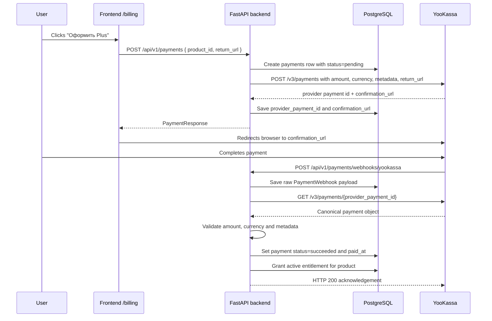

# Current payment confirmation flow

Status: current implementation audit
Last checked: 2026-08-31
Scope: YooKassa checkout, webhook confirmation, local payment state and entitlement activation.

This document describes how Astrotype currently decides that a client has paid. It is an implementation explainer, not a future-state wish list.

## Summary

Astrotype treats payment as confirmed only after the backend reconciles the YooKassa payment object server-to-server.

The browser return from YooKassa is not proof of payment. It is only a UX signal that the user came back from checkout.

A user is considered paid when the local backend has a succeeded payment with `paid_at` set, and, for product access, an active entitlement sourced from that payment.

Practical database criteria:

```sql
payments.status = 'succeeded'
payments.paid_at IS NOT NULL
```

Product-access criteria:

```sql
entitlements.user_id = <user id>
entitlements.product = <product>
entitlements.status = 'active'
entitlements.source_payment_id = payments.id
```

Account-tier note: the current implementation does not yet upgrade the user account from `free` to `plus`. The target contract for that next step is documented in `docs/architecture/account-tier-role-foundation.md`.

## Source files

| Concern                   | Current source                                                |
| ------------------------- | ------------------------------------------------------------- |
| Payment model             | `backend/app/modules/payments/models.py`                      |
| Webhook route             | `backend/app/modules/payments/router.py`                      |
| Payment orchestration     | `backend/app/modules/payments/service.py`                     |
| YooKassa API adapter      | `backend/app/modules/payments/providers/yookassa.py`          |
| Entitlement model         | `backend/app/modules/authorization/models.py`                 |
| Entitlement grant service | `backend/app/modules/authorization/service.py`                |
| Billing checkout button   | `frontend/src/components/billing/billing-checkout-button.tsx` |
| Payment client API        | `frontend/src/lib/api/payments.ts`                            |
| Billing page copy         | `frontend/src/app/(dashboard)/billing/page.tsx`               |
| Unit tests                | `backend/tests/unit/test_payments.py`                         |

## Current happy path



## Checkout creation

Frontend calls:

```http
POST /api/v1/payments
```

Current request shape:

```json
{
  "product_id": "self_full",
  "return_url": "https://<frontend>/billing?checkout=return"
}
```

The public create-payment contract is intentionally product-only. The client does not send `amount`, `currency`, `description`, or commercial metadata.

Backend behavior:

1. `PaymentsService.create_payment_for_product()` loads the product from `CatalogService`.
2. `PaymentsService.create_payment()` creates a local `payments` row with `status='pending'`.
3. `YooKassaProvider.create_payment()` creates the provider payment.
4. Backend stores YooKassa `provider_payment_id` and `confirmation_url` in the local payment record.

Current product metadata stored/sent for reconciliation:

```json
{
  "product_id": "self_full",
  "product": "self",
  "payment_id": "<local payments.id>",
  "user_id": "<local users.id>"
}
```

## Return URL is not payment proof

The return URL currently points back to `/billing?checkout=return`.

This must not activate access because:

- a user can open the return URL manually;
- redirect timing does not guarantee final PSP state;
- payment can still fail, be cancelled, or remain pending;
- frontend state can be forged.

Return from YooKassa should only trigger UI behavior such as "checking payment status" or a backend status refresh.

## Webhook endpoint

Current endpoint:

```http
POST /api/v1/payments/webhooks/yookassa
```

Current behavior:

1. Parse JSON body.
2. Save raw webhook body into `payment_webhooks`.
3. Parse YooKassa event object to get provider payment id.
4. Fetch the canonical YooKassa payment object server-to-server.
5. Validate that the canonical provider object matches the local payment.
6. Update local payment state.
7. Grant entitlement when payment is confirmed.

YooKassa notifications are acknowledged with HTTP 200 for valid processing paths. Authenticity is handled by reconciliation with the provider object rather than trusting browser state or the webhook body alone.

## Server-side reconciliation

Before activating access, backend calls YooKassa directly:

```http
GET https://api.yookassa.ru/v3/payments/{payment_id}
```

The current validation rule is implemented in `PaymentsService._event_matches_payment()`.

The provider object must match local immutable payment facts:

| Check               | Required match                                                            |
| ------------------- | ------------------------------------------------------------------------- |
| Provider payment id | YooKassa payment id equals `payments.provider_payment_id`                 |
| Currency            | YooKassa amount currency equals `payments.currency`                       |
| Amount              | YooKassa amount equals `payments.amount` within minor rounding tolerance  |
| Local payment id    | YooKassa metadata `payment_id` equals local `payments.id`                 |
| User id             | YooKassa metadata `user_id` equals local `payments.user_id`               |
| Product id          | YooKassa metadata `product_id` equals local payment metadata `product_id` |
| Product             | YooKassa metadata `product` equals local payment metadata `product`       |
| Succeeded payment   | if status is `succeeded`, YooKassa `paid` must be `true`                  |

If any validation fails, backend does not grant entitlement.

## Success condition

A YooKassa payment activates access only when both conditions are true:

```text
canonical_yookassa.status == "succeeded"
canonical_yookassa.paid == true
```

Then backend updates local state:

```text
payments.status = "succeeded"
payments.paid_at = now()
payments.payment_method_type = canonical_yookassa.payment_method.type
```

If status is `succeeded` but `paid` is not `true`, backend restores the previous payment status and records a payment payload mismatch.

## Entitlement activation

When a successful payment contains product metadata, backend grants product access through:

```python
EntitlementsService.grant_paid_product(
    user_id=payment.user_id,
    product=product,
    source_payment_id=payment.id,
    metadata={"product_id": product_id},
)
```

Current entitlement row fields:

| Field               | Meaning                                                  |
| ------------------- | -------------------------------------------------------- |
| `user_id`           | User receiving access                                    |
| `product`           | Product/access vertical, currently e.g. `self`           |
| `status`            | Access status, currently `active` when granted           |
| `source_payment_id` | Local payment that caused the grant                      |
| `starts_at`         | Grant activation time                                    |
| `expires_at`        | Optional expiry; currently `NULL` for non-expiring grant |
| `metadata_json`     | Additional product metadata, currently `product_id`      |

The grant operation is idempotent per `(source_payment_id, product)`: if the entitlement already exists, it is reactivated/updated instead of duplicated.

## Failure and edge cases

| Case                                           | Current behavior                                                                                   |
| ---------------------------------------------- | -------------------------------------------------------------------------------------------------- |
| Invalid JSON webhook                           | Route returns HTTP 400                                                                             |
| Provider API reconciliation fails              | Webhook remains unprocessed; `error_message='Provider reconciliation failed'`; exception is raised |
| Local payment not found                        | Webhook is marked processed with `Payment not found`; access is not granted                        |
| Amount/currency/metadata mismatch              | Webhook is marked processed with `Payment payload mismatch`; access is not granted                 |
| YooKassa status `succeeded` but `paid != true` | Payment status is not advanced; access is not granted                                              |
| YooKassa status `canceled`                     | Local payment status becomes `cancelled`; `cancelled_at` is set                                    |
| YooKassa status `waiting_for_capture`          | Local payment status becomes `processing`                                                          |

## Current frontend behavior

Current frontend implementation:

- `/billing` renders Plus copy and checkout CTA.
- `BillingCheckoutButton` calls `createPayment({ product_id: 'self_full', return_url })`.
- if backend returns `confirmation_url`, frontend redirects the browser to YooKassa.
- copy on `/billing` correctly says access is activated after payment confirmation, not after return to site.

Current frontend gap:

- after `/billing?checkout=return`, the page does not yet poll or refresh a backend access-state endpoint;
- there is no visible current-access state component on the billing page;
- frontend payment client currently exposes `createPayment()` only, not `getPayment()`/`listPayments()`/`getAccessState()` helpers.

## Current access-gating gap

Payment confirmation and entitlement creation are implemented.

What is not fully wired yet:

1. Account-tier role foundation: successful payment should set `users.account_tier = 'plus'`, but the new role must initially be status-only and must not restrict features. See `docs/architecture/account-tier-role-foundation.md`.

2. A current access-state endpoint such as:

```http
GET /api/v1/billing/access
```

3. A reusable backend policy check like:

```text
has_active_entitlement(user_id, product, access_mode)
```

4. Enforcement of that policy in paid report/product endpoints.

5. Frontend rendering that reads backend access state and switches between:

```text
free
checkout_pending
plus_active
payment_failed
plus_inactive
```

Until those pieces are added, the backend can confirm payment and create entitlements, but product screens still need explicit entitlement gates to use that state consistently.

## Verification

Current targeted unit test command:

```bash
./backend/.venv/bin/python -m pytest backend/tests/unit/test_payments.py -q
```

Latest local result on 2026-08-31:

```text
9 passed
```

Covered by tests:

- create-payment public contract accepts only `product_id` and `return_url`;
- checkout uses server catalog price/metadata;
- YooKassa webhook route acknowledges processing through the service;
- successful reconciled webhook grants product entitlement;
- metadata mismatch does not grant entitlement;
- `succeeded` without `paid=true` does not grant entitlement;
- provider reconciliation failure is recorded as unprocessed.

## Production checklist

Before relying on live payments, verify:

- `YOOKASSA_SHOP_ID` and `YOOKASSA_SECRET_KEY` are configured in production;
- YooKassa webhook URL is registered in the YooKassa merchant cabinet;
- the webhook URL is externally reachable over HTTPS;
- production logs show webhook delivery and provider reconciliation;
- a test payment creates a local `payments.status='succeeded'` row with `paid_at`;
- the same test payment creates an `entitlements.status='active'` row;
- paid product/report endpoints actually check entitlements before returning full content.

## Implementation status

| Area                               | Status          | Notes                                                                |
| ---------------------------------- | --------------- | -------------------------------------------------------------------- |
| Server-owned checkout creation     | Implemented     | `POST /api/v1/payments` accepts product id and return URL only       |
| YooKassa provider adapter          | Implemented     | Creates and fetches payments through YooKassa API                    |
| Webhook route                      | Implemented     | `/api/v1/payments/webhooks/yookassa`                                 |
| Server-side payment reconciliation | Implemented     | Fetches canonical provider object before activation                  |
| Payment success criteria           | Implemented     | Requires `status='succeeded'` and `paid=true`                        |
| Entitlement grant on success       | Implemented     | Grants active entitlement for product metadata                       |
| Unit coverage                      | Implemented     | `backend/tests/unit/test_payments.py` passes                         |
| Billing return UX polling          | Missing         | `/billing?checkout=return` does not yet refresh access state         |
| Account-tier Free/Plus role        | Missing         | Target contract: `docs/architecture/account-tier-role-foundation.md` |
| Access-state API                   | Missing         | SRS target exists, implementation not found in current audit         |
| Report/product entitlement gating  | Missing/unclear | Entitlement creation exists; broad use as backend gate was not found |
