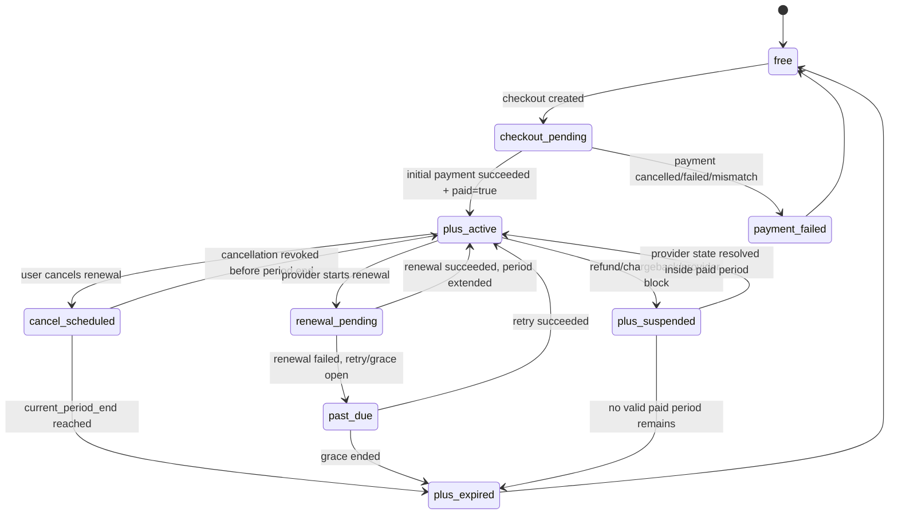

# Monthly Plus subscription contract

Status: target SaaS architecture, documentation only
Feature contract: `docs/features/E6-billing-subscriptions/FEATURE.md`
SRS: `docs/SRS/SRS-E6-billing-subscriptions.md`
Current-flow companion: `docs/architecture/current-payment-confirmation-flow.md`

This document defines the target SaaS billing model for Astrotype Plus as a monthly recurring account subscription. It intentionally supersedes the current non-expiring `self` entitlement model as the long-term commercial contract, but it does not claim that the code already implements this behavior.

## Product decision

Astrotype Plus must be a monthly SaaS subscription, not an implicit lifetime grant.

The paid state is account-level:

```text
user subscribes to plan astrotype_plus_monthly
-> provider confirms recurring payment / renewal
-> backend owns subscription_period_start and subscription_period_end
-> account_tier remains plus only while the subscription is active and unexpired
-> product entitlements are derived from the active subscription period
```

A one-time report purchase may exist later as a separate product, but it must not be called Plus and must not reuse subscription copy.

Plus controls report breadth, not access to the whole Astrotype product:

```text
basic natal report -> every authenticated account, including Free
all other reports -> active Plus only
```

The canonical matrix and endpoint rules are defined in `account-levels-report-access-policy.md`. Expiry must leave the basic report available and must not delete any generated report data.

## Definitions

| Term | Meaning |
| --- | --- |
| Plan | Server-owned commercial offer, e.g. `astrotype_plus_monthly` |
| Subscription | User's recurring contract with a provider-backed lifecycle and billing period |
| Period | Paid interval with `current_period_start` and `current_period_end` |
| Renewal | Provider-confirmed extension of `current_period_end` after successful recurring charge |
| Cancellation | User/provider action that stops future renewal; access remains until paid period end unless refunded/chargebacked |
| Past due | Renewal failed but retry/grace logic is still open |
| Expired | Paid period ended and no grace policy keeps access active |
| Entitlement | Product access grant derived from the active subscription period, not an eternal grant |

## Target plan

| Field | Target value |
| --- | --- |
| `plan_code` | `astrotype_plus_monthly` |
| Display name | `Astrotype Plus` |
| Billing interval | `month` |
| Interval count | `1` |
| Currency | `RUB` |
| Price source | Backend catalog only |
| Provider | YooKassa recurring payments/autopayment when available |
| Trial | Out of scope until a dedicated trial story defines it |
| Lifetime access | Out of scope for Plus |

## Source of truth

The backend database is the Astrotype source of truth for access decisions. YooKassa is the external payment/subscription evidence source.

Frontend must never decide that Plus is active from:

- return URL query params;
- local storage;
- button state;
- a visible payment success page;
- a previous `account_tier='plus'` value without checking subscription expiry.

Backend access checks must use:

```text
subscriptions.status in active-compatible states
AND subscriptions.current_period_start <= now
AND subscriptions.current_period_end > now
AND no blocking provider state/refund/chargeback exists
```

## Target state machine



## Access rule

A user has Plus access only when the computed subscription access state is active:

```text
plus_access_active =
  subscription.plan_code == 'astrotype_plus_monthly'
  AND subscription.status IN ('active', 'cancel_scheduled')
  AND subscription.current_period_start <= now()
  AND subscription.current_period_end > now()
```

`past_due` is a product policy decision. For MVP SaaS, keep it strict unless a grace-period story explicitly enables temporary access:

```text
past_due access = false by default
```

If a grace period is introduced, it must have an explicit `grace_until` timestamp and visible UI copy.

## Data model target

### `subscription_plans`

| Column | Type | Notes |
| --- | --- | --- |
| `id` | uuid | Primary key |
| `plan_code` | text unique | `astrotype_plus_monthly` |
| `display_name` | text | User-visible name |
| `amount` | numeric | Server-owned price |
| `currency` | text | `RUB` |
| `billing_interval` | text | `month` |
| `interval_count` | integer | `1` |
| `is_active` | boolean | Whether plan can be purchased |
| `features_json` | jsonb | Grants/features shown to UI |
| `created_at`, `updated_at` | timestamptz | Audit trail |

### `subscriptions`

| Column | Type | Notes |
| --- | --- | --- |
| `id` | uuid | Primary key |
| `user_id` | uuid | FK users.id |
| `plan_id` | uuid | FK subscription_plans.id |
| `provider` | text | `yookassa` |
| `provider_subscription_id` | text nullable | Provider recurring contract id if available |
| `status` | text | `incomplete`, `active`, `cancel_scheduled`, `past_due`, `suspended`, `expired`, `cancelled` |
| `current_period_start` | timestamptz | Inclusive active period start |
| `current_period_end` | timestamptz | Exclusive active period end |
| `cancel_at_period_end` | boolean | User/provider cancellation flag |
| `cancelled_at` | timestamptz nullable | When cancellation was requested/effective |
| `grace_until` | timestamptz nullable | Only if grace policy exists |
| `latest_payment_id` | uuid nullable | FK payments.id |
| `metadata_json` | jsonb | Safe provider/plan metadata |
| `created_at`, `updated_at` | timestamptz | Audit trail |

### `subscription_events`

Append-only audit table for provider and local lifecycle events.

| Column | Type | Notes |
| --- | --- | --- |
| `id` | uuid | Primary key |
| `subscription_id` | uuid | FK subscriptions.id |
| `provider_event_id` | text nullable | Idempotency key when provider supplies it |
| `event_type` | text | `initial_payment_succeeded`, `renewal_succeeded`, `renewal_failed`, `cancel_requested`, etc. |
| `effective_at` | timestamptz | When event changes subscription state |
| `payload_json` | jsonb | Sanitized payload, no card data |
| `created_at` | timestamptz | Audit trail |

### Relationship to `entitlements`

For SaaS Plus, entitlements should be period-bound and derived from the subscription:

```text
entitlements.expires_at = subscriptions.current_period_end
entitlements.metadata_json.subscription_id = subscriptions.id
```

No new Plus entitlement may be created with `expires_at = NULL` unless a separate non-subscription product explicitly owns it.

## API target

### Create monthly subscription checkout

```http
POST /api/v1/subscriptions/checkout
```

Request:

```json
{
  "plan_code": "astrotype_plus_monthly",
  "return_url": "https://astrotype.ru/billing?checkout=return"
}
```

Response:

```json
{
  "subscription_id": "uuid",
  "payment_id": "uuid",
  "status": "checkout_pending",
  "confirmation_url": "https://yookassa.ru/checkout/...",
  "current_period_start": null,
  "current_period_end": null
}
```

### Read subscription/account access

```http
GET /api/v1/billing/access
```

Target response:

```json
{
  "account_tier": "plus",
  "access_state": "plus_active",
  "subscription": {
    "id": "uuid",
    "plan_code": "astrotype_plus_monthly",
    "status": "active",
    "current_period_start": "2026-09-04T10:34:18Z",
    "current_period_end": "2026-10-04T10:34:18Z",
    "cancel_at_period_end": false,
    "next_billing_at": "2026-10-04T10:34:18Z",
    "grace_until": null
  },
  "entitlements": [
    {
      "product": "self",
      "status": "active",
      "starts_at": "2026-09-04T10:34:18Z",
      "expires_at": "2026-10-04T10:34:18Z"
    }
  ],
  "latest_payment": {
    "id": "uuid",
    "product_id": "astrotype_plus_monthly",
    "status": "succeeded",
    "created_at": "2026-09-04T10:33:00Z",
    "paid_at": "2026-09-04T10:34:18Z"
  }
}
```

### Cancel renewal

```http
POST /api/v1/subscriptions/{subscription_id}/cancel
```

Behavior:

- sets `cancel_at_period_end=true` locally only after provider cancellation succeeds or is reconciled;
- keeps Plus active until `current_period_end`;
- returns the updated subscription state.

### Resume renewal

```http
POST /api/v1/subscriptions/{subscription_id}/resume
```

Behavior:

- allowed only before `current_period_end`;
- clears `cancel_at_period_end` if provider recurring agreement can be resumed;
- returns updated subscription state.

## Frontend UX contract

Billing/account surfaces must show:

- Plus active/inactive state;
- current plan name;
- monthly price and billing interval;
- current paid period end;
- next billing date when renewal is active;
- cancellation scheduled state;
- grace/past-due state when applicable;
- retry CTA for failed renewal;
- manage/cancel/resume controls.

Required copy examples:

| State | Required copy direction |
| --- | --- |
| `plus_active` | `Plus активен до 4 октября 2026. Следующее списание — 4 октября 2026.` |
| `cancel_scheduled` | `Plus активен до 4 октября 2026. Автопродление отключено.` |
| `past_due` | `Не удалось продлить Plus. Обновите оплату, чтобы не потерять доступ.` |
| `plus_expired` | `Срок Plus истёк. Можно оформить подписку заново.` |
| `free` | `Plus не активен. Доступ открывается по месячной подписке.` |

UI must not show `Plus активен` without either an end date or explicit copy that the product is not a subscription. Since target Plus is a subscription, an active state without `current_period_end` is invalid.

## YooKassa recurring responsibilities

Target implementation must verify the exact YooKassa recurring-payment capabilities used by the merchant account before code work starts.

The docs contract requires:

1. Initial payment creates/saves a reusable payment method or provider recurring contract only when user consent is explicit.
2. Recurring charges are triggered by YooKassa autopayment or by backend scheduled renewal jobs, depending on provider capability.
3. Every renewal is reconciled server-to-server before period extension.
4. Failed renewal never silently extends `current_period_end`.
5. Refund/chargeback/suspension events can revoke or suspend access before natural period end when legally/provider-required.

## Migration from current implementation

Current production behavior may contain non-expiring Plus-like `self` entitlements with `expires_at=NULL`.

Migration must be explicit and audited. Options:

| Option | Behavior | Requirement |
| --- | --- | --- |
| Grandfather lifetime report | Existing users keep access to already purchased Self report only | Rename UI copy away from Plus subscription |
| Convert to first monthly period | Set `current_period_start` from paid_at and `current_period_end = paid_at + 1 month` | User-facing notice and support policy required |
| Manual admin mapping | Admin decides per account | Must record subscription_events reason |

Default safest migration:

- do not delete historical payments or entitlements;
- do not silently change a paid user from lifetime-like access to expiring access;
- introduce monthly SaaS for new purchases only until a product/legal decision is made.

## Non-goals

- No lifetime Plus under the subscription plan.
- No client-owned pricing.
- No access from frontend-only return state.
- No hidden indefinite `expires_at=NULL` entitlement for monthly Plus.
- No storing PAN/CVC/card data.
- No manual DB edits as the normal subscription management path.

## Verification contract

A monthly Plus implementation is not complete until tests and smoke prove:

- checkout creates a subscription shell and pending payment;
- initial successful payment sets `current_period_end = current_period_start + 1 month`;
- billing access returns `plus_active` only before `current_period_end`;
- access becomes inactive after expiry unless renewed;
- renewal success extends the period;
- renewal failure does not extend access;
- cancellation keeps access through paid period and prevents next renewal;
- billing UI renders the end date and next billing date;
- direct paid APIs deny access after expiry;
- no monthly Plus entitlement has `expires_at=NULL`.
