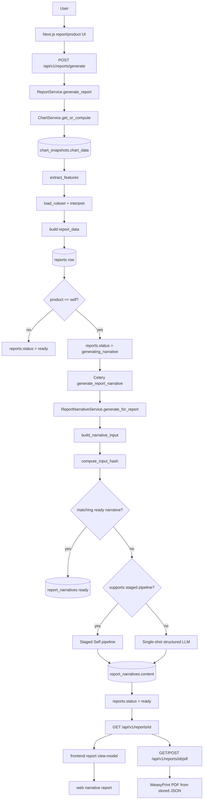
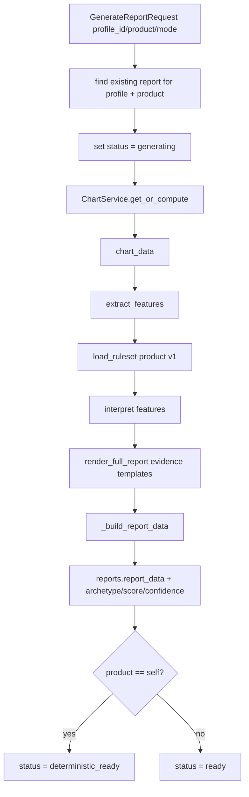
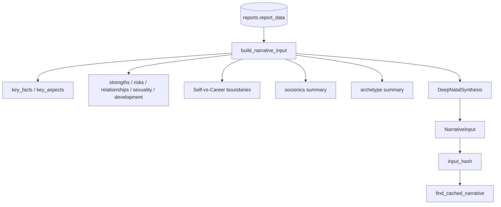
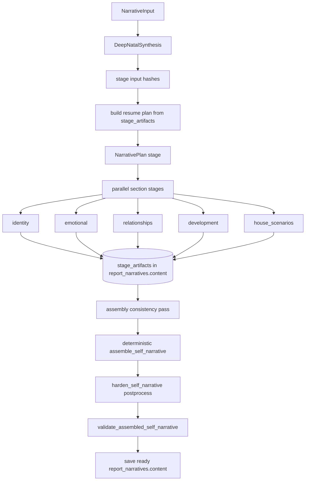
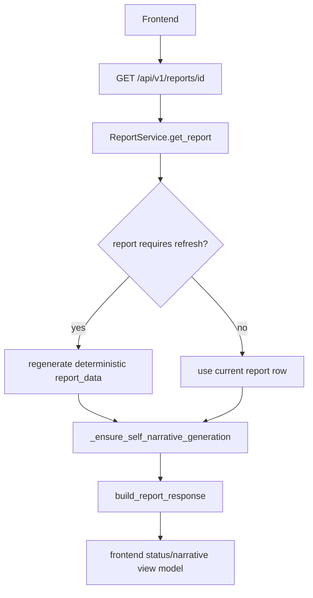
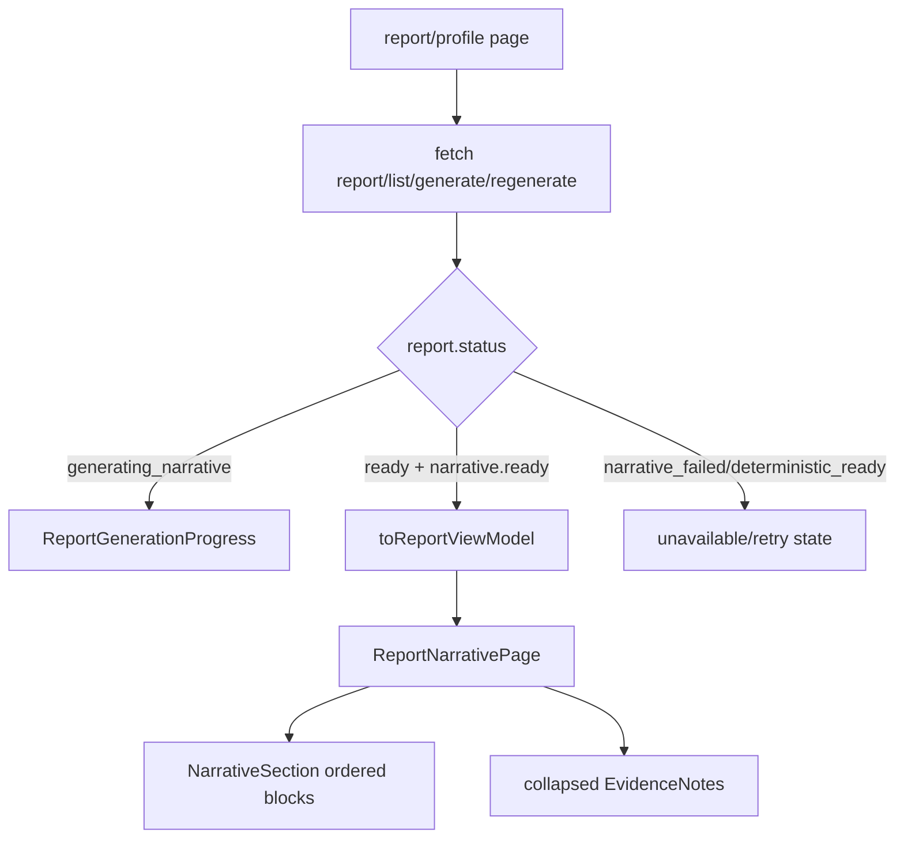
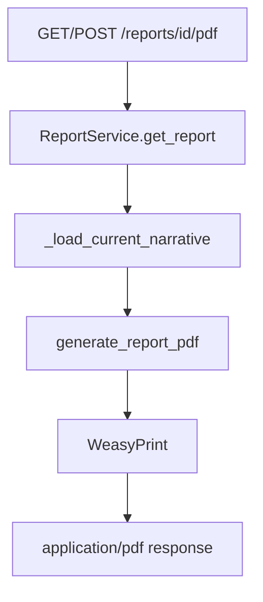

# Report generation data flow

Дата: 2026-07-04
Статус: current implementation map
Область: deterministic report generation, Self narrative generation, staged LLM pipeline, report API, web/PDF rendering.

## 1. Назначение документа

Этот документ описывает фактический data flow сборки отчёта в Astrotype: от пользовательского профиля и натальной карты до persisted `reports.report_data`, staged `report_narratives.content`, frontend view model and PDF.

Главный контракт:

- deterministic backend считает факты, признаки, правила, соционику, архетипы and evidence;
- LLM не рассчитывает карту и не добавляет новые факты;
- LLM получает curated `NarrativeInput` / staged prompts and writes prose only over deterministic data;
- итоговый Self report хранится как structured JSON в Postgres;
- web and PDF render the same persisted JSON;
- искусственное обрезание LLM/stage prose в assembler не является частью контракта.

## 2. End-to-end flow



## 3. Primary data stores

| Store               | Owner             | Purpose                                                 | Important fields                                                                                                                         |
| ------------------- | ----------------- | ------------------------------------------------------- | ---------------------------------------------------------------------------------------------------------------------------------------- |
| `users`             | auth/users        | User identity and verified state.                       | `id`, `email`, `is_verified`                                                                                                             |
| `person_profiles`   | profiles          | Birth/profile input.                                    | `birth_date`, `birth_time`, `birth_place`, `timezone`                                                                                    |
| `chart_snapshots`   | charts            | Cached deterministic chart result.                      | `chart_data`, `engine_version`, `socionics`, `function_strengths`                                                                        |
| `reports`           | reports           | Deterministic report row and lifecycle status.          | `product`, `status`, `report_data`, `archetype`, `score`, `confidence`, `version`                                                        |
| `report_versions`   | reports           | Archived deterministic report versions.                 | `report_id`, `version`, `report_data`                                                                                                    |
| `report_narratives` | report_narratives | LLM/staged narrative layer over a deterministic report. | `report_id`, `prompt_version`, `model_provider`, `model_name`, `status`, `input_hash`, `content`, `generation_attempts`, `error_message` |

`reports.report_data` and `report_narratives.content` are the two main JSON payloads. PDF is rendered on demand from these rows; local runtime does not require a separate stored PDF artifact.

## 4. Deterministic report flow

Entry point: `POST /api/v1/reports/generate`.

Source files:

- `backend/app/modules/reports/router.py`
- `backend/app/modules/reports/service.py`
- `backend/app/modules/charts/service.py`
- `backend/app/modules/rules/`

Flow:



The deterministic layer is the source of truth for:

- chart facts: planets, houses, aspects, elements, modalities;
- socionics and function strengths;
- rules/archetypes/scores/confidence;
- evidence trail and rendered deterministic claims;
- source chart freshness metadata.

LLM never receives raw user tables as an unrestricted blob. It receives curated narrative DTOs derived from `reports.report_data`.

## 5. Self narrative enqueue/status flow

Self reports have a second async layer.

After deterministic generation:

1. `reports.status` becomes `generating_narrative`.
2. `workers.tasks.reports.generate_report_narrative.delay(report_id=...)` is enqueued.
3. The API returns a report response with progress-friendly status.
4. Frontend polls `GET /api/v1/reports/{id}` until narrative is ready or unavailable.

If enqueue fails, backend downgrades the report to `deterministic_ready` and stores an explicit enqueue error. It must not leave the UI in an endless spinner.

## 6. NarrativeInput flow

Source files:

- `backend/app/modules/report_narratives/input_builder.py`
- `backend/app/modules/report_narratives/hash.py`
- `backend/app/modules/report_narratives/schemas.py`
- `backend/app/modules/report_narratives/deep_synthesis.py`

Flow:



`NarrativeInput` is intentionally curated. It should include enough evidence for a deep report, but it should not expose the LLM to unbounded raw report JSON or ask it to calculate anything.

Important DTO layers:

- profile summary;
- calculation quality;
- key facts and key aspects;
- socionics summary;
- archetype summary;
- dominants;
- inner mechanism;
- house scenarios;
- contradictions;
- failure modes;
- maturity levels;
- calibration questions;
- product boundaries;
- optional `deep_synthesis`.

## 7. Staged Self narrative flow

Current Self provider path uses staged generation when provider/settings support it.

Source files:

- `backend/app/modules/report_narratives/service.py`
- `backend/app/modules/report_narratives/staged_schemas.py`
- `backend/app/modules/report_narratives/prompts/`
- `backend/app/modules/report_narratives/stage_cache.py`
- `backend/app/modules/report_narratives/assembler.py`
- `backend/app/modules/report_narratives/postprocess.py`
- `backend/app/modules/report_narratives/validators.py`



Stage IDs:

| Stage             | Input                                   | Output schema                 | Purpose                                                             |
| ----------------- | --------------------------------------- | ----------------------------- | ------------------------------------------------------------------- |
| `plan`            | `DeepNatalSynthesis` + `NarrativeInput` | `NarrativePlan`               | Central thesis, tone, section hierarchy.                            |
| `identity`        | staged prompt + synthesis               | `IdentitySectionOutput`       | Main formula, identity, strengths.                                  |
| `emotional`       | staged prompt + synthesis               | `EmotionalSectionOutput`      | Emotions, communication, vulnerabilities.                           |
| `relationships`   | staged prompt + synthesis               | `RelationshipSectionOutput`   | Relationships and sexuality.                                        |
| `development`     | staged prompt + synthesis               | `DevelopmentSectionOutput`    | Development direction and practices.                                |
| `house_scenarios` | staged prompt + synthesis               | `HouseScenariosSectionOutput` | House-axis scenarios, need/shadow/mature expression.                |
| `assembly`        | all ready section outputs               | `AssemblyCheck`               | Consistency check; final text is still assembled deterministically. |

## 8. Stage artifact/cache/resume flow

Stage runtime data is currently JSON-backed inside `report_narratives.content`:

- `stage_progress` — status snapshot safe for API/UI;
- `stage_artifacts` — per-stage artifact with prompt version, model, input hash, attempts, status, error;
- `stage_resume` — what was reused/regenerated for the current run.

Cache/resume rules:

- ready stages with matching hashes can be reused;
- failed or stale stages can be regenerated without deleting the whole narrative;
- `POST /reports/{id}/narrative/regenerate` can force full or scoped regeneration;
- failed stage does not corrupt already-ready stage artifacts;
- final `reports.status=ready` requires assembled narrative validation to pass.

## 9. Deterministic assembly flow

Source file: `backend/app/modules/report_narratives/assembler.py`.

`assemble_self_narrative(...)` receives:

- `NarrativeInput`;
- `NarrativePlan`;
- ready section stage outputs;
- `AssemblyCheck`.

It outputs one `SelfNarrative` with ordered sections:

1. `main_formula`
2. `world_perception`
3. `emotions_and_communication`
4. `strengths`
5. `vulnerabilities`
6. `relationships`
7. `sexuality`
8. `development`

Assembly rules:

- preserve full useful stage prose;
- combine prose with deterministic evidence-backed layers: dominants, inner mechanism, house scenarios, contradictions, failure modes, maturity levels and section-specific claims;
- select only valid evidence IDs from `NarrativeInput`;
- do not reintroduce old body slicing such as `_bounded_body(... max_chars=...)`;
- do not copy raw technical enum labels as the primary user-facing prose.

The schema allows large section bodies (`NarrativeSection.body`, `HeroSection.body`, `EvidenceNote.claim`) so validation should not force micro-reports.

## 10. Postprocess and validation flow

Source files:

- `backend/app/modules/report_narratives/postprocess.py`
- `backend/app/modules/report_narratives/validators.py`

After assembly:

```text
SelfNarrative candidate
  → harden_self_narrative(...)
  → validate_assembled_self_narrative(...)
  → ready or narrative_failed
```

Postprocess/hardening is allowed to normalize safe prose problems without losing content, for example:

- remove or replace forbidden/fatalistic/diagnostic language;
- normalize too-informal second person markers (`ты`, `тебе`, `твой`, `свой`) to the project register;
- restore required section order or missing safe structure when possible;
- keep long text intact instead of truncating it.

Validation checks include:

- required sections and order;
- unknown evidence refs;
- Self-vs-Career boundary;
- forbidden medical/fatalistic/graphic language;
- generic horoscope markers;
- technical pipeline leakage;
- duplicate/contradictory prose;
- assembled quality gates.

## 11. Persistence and statuses

### Report status

| Status                 | Meaning                                                            | UI behavior                                                                                              |
| ---------------------- | ------------------------------------------------------------------ | -------------------------------------------------------------------------------------------------------- |
| `generating`           | Deterministic report calculation is running.                       | Loading/progress.                                                                                        |
| `deterministic_ready`  | Deterministic JSON exists; Self narrative not ready.               | For Self, do not show fake completed narrative. Enqueue/retry narrative or show unavailable/retry state. |
| `generating_narrative` | Narrative worker is running or queued.                             | Poll `GET /reports/{id}` and show progress.                                                              |
| `ready`                | Deterministic report and, for Self, ready narrative are available. | Render narrative-first report.                                                                           |
| `narrative_failed`     | Deterministic report exists but full narrative failed.             | Show unavailable/retry state for Self, not a fake safe fallback as final report.                         |
| `failed`               | Deterministic report generation failed.                            | Error state.                                                                                             |

### Narrative status

| Status       | Meaning                                                                         |
| ------------ | ------------------------------------------------------------------------------- |
| `generating` | LLM/staged generation in progress.                                              |
| `ready`      | `content` contains validated `SelfNarrative` JSON plus optional stage metadata. |
| `failed`     | Generation/validation failed; `error_message` describes failure.                |

## 12. API read flow



Read-side rules:

- `GET /reports/{id}` must refresh stale deterministic report data if chart snapshot/source version changed;
- for Self, narrative lookup should match current deterministic `input_hash` and prompt version;
- legacy fallback rows that pretend to be ready must be filtered out;
- response includes narrative status/payload only when current narrative is valid for the current report.

## 13. Frontend rendering flow

Source files:

- `frontend/src/lib/api/report.ts`
- `frontend/src/lib/report/view-model.ts`
- `frontend/src/components/report/report-generation-progress.tsx`
- `frontend/src/components/report/report-narrative-page.tsx`
- `frontend/src/components/report/narrative-section.tsx`
- `frontend/src/components/report/evidence-notes.tsx`

Flow:



Frontend should not build a fake Self report from `profile + chartSnapshot` when there is no real `reports` row. A profile and chart snapshot are prerequisites, not a finished report.

## 14. PDF flow

Source files:

- `backend/app/modules/reports/router.py`
- `backend/app/modules/reports/pdf.py`
- `backend/app/modules/reports/templates/report.html`

Flow:



PDF rules:

- PDF renders on demand from `reports.report_data` plus current `report_narratives.content`;
- PDF must not call LLM;
- PDF must not render stale narrative for a refreshed deterministic report;
- Web and PDF should share the same narrative JSON content.

## 15. Retry/regenerate flow

Entry point: `POST /api/v1/reports/{report_id}/narrative/regenerate`.

Purpose:

- regenerate narrative without recomputing deterministic report data;
- optionally force full staged regeneration;
- optionally retry failed/stale stages only;
- keep deterministic report available while narrative is regenerating.

Flow:

```text
POST narrative/regenerate
  → validate report belongs to user and product=self
  → enqueue generate_report_narrative(report_id, force=True, scope, stage_id)
  → set reports.status=generating_narrative
  → worker reuses/reset narrative row for cache key
  → staged resume plan decides ready/reused vs stale/regenerated stages
  → final assembly/validation
  → ready or narrative_failed
```

## 16. Failure and fallback policy

The product rule for Self is strict:

- do not show deterministic fallback or safe reserve summary as the normal completed Self report;
- if full narrative is not available, show progress/unavailable/retry;
- deterministic report data can still exist and remain useful internally, but it should not masquerade as a finished narrative answer;
- provider failures are operational failures of the narrative layer, not permission to invent missing facts or silently shorten the report.

Common failure classes:

| Failure                         | Layer                 | Expected behavior                                              |
| ------------------------------- | --------------------- | -------------------------------------------------------------- |
| deterministic calculation error | reports service       | `reports.status=failed`; show error.                           |
| narrative enqueue failure       | report router         | `deterministic_ready`; explicit error; retry possible.         |
| provider timeout/unavailable    | narrative service     | `narrative_failed`; retry possible.                            |
| invalid LLM JSON                | provider/stage parser | retry stage; if exhausted, `narrative_failed`.                 |
| assembled validation failure    | assembler/validator   | `narrative_failed` with stage metadata.                        |
| stale report data               | reports read path     | recompute deterministic report and require matching narrative. |

## 17. Invariants and guardrails

Hard invariants:

1. Deterministic engine is source of truth.
2. LLM output is JSON validated, not free Markdown.
3. LLM receives curated input, not unbounded raw report data.
4. `reports.report_data` and `report_narratives.content` are persisted separately.
5. Web and PDF render the same saved narrative JSON.
6. Self narrative must be full or unavailable/retry; no fake completed fallback.
7. Assembler must preserve full useful stage prose and must not clamp sections back into micro-reports.
8. Evidence refs in narrative must point to known facts/aspects/claims from `NarrativeInput`.
9. Prompt/model/input hash determine cache identity; current report freshness must still be checked before reading old rows.
10. Long-lived backend/worker services must be rebuilt/restarted after backend narrative code changes before live smoke claims.

## 18. Minimal verification map

For code changes in this flow, use the nearest relevant checks:

```bash
# Backend narrative/report slice
docker compose exec -T backend sh -lc '
  cd /app &&
  python -m py_compile app/modules/report_narratives app/modules/reports &&
  python -m ruff check app/modules/report_narratives app/modules/reports tests/unit/test_report_narratives tests/unit/test_reports &&
  python -m ruff format --check app/modules/report_narratives app/modules/reports tests/unit/test_report_narratives tests/unit/test_reports &&
  python -m mypy app/modules/report_narratives app/modules/reports &&
  python -m pytest tests/unit/test_report_narratives tests/unit/test_reports -q
'
```

For live Self narrative changes:

```bash
docker compose build backend worker
docker compose up -d backend worker
curl -fsS http://localhost:8000/api/v1/health
# then run a real generate/regenerate smoke and verify:
# reports.status=ready, narrative.status=ready, used_fallback=False, PDF HTTP 200
```

For docs-only changes to this document:

```bash
cd frontend
npx prettier --check ../docs/architecture/report-generation-data-flow.md ../README.md ../PROJECT_INDEX.md
cd ..
git diff --check -- docs/architecture/report-generation-data-flow.md README.md PROJECT_INDEX.md
```

## 19. Related documents

- `docs/design/llm-report-narrative-architecture.md`
- `docs/SRS/SRS-E11-llm-report-narrative.md`
- `docs/features/E11-llm-report-narrative/WORKFLOW.md`
- `docs/features/E11-llm-report-narrative/API.md`
- `docs/SRS/SRS-E14-staged-narrative-pipeline.md`
- `docs/features/E14-staged-narrative-pipeline/WORKFLOW.md`
- `docs/features/E14-staged-narrative-pipeline/API.md`
- `docs/SRS/SRS-E15-self-report-human-storytelling.md`
- `PROJECT_INDEX.md`
