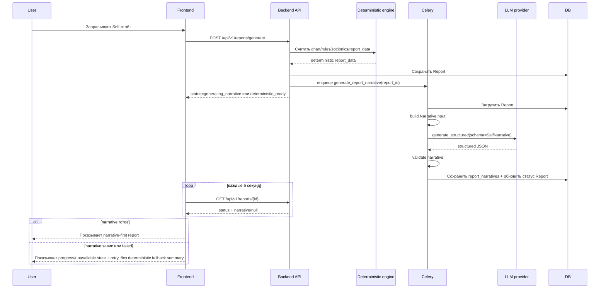

# E11 Workflow: как это реально работает

Этот документ объясняет E11 не как набор story-задач, а как понятный рабочий сценарий:

1. откуда вообще запускается фича;
2. какой именно вход получает LLM;
3. что видит пользователь в UI;
4. почему больше нельзя показывать safe fallback summary как нормальный ответ;
5. что делает retry/regenerate.

## Короткий ответ

E11 — это не отдельный экран и не отдельная кнопка «сгенерировать LLM-историю сама по себе».

Это narrative-слой поверх уже существующего Self-отчёта.

То есть workflow такой:

- пользователь запрашивает обычный Self-отчёт;
- backend сначала считает deterministic report;
- потом в фоне запускает LLM только для текста;
- frontend ждёт narrative-слой по статусам;
- если narrative готов, показывает narrative-first report;
- если narrative задержался или упал, показывает progress/unavailable state и retry, но не safe fallback summary.

## Для какого сценария вообще нужна E11

Проблема E11 не в расчётах, а в подаче результата.

Без E11 система уже умеет:

- считать карту;
- строить типологию;
- собирать claims и evidence;
- выдавать технический отчёт.

Но такой отчёт:

- трудно читать как цельную историю;
- тяжело сделать мягким и живым только шаблонами;
- неудобно подавать как premium narrative-first experience.

Поэтому E11 нужна для одного основного use case:

> Пользователь заказывает Self-отчёт и получает сначала проверяемую deterministic-базу, а затем поверх неё — мягкий, структурированный, человекочитаемый narrative.

## Что является входом в feature

Есть два разных смысла слова «вход», и их важно не смешивать.

### 1. Вход в систему со стороны пользователя

Пользовательский вход в E11 — это не raw birth data напрямую в LLM.

Пользовательский сценарий начинается так:

1. У пользователя уже есть профиль.
2. Пользователь открывает экран отчёта.
3. Пользователь запускает генерацию Self-отчёта.
4. Frontend вызывает:

```http
POST /api/v1/reports/generate
```

Пример минимального запроса:

```json
{
  "profile_id": "<profile_uuid>",
  "product": "self",
  "mode": "full"
}
```

Это и есть реальная точка входа в feature.

### 2. Вход в LLM со стороны backend

LLM не получает profile как есть, не получает сырую дату рождения и не получает весь `report_data` без фильтрации.

Перед LLM backend собирает специальный `NarrativeInput`.

В него входят только уже рассчитанные и разрешённые данные:

- `product`
- `language`
- `profile`
- `calculation_quality`
- `key_facts`
- `key_aspects`
- `socionics`
- `archetype`
- `strengths`
- `risks`
- `relationship_patterns`
- `sexuality_patterns`
- `development_recommendations`
- `product_boundaries`

То есть LLM получает не задачу «проанализируй человека по дате рождения», а задачу:

> «Вот уже рассчитанные факты и ограничения. Преврати их в narrative JSON, ничего нового не выдумывая».

## Что НЕ является входом в LLM

LLM не должна получать как единственную основу:

- raw birth date / time / place без рассчитанных фактов;
- весь `report_data` целиком без отбора;
- прямой вызов из frontend;
- свободный пользовательский prompt;
- задачу на повторный расчёт астрологии, аспектов, домов, соционики или архетипов.

Иными словами, LLM не аналитик и не движок расчёта. Она только narrative renderer.

## Основной end-to-end workflow



## Пошагово: что происходит после generate

### Шаг 1. Считается deterministic report

Сначала система делает обычную проверяемую работу:

- chart snapshot;
- features;
- rules interpretation;
- socionics;
- archetypes;
- evidence;
- confidence;
- report_data.

На этом этапе уже существует полезный результат, который можно показать даже без LLM.

### Шаг 2. Report сохраняется до LLM

После deterministic-части report уже сохранён.

Это критично, потому что:

- LLM может отвечать медленно;
- LLM может вернуть невалидный ответ;
- provider может упасть;
- UI не должен терять базовый отчёт.

### Шаг 3. Статус становится `generating_narrative`

Если narrative-слой пошёл в работу, report получает статус `generating_narrative`.

В этот момент HTTP-запрос не ждёт окончания LLM-вызова.

### Шаг 4. Celery собирает `NarrativeInput`

Фоновая задача:

- загружает saved report;
- собирает curated `NarrativeInput`;
- считает `input_hash`;
- может найти cache hit для идентичного входа;
- иначе идёт в provider.

## Что именно делает LLM

LLM должна:

- связать уже рассчитанные факты в цельный текст;
- написать hero-блок и секции отчёта;
- соблюдать тон и границы продукта;
- вернуть строго structured JSON.

LLM не должна:

- придумывать новые положения планет;
- добавлять несуществующие аспекты;
- пересчитывать соционику;
- делать career deep dive внутри Self;
- писать диагнозы, фатализм, мистику или графичную сексуальность.

## Какой output считается успешным

Успешный результат E11 — это не просто кусок текста.

Успешный результат — это сохранённый narrative-объект, который:

- прошёл schema validation;
- содержит обязательные секции;
- ссылается только на известные evidence refs;
- не нарушает product boundaries;
- сохранён отдельно в `report_narratives`;
- может быть повторно использован и для UI, и для PDF.

## Что видит frontend в каждом состоянии

### 1. `generating_narrative`

Frontend показывает progress screen, а не сырые технические детали на первом экране.

Сейчас поведение такое:

- polling `GET /api/v1/reports/{id}` каждые 5 секунд;
- таймаут интерфейса через 90 секунд;
- кнопка `Обновить`;
- после таймаута кнопка `Повторить генерацию`.

Это сценарий: «полный текст ещё собирается; никакой safe fallback summary пока не показываем».

### 2. `ready`

Если narrative готов, frontend показывает narrative-first Self report:

- hero;
- narrative sections;
- relationship / sexuality / development блоки;
- career CTA;
- technical details ниже, а не в первом экране.

Это главный happy path для E11.

### 3. `narrative_failed`

Если LLM-слой не удался, frontend не зависает.

Он показывает unavailable state:

- полного narrative нет;
- выводится warning;
- есть кнопка `Повторить генерацию`.

Важно: failure narrative-слоя не отменяет сам deterministic расчёт, но и не должен маскироваться под готовый safe summary.

### 4. `deterministic_ready`

Это промежуточный/degraded backend-статус:

- deterministic-часть готова;
- narrative ещё не вышел в финальное `ready`.

Для Self это не означает «покажи техническую версию как нормальный ответ». Корректное поведение — продолжать progress UI или дать retry/unavailable state, пока полного narrative нет.

## Retry / regenerate: когда и зачем

Если текстовый narrative:

- завис слишком долго;
- не прошёл validation;
- упал по provider/network ошибке;
- сохранился как `narrative_failed`;

frontend вызывает:

```http
POST /api/v1/reports/{report_id}/narrative/regenerate
```

Смысл этого endpoint:

- перегенерировать только narrative layer;
- не пересчитывать chart/rules/socionics;
- не терять уже сохранённый deterministic report.

То есть regenerate — это не «построить весь отчёт заново», а «попробовать ещё раз сделать только текстовую оболочку».

## Поддерживаемый продуктовый сценарий в MVP

На текущем этапе основной сценарий E11 — это только `self`.

Что это значит practically:

- prompt contract полноценно описан для Self;
- section ids и validators заточены под Self;
- frontend narrative-first rendering ориентирован на Self-report;
- Career и Love предусмотрены в контрактах расширения, но не являются полноценным E11-MVP flow.

Поэтому правильный ответ на вопрос «для какого user flow построена фича?» такой:

> Для Self-report flow, где narrative нужен как мягкая пользовательская оболочка над deterministic интерпретацией.

## Где проходит граница между Self и Career

Это важная часть сценария использования.

Self-report через E11 может:

- кратко касаться проявления личности в работе;
- завершаться CTA на отдельный Career-report.

Self-report через E11 не должен:

- выдавать список профессий;
- строить стратегию дохода;
- делать management profile;
- заменять отдельный Career продукт.

Иначе пользовательский сценарий ломается: Self перестаёт быть Self и начинает смешиваться с другим продуктом.

## Почему в системе больше нельзя показывать fallback summary как основной результат

Потому что для Self narrative теперь действует более строгий продуктовый контракт:

- пользователь либо получает полный narrative-ответ;
- либо явно видит, что полный текст пока недоступен;
- но не получает safe/technical fallback summary, замаскированный под готовый итог.

Причина простая: fallback summary размывает разницу между "полный narrative готов" и "LLM-слой фактически не сработал". В результате пользователь видит суррогат как будто это финальный ответ. Для post-login/profile-entry experience это признано неверным поведением.

Deterministic engine по-прежнему важен как источник истины и как основа для повторной генерации, PDF и отладки. Но на основном Self UI он больше не должен выступать как подмена narrative-ответа.

## Как это использовать при разработке и ревью

Если кто-то спрашивает «workflow уже реализован?», проверять нужно именно это:

1. Можно ли войти в flow через `POST /api/v1/reports/generate` для `product=self`?
2. Сохраняется ли deterministic report до LLM?
3. Собирается ли отдельный `NarrativeInput`, а не raw birth data prompt?
4. Идёт ли LLM через async task, а не внутри HTTP?
5. Есть ли явные статусы `generating_narrative` / `ready` / `narrative_failed`?
6. Polling-ит ли frontend статус?
7. Есть ли timeout и unavailable/retry state без показа safe fallback summary?
8. Повторяет ли `regenerate` только narrative layer?
9. Строится ли PDF из сохранённого narrative JSON, а не из второго LLM-вызова?

Если все 9 пунктов выполняются, workflow реализован корректно.

## TL;DR

E11 — это workflow не «LLM анализирует человека», а workflow:

- Self-report запускается обычным generate endpoint;
- deterministic engine считает всё важное первым;
- backend строит curated `NarrativeInput`;
- LLM пишет только narrative JSON;
- frontend ждёт статус, потом показывает narrative-first UI;
- при задержке или ошибке показывает progress/unavailable state без safe fallback summary;
- regenerate повторяет только narrative layer.
