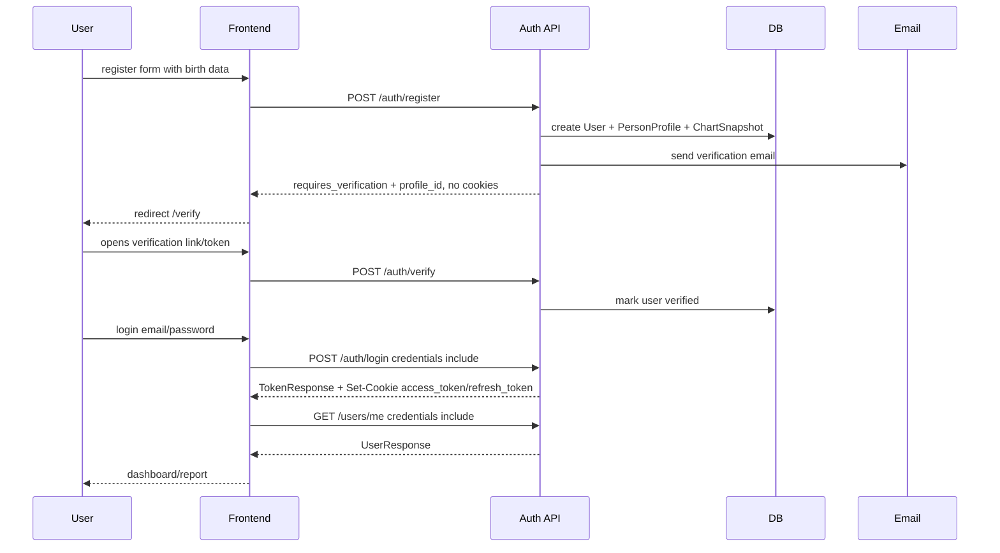
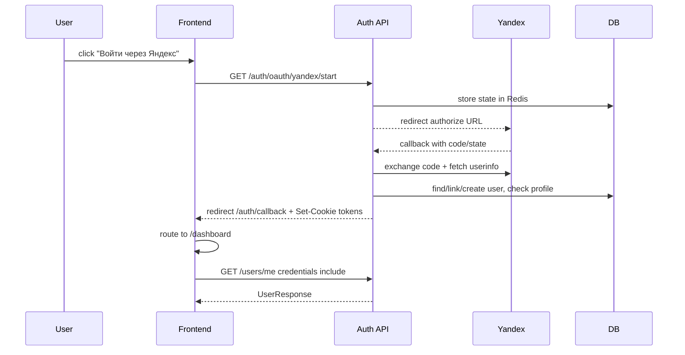
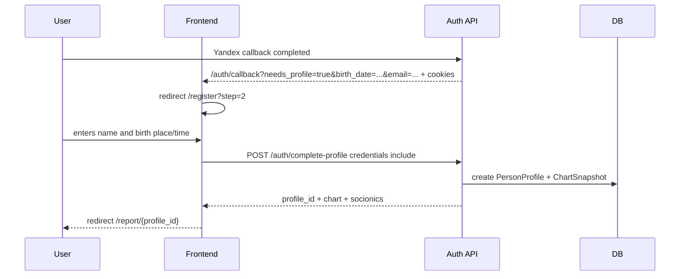

# E2 Current Auth Flow

> Статус: актуальное описание текущей реализации
> Обновлено: 2026-06-27
> Scope: browser auth, email/password, Yandex OAuth, refresh/logout, session bootstrap, verification, password reset, account linking

## 1. Коротко

Текущая browser-авторизация Astrotype — cookie-first:

- backend ставит HttpOnly cookies `access_token` и `refresh_token`;
- frontend отправляет protected requests с `credentials: "include"`;
- frontend auth-store хранит только `user` и состояние сессии, не JWT;
- `Authorization: Bearer` сохранён как compatibility/API-client fallback;
- legacy cookies `astrotype_token` / `astrotype_refresh_token` всё ещё принимаются backend как migration fallback, но browser frontend больше не должен их писать или читать.

При этом текущий `POST /auth/login` и `POST /auth/refresh` всё ещё возвращают JSON body формата `TokenResponse` (`access_token`, `refresh_token`, `token_type`) для совместимости. Browser frontend не использует эти поля: источник сессии — HttpOnly cookies + `/users/me`.

## 2. Основные файлы реализации

### Backend

| Файл                                         | Роль                                                                                                 |
| -------------------------------------------- | ---------------------------------------------------------------------------------------------------- |
| `backend/app/modules/auth/router.py`         | Endpoints: register, verify, login, refresh, logout, password reset, Yandex OAuth, linked providers. |
| `backend/app/modules/auth/service.py`        | Business logic: registration, login, refresh rotation, logout blacklist, complete OAuth profile.     |
| `backend/app/modules/auth/schemas.py`        | Request/response schemas.                                                                            |
| `backend/app/modules/auth/oauth/service.py`  | OAuth state, Yandex callback, find/create/link user.                                                 |
| `backend/app/modules/auth/oauth/yandex.py`   | Yandex authorize/token/userinfo calls.                                                               |
| `backend/app/modules/auth/verification.py`   | Email verification token lifecycle.                                                                  |
| `backend/app/modules/auth/password_reset.py` | Password reset token lifecycle.                                                                      |
| `backend/app/dependencies.py`                | `get_current_user`: token candidate validation + user/is_verified gate.                              |
| `backend/app/modules/users/router.py`        | `/users/me` session bootstrap and name update.                                                       |

### Frontend

| Файл                                             | Роль                                                                                                 |
| ------------------------------------------------ | ---------------------------------------------------------------------------------------------------- |
| `frontend/src/lib/api-client.ts`                 | Default browser API client: `credentials: "include"`, no Bearer injection, one refresh retry on 401. |
| `frontend/src/lib/auth-session.ts`               | Session bootstrap via `/users/me`, cookie refresh, Zustand state update.                             |
| `frontend/src/stores/auth-store.ts`              | Stores `user`, `isAuthenticated`, `isLoadingSession`; no JWT token state.                            |
| `frontend/src/app/(auth)/login/page.tsx`         | Email/password login; calls backend login then `bootstrapSession()`.                                 |
| `frontend/src/app/(auth)/register/page.tsx`      | Regular registration and OAuth complete-profile flow.                                                |
| `frontend/src/app/(auth)/auth/callback/page.tsx` | Handles post-Yandex frontend redirect; does not parse tokens.                                        |
| `frontend/src/components/layout/sidebar.tsx`     | Logout action: POST `/auth/logout`, clear UI auth state.                                             |

## 3. Cookie and token model

### Current browser cookies

| Cookie          | Set by                                          | HttpOnly |          Secure | SameSite | Purpose                                     |
| --------------- | ----------------------------------------------- | -------: | --------------: | -------- | ------------------------------------------- |
| `access_token`  | `/auth/login`, `/auth/refresh`, Yandex callback |      yes | production only | `lax`    | Short-lived access JWT.                     |
| `refresh_token` | `/auth/login`, `/auth/refresh`, Yandex callback |      yes | production only | `lax`    | Long-lived refresh JWT, rotated on refresh. |

`secure` is controlled by `settings.APP_ENV == "production"`.

### Legacy compatibility cookies

| Cookie                    | Current status                                                                    |
| ------------------------- | --------------------------------------------------------------------------------- |
| `astrotype_token`         | Backend still accepts it as access-token fallback. Frontend should not write it.  |
| `astrotype_refresh_token` | Backend still accepts it as refresh-token fallback. Frontend should not write it. |

### Authorization header

`Authorization: Bearer <token>` is still supported for external clients/tests/backward compatibility. Browser code must not attach it by default.

## 4. Protected route authentication

All protected endpoints depend on `get_current_user`.

Current token resolution order:

1. `Authorization: Bearer <token>` header;
2. `access_token` cookie;
3. `astrotype_token` cookie;
4. if no valid access candidate exists, try `refresh_token` or `astrotype_refresh_token` cookie as a fallback identity token.

For each token candidate:

- decode JWT;
- reject expired/invalid tokens;
- reject blacklisted `jti`;
- read `sub` as `User.id`;
- load user from DB;
- require `is_active=true`;
- require `is_verified=true`.

If the user is unverified, protected endpoints return `403 Email not verified` even if the JWT itself is valid.

Important behavior: a stale Bearer token must not shadow a valid cookie session. `get_current_user` tries all candidates before failing.

## 5. Regular registration flow

Endpoint:

```text
POST /api/v1/auth/register
```

Frontend route:

```text
/register
```

Request includes:

- `name`;
- `email`;
- `password`;
- `birth_date`;
- `birth_time` or default/no-time mode;
- `birth_time_accuracy`;
- `birth_place`;
- `latitude`;
- `longitude`;
- `timezone`.

Backend behavior:

1. Check duplicate email.
2. Validate password length `>= 8`.
3. Create `User` with hashed password and `is_verified=false` by default.
4. Create `PersonProfile` from birth data.
5. Compute natal chart and socionics immediately.
6. Persist `ChartSnapshot`.
7. Create email verification token.
8. Send verification email.
9. Return metadata only.

Current response shape:

```json
{
  "user_id": "uuid",
  "email": "user@example.com",
  "birth_date": "1990-01-01",
  "profile_id": "uuid",
  "requires_verification": true,
  "message": "Проверьте email и подтвердите аккаунт, чтобы войти и открыть отчёт."
}
```

No access/refresh cookies are set by regular registration. Frontend redirects to `/verify`.

## 6. Email verification flow

Endpoint:

```text
POST /api/v1/auth/verify
```

Request:

```json
{ "token": "verification-token" }
```

Backend verifies token and marks user as verified. After this, user can login normally.

Resend endpoint:

```text
POST /api/v1/auth/resend-verification
```

Request:

```json
{ "email": "user@example.com" }
```

Anti-enumeration behavior: response is always success-like:

```json
{
  "message": "If an account with that email exists, a verification link has been sent."
}
```

If the user exists and is not verified, backend creates/sends a new verification token.

## 7. Email/password login flow

Endpoint:

```text
POST /api/v1/auth/login
```

Frontend route:

```text
/login
```

Frontend request:

```ts
fetch("/api/v1/auth/login", {
  method: "POST",
  headers: { "Content-Type": "application/json" },
  body: JSON.stringify({ email, password }),
  credentials: "include",
});
```

Backend behavior:

1. Applies Redis rate limit keyed by login email.
2. Validates email/password.
3. Requires `is_active=true`.
4. Requires `is_verified=true`.
5. Creates access and refresh JWTs with `jti`.
6. Resets rate limit on success.
7. Returns `TokenResponse` body for compatibility.
8. Sets HttpOnly `access_token` and `refresh_token` cookies.

Current response body:

```json
{
  "access_token": "jwt",
  "refresh_token": "jwt",
  "token_type": "bearer"
}
```

Browser frontend ignores this body for session state. After successful login it calls `bootstrapSession()`.

Common errors:

| Status | Meaning                                                                                                                      |
| -----: | ---------------------------------------------------------------------------------------------------------------------------- |
|    401 | Invalid credentials, inactive account, or service-level auth error.                                                          |
|    403 | Protected endpoints return this for unverified users; login service raises authorization error text `Email not verified...`. |
|    429 | Too many login attempts.                                                                                                     |

Frontend behavior for unverified email: login page detects “not verified” in the error text and shows “Отправить письмо повторно”.

## 8. Session bootstrap flow

Main frontend helper:

```text
frontend/src/lib/auth-session.ts
```

Algorithm:

1. Set `isLoadingSession=true`.
2. `GET /api/v1/users/me` with `credentials: "include"`.
3. If 200: store `user`, set `isAuthenticated=true`.
4. If not 200: `POST /api/v1/auth/refresh` with empty JSON body and cookies.
5. If refresh succeeds: repeat `/users/me`.
6. If still not authenticated: clear UI auth state.
7. Set `isLoadingSession=false`.

`auth-store` persists only `user` under key `astrotype-auth`; it does not persist JWT.

## 9. Protected browser API flow

Main client:

```text
frontend/src/lib/api-client.ts
```

Every request uses:

```ts
credentials: "include";
```

The browser API client does not add `Authorization` by default.

On `401` from a non-auth endpoint:

1. call `POST /api/v1/auth/refresh` once;
2. if refresh succeeds, retry the original request once;
3. if refresh fails, return the original failed response to caller.

Auth endpoints are excluded from auto-refresh to avoid loops.

## 10. Refresh flow

Endpoint:

```text
POST /api/v1/auth/refresh
```

Current token lookup:

1. request body `refresh_token`, if present;
2. cookie `refresh_token`;
3. cookie `astrotype_refresh_token`.

Browser sends an empty JSON body:

```json
{}
```

Backend behavior:

1. Decode refresh JWT.
2. Reject invalid/expired token.
3. Reject blacklisted refresh `jti`.
4. Load user.
5. Require active and verified user.
6. Blacklist old refresh token `jti`.
7. Create new access and refresh JWTs.
8. Return `TokenResponse` body.
9. Set new HttpOnly cookies.

Current response body remains compatibility-shaped:

```json
{
  "access_token": "new-access-jwt",
  "refresh_token": "new-refresh-jwt",
  "token_type": "bearer"
}
```

## 11. Logout flow

Endpoint:

```text
POST /api/v1/auth/logout
```

Frontend calls:

```ts
fetch("/api/v1/auth/logout", {
  method: "POST",
  credentials: "include",
});
```

Backend dependencies require a current authenticated user before logout executes.

Backend token lookup:

- access token from `Authorization`, `access_token`, or `astrotype_token`;
- refresh token from request parameter, `refresh_token`, or `astrotype_refresh_token`.

Backend behavior:

1. Decode access token; if valid and has `jti`, blacklist it.
2. Decode refresh token if present; if valid and has `jti`, blacklist it.
3. Delete cookies:
   - `access_token`;
   - `refresh_token`;
   - `astrotype_token`;
   - `astrotype_refresh_token`.
4. Return success message.

Frontend behavior:

1. Calls backend logout.
2. Even if request fails, clears local auth UI state.
3. Redirects to `/login`.

## 12. Yandex OAuth flow

Start endpoint:

```text
GET /api/v1/auth/oauth/yandex/start
```

Frontend login button sets:

```ts
window.location.href = "/api/v1/auth/oauth/yandex/start";
```

Backend start behavior:

1. Generate random OAuth `state`.
2. Store `oauth:state:{state}` in Redis for 10 minutes.
3. Redirect to Yandex authorize URL.

Current Yandex authorize params:

```text
response_type=code
client_id=<YANDEX_CLIENT_ID>
redirect_uri=<YANDEX_REDIRECT_URI>
state=<state>
scope=login:birthday login:email
```

Current implementation uses OAuth state. It does not currently implement PKCE in the code path.

Callback endpoint:

```text
GET /api/v1/auth/oauth/yandex/callback?code=...&state=...
```

Backend callback behavior:

1. Validate and consume Redis state.
2. Exchange authorization code at Yandex token endpoint.
3. Fetch Yandex userinfo.
4. Extract:
   - Yandex id;
   - email;
   - display/real/login name;
   - birthday if available.
5. Find user by existing `IdentityLink`.
6. If no link, find user by provider email and link it.
7. If no user, create a new verified OAuth user.
8. Do not persist Yandex OAuth access token.
9. Issue Astrotype access/refresh JWTs.
10. Check whether `PersonProfile` exists.
11. Redirect to frontend `/auth/callback` with non-sensitive query params.
12. Set HttpOnly `access_token` and `refresh_token` cookies.

Possible frontend redirect params:

```text
/auth/callback?needs_profile=true&birth_date=YYYY-MM-DD&email=user@example.com
```

No JWT is placed into the redirect URL.

Frontend callback behavior:

- if `needs_profile=true`: redirect to `/register?step=2`, preserving `birth_date` and `email` params;
- otherwise: redirect to `/dashboard`;
- auth state is loaded later from `/users/me` using cookies.

## 13. OAuth complete-profile flow

Endpoint:

```text
POST /api/v1/auth/complete-profile
```

Requires cookie-authenticated current user.

Used when Yandex login created/found a user but no `PersonProfile` exists.

Request includes:

- `name`;
- `birth_date`;
- `birth_time` or unknown-time mode;
- `birth_time_accuracy`;
- `birth_place`;
- `latitude`;
- `longitude`;
- `timezone`.

Backend behavior:

1. Require active authenticated user.
2. Require non-empty display name.
3. Reject if profile already exists.
4. Update user name and birth date.
5. Create `PersonProfile`.
6. Compute chart and socionics.
7. Persist `ChartSnapshot`.
8. Return `profile_id`, chart and socionics data.

Frontend then redirects to:

```text
/report/{profile_id}
```

## 14. Password reset flow

Request endpoint:

```text
POST /api/v1/auth/password-reset/request
```

Request:

```json
{ "email": "user@example.com" }
```

Anti-enumeration: response is always success-like:

```json
{
  "message": "If an account with that email exists, a reset link has been sent."
}
```

Confirm endpoint:

```text
POST /api/v1/auth/password-reset/confirm
```

Request:

```json
{
  "token": "password-reset-token",
  "new_password": "new-password"
}
```

Backend validates the token and updates password. It does not auto-login after password reset.

## 15. Password change flow

Endpoint:

```text
POST /api/v1/auth/change-password
```

Requires authenticated user.

Request:

```json
{
  "current_password": "old-password",
  "new_password": "new-password"
}
```

Backend validates current password, requires new password length `>= 8`, updates `hashed_password`, and returns success message.

## 16. Account linking / unlinking

Current implemented endpoints:

```text
GET /api/v1/auth/linked-providers
DELETE /api/v1/auth/unlink/{provider}
```

Both require authenticated user.

`GET /linked-providers` returns:

- linked provider list;
- whether the account has a password.

`DELETE /unlink/{provider}`:

- requires the provider link to exist;
- refuses unlinking the only login method;
- allows unlink if user has password or another linked provider.

Yandex OAuth callback also performs automatic account linking by email when possible.

## 17. Rate limiting

Login endpoint uses Redis-backed `RateLimiter`:

- key is based on login email;
- limit comes from `settings.RATE_LIMIT_LOGIN_MAX_ATTEMPTS`;
- window comes from `settings.RATE_LIMIT_LOGIN_WINDOW_SECONDS`;
- failed login increments the counter;
- successful login resets it;
- limit exceeded returns `429` and `Retry-After` header.

Other global/anonymous rate limits are handled by middleware, outside this document.

## 18. Current security properties

Implemented:

- password hashing via `hash_password` / `verify_password` in `app.core.security`;
- JWT access/refresh tokens with `jti`;
- Redis blacklist for logout/refresh revocation;
- HttpOnly browser cookies;
- `SameSite=Lax` cookies;
- `Secure=true` only in production;
- OAuth state stored in Redis and consumed once;
- Yandex OAuth tokens are not stored in plaintext;
- protected endpoints enforce `is_verified` from DB;
- frontend does not use JWT as browser source of truth.

Known current limitations / follow-ups:

- Yandex OAuth code path currently uses `state`, not PKCE.
- `POST /auth/login` and `POST /auth/refresh` still expose token JSON bodies for compatibility, even though browser frontend ignores them.
- `get_current_user` can authenticate from a refresh cookie if no access token candidate is valid; this is permissive and should be revisited if stricter access/refresh separation is required.
- Double-submit CSRF tokens for mutating endpoints are not implemented yet; MVP relies on `SameSite=Lax`, trusted CORS and cookie settings.
- VK OAuth story is still not implemented.
- Legacy `astrotype_*` cookies are still accepted by backend during migration.

## 19. Current happy-path sequence diagrams

### Email/password registration and login



### Existing Yandex user with profile



### Yandex user without profile



## 20. Verification checklist

Use this when changing auth code or docs:

Backend targeted:

```bash
cd /home/balthier/archemap
docker compose exec -T backend sh -lc 'cd /app && python -m ruff check app/modules/auth app/modules/users app/dependencies.py tests/unit/test_auth_router_cookie.py tests/unit/test_dependencies.py'
docker compose exec -T backend sh -lc 'cd /app && python -m ruff format --check app/modules/auth app/modules/users app/dependencies.py tests/unit/test_auth_router_cookie.py tests/unit/test_dependencies.py'
docker compose exec -T backend sh -lc 'cd /app && python -m pytest tests/unit/test_auth_router_cookie.py tests/unit/test_dependencies.py -q'
```

Frontend targeted:

```bash
cd /home/balthier/archemap/frontend
node scripts/check-auth-ux.mjs
npx tsc --noEmit --pretty false
npx eslint .
npx prettier --check src/lib/api-client.ts src/lib/auth-session.ts src/stores/auth-store.ts 'src/app/(auth)' src/components/layout/sidebar.tsx
```

Docs targeted:

```bash
cd /home/balthier/archemap
npx prettier --check docs/features/E2-identity/CURRENT-AUTH-FLOW.md docs/features/E2-identity/FEATURE.md docs/features/E2-identity/API.md docs/features/E2-identity/WORKFLOW.md README.md PROJECT_INDEX.md
git diff --check -- docs/features/E2-identity/CURRENT-AUTH-FLOW.md docs/features/E2-identity/FEATURE.md docs/features/E2-identity/API.md docs/features/E2-identity/WORKFLOW.md README.md PROJECT_INDEX.md
```
