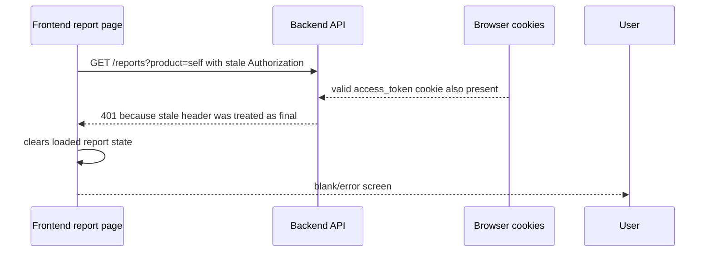
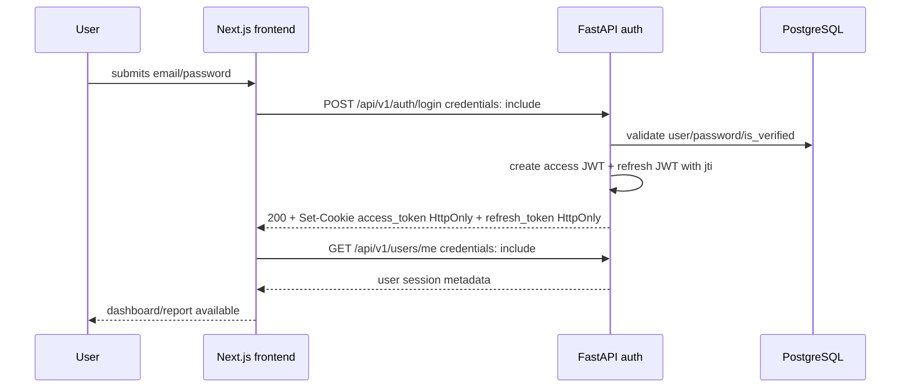
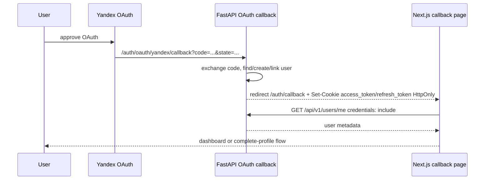
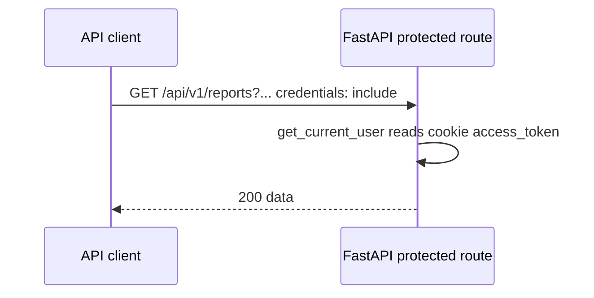
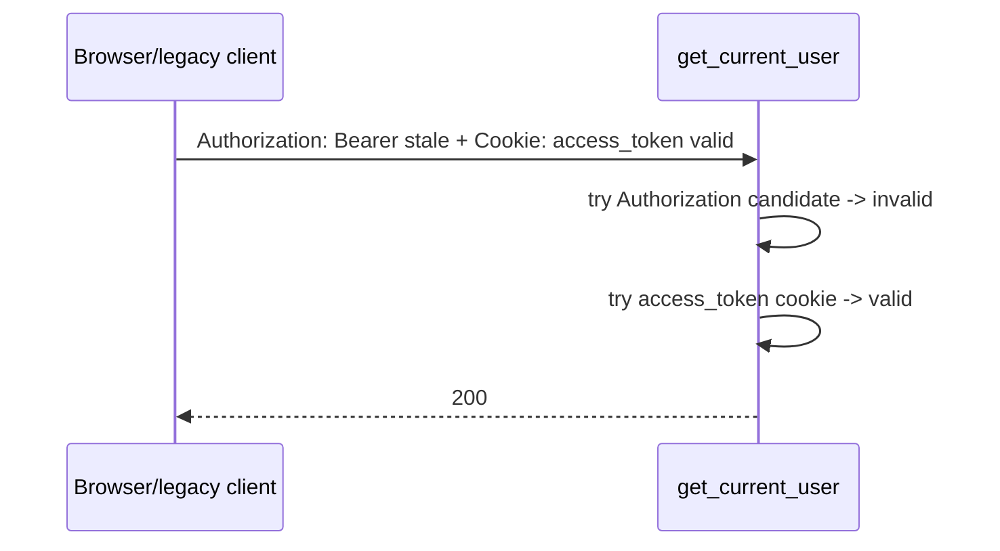
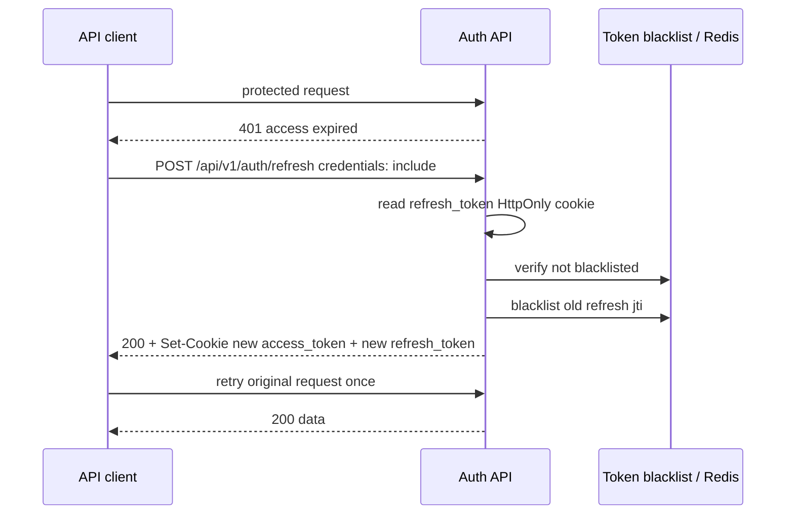
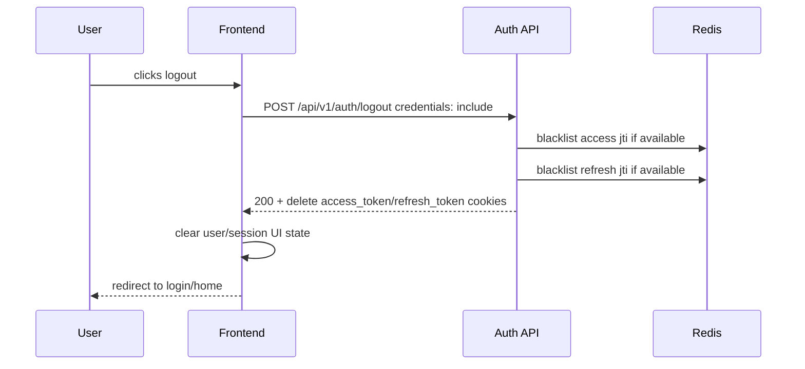

# E2 Identity Auth Workflow

Документ описывает целевой browser auth workflow для Astrotype после исправления рассинхрона JS-token и cookie-session.

Текущее фактическое состояние реализации: [CURRENT-AUTH-FLOW.md](CURRENT-AUTH-FLOW.md).

## Проблема

Исторически browser app использовал две разные auth-модели одновременно:

- email/password login возвращал JWT в JSON, frontend сохранял его в JS-readable cookies и отправлял `Authorization: Bearer`;
- OAuth/Yandex ставил HttpOnly cookies, которые frontend не может прочитать, но browser отправляет автоматически.

Такой гибрид создаёт auth-flap:



Целевой workflow устраняет эту неоднозначность: browser app живёт на cookie-first session, а Bearer token остаётся только compatibility/API-client fallback.

## Целевые принципы

1. Browser frontend не читает и не хранит JWT.
2. Backend ставит access/refresh JWT в HttpOnly cookies.
3. Все protected browser fetches используют `credentials: "include"`.
4. Frontend auth store хранит `user` и session state, не token.
5. Refresh делается через cookie, а не через refresh token в JS body.
6. Logout чистит cookies на backend.
7. Backend не даёт stale Bearer header затенить валидную cookie-backed session.
8. Уже загруженный report не исчезает из UI из-за позднего polling `401`.

## Основной login workflow



Frontend must not do this in the final browser flow:

```ts
Cookies.set("astrotype_token", accessToken);
localStorage.setItem("token", accessToken);
headers.Authorization = `Bearer ${token}`;
```

## OAuth callback workflow

OAuth already fits cookie-first better than email/password login.



## Protected request workflow



If compatibility Bearer exists:



## Refresh workflow



Rules:

- retry only once;
- if refresh fails, clear UI session state;
- do not loop refresh calls;
- do not clear already visible report data just because refresh failed.

## Logout workflow



Logout should also remove legacy JS-readable cookies during the migration window:

- `astrotype_token`
- `astrotype_refresh_token`

## Report page failure handling

The report page is the canary for auth correctness because it makes several protected calls:

- `GET /api/v1/profiles/{profile_id}`
- `POST /api/v1/profiles/{profile_id}/chart`
- `GET /api/v1/reports?product=self&limit=100`
- `GET /api/v1/reports/{report_id}`
- polling while narrative is generating
- `GET /api/v1/reports/{report_id}/pdf`

Target UX:

| State                                    | UI behavior                                                                     |
| ---------------------------------------- | ------------------------------------------------------------------------------- |
| Initial auth missing                     | Show explicit “Сессия истекла. Войдите снова.”                                  |
| Report already loaded, later polling 401 | Keep report visible, show small session-expired banner.                         |
| Refresh succeeds                         | Retry request once, no visible interruption.                                    |
| Refresh fails                            | Stop polling, keep cached report read-only, require login for updates/download. |
| `narrative_failed` / fallback            | Show deterministic fallback, not blank screen.                                  |

## Migration phases

### Phase 1 — Compatibility hardening (done by hotfix)

- Backend checks token candidates instead of single header.
- Refresh can read cookies.
- Frontend does not early-logout when JS refresh token is missing.

### Phase 2 — Cookie-native browser login

- Login sets HttpOnly cookies.
- Frontend login stops writing JWT cookies.
- Session bootstrap uses `/users/me`.

### Phase 3 — Remove browser token plumbing

- Remove token params from frontend API helpers.
- Remove default Bearer injection from browser API client.
- Auth store no longer contains `token`.

### Phase 4 — UX hardening

- Report page keeps loaded data on late 401.
- Protected pages have explicit session-expired state.
- Download/regenerate actions require fresh session.

### Phase 5 — Security hardening

- CSRF policy for mutating routes.
- Audit cookie settings in production.
- Add E8 security checklist items if not already covered.

## Verification checklist

- [ ] Login response sets HttpOnly cookies.
- [ ] OAuth callback sets the same cookie names as login.
- [ ] `/users/me` works with cookies only.
- [ ] `/reports` works with cookies only.
- [ ] stale Bearer + valid cookie returns 200.
- [ ] expired access + valid refresh recovers with one refresh call.
- [ ] invalid refresh returns 401 and UI shows session-expired state.
- [ ] report page does not blank after polling 401.
- [ ] frontend no longer writes auth JWT into JS-readable cookies for browser flow.
