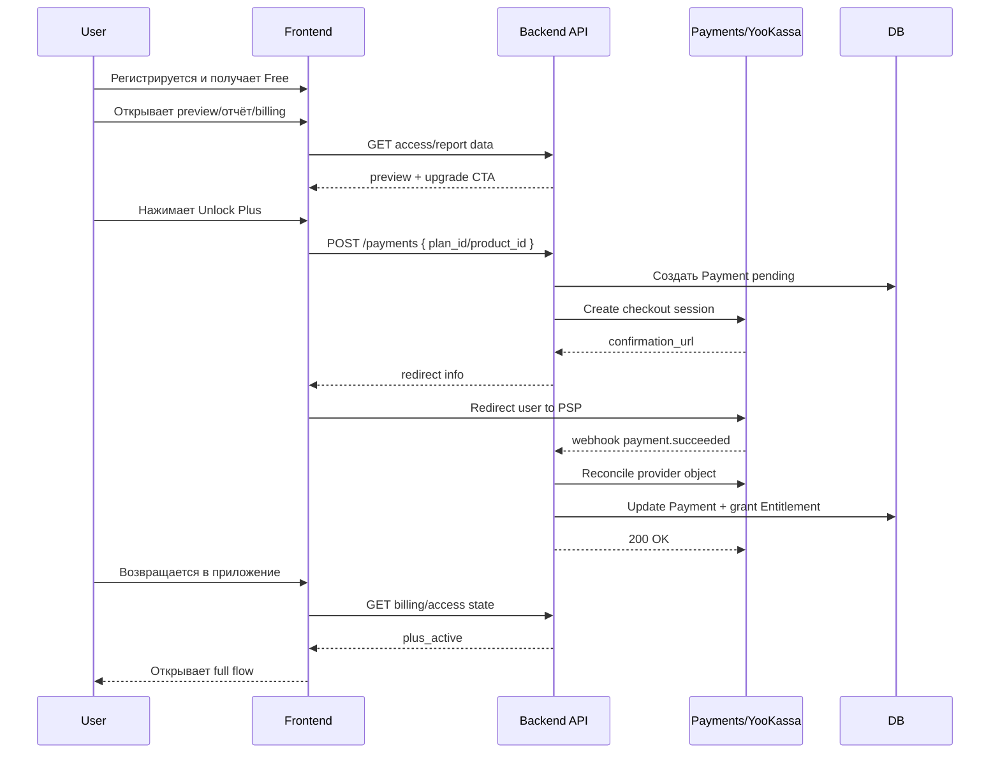

# E6 Workflow: как реально работает разделение Free и Plus

Этот документ объясняет E6 как пользовательский и системный сценарий, а не как набор изолированных stories.

## Короткий ответ

E6 — это не просто «добавить оплату».

Это feature, которая отвечает на вопрос:

когда пользователь видит бесплатный preview, а когда получает полный доступ к продуктам и отчётам.

То есть workflow такой:

1. пользователь регистрируется и попадает в Free;
2. Free даёт базовый вход в систему и первый доказательный preview;
3. в точках ценности интерфейс показывает, что именно откроет Plus;
4. пользователь инициирует оплату Plus;
5. backend создаёт checkout только по server-owned plan id;
6. после подтверждения оплаты webhook активирует entitlement;
7. frontend повторно читает access state и разблокирует full flow.

## Для какого сценария нужна E6

Проблема сейчас не только в отсутствии checkout.

Проблема в том, что продукт уже визуально обещает два режима:

- Free — вход в систему и первый точный срез;
- Plus — полная карта личности, отношений и карьеры.

Но пока это обещание не закреплено ни в API, ни в report flow, ни в access policy.

Поэтому E6 нужна для одного основного use case:

> Пользователь начинает с бесплатного preview, убеждается в точности сервиса, затем покупает Plus и без повторной регистрации получает полный доступ к закрытым разделам и вертикалям.

## Главный продуктовый принцип

Free и Plus отличаются не количеством декоративных фич, а уровнем доступа к результату.

Free должен отвечать на вопрос:

«Есть ли здесь узнаваемость, точность и желание идти дальше?»

Plus должен отвечать на вопрос:

«Как выглядит моя полная карта личности и как я ей пользуюсь регулярно?»

## Что входит в Free

В MVP Free разрешает:

- регистрацию и вход;
- создание профиля рождения;
- построение базового отчёта/preview;
- доступ к teaser-версии Self;
- просмотр billing page и предложений апгрейда.

Free не должен давать:

- полный narrative/full report;
- полный Career-report;
- скрытые секции, которые продаются как часть Plus;
- обход paywall через direct route или повторный запрос к API.

## Что открывает Plus

В MVP Plus открывает:

- полный Self-report;
- полный Career-report;
- полный narrative слой там, где он есть;
- доступ к секциям, скрытым в preview;
- account state «подписка активна» в billing UI.

Если в будущем состав Plus изменится, он должен меняться в catalog/access matrix, а не хардкодом в нескольких страницах.

## Есть два разных смысла слова «вход»

### 1. Пользовательский вход в платный flow

Пользователь не начинает платный сценарий с raw payment form.

Реальный путь такой:

1. Пользователь видит ценность в preview или на `/billing`.
2. Нажимает CTA на апгрейд.
3. Frontend не отправляет цену, валюту или состав услуг.
4. Frontend вызывает backend c plan/product identifier.
5. Backend создаёт payment session и возвращает redirect URL.
6. Пользователь завершает оплату у PSP.
7. После возврата UI обновляет access state.

### 2. Системный вход в access decision

Когда backend решает, что показать пользователю, он не должен опираться на «кнопка уже была нажата» или на локальный флаг из браузера.

Backend принимает решение по фактам:

- есть ли активный entitlement;
- какой продукт запрошен;
- какой режим нужен для данного ответа: `preview` или `full`;
- разрешён ли доступ к конкретной секции отчёта.

## Что не должно считаться доступом

Следующие события сами по себе не означают Plus-доступ:

- пользователь открыл `/billing`;
- frontend показывает 999 ₽ / месяц;
- payment создан, но ещё не подтверждён;
- пользователь вернулся с PSP, но webhook ещё не подтвердил оплату;
- у клиента в local state стоит optimistic-флаг «оплачено».

Настоящий доступ появляется только после backend-confirmed entitlement.

## Основной end-to-end workflow

## Пошагово: что происходит у Free-пользователя

### Шаг 1. Пользователь создаёт профиль

Это не платный момент. Профиль и базовые вычисления не должны зависеть от оплаты.

### Шаг 2. Пользователь получает preview

Preview нужен не как «сломанный отчёт», а как управляемая демо-версия.

Он должен:

- показать enough signal, что система узнаёт человека;
- не раскрывать весь коммерческий объём;
- объяснить, что именно откроет Plus.

### Шаг 3. UI показывает точки апгрейда

Upgrade CTA должен появляться в понятных местах:

- billing page;
- locked sections на report page;
- product pages, где Free не даёт полный доступ.

## Пошагово: что происходит при оплате

### Шаг 4. Frontend создаёт оплату только по plan id

Нельзя отправлять с клиента:

- `amount`;
- `currency`;
- коммерческое `metadata`;
- самостоятельный список услуг.

Frontend отправляет только server-owned identifier (`plus_monthly` или эквивалент, выбранный в реализации).

### Шаг 5. Backend создаёт checkout

Backend:

- ищет план в catalog;
- создаёт локальный payment;
- обращается к YooKassa;
- возвращает `confirmation_url`.

### Шаг 6. Пользователь проходит внешний checkout

Внешний PSP flow не должен автоматически считаться активацией доступа, пока backend не увидит подтверждённый результат.

### Шаг 7. Webhook активирует entitlement

После `payment.succeeded` backend:

- получает canonical payment object у YooKassa;
- сверяет amount/currency/metadata;
- обновляет `payments`;
- выдаёт entitlement;
- делает access state читаемым для UI.

## Что видит frontend в каждом состоянии

### 1. `free`

Показывается preview, locked sections и CTA на апгрейд.

### 2. `checkout_pending`

Пользователь уже пошёл в оплату, но entitlement ещё не подтверждён.

UI не должен обещать полный доступ заранее. Ему нужен статус «ожидаем подтверждение оплаты» и ручное/автоматическое обновление.

### 3. `plus_active`

Показывается полный flow без paywall и без teaser-ограничений.

### 4. `payment_failed` или `plus_inactive`

Пользователь остаётся в Free или возвращается в Free-friendly state.

Нельзя оставлять интерфейс в подвешенном режиме, где непонятно, есть доступ или нет.

## Как должен работать direct access к отчёту

Самая опасная ошибка — опираться только на frontend-роутинг.

Правильное поведение:

- пользователь может открыть `/report/{profileId}` напрямую;
- backend всё равно решает, preview это или full;
- если доступ платный, API не отдаёт скрытые секции целиком;
- UI показывает fallback/locked state, а не случайно раскрытый платный контент.

## Что E6 не должна делать

E6 не должна:

- превращать frontend в источник коммерческой правды;
- считать локальный флаг оплаты достаточным основанием для доступа;
- дублировать платный контент в free-ответе и просто скрывать его CSS'ом;
- делать так, чтобы Career был фактически доступен бесплатно через отдельный route;
- требовать от пользователя повторно создавать профиль после оплаты.

## Главный вывод для реализации

Реальная задача E6 — это не «подключить YooKassa».

Реальная задача E6 — связать четыре слоя в один контракт:

- pricing/catalog;
- payment confirmation;
- entitlement/access policy;
- preview/full UX в отчётах и продуктах.
