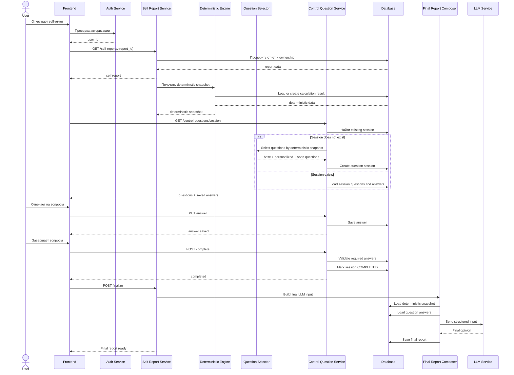
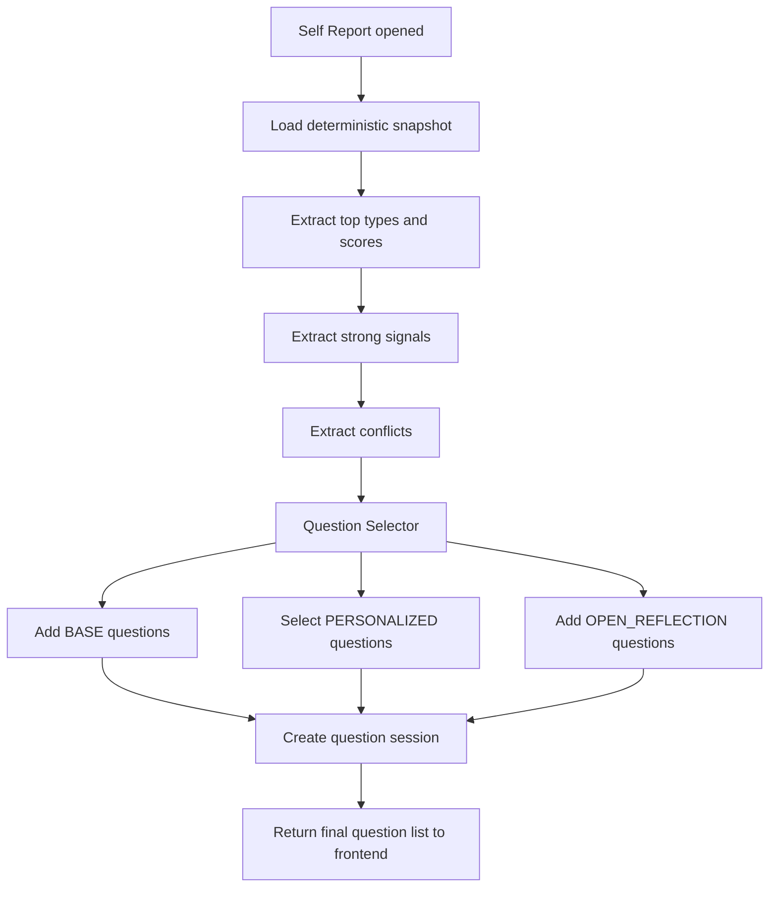
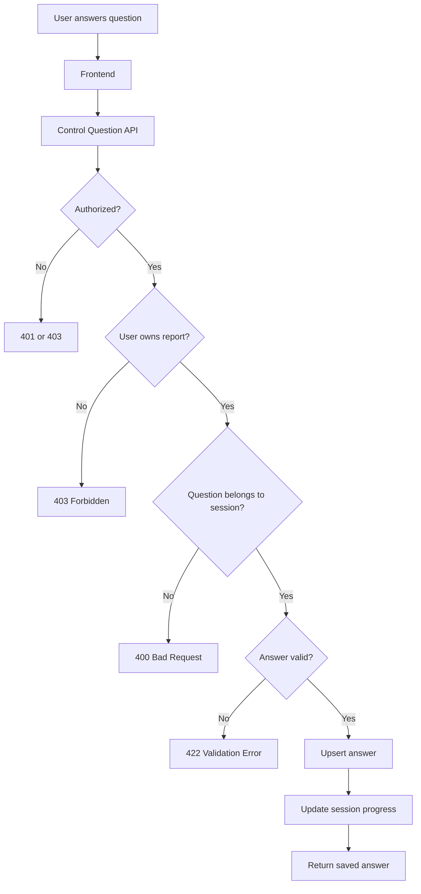
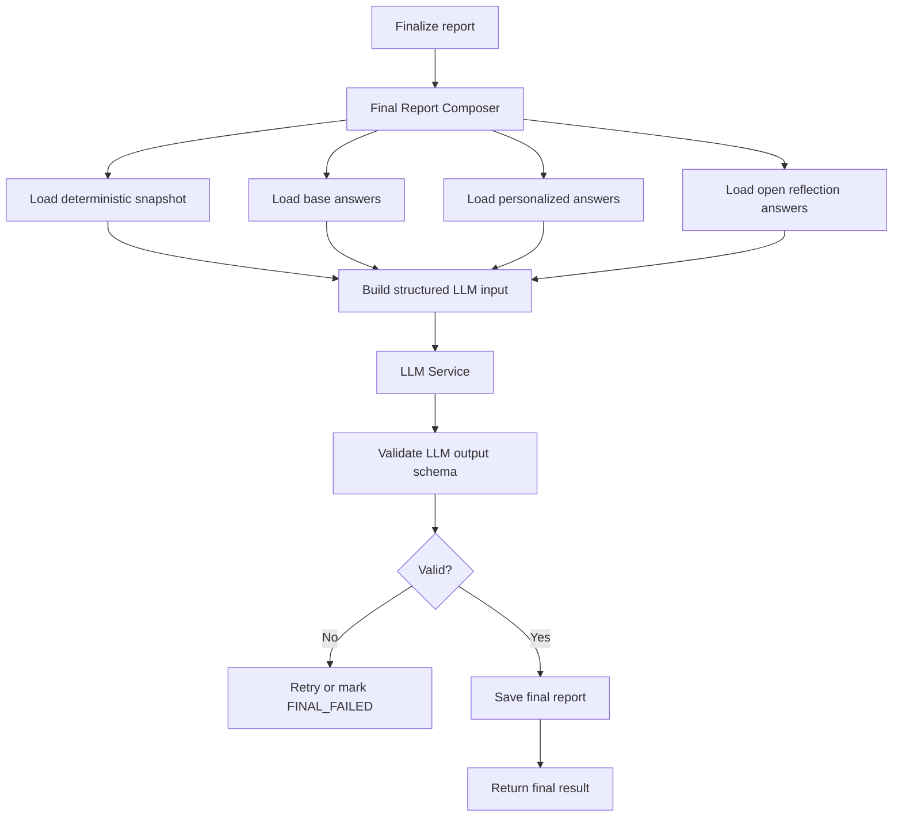

# Фича: «Контрольные вопросы» для Self-отчета

## 1. Назначение фичи

Фича «Контрольные вопросы» предназначена для уточнения финального self-отчета пользователя.

Система использует два источника данных:

1. **Детерминированные данные**
   Расчетные данные: натальная карта, дома, аспекты, веса, top-гипотезы, сильные и слабые сигналы, конфликтующие признаки.

2. **Ответы пользователя на контрольные вопросы**
   Поведенческий и субъективный слой, который помогает уточнить, подтвердить или ослабить расчетные гипотезы.

Финальная LLM-оценка формируется на основе суммы:

```text
Final Opinion = Deterministic Data + Control Answers + Interpretation Rules
```

Контрольные вопросы не заменяют расчетную модель и не являются отдельным тестом. Их роль — калибровать и обогащать финальную интерпретацию.

---

## 2. Цели

### 2.1. Бизнес-цели

- Повысить индивидуальность self-отчета.
- Сделать финальный вывод менее сухим и более персональным.
- Дать пользователю ощущение участия в анализе.
- Увеличить perceived value premium/self-отчета.
- Снизить риск ошибочной трактовки только по детерминированным данным.

### 2.2. Продуктовые цели

- Не превращать сервис в обычный психологический тест.
- Использовать вопросы как калибровочный слой.
- Показывать пользователю простой UX: «ответьте на вопросы, чтобы отчет был точнее».
- Скрыть от пользователя техническую сложность выбора вопросов.
- Не раскрывать напрямую логику типирования.

### 2.3. Технические цели

- Хранить ответы пользователя в привязке к конкретному self-отчету.
- Поддерживать версии наборов вопросов.
- Разделять базовые и персонализированные вопросы.
- Выбирать персонализированные вопросы на основе вычисленных весов.
- Передавать ответы в финальный LLM pipeline.
- Сохранять воспроизводимый snapshot входных данных для финальной генерации.

---

## 3. Ключевой принцип

Фича строится на двух слоях вопросов:

```text
Слой 1: BASE questions
Общие вопросы, которые задаются всем пользователям.

Слой 2: PERSONALIZED questions
Уточняющие вопросы, которые выбираются на основе расчетных весов, top-типов и конфликтов.
```

Дополнительно может быть третий вспомогательный слой:

```text
Слой 3: OPEN_REFLECTION questions
Открытые вопросы для живого материала, который LLM использует в финальном тексте.
```

---

## 4. Общий workflow пользователя

```text
1. Пользователь авторизуется.
2. Пользователь открывает свой self-отчет.
3. Система проверяет доступ к отчету.
4. Система получает или создает deterministic snapshot.
5. Система выбирает набор контрольных вопросов:
   - базовые вопросы;
   - персонализированные вопросы по весам;
   - открытые вопросы.
6. Пользователь отвечает на вопросы.
7. Система сохраняет ответы.
8. Пользователь завершает блок вопросов.
9. Система собирает final LLM input:
   - deterministic data;
   - base answers;
   - personalized answers;
   - open reflection answers.
10. LLM формирует финальное мнение.
11. Система сохраняет финальный отчет.
12. Пользователь видит финальный self-отчет.
```

---

## 5. Рекомендуемый MVP workflow

Для MVP лучше не делать два отдельных шага в интерфейсе.

Пользователь должен видеть один единый блок:

> Ответьте на контрольные вопросы, чтобы финальный отчет был точнее.

Внутри система уже собирает вопросы из разных слоев.

```text
Deterministic calculation
        ↓
Question Selector
        ↓
5 BASE questions
+ 3 PERSONALIZED questions
+ 2 OPEN_REFLECTION questions
        ↓
User answers
        ↓
Final LLM evaluation
```

---

## 6. Распределение вопросов в MVP

Рекомендуемый размер анкеты: **10 вопросов**.

```text
5 базовых вопросов
3 персонализированных вопроса
2 открытых вопроса
```

### 6.1. Базовые вопросы

Базовые вопросы задаются всем пользователям.

Их задача — собрать универсальный поведенческий профиль.

Темы:

| № | Тема | Что проверяем |
|---|---|---|
| 1 | Принятие решений | Te / Ti / Fi / Fe, рациональность |
| 2 | Реакция на хаос | контроль, адаптация, Ne / Ni / Se |
| 3 | Конфликт и давление | Se, Fi, Fe, стиль защиты |
| 4 | Работа и результат | Te / Ti, структура, польза |
| 5 | Новые возможности | Ne, гибкость, отношение к изменениям |

### 6.2. Персонализированные вопросы

Персонализированные вопросы выбираются после deterministic calculation.

Основания для выбора:

- близость top-1 и top-2 типов;
- близость top-1 и top-3 типов;
- конфликт сильных сигналов;
- сомнительная слабая зона top-гипотезы;
- противоречие между расчетом и базовыми ответами в v2.

### 6.3. Открытые вопросы

Открытые вопросы дают LLM живой материал для финального текста.

Они не должны сильно влиять на скоринг, но помогают сделать отчет более человечным.

---

## 7. System workflow



---

## 8. Data flow

### 8.1. Источники данных

| Источник | Данные |
|---|---|
| Auth Service | `user_id`, факт авторизации |
| Self Report Service | `report_id`, owner, report type, status |
| Deterministic Engine | планеты, дома, аспекты, веса, top-гипотезы |
| Question Selector | выбранный набор вопросов |
| Control Question Service | сессия вопросов, ответы пользователя |
| LLM Service | финальное мнение |

---

### 8.2. Data flow выбора вопросов



---

### 8.3. Data flow сохранения ответов



---

### 8.4. Data flow финальной LLM-оценки



---

## 9. Типы вопросов

### 9.1. `single_choice`

Пользователь выбирает один вариант.

Используется для большинства базовых и персонализированных вопросов.

Пример:

```json
{
  "type": "single_choice",
  "value": "facts_consequences"
}
```

---

### 9.2. `multi_choice`

Пользователь выбирает несколько вариантов.

Используется осторожно, в основном для вопросов про раздражение, усталость, слабые зоны.

Пример:

```json
{
  "type": "multi_choice",
  "values": ["too_many_options", "emotional_pressure"]
}
```

---

### 9.3. `scale`

Пользователь выбирает значение по шкале.

Например, от `1` до `5`.

Пример:

```json
{
  "type": "scale",
  "value": 4
}
```

---

### 9.4. `text`

Открытый ответ.

Используется для живого материала в финальном LLM-тексте.

Пример:

```json
{
  "type": "text",
  "text": "Я чувствую себя на своем месте, когда могу навести порядок в сложной системе."
}
```

---

## 10. Базовые вопросы для MVP

### 10.1. Вопрос 1 — принятие решений

**Когда нужно принять важное решение при неполной информации, что вы обычно делаете первым делом?**

Варианты:

1. Собираю факты, сравниваю варианты, оцениваю последствия.
2. Строю внутренне непротиворечивую систему решения.
3. Думаю, как решение повлияет на людей и отношения.
4. Ориентируюсь на образ будущего и долгосрочные последствия.
5. Быстро выбираю рабочий вариант и корректирую по ходу.

Пример сигналов:

| Ответ | Сигналы |
|---|---|
| Факты, варианты, последствия | Te, rationality |
| Непротиворечивая система | Ti, rationality |
| Люди и отношения | Fi / Fe |
| Образ будущего | Ni |
| Рабочий вариант и корректировка | Te / Se / иррациональность |

---

### 10.2. Вопрос 2 — реакция на хаос

**Когда ситуация становится хаотичной, что вам ближе?**

Варианты:

1. Восстановить порядок, роли и правила.
2. Быстро взять управление и начать действовать.
3. Дать ситуации раскрыться, не фиксируя решение слишком рано.
4. Стабилизировать людей и эмоциональную атмосферу.
5. Уйти в анализ причин и сценариев.

Пример сигналов:

| Ответ | Сигналы |
|---|---|
| Порядок, роли, правила | Ti, rationality |
| Взять управление | Se |
| Дать раскрыться | Ne / Ni |
| Стабилизировать людей | Fe / Fi |
| Анализ причин и сценариев | Ni / Ti |

---

### 10.3. Вопрос 3 — конфликт и давление

**Если человек нарушает ваши границы или договоренности, что вы скорее сделаете?**

Варианты:

1. Прямо обозначу границу и потребую прекратить.
2. Спокойно объясню, почему это неприемлемо.
3. Сначала оценю, стоит ли вступать в конфликт.
4. Постараюсь сгладить ситуацию.
5. Внутренне отстранюсь и перестану вкладываться.

Пример сигналов:

| Ответ | Сигналы |
|---|---|
| Прямо обозначу и потребую | Se |
| Объясню, почему неприемлемо | Ti / Fi |
| Оценю, стоит ли конфликт | Ni / Te |
| Сглажу ситуацию | Fe |
| Отстранюсь | Fi / Ni |

---

### 10.4. Вопрос 4 — работа и результат

**Что для вас важнее в рабочем процессе?**

Варианты:

1. Измеримый результат и понятная польза.
2. Логичная, чистая и непротиворечивая система.
3. Вовлеченность людей и общая энергия команды.
4. Свобода искать новые варианты.
5. Ясные роли, ответственность и порядок.

Пример сигналов:

| Ответ | Сигналы |
|---|---|
| Результат и польза | Te |
| Логичная система | Ti |
| Энергия команды | Fe |
| Новые варианты | Ne |
| Роли и порядок | Ti / Se |

---

### 10.5. Вопрос 5 — новые возможности

**Когда у вас уже есть рабочий план, но появляется новая интересная возможность, что вы чаще делаете?**

Варианты:

1. Проверяю, не разрушит ли она текущую систему.
2. Быстро оцениваю выгоду и могу перестроить план.
3. Часто увлекаюсь новой возможностью.
4. Оставляю пространство для эксперимента, но не ломаю основу.
5. Новые возможности скорее раздражают, если сбивают фокус.

Пример сигналов:

| Ответ | Сигналы |
|---|---|
| Не разрушит ли систему | Ti / rationality |
| Оцениваю выгоду | Te |
| Увлекаюсь новой возможностью | Ne |
| Эксперимент без разрушения основы | Ti + Ne |
| Раздражают, если сбивают фокус | слабая или неценностная Ne |

---

## 11. Персонализированные вопросы

Персонализированные вопросы выбираются не всем подряд, а только при наличии соответствующего триггера.

### 11.1. Триггер `TOP_PAIR`

Используется, когда top-1 и top-2 типы близки по весам.

Пример:

```json
{
  "trigger_type": "TOP_PAIR",
  "types": ["LSI", "LIE"],
  "max_score_delta": 0.12
}
```

Если расчет:

```json
{
  "top_types": [
    { "type": "LSI", "score": 0.78 },
    { "type": "LIE", "score": 0.72 }
  ]
}
```

Разница `0.06`, значит вопрос `LSI_vs_LIE` подходит.

---

### 11.2. Триггер `SIGNAL_CONFLICT`

Используется, когда в deterministic calculation есть конфликтующие сигналы.

Пример:

```json
{
  "trigger_type": "SIGNAL_CONFLICT",
  "signals": ["Ti", "Ne"]
}
```

---

### 11.3. Триггер `WEAK_ZONE_CHECK`

Используется, когда для top-гипотезы нужно проверить сомнительную слабую зону.

Пример:

```json
{
  "trigger_type": "WEAK_ZONE_CHECK",
  "type": "LSI",
  "function": "Fe"
}
```

---

## 12. Примеры персонализированных вопросов

### 12.1. LSI vs LIE

**Что для вас важнее, когда вы строите систему?**

Варианты:

1. Чтобы она была внутренне логичной, устойчивой и не разваливалась от исключений.
2. Чтобы она быстрее давала полезный результат, даже если внутри пока есть шероховатости.
3. Чтобы она масштабировалась, приносила выгоду и позволяла двигаться быстрее.
4. Чтобы людям было понятно, как в ней действовать.

Интерпретация:

| Ответ | Усиливает |
|---|---|
| Внутренняя логика и устойчивость | LSI / Ti |
| Быстрый полезный результат | LIE / Te |
| Масштабирование и выгода | LIE / Te / Ni |
| Понятность для людей | зависит от других ответов |

---

### 12.2. LSI vs EIE

**Когда группа людей неорганизована, что вы скорее делаете?**

Варианты:

1. Ввожу правила, роли и порядок.
2. Заражаю людей идеей, эмоцией или общей целью.
3. Выясняю, кто за что отвечает, и требую выполнения.
4. Сначала чувствую настроение группы и подбираю способ влияния.
5. Ухожу в анализ, почему система не работает.

Интерпретация:

| Ответ | Усиливает |
|---|---|
| Правила, роли, порядок | LSI |
| Идея, эмоция, цель | EIE |
| Требую выполнения | LSI / SLE |
| Чувствую настроение группы | EIE / Fe |
| Анализ системы | LSI / LII |

---

### 12.3. LIE vs EIE

**Что для вас естественнее, когда нужно повести людей за собой?**

Варианты:

1. Показать выгоду, план, результат и путь достижения.
2. Создать эмоциональное напряжение, образ будущего и ощущение миссии.
3. Раздать роли, поставить сроки и контролировать выполнение.
4. Найти личную мотивацию каждого человека.

Интерпретация:

| Ответ | Усиливает |
|---|---|
| Выгода, план, результат | LIE |
| Образ будущего, миссия, эмоция | EIE |
| Роли, сроки, контроль | LSI / SLE / LIE |
| Личная мотивация | EIE / Fi-valued types |

---

### 12.4. Ti vs Ne conflict

**Что для вас хуже?**

Варианты:

1. Жесткая система, которая мешает видеть новые варианты.
2. Постоянные новые варианты, из-за которых невозможно зафиксировать решение.
3. Система без правил, где каждый понимает все по-своему.
4. Правила есть, но они не дают практического результата.

Интерпретация:

| Ответ | Сигнал |
|---|---|
| Жесткая система мешает вариантам | Ne ценностная |
| Много вариантов мешают зафиксировать решение | Ti / слабая Ne |
| Система без правил | Ti / rationality |
| Правила без результата | Te |

---

### 12.5. Fe check for LSI-like profile

**Когда нужно эмоционально воодушевить людей, что вам ближе?**

Варианты:

1. Могу это сделать, если понимаю цель и контекст.
2. Делаю это естественно, мне нравится управлять настроением.
3. Могу, но быстро устаю и предпочитаю конкретику.
4. Не люблю этим заниматься, лучше дать людям ясные правила и задачу.
5. Сначала наблюдаю настроение, потом решаю, стоит ли вмешиваться.

Интерпретация:

| Ответ | Возможный вывод |
|---|---|
| Могу при понятной цели | Fe доступна ситуативно |
| Естественно управляю настроением | сильная / ценностная Fe |
| Могу, но устаю | Fe слабая, но признаваемая |
| Не люблю, лучше правила | Fe неценностная, Ti focus |
| Наблюдаю и решаю | интровертная наблюдательная позиция |

---

## 13. Открытые вопросы

Открытые вопросы нужны для финального LLM-объяснения.

Рекомендуемые вопросы:

### 13.1. Вопрос про сильное состояние

**Опишите ситуацию, где вы чувствовали себя максимально «на своем месте». Что вы там делали?**

Цель:

- получить живой пример;
- понять естественную роль пользователя;
- усилить финальный текст.

---

### 13.2. Вопрос про непонимание со стороны других

**Что люди чаще всего неправильно понимают в вас?**

Цель:

- выявить конфликт между внутренним самоощущением и внешним образом;
- дать LLM материал для более точной формулировки;
- обнаружить возможную маску, социальную роль или адаптацию.

---

## 14. Question Selector

`QuestionSelector` — компонент, который выбирает вопросы для конкретного self-отчета.

### 14.1. Input

```json
{
  "report_id": "rep_123",
  "deterministic_snapshot": {
    "top_types": [
      { "type": "LSI", "score": 0.78 },
      { "type": "LIE", "score": 0.72 },
      { "type": "EIE", "score": 0.67 }
    ],
    "strong_signals": ["Ti", "Se", "rationality"],
    "weak_signals": ["Ne", "Fe"],
    "conflicts": [
      {
        "code": "ti_ne_conflict",
        "signals": ["Ti", "Ne"],
        "strength": 0.64
      }
    ]
  }
}
```

### 14.2. Output

```json
{
  "question_set_code": "self_v1",
  "selected_questions": [
    {
      "code": "decision_style",
      "layer": "BASE"
    },
    {
      "code": "chaos_reaction",
      "layer": "BASE"
    },
    {
      "code": "conflict_style",
      "layer": "BASE"
    },
    {
      "code": "work_value",
      "layer": "BASE"
    },
    {
      "code": "new_opportunity_reaction",
      "layer": "BASE"
    },
    {
      "code": "lsi_vs_lie_system_goal",
      "layer": "PERSONALIZED"
    },
    {
      "code": "lsi_vs_eie_group_disorder",
      "layer": "PERSONALIZED"
    },
    {
      "code": "ti_ne_conflict_plan_vs_options",
      "layer": "PERSONALIZED"
    },
    {
      "code": "strong_state_reflection",
      "layer": "OPEN_REFLECTION"
    },
    {
      "code": "misunderstood_by_others",
      "layer": "OPEN_REFLECTION"
    }
  ]
}
```

---

## 15. Алгоритм выбора вопросов

### 15.1. MVP-алгоритм

```python
def select_questions(deterministic_result):
    questions = []

    # 1. Всегда добавляем базовые вопросы
    questions.extend(get_base_questions(limit=5))

    top_types = deterministic_result.top_types[:3]

    # 2. Добавляем вопрос-различитель между top-1 и top-2
    if score_delta(top_types[0], top_types[1]) <= 0.12:
        question = get_pair_question(top_types[0].type, top_types[1].type)
        if question:
            questions.append(question)

    # 3. Добавляем вопрос-различитель между top-1 и top-3
    if len(top_types) >= 3 and score_delta(top_types[0], top_types[2]) <= 0.18:
        question = get_pair_question(top_types[0].type, top_types[2].type)
        if question:
            questions.append(question)

    # 4. Добавляем вопрос по самому сильному конфликту
    strongest_conflict = get_strongest_conflict(deterministic_result.conflicts)
    if strongest_conflict:
        question = get_conflict_question(strongest_conflict.code)
        if question:
            questions.append(question)

    # 5. Добавляем открытые вопросы
    questions.extend(get_open_reflection_questions(limit=2))

    # 6. Удаляем дубли и ограничиваем размер
    return deduplicate_and_limit(questions, limit=10)
```

---

### 15.2. Приоритеты выбора

Если кандидатов больше, чем доступных слотов, приоритет такой:

```text
1. BASE questions
2. TOP_PAIR question для top-1 vs top-2
3. TOP_PAIR question для top-1 vs top-3
4. SIGNAL_CONFLICT question
5. WEAK_ZONE_CHECK question
6. OPEN_REFLECTION questions
```

---

## 16. Статусы self-отчета

| Статус | Значение |
|---|---|
| `DRAFT` | Отчет создан, исходные данные еще не полные |
| `DETERMINISTIC_PENDING` | Детерминированный расчет ожидает выполнения |
| `DETERMINISTIC_READY` | Детерминированный расчет готов |
| `QUESTIONS_REQUIRED` | Нужно пройти контрольные вопросы |
| `QUESTIONS_IN_PROGRESS` | Пользователь начал отвечать |
| `READY_FOR_FINAL_LLM` | Ответы завершены, можно запускать финальную генерацию |
| `FINAL_GENERATING` | Финальный отчет генерируется |
| `FINAL_READY` | Финальный отчет готов |
| `FINAL_FAILED` | Ошибка генерации |
| `STALE_AFTER_ANSWER_EDIT` | Ответы изменились после финализации, нужна регенерация |

---

## 17. Статусы question session

| Статус | Значение |
|---|---|
| `NOT_STARTED` | Сессия создана, ответов нет |
| `IN_PROGRESS` | Есть хотя бы один ответ |
| `COMPLETED` | Все обязательные вопросы отвечены |
| `LOCKED` | Ответы использованы в финальной генерации |
| `REOPENED` | Ответы изменены после финализации |

---

## 18. Модель данных

### 18.1. `control_question_sets`

Хранит версии наборов вопросов.

```sql
control_question_sets
- id
- code                 -- example: self_v1
- report_type          -- SELF
- version              -- 1
- title
- description
- is_active
- created_at
- updated_at
```

---

### 18.2. `control_questions`

Хранит вопросы.

```sql
control_questions
- id
- question_set_id
- code
- layer                -- BASE / PERSONALIZED / OPEN_REFLECTION
- order_index
- question_type        -- single_choice / multi_choice / scale / text
- text
- description
- options_json
- required
- llm_tags_json
- trigger_json
- is_active
- created_at
- updated_at
```

Пример `trigger_json` для базового вопроса:

```json
{
  "type": "ALWAYS"
}
```

Пример `trigger_json` для pair-question:

```json
{
  "type": "TOP_PAIR",
  "types": ["LSI", "LIE"],
  "max_score_delta": 0.12
}
```

Пример `trigger_json` для conflict-question:

```json
{
  "type": "SIGNAL_CONFLICT",
  "signals": ["Ti", "Ne"],
  "min_conflict_strength": 0.5
}
```

---

### 18.3. `control_question_sessions`

Хранит конкретную сессию вопросов для self-отчета.

```sql
control_question_sessions
- id
- report_id
- user_id
- question_set_id
- deterministic_snapshot_id
- status
- started_at
- completed_at
- locked_at
- created_at
- updated_at
```

Ограничения:

```text
- один active session на один report_id;
- user_id должен совпадать с владельцем отчета;
- после LOCKED ответы нельзя менять без reopen/regenerate сценария.
```

---

### 18.4. `control_question_session_items`

Фиксирует, какие вопросы были выбраны для конкретной сессии.

Это важно, потому что персонализированные вопросы выбираются динамически.

```sql
control_question_session_items
- id
- session_id
- question_id
- order_index
- layer
- selection_reason_json
- created_at
```

Пример `selection_reason_json`:

```json
{
  "reason": "TOP_PAIR",
  "types": ["LSI", "LIE"],
  "scores": {
    "LSI": 0.78,
    "LIE": 0.72
  },
  "delta": 0.06
}
```

---

### 18.5. `control_question_answers`

Хранит ответы пользователя.

```sql
control_question_answers
- id
- session_id
- question_id
- value_json
- text_answer
- created_at
- updated_at
```

Пример для `single_choice`:

```json
{
  "value": "facts_consequences"
}
```

Пример для `multi_choice`:

```json
{
  "values": ["too_many_options", "emotional_pressure"]
}
```

Пример для `scale`:

```json
{
  "value": 4
}
```

---

### 18.6. `final_report_generations`

Хранит факт финальной LLM-генерации.

```sql
final_report_generations
- id
- report_id
- user_id
- deterministic_snapshot_id
- control_question_session_id
- llm_provider
- llm_model
- prompt_version
- input_json
- output_json
- status
- error_message
- created_at
- completed_at
```

---

## 19. API

### 19.1. Получить self-отчет

```http
GET /api/self-reports/{report_id}
```

Backend проверяет:

```text
- пользователь авторизован;
- отчет существует;
- отчет принадлежит пользователю;
- отчет относится к SELF;
- статус отчета позволяет открыть страницу.
```

---

### 19.2. Получить или создать сессию контрольных вопросов

```http
GET /api/self-reports/{report_id}/control-questions/session
```

Логика:

```text
1. Проверить ownership.
2. Проверить наличие deterministic snapshot.
3. Если snapshot отсутствует — создать или вернуть ошибку DETERMINISTIC_NOT_READY.
4. Проверить existing question session.
5. Если сессии нет — выбрать вопросы через QuestionSelector.
6. Создать session и session_items.
7. Вернуть вопросы и уже сохраненные ответы.
```

Response:

```json
{
  "session_id": "cqs_123",
  "report_id": "rep_456",
  "status": "IN_PROGRESS",
  "question_set_code": "self_v1",
  "questions": [
    {
      "question_id": "q_001",
      "code": "decision_style",
      "layer": "BASE",
      "order": 1,
      "type": "single_choice",
      "text": "Когда нужно принять важное решение при неполной информации, что вы обычно делаете первым делом?",
      "options": [
        {
          "value": "facts_consequences",
          "label": "Собираю факты, сравниваю варианты, оцениваю последствия."
        }
      ],
      "required": true
    }
  ],
  "answers": [
    {
      "question_id": "q_001",
      "value_json": {
        "value": "facts_consequences"
      },
      "text_answer": null
    }
  ]
}
```

---

### 19.3. Сохранить ответ

```http
PUT /api/self-reports/{report_id}/control-questions/answers/{question_id}
```

Request:

```json
{
  "value_json": {
    "value": "facts_consequences"
  },
  "text_answer": null
}
```

Backend проверяет:

```text
- пользователь авторизован;
- пользователь владеет отчетом;
- сессия существует;
- question_id входит в session_items;
- сессия не LOCKED;
- ответ соответствует question_type;
- обязательные ограничения соблюдены.
```

Response:

```json
{
  "question_id": "q_001",
  "saved": true,
  "session_status": "IN_PROGRESS"
}
```

---

### 19.4. Завершить вопросы

```http
POST /api/self-reports/{report_id}/control-questions/complete
```

Backend:

```text
1. Проверяет ownership.
2. Проверяет, что все required questions отвечены.
3. Переводит session в COMPLETED.
4. Переводит report в READY_FOR_FINAL_LLM.
```

Response:

```json
{
  "session_id": "cqs_123",
  "status": "COMPLETED",
  "report_status": "READY_FOR_FINAL_LLM"
}
```

Ошибка, если не все обязательные вопросы заполнены:

```json
{
  "error": "REQUIRED_QUESTIONS_MISSING",
  "missing_question_ids": ["q_003", "q_007"]
}
```

---

### 19.5. Запустить финальную генерацию

```http
POST /api/self-reports/{report_id}/finalize
```

Backend:

```text
1. Проверяет ownership.
2. Проверяет наличие deterministic snapshot.
3. Проверяет completed question session.
4. Создает final_report_generation.
5. Собирает LLM input.
6. Вызывает LLM.
7. Валидирует output.
8. Сохраняет final report.
```

Response:

```json
{
  "report_id": "rep_456",
  "status": "FINAL_GENERATING"
}
```

Для MVP можно выполнять синхронно. Для production лучше использовать async job.

---

### 19.6. Получить финальный отчет

```http
GET /api/self-reports/{report_id}/final
```

Response:

```json
{
  "report_id": "rep_456",
  "status": "FINAL_READY",
  "result": {
    "final_type": "LSI",
    "confidence": 0.78,
    "summary": "...",
    "deterministic_evidence": [],
    "user_answer_evidence": [],
    "conflicts": []
  }
}
```

---

## 20. LLM input contract

Финальный input должен быть структурированным.

```json
{
  "report_context": {
    "report_id": "rep_456",
    "report_type": "SELF",
    "language": "ru",
    "prompt_version": "final_self_v1"
  },
  "deterministic_data": {
    "birth_data": {
      "date": "1990-08-24",
      "time": "14:20",
      "place": "Moscow"
    },
    "astro": {
      "planets": [],
      "houses": [],
      "aspects": []
    },
    "scoring": {
      "top_types": [
        {
          "type": "LSI",
          "score": 0.78,
          "evidence": []
        },
        {
          "type": "LIE",
          "score": 0.72,
          "evidence": []
        },
        {
          "type": "EIE",
          "score": 0.67,
          "evidence": []
        }
      ],
      "strong_signals": ["Ti", "Se", "rationality"],
      "weak_signals": ["Ne", "Fe"],
      "conflicts": []
    }
  },
  "control_answers": {
    "question_set": "self_v1",
    "session_id": "cqs_123",
    "answers": [
      {
        "code": "decision_style",
        "layer": "BASE",
        "question": "Когда нужно принять важное решение при неполной информации, что вы обычно делаете первым делом?",
        "type": "single_choice",
        "answer": "Собираю факты, сравниваю варианты, оцениваю последствия.",
        "llm_tags": ["decision_making", "te_ti", "rationality"]
      },
      {
        "code": "lsi_vs_lie_system_goal",
        "layer": "PERSONALIZED",
        "question": "Что для вас важнее, когда вы строите систему?",
        "type": "single_choice",
        "answer": "Чтобы она была внутренне логичной, устойчивой и не разваливалась от исключений.",
        "llm_tags": ["lsi_vs_lie", "ti_vs_te", "system_vs_result"]
      }
    ]
  },
  "instructions": {
    "deterministic_data_priority": "high",
    "user_answers_role": "calibration_and_context",
    "handle_conflicts": true,
    "do_not_override_without_reason": true,
    "separate_sources_in_explanation": true,
    "return_json": true
  }
}
```

---

## 21. LLM interpretation rules

LLM должна соблюдать правила:

```text
1. Детерминированные данные — основной слой анализа.
2. Ответы пользователя — слой калибровки и контекста.
3. Ответы могут усиливать или ослаблять расчетные гипотезы.
4. Ответы не должны полностью переопределять расчет без объяснения.
5. Если ответы подтверждают расчет, нужно явно указать, что именно подтвердилось.
6. Если ответы противоречат расчету, нужно явно указать конфликт.
7. Если confidence снижается, нужно объяснить почему.
8. Нельзя выдумывать данные, которых нет во входном JSON.
9. Нельзя раскрывать пользователю техническую механику весов слишком подробно.
10. Нужно разделять:
   - что видно из расчета;
   - что видно из ответов;
   - что осталось спорным.
```

---

## 22. LLM output contract

LLM должна вернуть валидный JSON.

```json
{
  "final_type": "LSI",
  "confidence": 0.78,
  "alternative_types": [
    {
      "type": "LIE",
      "confidence": 0.61,
      "reason": "Есть сильные признаки практической рациональности, но ответы пользователя больше поддерживают структурный Ti-подход."
    }
  ],
  "summary": "Детерминированные данные указывают на выраженную структурность и стремление к контролю системы. Ответы пользователя усиливают эту гипотезу через акцент на порядке, устойчивости и непротиворечивости решений.",
  "key_traits": [
    "структурность",
    "контроль среды",
    "ориентация на ясные правила"
  ],
  "deterministic_evidence": [
    "Top-гипотеза LSI получила наибольший расчетный вес.",
    "Сильные сигналы связаны с Ti, Se и рациональностью."
  ],
  "user_answer_evidence": [
    "Пользователь выбирает внутреннюю логичность системы выше быстрого практического результата.",
    "Пользователь предпочитает восстанавливать порядок в хаотичной ситуации."
  ],
  "conflicts": [
    {
      "source": "control_answers",
      "description": "Ответ про новые возможности показывает некоторую готовность к эксперименту, что частично смягчает жесткую рациональную гипотезу."
    }
  ],
  "recommendations": [
    "Использовать сильную сторону в задачах, где нужно структурировать хаос.",
    "Отдельно отслеживать ситуации, где избыточный контроль может снижать гибкость."
  ]
}
```

Backend должен валидировать:

```text
- JSON parse;
- наличие final_type;
- confidence от 0 до 1;
- наличие summary;
- наличие deterministic_evidence;
- наличие user_answer_evidence;
- корректный формат alternative_types.
```

---

## 23. Frontend UX

### 23.1. Блок на странице self-отчета

Текст:

```text
Чтобы сделать финальный отчет точнее, ответьте на несколько контрольных вопросов.
Они помогут учесть не только расчетные данные, но и ваш реальный стиль поведения.
```

Кнопка:

```text
Ответить на вопросы
```

---

### 23.2. Экран вопросов

Рекомендации:

```text
- показывать прогресс: 3 из 10;
- не показывать пользователю слои BASE / PERSONALIZED;
- не показывать, какой тип проверяет вопрос;
- использовать нейтральные формулировки;
- избегать слов: логик, этик, сенсорик, интуит, LSI, EIE и т.д.;
- поддерживать автосохранение;
- разрешить вернуться к предыдущим вопросам;
- явно показывать кнопку завершения.
```

---

### 23.3. После завершения вопросов

Текст:

```text
Ответы сохранены. Теперь можно сформировать финальный self-отчет.
```

Кнопка:

```text
Сформировать финальный отчет
```

---

## 24. Важные UX-принципы

### 24.1. Не задавать прямые типологические вопросы

Плохо:

```text
Вы логик или этик?
```

Хорошо:

```text
Когда в команде конфликт, что вы обычно делаете первым делом?
```

---

### 24.2. Не делать варианты социально желательными

Плохо:

```text
1. Я ответственный и думаю о людях.
2. Я холодный и давлю всех.
```

Хорошо:

```text
1. Фиксирую договоренности.
2. Стабилизирую отношения.
3. Ищу практическое решение.
4. Оцениваю долгосрочные последствия.
```

---

### 24.3. Не раскрывать механику типирования

Плохо:

```text
Этот вопрос проверяет, LSI вы или LIE.
```

Хорошо:

```text
Этот вопрос помогает уточнить ваш стиль принятия решений.
```

---

## 25. Edge cases

### 25.1. Пользователь не ответил на обязательные вопросы

Финальная генерация недоступна.

Ошибка:

```json
{
  "error": "REQUIRED_QUESTIONS_MISSING",
  "missing_question_ids": ["q_003", "q_007"]
}
```

---

### 25.2. Пользователь открыл отчет повторно

Система должна вернуть existing session и saved answers.

Нельзя заново выбирать другой набор вопросов, если сессия уже создана.

---

### 25.3. Детерминированный расчет изменился

Если изменились исходные данные или пересчитался deterministic snapshot, нужно инвалидировать старую финальную генерацию.

Варианты:

```text
- сохранить старые ответы;
- пересоздать personalized questions;
- потребовать заново пройти только новые/измененные вопросы;
- перевести отчет в QUESTIONS_REQUIRED.
```

Для MVP проще:

```text
При изменении birth data старая question session помечается obsolete,
создается новая session.
```

---

### 25.4. Пользователь изменил ответы после финализации

MVP-вариант:

```text
После FINAL_READY question session получает LOCKED.
Ответы нельзя менять.
```

V2-вариант:

```text
Ответы можно изменить.
Отчет получает статус STALE_AFTER_ANSWER_EDIT.
Пользователь может запустить повторную генерацию.
```

---

### 25.5. LLM вернула невалидный JSON

Backend:

```text
1. Делает retry с repair prompt.
2. Если retry не помог — ставит FINAL_FAILED.
3. Сохраняет ошибку в final_report_generations.
4. Пользователю показывает нейтральную ошибку.
```

Пользовательский текст:

```text
Не удалось сформировать финальный отчет. Попробуйте еще раз.
```

---

## 26. Безопасность

Обязательные проверки:

```text
- пользователь должен быть авторизован;
- пользователь может видеть только свои self-отчеты;
- нельзя получить вопросы чужого отчета;
- нельзя получить ответы чужого отчета;
- нельзя сохранить ответ в чужую сессию;
- нельзя завершить чужую сессию;
- нельзя финализировать чужой отчет;
- нельзя отправить question_id, которого нет в session_items;
- нельзя менять LOCKED-сессию без отдельного сценария.
```

---

## 27. Логирование и аудит

Логировать:

```text
- создание question session;
- выбранные question_ids;
- selection reasons без чувствительного текста;
- сохранение ответа;
- завершение сессии;
- запуск финальной генерации;
- prompt_version;
- deterministic_snapshot_id;
- control_question_session_id;
- llm_model;
- статус генерации;
- ошибки LLM.
```

Не логировать в application logs:

```text
- полные открытые ответы пользователя;
- полный LLM input;
- чувствительные персональные данные.
```

Полный input можно хранить в `final_report_generations.input_json`, но с учетом политики приватности и доступа.

---

## 28. MVP scope

В MVP входит:

```text
1. Один активный question set: self_v1.
2. 5 базовых вопросов.
3. 3 персонализированных вопроса.
4. 2 открытых вопроса.
5. QuestionSelector на основе deterministic top_types и conflicts.
6. Одна question session на один self-report.
7. Сохранение ответов.
8. Завершение сессии.
9. Передача ответов в финальную LLM-оценку.
10. Сохранение финального LLM output.
11. Блокировка ответов после финализации.
12. Ownership checks во всех API.
```

---

## 29. Out of scope для MVP

В первый релиз не входит:

```text
- адаптивная анкета в два шага;
- выбор второго слоя на основе базовых ответов;
- A/B-тестирование вопросов;
- админка для редактирования вопросов;
- ручная модерация ответов;
- повторная генерация нескольких версий отчета;
- сравнение self-ответов с ответами другого человека;
- динамическая генерация вопросов через LLM;
- сложная аналитика прохождения анкеты.
```

---

## 30. V2 improvements

Во второй версии можно добавить:

```text
1. Двухэтапный UX:
   - сначала базовые вопросы;
   - потом уточняющие вопросы по расчету + базовым ответам.

2. Учет базовых ответов в QuestionSelector:
   deterministic weights + base answers → personalized questions.

3. Reopen flow:
   пользователь меняет ответы → отчет становится stale → новая генерация.

4. Admin UI:
   управление вопросами, версиями, триггерами.

5. A/B tests:
   сравнение разных формулировок вопросов.

6. Analytics:
   какие вопросы чаще всего влияют на confidence;
   какие пары типов чаще всего конфликтуют;
   какие вопросы плохо различают гипотезы.
```

---

## 31. Acceptance criteria

Фича считается готовой, если:

```text
1. Авторизованный пользователь может открыть свой self-отчет.
2. Пользователь не может открыть чужой self-отчет.
3. Для self-отчета создается question session.
4. Вопросы выбираются из BASE + PERSONALIZED + OPEN_REFLECTION слоев.
5. Персонализированные вопросы выбираются на основе deterministic snapshot.
6. Выбранные вопросы фиксируются в session_items.
7. При повторном открытии отчета набор вопросов не меняется.
8. Пользователь может сохранить ответы.
9. Ответы сохраняются в БД.
10. При повторном открытии страницы ответы подгружаются.
11. Нельзя завершить вопросы, если required questions не заполнены.
12. После завершения сессия получает статус COMPLETED.
13. Отчет получает статус READY_FOR_FINAL_LLM.
14. Финальная LLM-оценка получает deterministic data + answers.
15. LLM output валидируется по контракту.
16. Финальный отчет сохраняется.
17. Финальный отчет отображает:
    - основной вывод;
    - confidence;
    - расчетные основания;
    - основания из ответов;
    - конфликты или неопределенность.
18. После финализации ответы блокируются в MVP.
19. Все API проверяют ownership.
20. Ошибки LLM не ломают отчет и корректно отображаются пользователю.
```

---

## 32. Итоговая архитектурная формула

```text
Deterministic Engine
        ↓
Top types + weights + conflicts
        ↓
Question Selector
        ↓
BASE questions
+ PERSONALIZED questions
+ OPEN_REFLECTION questions
        ↓
Control Answers
        ↓
Final Report Composer
        ↓
LLM Final Evaluation
        ↓
Final Self Report
```

Главный принцип:

```text
Детерминированный расчет дает базовую гипотезу.
Контрольные вопросы дают калибровочный слой.
LLM собирает финальное объяснение.
```

Фича не должна превращаться в отдельный тест типирования.

Правильная роль вопросов:

```text
Не определить тип с нуля,
а уточнить и объяснить уже рассчитанную гипотезу.
```
