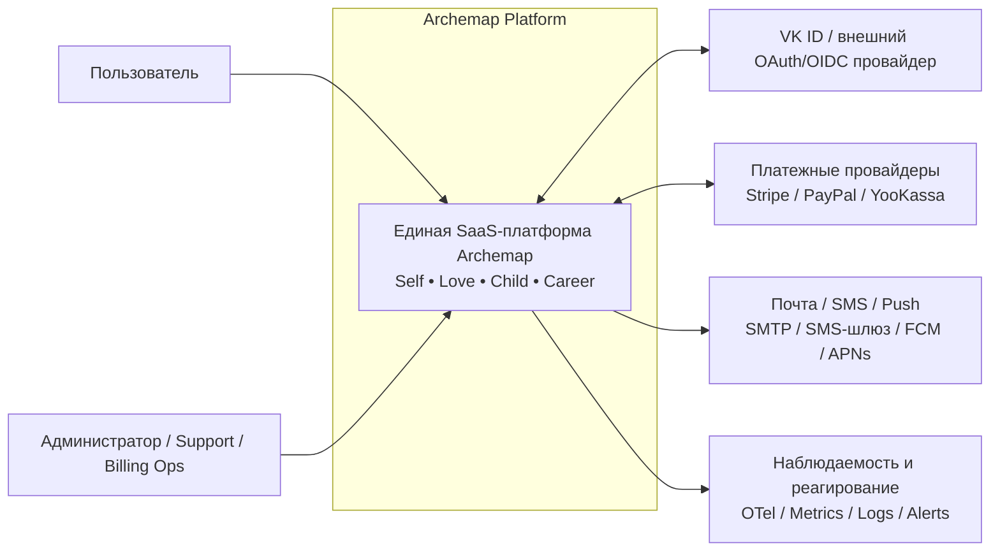
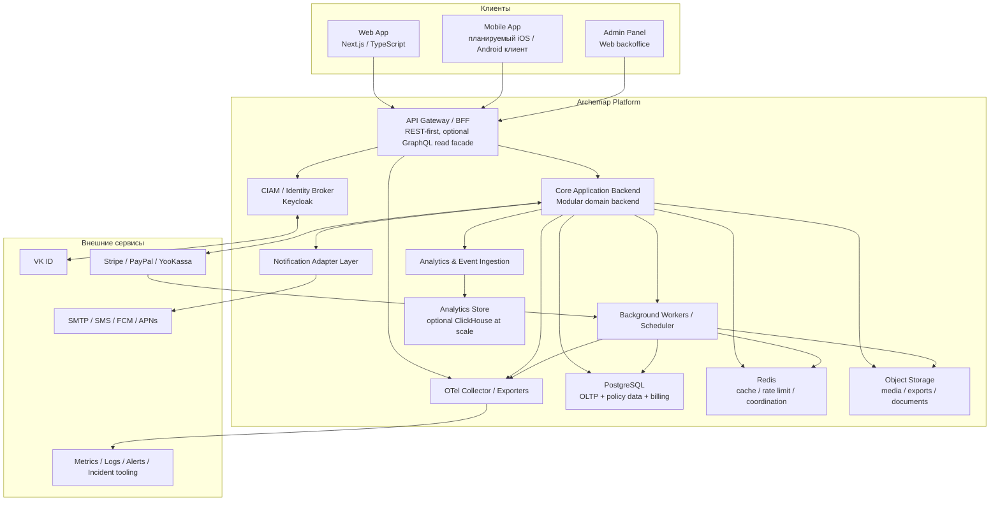
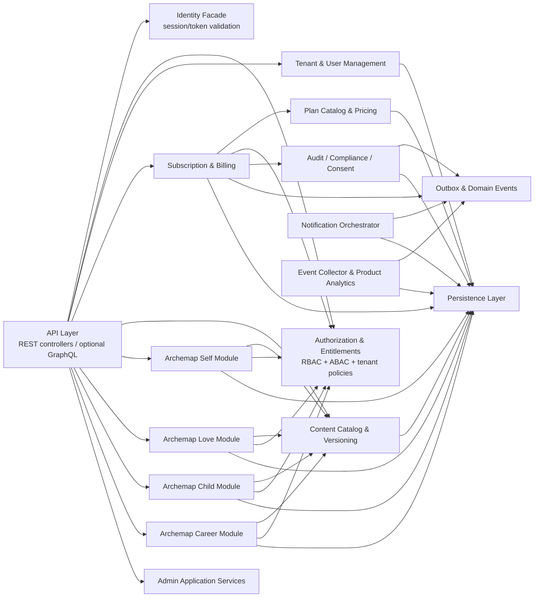
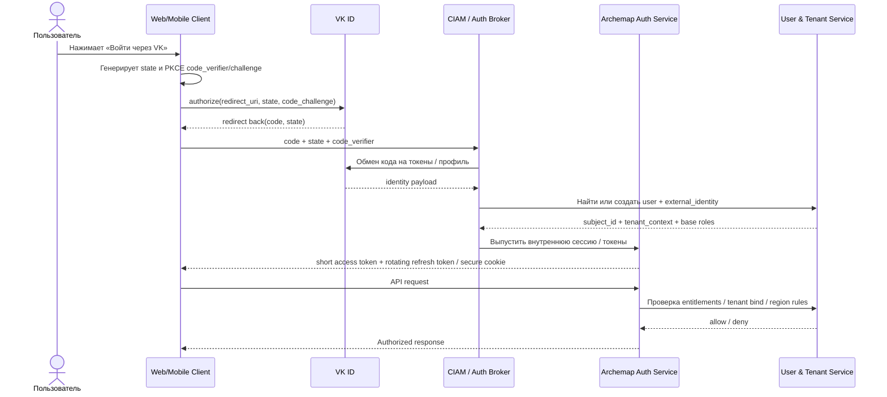
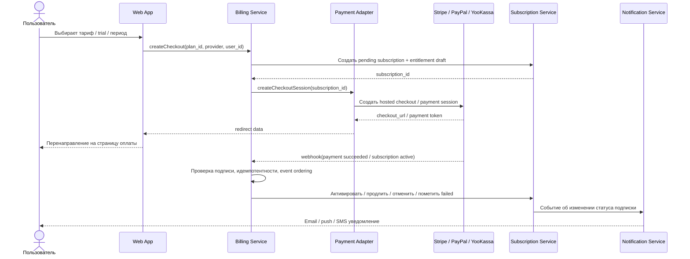
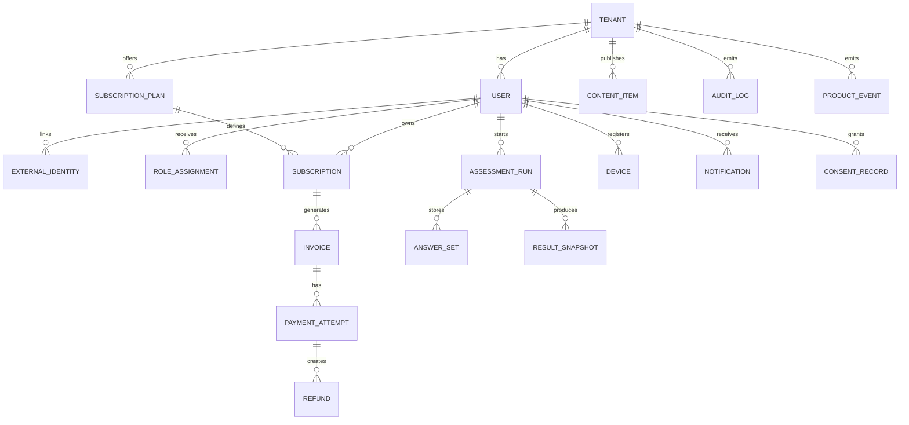

# C4-архитектура SaaS-платформы Archemap

## Резюме для руководителя

Для Archemap разумнее проектировать **единую платформу** с общими контурами идентификации, биллинга, пользовательского профиля, уведомлений, аналитики и админ-панели, а четыре продуктовых направления — **Archemap Self, Archemap Love, Archemap Child, Archemap Career** — реализовать как отдельные доменные модули внутри одной архитектурной модели. Такой подход лучше соответствует C4-модели, где сначала фиксируются уровни **system context → container → component → code**, а затем уже принимается решение, что реально выносить в отдельные deployable units. Для ваших ограничений — минимальный runtime AI, отсутствие «быстрых/экспресс» решений, мобильная готовность и требование не хардкодить бизнес-логику — наиболее устойчивым стартом будет **модульный монолит с сервисными границами**, а не преждевременный набор микросервисов. citeturn36view0turn37view0turn37view1

Контур аутентификации не стоит строить самостоятельно. Для multi-tenant SaaS это официально считается плохой идеей: современные рекомендации по multitenant-identity прямо указывают, что **собственный IdP сложен, дорог и тяжёл для безопасной эксплуатации**. Практический вариант — внешний CIAM/IdP-слой, например **Keycloak** как self-hosted identity broker, а вход через VK реализовать как внешний social/OIDC/OAuth-провайдер либо как прямую интеграцию через **VK ID SDK**, который в официальном репозитории VKCOM заявлен как SDK с поддержкой **OAuth 2.1** и использует `redirectUrl`, `state`, `codeVerifier`. Для web и mobile-клиентов обязательны **Authorization Code + PKCE**, а для native apps — системный браузер/Custom Tabs, а не embedded webview. citeturn42search2turn42search0turn42search1turn25view0turn15search0turn15search1turn15search2turn15search9

Платёжный контур нужно проектировать как **provider-agnostic abstraction**: единый внутренний интерфейс `PaymentProvider`, а снаружи — адаптеры к Stripe, PayPal и YooKassa/YooMoney. Для снижения PCI-DSS-области ответственности предпочтительны **hosted checkout / hosted fields / hosted payment page**, потому что при полном аутсорсе карточных данных на PCI-compliant third party e-commerce merchant может попадать в сценарий, близкий к **SAQ A**. У Stripe подтверждён полноценный subscription lifecycle с инвойсами, PaymentIntent и webhook-событиями; у PayPal — планы, подписки, webhooks и refunds; у YooKassa — API, webhooks, возвраты и сценарии автоплатежей через сохранённый способ оплаты. citeturn23view1turn19search2turn19search3turn19search8turn31search0turn31search6turn31search8turn31search9turn31search13turn31search19turn30search0turn30search1turn30search5turn30search8turn2search15

Если платформа будет обрабатывать персональные данные **российских граждан**, архитектура должна учитывать, что Роскомнадзор трактует 242-ФЗ как требование **локализации баз персональных данных российских граждан на территории РФ**, а оператор обязан уведомлять Роскомнадзор о начале обработки, отдельно уведомлять о трансграничной передаче до её начала, а при инциденте утечки/неправомерной передачи отчитываться в течение **24 часов** и затем **72 часов**. Если платформа также ориентирована на пользователей в ЕС, GDPR применим при предложении услуг субъектам данных в ЕС или мониторинге их поведения; GDPR требует risk-based security measures, допускает и поощряет шифрование, а в случае personal data breach требует уведомления надзорного органа **не позднее 72 часов**, а для высокорисковой обработки предусматривает **DPIA**. Это делает юридически и операционно самым простым стартовым вариантом для RU-first рынка облако с инфраструктурой в России и явным data-residency routing по субъектам данных. citeturn40view1turn40view4turn40view2turn40view3turn3search0turn17search7turn3search13turn3search1

Рекомендуемый технологический базис: **Next.js/TypeScript** для веб-клиента и админки, **Kotlin + Spring Boot + модульная доменная структура** для backend, **Keycloak** для CIAM/identity brokering, **PostgreSQL** как primary OLTP storage, **Redis** для cache/rate limiting/background coordination, **S3-совместимое object storage**, **OpenTelemetry** для observability, **OpenTofu** для IaC, **Argo CD** для GitOps CD, а документацию хранить как код через **Structurizr DSL + Markdown/ADR + OpenAPI**. Это хорошо сочетается с AI-Driven Development: текстовые модели, контракты и ADR удобно валидировать в CI/CD и использовать как контекст для AI-агентов, при этом runtime-контур остаётся детерминированным и без обязательной зависимости от ИИ. citeturn37view1turn20search4turn20search8turn20search20turn20search6turn20search7turn16search7turn16search14

## Архитектурные принципы и рамки проекта

C4-модель официально описывает четыре основных уровня абстракции — **software system, container, component, code** — и соответствующие им иерархические диаграммы. Для этого проекта это важно не как формальность, а как способ зафиксировать устойчивую архитектуру до выбора конкретных облака, платёжного провайдера и окончательной организационной модели команд. В дополнение к C4 здесь особенно полезен подход **architecture as code**: Structurizr DSL, Markdown/AsciiDoc и ADR хранятся текстом, версионируются в Git, экспортируются в Mermaid/PNG/SVG и работают как “AI-friendly” документация. citeturn36view0turn37view0turn37view1

Ключевой принцип для Archemap — **platform-first, products-second**. Это означает, что Self/Love/Child/Career — не четыре несвязанных приложения, а четыре доменных контекста над общей платформой. Общими должны быть: идентификация пользователя, tenant-context, подписка, entitlement model, billing, notification orchestration, audit trail, event schema, CMS/content versioning и observability. Такой дизайн уменьшает дублирование и упрощает мобильную эволюцию, потому что mobile app сможет использовать тот же backend contract, а не четыре разрозненных API. В multi-tenant SaaS контекст арендатора должен рассматриваться как часть идентичности, а tenant isolation — как базовая архитектурная тема, а не вторичная настройка. citeturn27search3turn27search15turn27search1turn27search4

Второй принцип — **no hardcoding in business capabilities**. На практике это означает: тарифы и entitlement matrix не кодируются константами; правила доступа не размазываются по контроллерам; внешний auth/payment/notification provider не зашивается в доменную модель; контент, анкеты, интерпретации, версии расчётов и legal texts управляются через конфигурацию, CMS или versioned data assets. Для API-контрактов это означает **contract-first** с OpenAPI как каноническим описанием HTTP API и ограниченным, осознанным использованием GraphQL только на read-side, если он действительно нужен для мобильной и web-композиции данных. OpenAPI официально предназначен именно для machine-readable, language-agnostic описания HTTP API, а GraphQL требует дополнительных защитных мер: ограничение query cost/depth, контроль introspection и строгую авторизацию на поле/резолвер. citeturn20search4turn20search8turn20search12turn16search15turn16search19turn20search1turn20search13

Третий принцип — **externalize identity, centralize authorization**. Для multitenant SaaS официальные архитектурные рекомендации предлагают использовать внешний IdP и отдельно продумать, где хранится tenant-authorization context. Иными словами: аутентификацию лучше отдать CIAM-слою, а права и entitlements держать под контролем самой платформы. Для Archemap это означает практическую схему: IdP выдаёт подтверждённую user identity, а платформа поверх этого рассчитывает роли, tenant memberships, активную подписку, региональные ограничения и product entitlements. citeturn42search2turn42search4turn42search6turn16search4

Наконец, проект должен быть **mobile-ready by design**. Это не означает немедленную разработку мобильного клиента; это означает архитектурные решения, которые её не блокируют: stateless API, versioned contracts, device registry, push notification adapters, PKCE/native-app auth, CDN/object storage для медиа и строгую идемпотентность операций, связанных с платежами и подписками. RFC 8252 прямо рекомендует для native apps использовать внешний user-agent, а не встроенный webview; Firebase Cloud Messaging и APNs дают стандартный контур для push-доставки. citeturn15search1turn15search0turn22search0turn22search1turn22search4

| Принцип | Что это означает для Archemap |
|---|---|
| Platform-first | Общие identity, billing, entitlements, CMS, analytics, notifications для всех четырёх доменов |
| CIAM вне продукта | Самостоятельный IdP не строим; используем внешний identity layer и broker/social login |
| Configuration over hardcode | Тарифы, правила, контент, legal texts, калькуляторы и provider mappings версионируются как данные |
| Contract-first | REST/OpenAPI — канон; GraphQL — только где даёт реальную ценность и закрыт security-controls |
| Tenant-aware from day one | `tenant_id`, `region_scope`, `entitlement_set`, `data_residency_policy` входят в core model |
| Runtime AI не в critical path | AI применяется для разработки, тестирования и документации, но не обязателен для runtime-сценариев |
| Mobile-ready | PKCE, versioned API, device tokens, push adapters, object storage/CDN, идемпотентные команды |

## Целевая C4-архитектура

Официальная C4-модель рекомендует строить описание архитектуры сверху вниз: сначала контекст системы, затем контейнеры, затем компоненты, а при необходимости — кодовый уровень. Ниже приведён практический C4-набор для Archemap, адаптированный под SaaS-платформу с четырьмя продуктами, внешним CIAM, подписочной монетизацией и юридическими ограничениями по персональным данным. citeturn36view0turn37view0

### Контекст системы



На уровне system context Archemap — это **одна SaaS-система**, с которой взаимодействуют конечный пользователь и операционные роли. Внешние системы здесь не «дополнения», а критические зависимости платформы: CIAM/социальный вход, платёжные провайдеры, каналы уведомлений и observability stack. Такое представление особенно важно для юридической и операционной модели: именно на этом уровне фиксируются трансграничные потоки, расположение баз персональных данных, webhook surface и зоны доверия. citeturn36view0turn40view1turn40view2turn40view4turn31search0turn31search1turn31search5

### Контейнеры



**Рекомендуемая физическая форма на старте** — не набор микросервисов, а **несколько контейнеров вокруг одного модульного backend**: web/admin, CIAM, core backend, worker/scheduler и адаптеры платформы. Это лучше соответствует вашим требованиям: меньше operational tax, проще целостная безопасность, меньше сетевой хрупкости и при этом сохраняются C4-границы, пригодные для последующего выделения в отдельные сервисы.  

На этом уровне особенно важны следующие решения:

- **Gateway/BFF** отдаёт наружу канонический REST API, versioned by contract, и при необходимости добавляет GraphQL read facade для web/mobile-композиции.
- **CIAM/Identity Broker** отделён от доменных модулей.
- **Core backend** реализует бизнес-функции всех четырёх модулей и общие capability model.
- **Workers** выносят renewals, retries, reminders, webhook processing, exports и document generation из request path.
- **Analytics store** появляется опционально: сначала достаточно event ingestion + operational aggregates в Postgres, затем при росте вводится columnar warehouse.
- **Object storage** нужен не только для медиа, но и для экспортов, отчётов, резервных артефактов и версионируемых контент-пакетов.

Технологически такая контейнерная карта хорошо ложится на managed Kubernetes и одновременно допускает частичный serverless для нерегулярных jobs: AWS Lambda, Google Cloud Run, Azure Container Apps и Yandex Serverless Containers все официально поддерживают serverless compute/containers, а Yandex Cloud отдельно предлагает managed Kubernetes, managed PostgreSQL, KMS, logging и serverless containers в инфраструктуре, физически размещённой в России. citeturn28search0turn28search1turn28search2turn28search3turn9search0turn9search1turn9search5turn9search9turn9search10turn32search3turn32search15

### Компоненты

Ниже — целевая компонентная схема для **Core Application Backend**.



Эта схема отражает главное архитектурное решение: **четыре продуктовых домена не должны дублировать platform capabilities**. У каждого из модулей Self/Love/Child/Career есть собственные application services и собственная доменная логика, но они используют единые компоненты Content Catalog, Authorization/Entitlements, User/Tenant Management, Billing и Audit.  

С практической точки зрения это даёт следующие эффекты:

- **нет хардкода тарифов** — тарифы и права живут в Plan Catalog / Entitlements;
- **нет хардкода контента** — анкеты, версии интерпретаций и scoring rules управляются Content Catalog;
- **нет рассыпанной авторизации** — policy checks централизованы;
- **нет потери событий** — side effects публикуются через outbox pattern;
- **нет смешения продуктовой и юридической ответственности** — Consent, audit trail и compliance events живут отдельно от product analytics.

Такая компонентная карта хорошо согласуется с OWASP-подходом к централизованной и проверяемой авторизации, а также с multi-tenant-архитектурами, где tenant isolation и identity context должны быть консистентны на всех уровнях приложения. citeturn16search4turn27search3turn27search4turn42search6

### Кодовый уровень

На code level достаточно зафиксировать **package/module boundaries** и правила зависимостей. Для такого проекта я рекомендую следующую раскладку:

```text
/archemap-platform
  /apps
    /web
    /admin
  /services
    /core-api
      /src/main/kotlin/com/archemap
        /identity
        /access
        /tenancy
        /users
        /billing
        /catalog
        /content
        /self
        /love
        /child
        /career
        /notifications
        /analytics
        /audit
        /shared
    /workers
  /contracts
    /openapi
    /json-schema
    /event-schemas
  /docs
    /c4
    /adr
    /runbooks
    /privacy
    /incident-response
  /infra
    /opentofu
    /kubernetes
    /argocd
```

Практически важнее не UML class diagram, а **правило направленности зависимостей**: внешние входы идут только в API/application layer; доменные модули не импортируют друг друга напрямую; межмодульные зависимости — только через contracts/events/application services; документы C4/ADR/API живут рядом с кодом и валидируются в CI. Structurizr прямо поддерживает DSL, Markdown/AsciiDoc, ADR и экспорт в Mermaid; OpenAPI даёт machine-readable contract, пригодный и для генераторов SDK, и для AI-assisted development. citeturn37view0turn37view1turn20search4turn20search8

## Сквозные сценарии и модель данных

### Аутентификация и авторизация

Для входа через VK и будущей мобильной готовности лучший сквозной сценарий — **Authorization Code Flow + PKCE**, где VK выступает внешним OAuth 2.1 / social provider, а платформа создаёт/линкует внутреннего пользователя и его tenant context после успешного обмена кода. Официальный VKCOM SDK описывает обязательные поля `app`, `redirectUrl`, `state`, `codeVerifier` и прямо указывает на поддержку **OAuth 2.1**. OIDC, в свою очередь, остаётся стандартным способом получить layer аутентификации поверх OAuth. PKCE защищает public clients от перехвата authorization code, а RFC 8252 требует для native apps использовать внешний user-agent. citeturn25view0turn15search0turn15search1turn15search2turn15search9



Для авторизации недостаточно только ролей. OWASP рекомендует **deny by default**, валидировать авторизацию на каждом запросе и придерживаться least privilege. Для Archemap это означает сочетание **RBAC + ABAC**:  
роль даёт базовый слой (`user`, `support`, `content_manager`, `billing_admin`, `super_admin`), а атрибуты уточняют доступ (`tenant_id`, `subscription_state`, `product_scope`, `region_scope`, `mfa_level`, `consent_flags`). Если вы добавите GraphQL, OWASP отдельно рекомендует контролировать input validation, query cost, insecure defaults и access control на уровне резолверов. citeturn16search4turn16search15turn16search19

### Подписка и платёжный жизненный цикл

Подписочная модель должна быть собственной частью домена, а не «побочным эффектом провайдера». Внутри платформы должны существовать канонические сущности: `Plan`, `Subscription`, `Invoice`, `PaymentAttempt`, `Entitlement`, `CancellationRequest`, `RefundRequest`. Внешний провайдер только исполняет платёжную операцию, а **источником истины по доступам** остаётся сам Archemap. Это позволяет без боли переключать PSP, комбинировать провайдеров по регионам и не хардкодить бизнес-правила в callback-handlers. Официальные docs Stripe, PayPal и YooKassa подтверждают, что подписки, webhooks и refunds поддерживаются, но operational truth лучше вести у себя. citeturn31search6turn31search8turn31search9turn31search13turn31search19turn30search0turn30search1turn30search5turn30search8



Рекомендованный **subscription lifecycle**:

- **trial**: отдельный статус с жёсткой датой окончания и event/reminder policy;
- **active**: доступ включён;
- **past_due / payment_failed**: доступ может быть ограничен grace period;
- **canceled_at_period_end**: доступ до конца оплаченного периода;
- **canceled_immediately**: для hard-stop сценариев;
- **refunded / partially_refunded**: финансовое состояние не равно entitlement state автоматически — это должно решаться вашей product policy;
- **expired**: переход в read-only/locked state.

На уровне PCI-DSS критично, чтобы платформа по возможности **не принимала PAN/CVV на собственной стороне**. Официальный SAQ A у PCI SSC описывает eligibility для merchant environments, где весь электронный account data flow аутсорсен compliant third party, а на платёжной странице браузер получает платёжные элементы только от самого payment processor. У Braintree/PayPal Hosted Fields и Stripe hosted/embedded approaches эта стратегия прямо используется, а YooKassa отдельно документирует HTTPS и ежегодную проверку по PCI DSS. citeturn23view1turn19search2turn19search3turn19search8

### Модель данных

Ниже — логическая модель, достаточная для первого production-ready релиза.



Практическая реализация этой модели хорошо ложится на **PostgreSQL как primary OLTP DB**:  
PostgreSQL даёт **Row-Level Security**, нативный **JSON/JSONB** для гибких content/config объектов и **declarative partitioning** для больших audit/event/payment tables. Поэтому рекомендованная схема — relational core для идентичности, биллинга и entitlements; JSONB для версионируемого контента, provider payload и feature flags; месячное партиционирование для `audit_log`, `product_event`, `payment_webhook_event`. citeturn34search0turn34search1turn34search2turn34search4

Важно ввести несколько архитектурных полей сразу:

- `tenant_id` — на всех tenant-bound таблицах;
- `region_scope` / `data_residency_scope` — на таблицах с PII;
- `content_version` и `calculation_version` — на результатах и контенте;
- `external_provider` и `external_ref` — на auth/payment/notification integrations;
- `correlation_id` / `idempotency_key` — на commands, webhooks и платежных операциях;
- `deleted_at` и `legal_hold` — для поддержания retention policy и прав на удаление;
- `consent_type`, `granted_at`, `revoked_at`, `source` — для privacy auditability.

Такой набор делает систему переносимой между провайдерами, пригодной для расследований и совместимой с будущей мобильной синхронизацией. citeturn16search11turn17search2turn18search1

## Безопасность и комплаенс

Базовый security baseline для Archemap стоит строить вокруг **OWASP ASVS** как проверочного стандарта и использовать профиль cheat sheets по Authentication, Authorization, Password Storage, REST, GraphQL, Secrets Management, Key Management, Cryptographic Storage и Logging. Это даёт единый нормализованный чек-лист как для code review, так и для pentest/acceptance. Отдельно стоит подчеркнуть: secure REST должен работать только по HTTPS, а GraphQL требует защиты от дорогих запросов и insecure defaults. citeturn16search1turn16search5turn16search0turn16search4turn16search9turn16search15turn16search19turn16search21turn16search17turn16search2turn16search11

С точки зрения хранения секретов архитектура должна опираться не на `.env` и не на статические ключи в CI/CD, а на **managed secret store + KMS + workload identity**. OWASP прямо указывает на необходимость централизовать хранение, provisioning, auditing и rotation секретов. На Kubernetes-слое это означает отказ от постоянных cloud credentials внутри подов: AWS рекомендует IRSA, GKE — Workload Identity Federation for GKE, AKS — Microsoft Entra Workload ID. Для российского контура аналогичную роль играют service accounts/IAM Yandex Cloud. citeturn16search21turn16search17turn33search1turn33search4turn33search2turn33search3

GDPR и российское законодательство стоит закладывать не как «юридическую документацию потом», а как **архитектурный routing policy**. GDPR применим, если сервис предлагает товары/услуги субъектам данных в ЕС или мониторит их поведение; также GDPR требует risk-based security measures, breach notification within 72 hours и DPIA для high-risk processing. Для Archemap это особенно актуально, если используются профилирование, чувствительные жизненные категории или данные о детях. Со стороны РФ нужны локализация баз ПД граждан РФ, уведомление Роскомнадзора о начале обработки, уведомление о трансграничной передаче до её начала и сообщения об инцидентах в 24/72 часа. **Вывод-следствие**: если планируется одновременно RU и EU рынок, лучше сразу проектировать два policy-domain: RU data plane и EU/global data plane, а любые cross-border exports оформлять как контролируемые и минимизированные потоки, а не как «одна глобальная БД для всех». Это архитектурный вывод из нормативных требований. citeturn40view1turn40view2turn40view3turn40view4turn3search0turn17search7turn3search13turn3search1

Для операционного контроля рекомендую **единый observability слой на OpenTelemetry** с обязательной корреляцией traces, metrics и logs, плюс алертинг на базе четырёх golden signals: latency, traffic, errors, saturation. Для incident response ориентиром стоит взять актуальный NIST SP 800-61 Rev. 3, который теперь встроен в CSF 2.0 risk-management model. Практически это означает: runbooks, incident classification, evidence retention, post-incident review, регулярные breach/tabletop exercises и доказуемо работающий процесс restore drill. citeturn16search7turn16search3turn16search10turn16search14turn39view0turn39view1turn39view2turn39view3turn39view4turn18search1

| Область | Что обязательно заложить | Основание |
|---|---|---|
| Аутентификация | OIDC/OAuth 2.1, PKCE для public clients, short-lived access token, rotating refresh token, MFA-ready flows | citeturn15search0turn15search1turn15search2turn25view0turn16search0 |
| Авторизация | Deny-by-default, server-side checks на каждый запрос, least privilege, RBAC + ABAC, tenant isolation | citeturn16search4turn27search3turn27search4 |
| API security | HTTPS only, input validation, idempotency keys, rate limiting, anti-replay для webhooks, query cost/depth limits для GraphQL | citeturn16search15turn16search19turn31search0turn31search1turn31search5 |
| Секреты и ключи | KMS, secret manager, rotation, audit trail, отсутствие статических ключей в pod/runner | citeturn16search21turn16search17turn33search1turn33search2turn33search4 |
| Шифрование | TLS in transit, encryption at rest, отдельные ключи по средам и типам данных, password hashing вместо reversible encryption | citeturn16search2turn16search9turn16search15turn17search3 |
| Платежи | Hosted checkout / hosted fields, не хранить PAN/CVV, проверять подписи вебхуков, независимая entitlement model | citeturn23view1turn19search2turn19search3turn19search8turn31search0turn31search1turn31search5 |
| Логи и аудит | Structured logs, trace IDs, redaction PII, immutable audit trail для admin/security/billing событий | citeturn16search11turn16search10turn16search14 |
| Мониторинг и алерты | Metrics/traces/logs, golden signals, actionable alerts, low-noise paging | citeturn39view0turn39view1turn39view2turn39view3turn39view4turn17search2 |
| Incident response | CSF-aligned IR plan, runbooks, tabletop exercises, breach workflow, restore drill | citeturn18search1turn18search5 |
| GDPR | Risk-based controls, breach 72h, DPIA for high-risk processing, records/process discipline | citeturn3search0turn17search7turn3search13turn3search1 |
| Россия | Локализация БД ПД граждан РФ, уведомление о начале обработки, уведомление о трансграничной передаче, инцидент 24h/72h | citeturn40view1turn40view2turn40view3turn40view4 |

## Варианты платформы и рекомендуемый стек

### Сравнение облачных вариантов

| Вариант | Что подтверждено официально | Компромиссы | Когда выбирать | Источники |
|---|---|---|---|---|
| Yandex Cloud | Managed Kubernetes, Managed PostgreSQL, KMS, logging, serverless containers; Yandex Cloud документирует регионы и дата-центры в России | Более узкая глобальная экосистема, чем у hyperscalers | RU-first рынок, строгая локализация ПД, пониженная юридическая сложность по РФ | citeturn9search0turn9search1turn9search5turn9search9turn9search10turn28search3turn32search3turn32search15 |
| AWS | Global Regions/AZs, EKS, RDS automated backups/PITR, Lambda, IAM roles for service accounts, SaaS Lens | Для российских ПД потребуется отдельная локализационная стратегия | Global-first SaaS, зрелые команды DevOps/Platform, сложные multi-tenant сценарии | citeturn32search0turn32search4turn29search0turn29search12turn28search0turn33search1turn27search0turn27search3 |
| Google Cloud | Global regions, GKE, Cloud SQL backups/CMEK, Cloud Run, Workload Identity Federation for GKE | Требует отдельной стратегии под РФ-локализацию | Product analytics, managed Kubernetes + serverless, сильный fit для platform engineering | citeturn32search1turn28search1turn28search13turn29search1turn8search14turn33search4 |
| Azure | Global regions, AKS, Azure Database for PostgreSQL with automatic backups and encrypted backups, Key Vault, Entra Workload ID, сильная официальная multitenant-guidance | Тоже требует отдельной стратегии под РФ-локализацию | B2B/SaaS с enterprise identity-federation и сильным Microsoft ecosystem fit | citeturn32search2turn33search2turn29search6turn8search7turn8search18turn27search1turn27search4 |

Если главный рынок — Россия и нужно минимизировать юридическую сложность по 152-ФЗ/242-ФЗ, старт на **Yandex Cloud** выглядит наиболее прямолинейным. Если в приоритете глобальный B2C/B2B рост, то **GCP** и **Azure** выглядят наиболее balanced для managed container platform + identity guidance, а **AWS** остаётся очень сильным вариантом при наличии зрелой cloud-команды и явной SaaS/multitenancy экспертизы. Для смешанного сценария RU+EU я бы рекомендовал не «одну глобальную БД», а **hybrid или split data plane**. citeturn40view1turn40view2turn27search1turn27search3turn32search15

### Сравнение вариантов хранилища данных

| Вариант | Сильные стороны | Ограничения | Роль в Archemap | Источники |
|---|---|---|---|---|
| PostgreSQL | Row-Level Security, JSON/JSONB, declarative partitioning, mature relational model | Нужен аккуратный дизайн для аналитики очень больших объёмов | Лучший primary OLTP выбор для identity, subscriptions, content metadata, audit | citeturn34search0turn34search1turn34search2turn34search4 |
| MySQL | Зрелая managed ecosystem, JSON поддерживается через generated columns/индексацию | Менее удобен для tenant-aware policy/data modeling, чем PostgreSQL | Допустим как OLTP-альтернатива, если команда уже сильна в MySQL | citeturn10search1turn10search5turn10search9 |
| MongoDB | Гибкая документная модель, distributed transactions, change streams | Меньше естественности для строгих billing/authorization relations | Полезен, если контент сверхдинамичный, но я не рекомендую как единственную primary DB | citeturn10search2turn10search6turn10search10 |
| ClickHouse | Column-oriented OLAP, materialized views, высокая скорость аналитики | Не primary OLTP БД | Лучший второй шаг для product analytics и event warehouse при росте | citeturn35search1turn10search23turn10search19turn35search10 |

Итоговая рекомендация по данным: **PostgreSQL как primary system of record**, **Redis** для latency-sensitive технических функций, **object storage** для бинарных/экспортных артефактов, а **ClickHouse** — только когда объём product events и аналитических отчётов оправдает отдельный OLAP-слой. citeturn34search0turn34search1turn35search1

### Сравнение платёжных провайдеров

| Провайдер | Что подтверждено официально | Сильный fit | Комментарий по архитектуре | Источники |
|---|---|---|---|---|
| Stripe Billing | Subscriptions, invoices, PaymentIntent, webhooks, refunds | Международная подписочная логика и мощный billing lifecycle | Лучший выбор, если важны гибкие subscription states, invoices, dunning и развитая billing-модель | citeturn31search6turn31search8turn31search0turn30search0turn30search3turn19search8 |
| PayPal Subscriptions | Plans/subscriptions, webhooks, refunds, JS SDK с подписками | Аудитория, где высока доля PayPal-оплат | Хорош как дополнительный provider или основной при сильном PayPal-fit; доменную модель биллинга всё равно держать у себя | citeturn31search9turn31search13turn31search1turn31search19turn30search1turn30search4 |
| YooKassa | API для платежей и возвратов, webhooks, security page, сценарии автоплатежей с сохранением способа оплаты | RU-first рынок и локальные методы оплаты | Практически лучший выбор для российского контура, особенно при локальных способах оплаты и юридической интеграции | citeturn30search5turn30search8turn19search3turn2search15turn2search18 |

Архитектурно я рекомендую **не выбирать один провайдер навсегда**, а ввести внутренний слой `Billing Core + PSP Adapters`. Тогда выбор PSP становится конфигурационным решением по рынку/юрисдикции, а не переломом доменной модели. При этом `Subscription` и `Entitlement` остаются внутренними сущностями, а provider-specific objects живут как ссылки/снэпшоты. citeturn31search6turn31search13turn30search5

### Рекомендуемый стек

| Слой | Рекомендация | Почему |
|---|---|---|
| Web / Admin | Next.js + TypeScript | Один технологический стек для public site, кабинета и backoffice, хороший SSR/SEO и удобная mobile-ready эволюция |
| CIAM | Keycloak + broker/direct social integration for VK | Не строим собственный IdP; получаем OIDC/OAuth, identity brokering, social login, admin console и дальнейшую enterprise federation готовность citeturn42search0turn42search1turn42search3turn42search7turn42search2 |
| Backend | Kotlin + Spring Boot + модульная доменная структура | Сильный fit для non-express production backend, транзакционности, security и долгоживущего SaaS-кода |
| API | REST/OpenAPI как канон; GraphQL только как optional read facade | REST проще защищать и версионировать; OpenAPI машиночитаем; GraphQL нужен только по реальной read-composition потребности citeturn20search4turn20search8turn16search15turn16search19 |
| Data | PostgreSQL + Redis + S3-compatible storage | Наиболее сбалансированный OLTP-набор для entitlements, billing, user data и кеша citeturn34search0turn34search1turn34search2 |
| Analytics | Operational analytics first; ClickHouse later | Не плодим лишнюю сложность раньше времени, но оставляем clear upgrade path citeturn35search1turn10search23 |
| Infra | Managed Kubernetes как default; serverless для webhooks/jobs/exports | Максимальная переносимость и контроль при сохранении опции дешёвых event-driven нагрузок citeturn28search0turn28search1turn28search2turn28search3 |
| IaC / CD | OpenTofu + Argo CD | IaC без vendor lock-in и предсказуемый GitOps deployment flow citeturn20search6turn20search7 |
| Observability | OpenTelemetry + Prometheus-compatible metrics + centralized logs/traces | Vendor-neutral instrumentation и хорошая связка с golden signals / incident response citeturn16search7turn16search14turn17search2turn39view0 |
| Документация | Structurizr DSL + ADR + OpenAPI + runbooks | AI-friendly docs-as-code, CI validation и прозрачные архитектурные изменения citeturn37view0turn37view1turn20search4 |

## Delivery и эволюция к мобильным приложениям

Для delivery-процесса здесь лучше всего работает **Git-based docs-and-code pipeline**, где архитектурные артефакты валидируются вместе с кодом. GitHub Actions и GitLab CI официально поддерживают workflow/pipeline YAML; GitLab отдельно документирует review apps и environments; Argo CD использует Git как source of truth для desired state в Kubernetes; SLSA задаёт модель постепенного усиления supply-chain integrity. Это позволяет не только гонять тесты, но и проверять, что OpenAPI, Structurizr DSL, ADR-ссылки, миграции БД и deployment manifests согласованы между собой. citeturn21search0turn21search3turn21search7turn21search1turn20search7turn21search2turn21search11turn21search23

```mermaid
flowchart LR
    pr["Merge Request / Pull Request"]
    checks["Lint • Unit Tests • SAST • Dependency Scan"]
    contracts["Validate OpenAPI • Structurizr DSL • ADR links"]
    build["Build image • SBOM • Provenance / signing"]
    review["Preview / Review App"]
    staging["Deploy to Staging via Argo CD"]
    e2e["Integration • E2E • DB migration checks • Smoke tests"]
    approval["Manual approval / change window"]
    prod["Progressive deploy to Production"]
    observe["Post-deploy observability • rollback guard"]

    pr --> checks --> contracts --> build --> review --> staging --> e2e --> approval --> prod --> observe
```



Я бы закладывал такой CI/CD outline:

- **на PR**: lint, tests, SAST/SCA, contract validation;
- **на merge в main**: сборка контейнера, SBOM/provenance, push в registry;
- **preview**: review environment для web/admin/API;
- **staging**: deploy через GitOps;
- **pre-prod gate**: e2e + migration checks + synthetic smoke;
- **prod**: progressive rollout + автоматический rollback при нарушении SLO/alerts;
- **post-release**: архитектурный diff, changelog, runbook update.

Это особенно важно для вашего требования **AI-Driven Development, но без «магии» в production**: AI может генерировать tests, markdown, DSL-изменения и кодовые предложения, но все изменения проходят через тот же deterministic pipeline. citeturn37view1turn21search2turn20search7

Переход к мобильным приложениям проще всего строить поэтапно:

| Этап | Что нужно уже сейчас | Что это даст позже |
|---|---|---|
| Web-first | Versioned REST API, PKCE-ready auth, device table, push adapter abstraction, object storage | Не придётся ломать backend при первом мобильном клиенте |
| Mobile beta | System browser auth, token rotation, device-token registration, payload minimization, mobile analytics schema | Нормальный iOS/Android onboarding без переписывания identity/payment flows |
| Scale-out | Separate mobile BFF only if реально потребуется, offline-friendly sync endpoints, background jobs for reminders/docs | Можно добавлять rich mobile UX без разрушения core platform |

Для native mobile нужно строго придерживаться **RFC 8252**, а для push-канала — использовать вендорские платформы наподобие **FCM/APNs** через общий adapter layer. Это значит, что backend уже сейчас должен уметь хранить `device_id`, `push_token`, `platform`, `token_updated_at`, `notification_preferences` и `consent_flags`. citeturn15search1turn22search0turn22search1turn22search4

## Открытые вопросы и ограничения

Ниже — ключевые вопросы, которые остаются открытыми не потому, что архитектура не сформирована, а потому что они действительно влияют на выбор конкретных реализаций:

- **Юрисдикции и рынок запуска.** Если старт строго RU-first, выбор облака и PSP резко смещается в сторону российского контура; если сразу EU/global, допустим другой баланс.
- **Модель tenant-а.** Будет ли tenant означать brand/white-label/partner/workspace, или на старте это один platform-tenant для B2C? От этого зависит глубина tenancy model и admin isolation.
- **CIAM-сценарии кроме VK.** Нужны ли email/password, passwordless, enterprise SSO/SAML, MFA с первого релиза, или VK/social login — только дополнительный onboarding path?
- **Контентный контур.** Насколько бизнес хочет управлять контентом и версиями интерпретаций через админку, а не через Git-managed content packs?
- **Политика отмен и возвратов.** Архитектура поддерживает и immediate cancellation, и cancel-at-period-end, и partial refunds, но конкретные бизнес-правила должны быть зафиксированы отдельно в billing policy.
- **Аналитика и privacy.** Нужна ли глубокая поведенческая продуктовая аналитика с сегментацией, или достаточно operational + subscription analytics. Для сценариев с profiling и данными о детях я бы считал DPIA вероятно необходимой мерой. citeturn3search13turn3search1

При этих оговорках финальная рекомендация остаётся устойчивой: **единая платформенная архитектура, модульный backend, внешний CIAM, provider-agnostic billing, PostgreSQL как ядро, OpenAPI/Structurizr/ADR как документы-код, Kubernetes как базовая платформа и serverless только как дополняющий слой**. Это даёт хороший баланс между скоростью запуска, нормативной устойчивостью, понятной эксплуатацией и будущим ростом к мобильным приложениям.