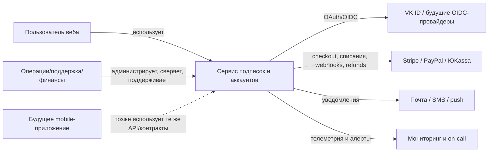
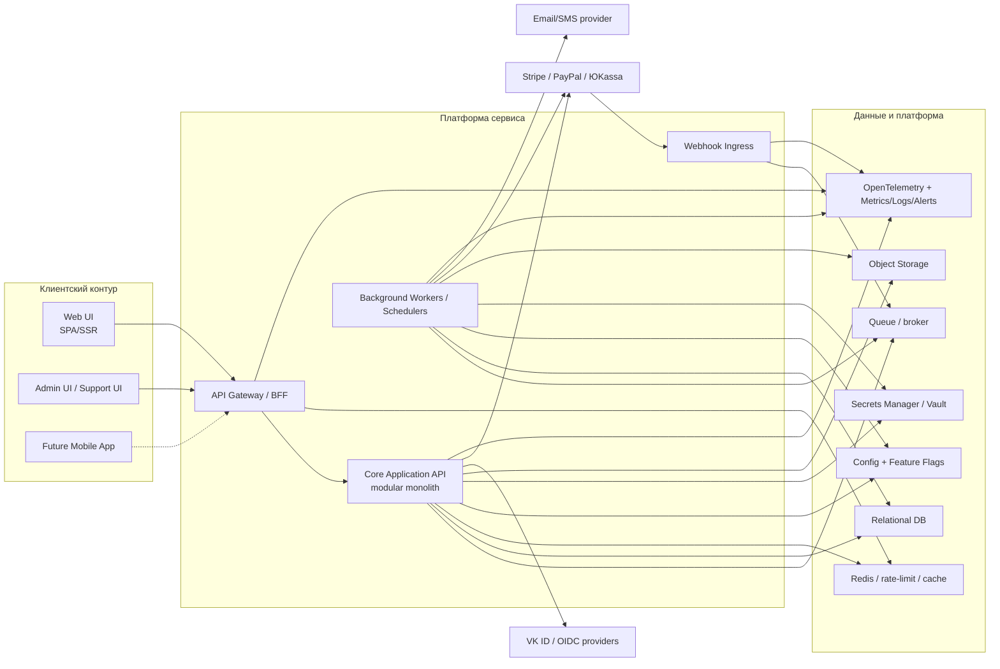
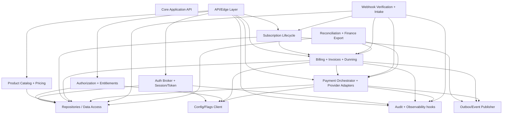
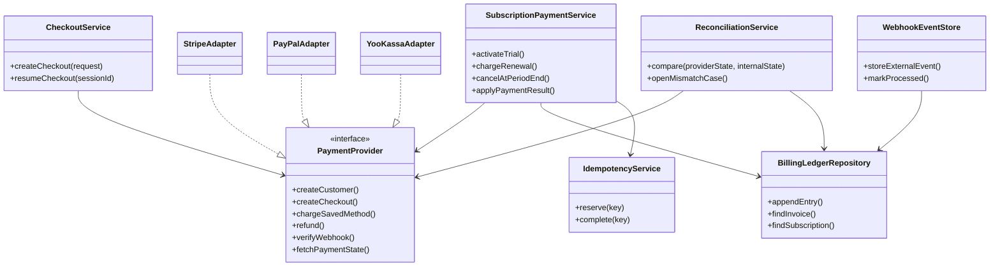
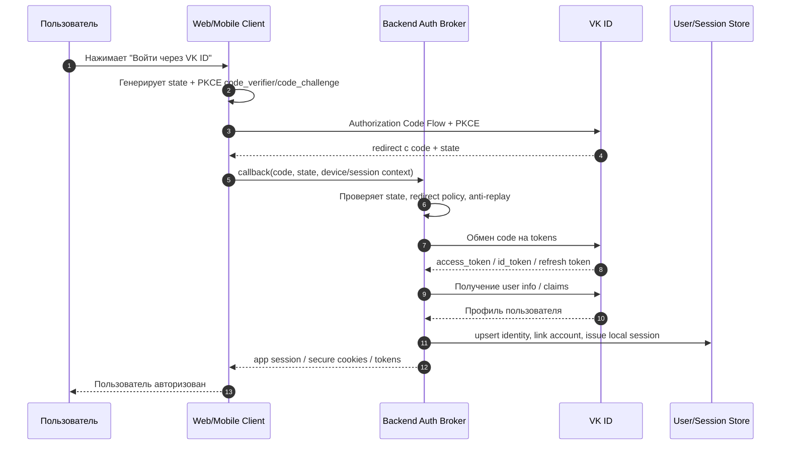

# C4-архитектура веб-сервиса с авторизацией, безопасностью и подписочными платежами

## Резюме для руководителя

Для заданных условий наиболее устойчивой отправной точкой выглядит **модульный монолит с чёткими доменными границами**, а не ранний набор микросервисов: это даёт меньшую архитектурную хрупкость на старте, но сохраняет естественный путь к выделению контейнеров и сервисов позже. В терминах C4 это означает: один основной backend-контейнер с хорошо отделёнными компонентами `Auth`, `Subscription`, `Billing`, `Payment Orchestration`, `Webhook Intake`, `Reconciliation`, `Config/Flags`, `Audit/Observability`, плюс отдельные контейнеры для фронтенда, фоновых workers и инфраструктурных зависимостей. Такой подход хорошо согласуется с C4-моделью как иерархией context/container/component/code, а для долгоживущей документации лучше использовать “models as code” и экспорт диаграмм из единой модели в Mermaid/SVG/PNG, чтобы документация не дрейфовала от реальности. citeturn23search0turn23search1turn23search2turn23search7turn40search2turn40search1turn40search21turn23search3

Для аутентификации стоит проектировать **не “VK-only login”, а слой identity brokerage**: VK ID как первый провайдер, но через абстракцию “external IdP adapter registry”. Это особенно важно, потому что VK ID уже опирается на OAuth 2.1, а официальные VK ID SDK для web, iOS и Android прямо заявляют поддержку OAuth 2.1 и альтернативных входов через VK, OK и Mail; значит, архитектура с provider adapters и PKCE по умолчанию одновременно удовлетворяет текущему требованию и будущему росту в мобильные клиенты. OAuth 2.1 и RFC 7636/9700 делают PKCE, строгие `redirect_uri`, отказ от implicit flow и более жёсткую security posture фактической базовой линией. citeturn32search0turn33search1turn33search2turn25search0turn25search1turn25search2turn25search9

Для платежей нужен **не “интегратор одного PSP”, а слой payment orchestration** с провайдер-адаптерами, webhook verification, идемпотентностью, ledger/учётным слоем и reconciliation. Stripe даёт наиболее богатую глобальную подписочную функциональность, включая dedicated docs по subscriptions, webhook events, hosted customer portal и usage-based billing; PayPal даёт сильное глобальное покрытие и mature API подписок; ЮKassa сильна для российского рынка, автоплатежей, локальных способов оплаты, webhook-модели и интеграции с требованиями вроде чеков/54‑ФЗ. При этом PCI DSS надо трактовать как обязательный baseline для всех, кто может повлиять на безопасность cardholder-data environment; hosted checkout/iframe‑подходи уменьшают scope, но не отменяют саму обязанность корректно определить применимость SAQ/controls. citeturn11search6turn11search0turn11search16turn38search1turn38search3turn38search0turn11search17turn13search1turn13search6turn14search0turn16search2turn16search4turn16search6turn39search0turn39search9turn39search13turn39search17turn39search8

Если регион эксплуатации пока не определён, разумная стратегия такая: **архитектурно проектировать “global-ready”, а коммерчески включать провайдеры по регионам**. То есть ядро подписок и платежного учёта должно быть нейтральным к PSP, а конкретный checkout/provider выбирается конфигурацией и feature flags, а не hardcoded ветками. Это одновременно уменьшает lock-in и делает систему удобной для AI-Driven Development: OpenAPI/AsyncAPI, schema registry, provider contracts, diagrams-as-code, code generation и contract testing превращают архитектуру в машиночитаемый набор артефактов, с которым AI-инструменты работают значительно качественнее и безопаснее, чем с prose-only документацией. citeturn21search0turn21search3turn21search8turn37search1turn37search13turn8search3turn20search2turn20search6turn20search0turn20search4turn20search1turn26search6turn40search2turn40search7

## Исходные допущения и архитектурные принципы

Поскольку стек, регион и целевой масштаб не заданы, ниже описана **вендор-нейтральная reference architecture**, рассчитанная на путь “веб-сервис сейчас → mobile-ready платформа позже”. Основное допущение: сервис **не должен зависеть от AI в runtime-критическом path**, но должен быть устроен так, чтобы AI-инструменты могли безопасно ускорять проектирование, кодогенерацию, ревью контрактов, тестирование и обновление документации. Это хорошо сочетается с C4-подходом и моделированием архитектуры как данных, а не только как картинок. citeturn23search0turn24search2turn40search2turn40search3

Из этого следуют пять жёстких принципов. Во-первых, **вся интеграционная поверхность должна быть machine-readable**: OpenAPI для HTTP APIs, AsyncAPI для event/webhook-потоков, схемы событий в реестре, а не только wiki-страницы. OpenAPI официально определяет стандарт, который позволяет и людям, и машинам понимать API без чтения исходников; AsyncAPI делает то же для message-driven интерфейсов; реестр схем нужен для управляемой эволюции контрактов. citeturn37search1turn37search5turn37search19turn8search3turn20search2turn20search6

Во-вторых, **никакого hardcoding бизнес-вариантов**: провайдеры OAuth и PSP должны подключаться через adapters и конфигурацию. Feature flags не должны подменять системную конфигурацию: OpenFeature задаёт вендор-нейтральный API feature flags, а Unleash отдельно подчёркивает, что feature flags — это short-lived runtime switches, а не замена статической конфигурации. Значит, callback URLs, client IDs, webhook secrets, тарифные планы, доступные PSP/IdP, региональные правила и rollout-политики должны жить в управляемой config-модели, а не в коде. citeturn21search0turn21search3turn21search8

В-третьих, **сильная доменная модель для подписок и денег**. Для подписок, инвойсов, платежных попыток, возвратов, entitlement-статусов и webhook-событий нужен реляционный source of truth с явным audit trail. Внешние PSP по определению асинхронны и присылают события webhook-ами; Stripe, PayPal и ЮKassa все опираются на обратные уведомления для подписочных статусов и платёжных переходов, поэтому ваша база должна быть authoritative business ledger, а не “тонкой прокладкой над чужим кабинетом”. citeturn11search0turn11search18turn11search13turn14search0turn38search0turn31search1

В-четвёртых, **безопасность должна быть системной, а не точечной**. OWASP ASVS задаёт базовую рамку технических security controls; API Security Top 10 2023 отдельно выделяет broken object-level authorization, broken authentication и unrestricted resource consumption как самые типовые риски API-систем; OWASP также рекомендует централизованное secrets management, rate limiting, secure logging, secure session management и threat modeling как часть SDL. Для платёжного контура это дополняется PCI DSS baseline и ограничением card-data scope. citeturn8search4turn10search1turn10search18turn10search2turn8search8turn29search2turn29search14turn30search0turn16search2turn39search17

В-пятых, **операционная модель должна быть эволюционной**. Kubernetes даёт HPA, PDB, Jobs/CronJobs и Gateway API; Knative добавляет serverless-абстракции поверх Kubernetes; Argo CD и Terraform поддерживают declarative GitOps и IaC; OpenTelemetry и Prometheus/Alertmanager закрывают observability. Это не означает, что всё нужно включить в первой итерации, но означает, что проектировать сразу надо так, чтобы later-stage scaling не требовал переписывания домена. citeturn9search1turn9search4turn9search2turn9search0turn8search18turn18search2turn18search18turn18search11turn18search8turn18search20turn18search1turn18search9

## C4-архитектура

Ниже приведены **Mermaid-представления C4-уровней**. Для production-документации я рекомендую хранить их как **единую C4-модель в Structurizr DSL** и экспортировать в Mermaid и SVG/PNG; Structurizr официально поддерживает models-as-code, экспорт в Mermaid и экспорт диаграмм в SVG/PNG. Это особенно полезно для AI-friendly документации: PR-ревью видит diff модели, а AI-инструменты могут работать не с “картинкой”, а со структурированным описанием архитектуры. citeturn40search2turn40search7turn40search1turn40search21

**System Context**



Context diagram в C4 нужен для показа людей и внешних систем, а не для детализации технологий; именно на этом уровне важно явно показать, что сервис зависит и от IdP, и от PSP, и от собственных внутренних операторов/финансовых ролей. citeturn23search8turn23search7

**Container**



Container diagram в C4 показывает распределение ответственности между приложениями и data stores; формально контейнер — это приложение или хранилище. Для вашего случая оптимален именно такой container split: отдельные UI, единый core backend, отдельный webhook ingress и отдельные workers. Это даёт хорошую операционную изоляцию для тяжёлых или повторяемых задач, но не форсирует premature microservices. Kubernetes даёт нативные механизмы для autoscaling, scheduled jobs и availability control на уровне workloads. citeturn23search1turn9search1turn9search2turn9search13

**Component**



Component diagram имеет смысл делать именно для **core backend container**, потому что здесь находятся бизнес-границы и точки потенциального выделения в отдельные сервисы. В C4 component diagram рекомендуется только если он добавляет ценность; в вашем случае он добавляет её, потому что одновременно надо контролировать auth, payments, billing и security boundaries. citeturn23search2turn23search4

**Code**

Ниже — code-level zoom для компонента `Payment Orchestrator`, потому что именно он на практике чаще всего становится источником hardcoding, дублирования логики и vendor lock-in.



Code diagram в C4 — это zoom на реализацию отдельного компонента. В реальном проекте его стоит автоматически получать из кода или модели, а не рисовать руками, если документация должна жить долго; C4 прямо отмечает, что component/code-представления полезно автоматизировать. citeturn23search7turn23search3

**OAuth sequence для VK ID и mobile-ready auth**



Такой flow соответствует современному baseline: OAuth 2.1, PKCE, строгая валидация redirect/state и отказ от implicit flow. Он одинаково пригоден для web и mobile-ready сценариев; для VK ID это дополнительно согласуется с официальными web/iOS/Android SDK, которые позиционируются вокруг OAuth 2.1. citeturn25search0turn25search1turn25search2turn25search9turn32search0turn33search1turn33search2

## Модули платформы и ключевые решения

Ниже — рекомендуемый набор модулей и их ответственность. Здесь принципиально не предлагается один “магический” стек; предлагается **граница ответственности**, которая потом может быть реализована на любом зрелом стеке.

| Модуль | Ответственность | Что исключить из hardcoding |
|---|---|---|
| `API Gateway / BFF` | TLS termination, routing, auth prechecks, rate limiting, request shaping, API version routing, mobile-friendly фасад | Правила маршрутизации, лимиты, CORS, rollout rules должны быть декларативны; в Kubernetes переносимый вариант — Gateway API. citeturn9search0turn9search6turn10search2 |
| `Auth Broker` | Вход через VK ID и будущие OIDC/OAuth-провайдеры, account linking, token exchange, session issuance | Client IDs, scopes, redirect URIs, provider toggles, account-linking policy — в конфиге; PKCE/state обязателен. citeturn32search0turn33search1turn33search2turn25search1turn25search2 |
| `Authorization + Entitlements` | RBAC/ABAC, доступ к premium-возможностям, BOLA-safe checks на уровне ресурса | Роли, тарифные entitlement-наборы, grace periods и experimental permissions — как данные, не как `if plan == PRO`. OWASP отдельно подчёркивает важность object-level authorization. citeturn30search1turn10search1 |
| `Catalog + Pricing` | Продукты, планы, цены, trial, coupons, локализация валют/presentation | Прайсинг и plan matrix должны храниться как versioned config/data; для usage-based сценариев нужен отдельный метрический слой. Stripe и PayPal официально поддерживают фиксированные и usage/seat-like модели. citeturn35search12turn35search13turn38search0 |
| `Subscription Lifecycle` | Создание/изменение/пауза/отмена подписки, grace, proration, renewal schedule | Timing, proration policy, cancel-at-period-end и upgrade/downgrade policy не должны зашиваться в UI. Stripe и PayPal явно поддерживают lifecycle operations для subscriptions. citeturn11search6turn34search10turn38search2turn38search12 |
| `Payment Orchestrator` | Checkout, charge attempts, retries, refunds, provider adapters | Provider-specific fields — внутри adapters; внешне только внутренний canonical payment contract. Idempotency для create/update обязателен как минимум для Stripe и рекомендуется как общий паттерн. citeturn31search3turn31search15turn14search0 |
| `Webhook Intake` | Verify, persist, dedupe, ack fast, enqueue heavy work | Нельзя делать бизнес-логику “в теле webhook handler”; Stripe retry’ит до 3 дней, ЮKassa ждёт HTTP 200 и продолжает доставку до 24 часов, PayPal требует verification. citeturn31search0turn14search0turn31search16turn31search13 |
| `Billing + Ledger` | Инвойсы, credit notes, платёжные попытки, dunning, audit trail | Биллинг должен быть внутренним источником истины для доступа/денег; у Stripe есть отдельный Billing product и customer portal, но ваша бизнес-логика не должна жить только в PSP. citeturn11search9turn35search12turn38search1 |
| `Reconciliation + Finance` | Сверка внутреннего ledger с состоянием PSP, case management для mismatch | Не полагаться только на webhook order; периодическая server-to-server сверка обязательна, особенно для refunds/chargebacks/late events. Под это хорошо подходят workers и scheduled jobs. citeturn11search18turn31search1turn14search0turn9search2 |
| `Background Workers` | Renewal jobs, email, retries, reconciliation, report generation | Планировщик и queue должны быть отдельными от request path; Kubernetes Jobs/CronJobs подходят как базовый механизм. citeturn9search2turn9search11 |
| `Config + Feature Flags` | Remote config, staged rollout, region/provider enablement | Флаги — для rollout и экспериментов; долгоживущая конфигурация — в config service. OpenFeature + удалённый flag provider снижают lock-in на уровне кода. citeturn21search0turn21search3turn21search8 |
| `Observability + Audit` | Traces, metrics, logs, audit events, alerting | Логи должны коррелироваться с trace/span context; OpenTelemetry это поддерживает как vendor-neutral модель, Alertmanager закрывает dedupe/routing alert’ов. citeturn18search8turn18search20turn18search0turn18search1 |
| `Secrets + Keys` | OAuth secrets, webhook secrets, DB creds, signing keys, rotation | Kubernetes Secrets недостаточны как единственное решение: base64 — не шифрование; нужен внешний secrets manager/Vault/ESO. citeturn19search1turn19search22turn19search0turn19search6turn19search14 |

Из storage-patterns я бы рекомендовал **основную реляционную БД** для пользователей, identity links, plans, subscriptions, ledger и invoices; **Redis** для rate limiting, short-lived session/cache/use-case ускорения; **очередь/брокер** для webhook fan-out и фоновых задач; **object storage** для отчётов, экспортов и неизменяемых артефактов; **schema registry** для event schemas. Это не “выбор конкретного бренда”, а минимальный набор ролей данных, который отвечает требованиям по подпискам, платежам и эволюции API/event contracts. Под описания event-driven API и схем подходит AsyncAPI + registry. citeturn8search3turn20search2turn20search6

Для AI-Driven Development я бы установил такой baseline артефактов как source of truth: `workspace.dsl` для C4/Structurizr, `openapi.yaml` для HTTP, `asyncapi.yaml` для webhooks/events, `schemas/*` в registry, `adr/*` для ключевых решений, `policy/*` для authorization rules, `terraform/*` и `helm/*`/`kustomize/*` для среды. Это не “AI-архитектура”, а **архитектура с высокой машинной читаемостью**, где AI помогает генерировать SDK, тесты, документацию и review hints, но не заменяет формальные контракты. citeturn40search2turn40search7turn37search1turn8search3turn20search0turn20search3turn20search1turn18search11

Ниже — минимальный пример OpenAPI-фрагмента для mobile-ready API: явные схемы, security schemes и идемпотентный provisioning подписки по `Idempotency-Key`.

```yaml
openapi: 3.1.0
info:
  title: Subscription Service API
  version: 1.0.0
paths:
  /v1/subscriptions:
    post:
      operationId: createSubscription
      security:
        - bearerAuth: []
      parameters:
        - in: header
          name: Idempotency-Key
          required: true
          schema:
            type: string
      requestBody:
        required: true
        content:
          application/json:
            schema:
              $ref: '#/components/schemas/CreateSubscriptionRequest'
      responses:
        '201':
          description: Subscription created
components:
  securitySchemes:
    bearerAuth:
      type: http
      scheme: bearer
      bearerFormat: JWT
  schemas:
    CreateSubscriptionRequest:
      type: object
      required: [planCode, paymentProvider]
      properties:
        planCode:
          type: string
        paymentProvider:
          type: string
          enum: [stripe, paypal, yookassa]
```

OpenAPI официально предназначен именно для такого machine-readable описания HTTP API, а security metadata в спецификации полезна и людям, и tooling. Для SDK/server stub generation можно использовать OpenAPI Generator; для breaking-change control на protobuf/event schemas — Buf; для consumer-driven contract testing — Pact. citeturn37search1turn37search19turn20search0turn20search4turn20search1turn26search6turn26search0

## Нефункциональные требования и безопасность

Поскольку целевой масштаб не указан, разумно зафиксировать **базовый профиль качества**, который не привязан к одному облаку. Для старта я бы заложил такие цели как проектные: `99.9–99.95%` availability для customer-facing API, `p95 <= 300 ms` для типовых read-запросов внутри вашей зоны ответственности, `p95 <= 500 ms` для command-запросов без учёта внешних PSP/IdP round-trips, `RTO <= 60 мин`, `RPO <= 15 мин`, а также отдельную классификацию консистентности: **strong consistency** для subscription state/ledger/entitlements, **eventual consistency** для уведомлений, аналитики и read models. Это именно рекомендуемые целевые SLO/DR-параметры, а не универсальный норматив. Инфраструктурно они достижимы через autoscaling, PDB, очереди, scheduled jobs, declarative delivery и централизованную observability. citeturn9search1turn9search4turn9search13turn18search8turn18search20turn18search1turn18search2

По logging retention нужно разделять **операционные** и **регуляторные** уровни. Как архитектурный baseline я бы советовал: горячие searchable security/application logs — 30–90 дней, дешёвое холодное хранение — 12 месяцев, а если система входит в PCI DSS scope, минимум в один год хранения и как минимум три месяца “immediately available” надо валидировать отдельно по применимой версии и вашим отношениям с acquiring/processor. OWASP Logging Cheat Sheet задаёт инженерный baseline по структуре и безопасности application logs, а PCI guidance consistently emphasises долговременное хранение audit trail. citeturn29search2turn29search1turn16search2

Ниже — краткая security baseline-checklist для вашего сервиса.

| Область | Базовый контроль | Почему это обязательно |
|---|---|---|
| OAuth/OIDC | Authorization Code + PKCE, strict `redirect_uri`, `state`, short-lived tokens, refresh rotation policy | Это соответствует OAuth 2.1 / RFC 7636 / RFC 9700 и закрывает code interception и legacy anti-patterns. citeturn25search0turn25search1turn25search2turn25search15 |
| AuthN/AuthZ | MFA для admin/support, reauthentication для чувствительных действий, object-level authorization checks | OWASP отдельно разделяет authentication и authorization; API1:2023 — broken object-level authorization. citeturn29search14turn30search5turn30search1turn10search1 |
| Sessions | Absolute/inactivity timeouts, secure cookies for web, token scope minimization for APIs/mobile | OWASP Session Management рекомендует absolute timeouts и контролируемую инвалидизацию. citeturn30search2 |
| API protection | Rate limiting на gateway и app-level, abuse detection, 429 semantics, quota per principal/endpoint | OWASP DoS/API security прямо рекомендует rate limiting как инфраструктурно, так и на уровне приложения. citeturn10search2turn10search18turn10search10 |
| WAF | WAF с rule set уровня OWASP CRS перед public edge | CRS — признанный generic ruleset для широкого класса web атак. citeturn10search0turn10search8turn10search20 |
| Secrets | Внешний secrets manager/Vault, rotation, least privilege, no secrets in repo | OWASP рекомендует designated secret management solution; Kubernetes Secrets в base64 сами по себе не дают конфиденциальность. citeturn8search8turn19search0turn19search1turn19search22 |
| Payments | Hosted checkout/iframe model where feasible, tokenization, PSP-side card entry, PCI scope review | PCI DSS применяется ко всем, кто хранит/обрабатывает/передаёт CHD или влияет на безопасность CDE; hosted collection уменьшает scope. citeturn16search2turn16search4turn16search6turn39search0turn39search9turn39search13 |
| Webhooks | Signature verification, IP policy where supported, replay defense, event dedupe, fast 2xx ACK | Stripe/PayPal/ЮKassa все требуют verify-first mindset; delivery по определению at-least-once. citeturn11search18turn31search13turn31search16turn14search0 |
| Logging/Audit | Structured logs, correlation IDs, immutable audit events for admin/payment actions | OWASP Logging + trace correlation через OpenTelemetry упрощают forensics и incident response. citeturn29search2turn18search0turn18search20 |
| Threat modeling | Регулярный threat modeling по крупным change-set’ам | OWASP Threat Modeling Cheat Sheet рекомендует делать это частью SDL, а не разовой активностью. citeturn30search0 |

Краткая threat model для вашего кейса выглядит так. Главные активы: учётные записи, linkage внешних identity providers, subscription/entitlement state, платёжные намерения и инвойсы, webhook secrets, audit trail и административные права. Главные угрозы: захват внешнего OAuth flow, forged/replayed webhooks, BOLA по premium-ресурсам, double charge из-за повторов/таймаутов, SSRF через callback URLs или provider metadata, компрометация секретов, admin abuse и расхождение внутреннего ledger с состоянием PSP. Наиболее важные смягчения: PKCE + strict redirect verification, canonical event store с dedupe/idempotency, policy checks на каждом resource access, разрешённые URL/IP/payload verification для webhooks, внешний secrets manager, immutable audit logging, регулярная reconciliation и canary/rollback delivery. Это напрямую продолжает OWASP guidance по threat modeling, web service security, authorization, SSRF и OAuth security BCP. citeturn30search0turn10search7turn30search1turn30search3turn25search2

## Сравнение вариантов

Вы просили избегать навязывания одного вендора, поэтому вывод здесь не “выберите X”, а “**выберите оркестратор + адаптеры + региональную политику**, а потом подключайте конкретные PSP/IdP”.

| Платёжный провайдер | Сильные стороны | Ограничения | Стоимость и применимость |
|---|---|---|---|
| **Stripe** | Сильная глобальная платформа: subscriptions, webhook ecosystem, customer portal, usage-based billing, 125+ local payment methods, 135+ currencies. Отлично подходит для международного SaaS и для self-serve subscription management. citeturn11search6turn11search0turn38search1turn34search1turn27search0turn28search0turn35search12 | Доступность и набор возможностей зависят от страны бизнеса; Billing — отдельный ценовой слой; PCI scope уменьшается, но не исчезает автоматически. citeturn28search0turn28search2turn35search0turn39search0turn39search9 | Для ориентира по европейской pricing page: карты EEA — от `1.4% + €0.10`, non-EEA — `2.9% + €0.10`; Stripe Billing — `0.7%` billing volume pay-as-you-go. Проверять нужно по вашему merchant country. citeturn34search0turn35search0turn35search2 |
| **PayPal** | Глобальная узнаваемость бренда, сильная consumer trust, mature subscriptions/webhooks, buyer-side управление automatic payments, good fit для mixed checkout audience. citeturn38search0turn11search13turn31search1turn38search6turn27search10 | Менее “единый billing platform” experience, чем у Stripe; часть lifecycle/customer self-service часто приходится аккуратно совмещать между вашим UI и PayPal UX/API. citeturn38search2turn38search12turn38search6 | По US merchant fee page в качестве ориентира: PayPal Checkout — `3.49% + fixed fee`, standard credit/debit — `2.99% + fixed fee`; рынок и методы сильно влияют на ставку. citeturn15search1turn15search13 |
| **ЮKassa** | Сильный вариант для РФ: локальные методы оплаты, автоплатежи, webhooks, чеки и сценарии, связанные с российским регулированием и платёжной инфраструктурой. Документация прямо покрывает сохранение payment method, автосписания и webhooks. citeturn13search0turn13search1turn13search6turn14search0turn27search2turn39search8 | Менее универсальна для глобального SaaS; периодичность и отключение автоплатежей в значимой части управляются на вашей стороне; региональная специализация выше. citeturn13search6 | Тарифы начинаются примерно от `2.8%` для карт/кошелька, зависят от способа оплаты и оборота. Для российского рынка часто даёт наилучший fit. citeturn15search2turn15search5 |

**Вывод по платежам.** Если нужен глобальный B2C/B2B SaaS с богатыми self-serve billing capabilities — стартовая связка чаще всего будет `Stripe first, PayPal second`. Если вероятен российский рынок или русскоязычная аудитория с локальными методами — `ЮKassa first`, а мировой PSP подключать второй волной. Но независимо от выбора, внутренняя модель должна быть одна: `ProviderAdapter`, `ExternalPayment`, `InternalInvoice`, `LedgerEntry`, `WebhookEvent`, `ReconciliationCase`. Это и есть ключ к отсутствию hardcoding. citeturn11search6turn38search1turn38search0turn13search1turn13search6

| Вариант аутентификации | Когда подходит | Плюсы | Минусы и стоимость |
|---|---|---|---|
| **VK ID direct** | Если аудитория русскоязычная или РФ/CIS-first | Официальные web/iOS/Android SDK; OAuth 2.1; поддержка VK/OK/Mail в VK ID ecosystem; mobile-ready путь есть. citeturn32search0turn33search1turn33search2 | Нужен собственный слой broker/linking; сильная привязка к региональной аудитории. Прямой per-login fee в официальных источниках не декларируется. |
| **Generic OIDC providers direct** | Если нужен международный growth path | Широкая совместимость стандартов; Google OIDC и Sign in with Apple имеют официальные web docs. citeturn17search0turn17search5turn17search21turn17search24 | Каждого провайдера придётся отдельно интегрировать и сопровождать; Apple web setup имеет дополнительные account/app prerequisites. citeturn17search21 |
| **Self-hosted broker such as Keycloak** | Если хотите централизованный broker без SaaS lock-in | Open source IAM, identity brokering, social login, OIDC/SAML, fine-grained authorization возможности. citeturn17search3turn17search7turn17search19turn41search1turn41search4 | Нет license fee, но есть немалый ops/TCO; нужен зрелый security/ops процесс. |
| **Managed broker such as Auth0** | Если приоритет — time-to-market и managed identity platform | OIDC/enterprise/social ecosystem, free/dev tiers и публичная pricing page. citeturn17search2turn17search6turn41search0turn41search6 | Управляемый SaaS снижает ops, но повышает vendor lock-in и recurring cost; pricing меняется по MAU и use case. |

**Вывод по auth.** Для вашего кейса оптимально не спорить между “direct social login” и “broker platform”, а разделить решение на два слоя: внешний `IdP adapter layer` и внутренний `local identity / entitlement layer`. Тогда VK ID можно включить первым провайдером, а позже добавить Google/Apple или вынести federation в Keycloak/Auth0 без слома домена приложения. citeturn32search0turn17search3turn41search0turn41search1

| Вариант деплоя | Плюсы | Минусы | Где я бы применял |
|---|---|---|---|
| **Managed Kubernetes** | HPA, PDB, Jobs/CronJobs, Gateway API, GitOps, высокая переносимость и control plane зрелость. citeturn9search1turn9search4turn9search2turn9search0turn18search2 | Наибольшая платформа/ops сложность и стоимость владения. | Когда нужен явный multi-service growth path, мощный control over networking, jobs, secrets, observability. |
| **Kubernetes + Knative** | Serverless-подобный UX поверх Kubernetes, scale-to-zero/higher abstractions. citeturn8search2turn8search18 | Сложность уже не только Kubernetes, но и дополнительного serverless слоя. | Когда уже есть зрелый k8s platform team и нужна экономичность для bursty workloads. |
| **Managed serverless containers** | Низкий ops overhead, быстрая поставка, оплата ближе к фактической нагрузке. | Больше vendor coupling, ограничения networking/runtime/model of operations. | Для ранней стадии или нерегулярной нагрузки, если архитектура уже контрактно и доменно готова к последующему переносу. |

**Рекомендуемое решение по деплою.** Если scale и регион действительно пока не ясны, самый прагматичный компромисс — **контрактно и доменно проектировать как platform-ready систему, но запускать первую версию либо на managed Kubernetes, либо на managed container platform**, не разрывая домен на микросервисы заранее. Если команда infra зрелая — managed Kubernetes. Если команда маленькая и time-to-market критичен — managed containers с сохранением IaC, OpenAPI and domain boundaries. citeturn18search11turn18search2turn9search1turn8search2

## Дорожная карта внедрения

Ниже — реалистичный roadmap без привязки к одному стеку. Оценка дана грубо как `Low / Medium / High` по совокупности инженерной сложности и организационного риска.

| Этап | Что сделать | Усилие | Основные риски |
|---|---|---:|---|
| **Foundation** | C4-модель как код, ADR, OpenAPI/AsyncAPI skeleton, domain model, IaC baseline, CI scaffold | Medium | Недооценка contract-first discipline; drift между кодом и docs, если не автоматизировать экспорт/валидацию. citeturn40search2turn40search7turn37search1turn18search11 |
| **Identity** | Local user model, session/token model, VK ID integration через broker-adapter, account linking, admin MFA | Medium | Ошибки OAuth flow, redirect policy, linking collisions. citeturn32search0turn33search1turn33search2turn25search1turn25search2 |
| **Subscription core** | Plans/catalog, entitlement engine, lifecycle state machine, trial/grace/cancel/renew semantics | Medium | Hardcoding pricing rules, смешение billing и access-control логики. |
| **Payments** | Payment orchestration interface, первый PSP adapter, hosted checkout, idempotency, webhook ingestion | High | Повторы событий, двойные списания, расхождение внутренних и внешних статусов. citeturn31search0turn31search3turn14search0turn31search16 |
| **Billing & reconciliation** | Invoice model, dunning, refund flow, mismatch-case handling, finance exports | High | Неполный audit trail и позднее обнаружение provider mismatches. |
| **Security hardening** | WAF, rate limits, secrets manager, audit logging, threat model, пен-тест/ASVS review | High | Ложное чувство безопасности при наличии только gateway-level controls. citeturn8search4turn10search0turn10search2turn8search8turn30search0 |
| **Delivery maturity** | Contract tests, integration tests с real dependencies, artifact signing/attestations, GitOps rollout, canary/blue-green | Medium | Supply-chain gaps и небезопасные deployment credentials. citeturn26search6turn26search8turn22search12turn22search8turn22search1turn22search2turn36search5turn36search8turn18search2 |
| **Regional expansion / mobile** | Подключение второго PSP/IdP, mobile auth flow, mobile BFF tweaks, provider/currency/locale config | Medium | Утечка web-specific assumptions в mobile flows; рост vendor-specific ветвлений. citeturn33search1turn33search2turn25search9 |

Минимально жизнеспособный production roadmap я бы строил так:  
сначала **Foundation + Identity + Subscription Core**, затем **один PSP end-to-end**, потом **Billing/Reconciliation**, затем **security hardening и delivery maturity**, и только после этого — **второй PSP/второй IdP/mobile rollout**. Такая очередность уменьшает риск того, что сервис рано станет “платёжно сложным, но доменно рыхлым”. Для поэтапного расширения архитектуры подходят **Strangler Fig** для функционального вынесения старых частей и **blue-green/canary** для поставки; для схем БД безопаснее применять **expand-and-contract**. citeturn36search0turn36search18turn36search2turn36search5turn40search7

Ниже — пример outline CI/CD, который я бы считал хорошим baseline для AI-friendly, auditable pipeline.

```yaml
name: platform-ci
on: [push, pull_request]

jobs:
  validate:
    steps:
      - checkout
      - lint
      - validate-openapi
      - validate-asyncapi
      - buf-breaking-check
      - unit-tests

  contract-and-integration:
    steps:
      - pact-consumer-tests
      - pact-provider-verification
      - integration-tests-with-testcontainers

  build-and-supply-chain:
    steps:
      - build-container
      - generate-attestation
      - sign-image-with-cosign

  deploy-preview:
    if: pull_request
    steps:
      - deploy-review-env
      - smoke-tests

  deploy-prod:
    if: main
    steps:
      - gitops-sync
      - canary-or-bluegreen
      - post-deploy-checks
      - rollback-on-slo-breach
```

Такой pipeline прямо опирается на официальные практики GitHub Actions/GitLab CI, OIDC-based deployment auth, artifact attestations, Cosign/Sigstore, SLSA provenance, Pact contract testing, Testcontainers и GitOps/Argo CD. citeturn22search0turn22search4turn22search12turn22search8turn22search1turn22search9turn22search2turn22search22turn26search6turn26search8turn18search2turn18search6turn22search3

**Итоговое решение.** Для вашего запроса я бы рекомендовал **platform-first modular monolith** с формальными boundaries, `VK ID first` через broker/adapters, `payment orchestration` вместо прямой привязки к одному PSP, contracts-as-code, configuration/flags/secrets outside code, webhook-first но ledger-authoritative processing, и эволюционный rollout к mobile и multi-provider. Это решение лучше всего отвечает сразу четырём вашим ограничениям: минимум AI в runtime, максимальная пригодность для AI-driven разработки, отсутствие hardcoding и готовность к масштабированию без “быстрых экспресс-решений”. citeturn23search0turn40search2turn32search0turn11search6turn38search0turn13search1turn21search0turn37search1