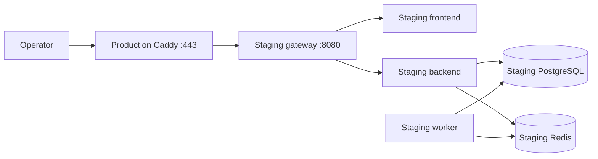

# Staging VPS: staging.astrotype.ru

Статус: инфраструктурный контракт подготовлен; live-статус фиксируется в `docs/features/E9-staging-environment/S01-staging-runtime.md`.

## Назначение

Staging используется для проверки текущего релиза, миграций, авторизации, worker flow и YooKassa test-shop до production cutover. Staging не является резервной production-средой и не получает production данные.

## Топология



Production Caddy видит только `staging-gateway` через внешнюю Docker network `astrotype_edge`. Staging PostgreSQL и Redis остаются только во внутренней сети staging project.

## 1. DNS prerequisite

Создать запись:

```text
A  staging  46.173.16.113
```

Проверка:

```bash
python3 - <<'PY'
import socket
print(socket.gethostbyname_ex("staging.astrotype.ru"))
PY
```

Не запускать публичный TLS smoke, пока hostname не резолвится на VPS.

## 2. Файлы на VPS

Staging использует тот же source tree `/opt/astrotype`, но отдельные runtime contracts:

- `docker-compose.staging.yml`;
- `.env.staging`;
- отдельный Compose project `astrotype-staging`;
- volumes `postgres_staging_data` и `redis_staging_data` внутри staging project.

Создать env:

```bash
cd /opt/astrotype
cp .env.staging.example .env.staging
chmod 600 .env.staging
```

Заполнить случайные `POSTGRES_PASSWORD` и `SECRET_KEY`. Не копировать production значения.

Сгенерировать пароль Basic Auth и Caddy hash без вывода пароля в shell history:

```bash
read -rsp 'Staging Basic Auth password: ' STAGING_PASSWORD; echo
STAGING_HASH=$(docker run --rm caddy:2-alpine caddy hash-password --plaintext "$STAGING_PASSWORD")
unset STAGING_PASSWORD
printf 'astrotype-staging %s\n' "$STAGING_HASH" > deploy/staging-basic-auth.caddy
unset STAGING_HASH
chmod 600 deploy/staging-basic-auth.caddy
```

`deploy/staging-basic-auth.caddy` исключён из Git и монтируется только в staging gateway. Не переносить hash в `.env.staging`: символы `$` в bcrypt hash могут быть интерпретированы Compose.

Для платежного smoke добавить только credentials тестового магазина:

```dotenv
YOOKASSA_SHOP_ID=<test-shop-id>
YOOKASSA_SECRET_KEY=<test-secret-key>
```

## 3. Edge network и production Caddy

Обновлённый `docker-compose.prod.yml` подключает production Caddy к именованной сети `astrotype_edge`. Создать сеть можно идемпотентно:

```bash
docker network inspect astrotype_edge >/dev/null 2>&1 || docker network create astrotype_edge
```

После обновления Caddyfile пересоздать только Caddy:

```bash
docker compose -f docker-compose.prod.yml --env-file .env.production up -d caddy
curl -fsS https://astrotype.ru/api/v1/health
```

Production health обязан остаться HTTP 200.

## 4. Contract validation

```bash
docker compose -f docker-compose.prod.yml --env-file .env.production config >/dev/null
docker compose -f docker-compose.staging.yml --env-file .env.staging config >/dev/null

docker run --rm \
  -v "$PWD/deploy/Caddyfile.staging:/etc/caddy/Caddyfile:ro" \
  -v "$PWD/deploy/staging-basic-auth.caddy:/run/secrets/staging-basic-auth.caddy:ro" \
  caddy:2-alpine caddy validate --config /etc/caddy/Caddyfile
```

Проверить production Caddyfile в текущем container после staging gateway startup:

```bash
docker compose -f docker-compose.prod.yml --env-file .env.production exec -T caddy \
  caddy validate --config /etc/caddy/Caddyfile
```

## 5. Запуск

```bash
docker compose -f docker-compose.staging.yml --env-file .env.staging up -d --build

docker compose -f docker-compose.staging.yml --env-file .env.staging ps
```

Backend автоматически выполняет `alembic upgrade head` перед стартом FastAPI.

## 6. Внутренний smoke до DNS

```bash
docker compose -f docker-compose.staging.yml --env-file .env.staging exec -T backend \
  curl -fsS http://localhost:8000/api/v1/health

docker compose -f docker-compose.staging.yml --env-file .env.staging exec -T gateway \
  wget -qO- --user="$STAGING_BASIC_AUTH_USER" --password='<operator-password>' \
  http://localhost:8080/api/v1/health
```

## 7. Публичный smoke

Без credentials должен быть HTTP 401:

```bash
curl -sS -o /dev/null -w '%{http_code}\n' https://staging.astrotype.ru/api/v1/health
```

С Basic Auth:

```bash
curl -fsS -u 'astrotype-staging:<operator-password>' \
  -D /tmp/staging-headers.txt \
  https://staging.astrotype.ru/api/v1/health
```

Проверить HTTP 200 и header:

```text
X-Robots-Tag: noindex, nofollow, noarchive
```

Production regression:

```bash
curl -fsS https://astrotype.ru/api/v1/health
curl -fsSI https://astrotype.ru/
```

## 8. Логи

```bash
docker compose -f docker-compose.staging.yml --env-file .env.staging logs --tail=200 backend
docker compose -f docker-compose.staging.yml --env-file .env.staging logs --tail=200 worker
docker compose -f docker-compose.staging.yml --env-file .env.staging logs --tail=200 gateway
docker compose -f docker-compose.prod.yml --env-file .env.production logs --tail=200 caddy
```

## 9. Staging user

При `EMAIL_PROVIDER=console` verification link пишется в backend logs. После регистрации получить ссылку только из staging backend logs, подтвердить email, войти и создать отдельный staging profile. Не использовать production email/password, если это не специально созданный тестовый аккаунт.

## 10. YooKassa test-shop smoke

1. Убедиться, что `.env.staging` содержит test-shop, а не production credentials.
2. Войти через Basic Auth и staging account.
3. Открыть `https://staging.astrotype.ru/billing`.
4. Создать checkout `self_full` обычной UI-кнопкой.
5. Проверить, что redirect ведёт в тестовый магазин YooKassa.
6. Оплатить официальной тестовой картой YooKassa.
7. Убедиться, что return URL ведёт на staging, а не production.
8. Выполнить payment/webhook/entitlement readback по `docs/implementation/payment-confirmation-production-smoke.md`, но в staging PostgreSQL.

Открыть staging psql:

```bash
docker compose -f docker-compose.staging.yml --env-file .env.staging exec postgres \
  sh -lc 'psql -U "$POSTGRES_USER" "$POSTGRES_DB"'
```

Критерий: `payment.succeeded` сохранён и обработан, payment имеет `paid_at`, entitlement принадлежит тому же staging user id, `/api/v1/billing/access` возвращает `plus_active`.

## 11. Backup и teardown

Staging dump:

```bash
mkdir -p backups/staging
stamp=$(date -u +%Y%m%dT%H%M%SZ)
docker compose -f docker-compose.staging.yml --env-file .env.staging exec -T postgres \
  sh -lc 'pg_dump -U "$POSTGRES_USER" "$POSTGRES_DB"' \
  > "backups/staging/postgres-$stamp.sql"
test -s "backups/staging/postgres-$stamp.sql"
```

Остановить staging без удаления данных:

```bash
docker compose -f docker-compose.staging.yml --env-file .env.staging down
```

Не выполнять `down -v` без отдельного решения: команда удалит staging PostgreSQL/Redis volumes.

## 12. Rollback ingress

Если staging влияет на production:

1. выполнить `docker compose ... -f docker-compose.staging.yml down` без `-v`;
2. удалить staging host block из `deploy/Caddyfile`;
3. пересоздать production Caddy;
4. проверить production health и frontend;
5. не удалять `astrotype_edge`, пока production Caddy ещё подключён к ней.
