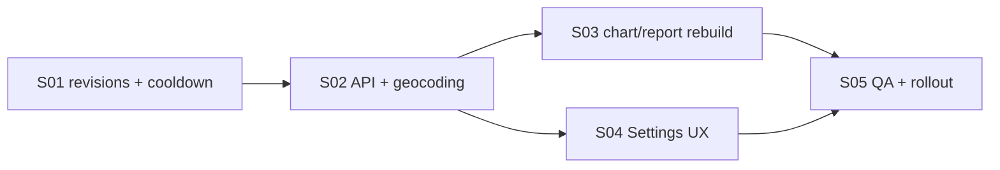

# E10: Уточнение времени и места рождения

## Статус

⬜ Не начато — контракт подготовлен, реализация отсутствует

## Цель

Дать авторизованному пользователю возможность в разделе `Настройки` безопасно уточнить время и место рождения, после чего Astrotype пересчитает натальную карту и актуализирует отчёт. Успешное изменение разрешено не чаще одного раза за скользящие 24 часа на аккаунт.

## Пользовательская ценность

Пользователь может исправить неточные исходные данные без нового аккаунта, повторной покупки и обращения в поддержку. Старый отчёт не исчезает во время пересчёта, а история расчётов сохраняется.

## Нормативное правило частоты

```text
Следующее успешное уточнение разрешено не ранее чем
last_successful_refinement_at + 24 часа.
```

- Ограничение применяется сервером на аккаунт, а не только интерфейсом и не отдельно на каждый профиль.
- Время сравнивается в UTC; календарная полночь и часовой пояс клиента на правило не влияют.
- Отсчёт начинается только после успешной фиксации материально изменённых данных.
- Просмотр доступности, ошибки валидации, повтор с тем же `Idempotency-Key` и запрос без изменений лимит не расходуют.
- Параллельные запросы не могут создать два уточнения в одном окне.

## Область работ

- Карточка «Данные рождения» в `/settings`.
- Выбор принадлежащего пользователю профиля, если профилей несколько.
- Редактирование времени рождения и его точности.
- Поиск и выбор места рождения из геокодера.
- Серверное определение/проверка координат и IANA-часового пояса.
- Неизменяемый журнал уточнений и серверный cooldown 24 часа.
- Новый снимок натальной карты и безопасная регенерация отчёта.
- Отображение состояния пересчёта и времени следующего доступного изменения.
- Метрики, аудит, тесты и поэтапный rollout.

## Вне области работ

- Изменение даты рождения в этом сценарии.
- Свободный ручной ввод latitude, longitude или timezone.
- Смена имени, email или пароля — это независимые настройки.
- Ректификация времени рождения алгоритмом или консультацией астролога.
- Автоматическое списание денег за новый расчёт.
- Удаление предыдущих карт, отчётов и PDF.
- Обход cooldown через создание/переключение профилей или только frontend-проверку.
- Административный bypass без отдельного аудируемого support-контракта.

## Ключевые продуктовые решения

1. Пользователь может изменить только время/точность, только место или оба блока за одну операцию.
2. Клиент отправляет полный итоговый снимок полей рождения; backend вычисляет `changed_fields` и отклоняет no-op.
3. Место считается выбранным только из результата геокодера. Координаты и timezone не редактируются вручную.
4. Текущее содержимое отчёта остаётся доступным, пока новый расчёт не достигнет `deterministic_ready`.
5. После готовности новый отчёт становится активным атомарно; предыдущая версия остаётся исторической.
6. Повторная генерация не требует новой оплаты и не меняет entitlement аккаунта.
7. Ограничение 24 часа относится только к успешному изменению данных рождения; имя и пароль не блокируются.

## Зависимости

- Текущие `PersonProfile`, `/api/v1/profiles/*` и `/api/v1/profiles/geocode`.
- Astrotype v2: карта → факты → синтез → outline → сегменты → отчёт.
- Celery/Redis для фонового пересчёта.
- Существующие ownership- и auth-проверки.
- Версионирование натальных карт и отчётов без перезаписи старых данных.

## Исходный разрыв реализации

Сейчас `/settings` изменяет только имя через `PATCH /api/v1/users/me`. Универсальный `PATCH /api/v1/profiles/{profile_id}` уже может менять данные рождения, но не содержит суточного ограничения, неизменяемой ревизии, защиты от гонок и гарантированного запуска полного пересчёта. Использовать этот общий PATCH напрямую для нового UX нельзя: уточнение должно идти через отдельную доменную операцию.

## Критерии приёмки

- [ ] В `/settings` отображаются текущие время, точность и место рождения выбранного профиля.
- [ ] Пользователь может уточнить время, место или оба блока.
- [ ] Место выбирается из подсказок; backend получает согласованные place/lat/lon/timezone.
- [ ] Backend разрешает максимум одно успешное уточнение на аккаунт за скользящие 24 часа.
- [ ] Ограничение устойчиво к параллельным запросам и обходу через другой profile ID.
- [ ] `429` возвращает `Retry-After`, `next_available_at` и стабильный код причины.
- [ ] No-op, валидационная ошибка и идемпотентный повтор не запускают новый cooldown.
- [ ] Каждое успешное уточнение создаёт неизменяемую ревизию до/после.
- [ ] Новая карта и отчёт создаются как новые версии; старые артефакты не удаляются и не перезаписываются.
- [ ] Старый отчёт доступен до готовности нового deterministic-слоя.
- [ ] Повторный расчёт не создаёт платёж и не изменяет подписку/entitlement.
- [ ] UI показывает серверное время следующего изменения и состояние пересчёта.
- [ ] Unit, integration, concurrency, frontend и staging smoke закрывают happy path и ограничения.

## Stories

| ID  | Story                                                                           | Статус       |
| --- | ------------------------------------------------------------------------------- | ------------ |
| S01 | [Хранилище ревизий и атомарный cooldown](./S01-revision-storage-cooldown.md)    | ⬜ Не начато |
| S02 | [API уточнения и контракт геокодирования](./S02-refinement-api-geocoding.md)    | ⬜ Не начато |
| S03 | [Пересчёт карты и безопасная версия отчёта](./S03-chart-report-regeneration.md) | ⬜ Не начато |
| S04 | [UX данных рождения в Settings](./S04-settings-birth-data-ux.md)                | ⬜ Не начато |
| S05 | [Тесты, наблюдаемость и rollout](./S05-tests-observability-rollout.md)          | ⬜ Не начато |

## Порядок реализации



## Связанные документы

- [SRS-E10](../../SRS/SRS-E10-birth-data-refinement.md)
- [Пользовательский и системный workflow](./WORKFLOW.md)
- [Astrotype v2 API/runtime](../E16-v2-e10-api-async-runtime/FEATURE.md)
- [Astrotype v2 database foundation](../E16-v2-e2-database-foundation/FEATURE.md)

## Проверка документации

```bash
cd frontend
npx prettier --check ../docs/features/E10-birth-data-refinement ../docs/SRS/SRS-E10-birth-data-refinement.md
cd ..
git diff --check -- docs/features/E10-birth-data-refinement docs/SRS/SRS-E10-birth-data-refinement.md docs/features/README.md
```

Документирование не закрывает Stories: статусы меняются только после кода, тестов и требуемого runtime smoke.
