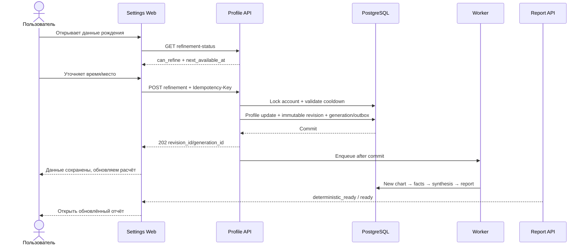

# E10 Workflow: уточнение данных рождения

## Пользовательский вход

Авторизованный пользователь открывает `Настройки` → `Данные рождения`, выбирает профиль и нажимает «Уточнить данные».

## Happy path

## Что меняется синхронно

- Проверяются auth и ownership.
- Валидируются time/accuracy и place/coordinates/timezone.
- Проверяется per-account rolling cooldown 24 часа.
- Сравнивается итоговый снимок с текущим.
- Обновляется профиль и создаётся неизменяемая ревизия/generation запись.

## Что выполняется асинхронно

- Расчёт новой версии натальной карты.
- Извлечение фактов и evidence.
- Синтез, outline, infographic/calculation layer.
- Narrative-сегменты и финальная сборка.
- Переключение активного отчёта после `deterministic_ready`.

## Cooldown path

Если успешная ревизия младше 24 часов, backend возвращает `429`, `Retry-After` и `next_available_at`. UI отключает только новую операцию уточнения. Просмотр отчёта, редактирование имени и смена пароля остаются доступны.

## Validation/no-op path

Некорректное место, несогласованные time/accuracy или отсутствие материальных изменений возвращают 4xx без создания committed-ревизии и без старта cooldown.

## Failure path

Если фоновый пересчёт завершился ошибкой:

- revision получает `failed` и безопасный `error_code`;
- старый отчёт остаётся активным;
- пользователь видит, что сохранённый ранее отчёт доступен;
- повторная оплата не предлагается;
- автоматический retry должен быть идемпотентным;
- ручной support-retry не должен менять cooldown или профиль повторно.

## Данные, которые нельзя терять или перезаписывать

- предыдущий birth-data snapshot;
- предыдущие NatalChart и детерминированные rows;
- предыдущие отчёты, narrative segments и PDF;
- платёжные и entitlement records.

## Границы безопасности

- Только владелец профиля может читать статус и запускать уточнение.
- 24-часовое правило проверяется в durable DB-транзакции.
- Snapshots содержат персональные данные и не выводятся в логи/метрики.
- Client timestamps не участвуют в cooldown.
- Frontend disable не считается защитой.
