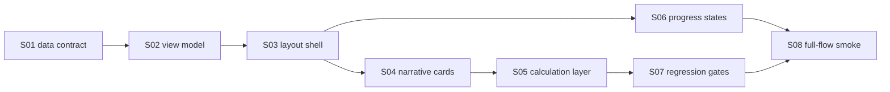

# V2-E11: Web responsive canonical report reader

## Status

⬜ Не начато

## Goal

Build the production Astrotype V2 web report reader for the full Self flow: after registration, verification and login, the user lands on `/report/v2/{profile_id}`, generation runs through the V2 async runtime, and the ready report renders according to the canonical sample.

## Canonical visual source

- `docs/design/astrotype-v2-infographic-db-report-sample.html`
- `docs/design/astrotype-v2-infographic-db-report-data.json`
- `docs/design/astrotype-v2-canonical-report-ui-contract.md`

The sample overrides the current product report/dashboard design. Existing frontend report components may be inspected for auth/session/API patterns only; they are not the visual target.

## Dependencies

- V2-E10 API & async runtime: `docs/features/E16-v2-e10-api-async-runtime/FEATURE.md`
- V2 deterministic chart/facts/synthesis/outline/report storage slices
- Frontend auth/session guard and `/report/v2/[profileId]` route

## Scope

- Dedicated V2 report reader components.
- Typed frontend view-model mapping from V2 API payload to UI props.
- Canonical ready-state layout: hero → narrative sections → deterministic calculation layer.
- Regenerate/progress/error states that do not break the canonical ready-state layout.
- Full-flow local smoke from registration to ready report.
- DOM/visual regression gates for canonical structure.

## Out of scope

- Legacy `/report/[profileId]` redesign.
- Socionics, Model A, MBTI, function-strength radar/profile, or any typology system.
- Career CTA or career upsell in Self report.
- Static copy-paste of the sample HTML as the live report.
- Frontend-side astrology calculations that should be deterministic backend data.

## Acceptance criteria

- [ ] A newly registered user can reach `/report/v2/{profile_id}` after verification/login.
- [ ] The report generation path uses V2 API/worker/runtime and returns a complete report.
- [ ] Ready-state page renders hero cover before all narrative sections.
- [ ] Six canonical narrative sections render in order:
  1. `Ядро личности`
  2. `Мышление и восприятие`
  3. `Эмоциональная регуляция`
  4. `Воля и действие`
  5. `Близость и отношения`
  6. `Вектор роста`
- [ ] Each narrative section uses the sample information architecture: numeric eyebrow, h2 title, subtitle/tag, prose column, aside bullets.
- [ ] Lower deterministic calculation layer renders after narrative sections.
- [ ] Planet positions table renders from API data.
- [ ] Element and modality balance bars render from API data.
- [ ] House emphasis chart and labelled top house cards render from API data.
- [ ] Aspect network renders from API data.
- [ ] Key aspects table renders from API data.
- [ ] Calculation matrix renders house mode, hemispheres, quadrants and aspect profile from API data.
- [ ] Regenerate works from ready state and resolves back to a ready report.
- [ ] No V2 Self report screen contains `socionics`, `Соционика`, `Model A`, `function_strengths`, MBTI or legacy `/api/v1/reports` markers.
- [ ] Local full-flow smoke script passes.
- [ ] Frontend lint, prettier, typecheck and tests pass.
- [ ] Backend V2 contract tests pass.
- [ ] GitHub CI for pushed HEAD is green.

## Stories

| ID  | Story                                                                                   | Status       |
| --- | --------------------------------------------------------------------------------------- | ------------ |
| S01 | [Lock reader data contract](./S01-reader-data-contract.md)                              | ✅ Готово    |
| S02 | [Add frontend view-model mappers](./S02-view-model-mappers.md)                          | ✅ Готово    |
| S03 | [Build canonical layout shell](./S03-canonical-layout-shell.md)                         | ✅ Готово    |
| S04 | [Render narrative section cards](./S04-narrative-section-rendering.md)                  | ✅ Готово    |
| S05 | [Render deterministic calculation layer](./S05-deterministic-calculation-layer.md)      | ✅ Готово    |
| S06 | [Formalize generation/progress states](./S06-regeneration-and-progress-states.md)       | ⬜ Не начато |
| S07 | [Add responsive and visual regression gates](./S07-responsive-and-visual-regression.md) | ⬜ Не начато |
| S08 | [Add full-flow smoke and runbook](./S08-full-flow-smoke-and-runbook.md)                 | ⬜ Не начато |

## Implementation order



## Verification commands

```bash
cd frontend
node scripts/check-v2-report-routing.mjs
node scripts/check-v2-report-reader-dom.mjs
npx eslint .
npx prettier --check .
npx tsc --noEmit
npm test
```

```bash
cd backend
uv run pytest tests/unit/test_astrotype_v2/test_api_runtime.py tests/unit/test_astrotype_v2/test_qa_smoke_rollout.py -q
```

```bash
python3 scripts/smoke/astrotype-v2-full-flow.py --base-url http://127.0.0.1:3000 --backend-url http://127.0.0.1:8000
```
