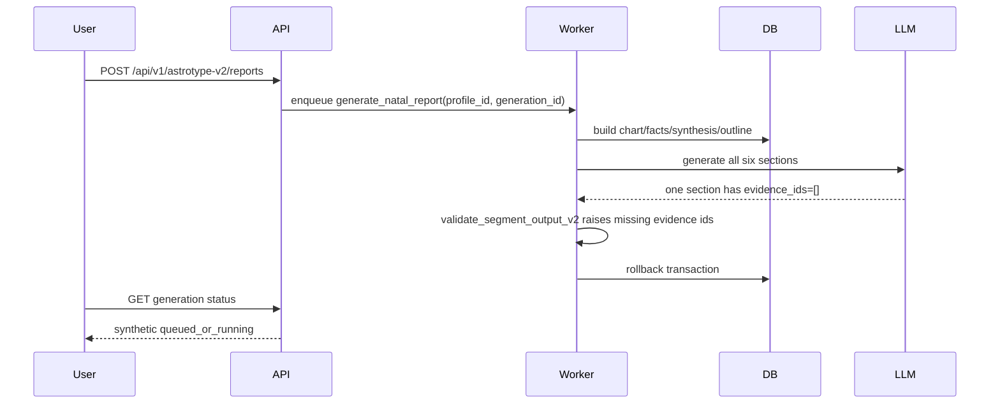
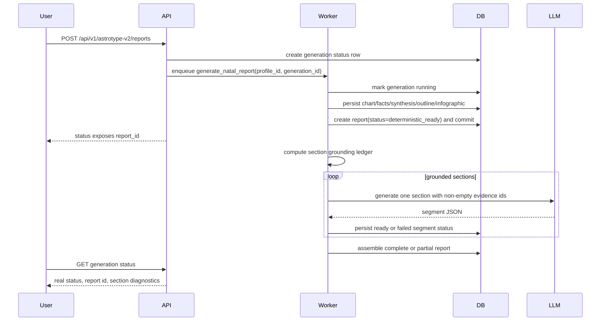

# V2-E17 section evidence grounding workflow

## User-facing trigger

A user creates or regenerates an Astrotype v2 natal report from a completed profile. The backend starts async generation and returns a `generation_id`.

The report must become visible even if some LLM sections fail. Deterministic foundation must not be lost.

## Current broken flow



The user sees a report that never appears, while the API cannot explain why.

## Target flow

Hard invariant:

```text
No LLM provider call before deterministic report commit.
```

The deterministic report must be visible as `deterministic_ready` before narrative generation starts.



After the deterministic commit, the frontend must render the report shell, chart/facts/outline and infographic/calculation layer immediately. Narrative sections are progressive additions, not a prerequisite for showing the report.

## Section grounding ledger

Before LLM calls, the worker must build a ledger like:

| Section | Owned evidence | Reference evidence | Status | Action |
|---|---:|---:|---|---|
| `core_pattern` | 8 | 0 | `ready` | generate |
| `perception_and_mind` | 3 | 1 | `ready` | generate |
| `emotional_regulation` | 2 | 2 | `bridged` | generate with bridge note |
| `agency_and_desire` | 3 | 0 | `ready` | generate |
| `relationships_and_intimacy` | 2 | 1 | `bridged` | generate with bridge note |
| `growth_vector` | 3 | 1 | `ready` | generate |

If a section has zero total evidence, it must be `skipped` or `blocked`; it must not be sent to the LLM.

## LLM input contract

The LLM receives only one section at a time:

- section id/title/purpose;
- owned themes;
- allowed reference themes;
- forbidden theme ids;
- allowed evidence ids;
- style/depth contract;
- continuation policy.

The LLM must not receive:

- socionics/Model A/typology data;
- unrestricted full report context;
- fake evidence ids;
- instructions to invent missing evidence.

## Failure behavior

| Failure | Correct behavior |
|---|---|
| Section has no evidence | Mark section `skipped_ungrounded` or `blocked` before LLM; do not call provider |
| Provider returns non-JSON | Mark section `failed_provider`; keep deterministic artifacts |
| Provider omits evidence ids | Retry same section once with explicit validation error; then mark `failed_validation` |
| One section fails | Keep other ready sections; assemble `partial` if possible |
| All sections fail | Return failed generation with deterministic diagnostics, not fake queued status |

## Retry behavior

Retry must operate at the smallest safe boundary:

1. retry one failed section when deterministic inputs are still valid;
2. regenerate outline/section inputs only when fact assignment rules changed;
3. rebuild chart/facts only when birth data or chart engine version changed.

Do not rerun the whole report when only one section failed validation.
