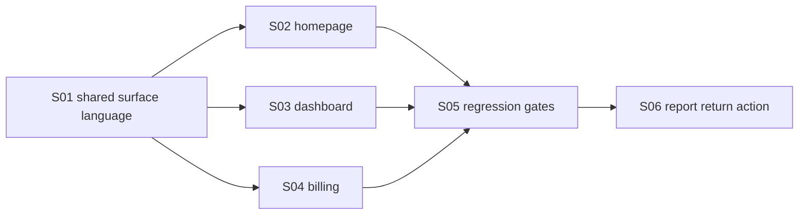

# V2-E18: Product surface redesign — homepage, dashboard, billing

## Status

✅ Implemented and locally verified

## Goal

Implement a refreshed Astrotype product surface so the public homepage, user dashboard and billing page visually belong to the same product as the canonical v2 report reader.

## Design direction sources

These files are concept/direction samples, not pixel-perfect implementation contracts:

- `docs/design/astrotype-v2-homepage-sample.html`
- `docs/design/astrotype-v2-dashboard-sample.html`
- `docs/design/astrotype-v2-billing-sample.html`
- `docs/design/astrotype-v2-infographic-db-report-sample.html`
- `docs/design/astrotype-v2-canonical-report-ui-contract.md`

The implementation should preserve the direction: wide dark report-style pages, large cover sections, gold accents, calm premium feel, narrative-first hierarchy and compact calculation/proof language. Exact copy, exact spacing and exact block order may change during implementation.

## Dependencies

- V2-E11 report reader visual language: `docs/features/E16-v2-e11-web-responsive-reader/FEATURE.md`
- Current frontend auth/session patterns in `frontend/src/app/(auth)` and `frontend/src/lib/auth-session.ts`
- Current dashboard route: `frontend/src/app/(dashboard)/dashboard/page.tsx`
- Current billing route: `frontend/src/app/(dashboard)/billing/page.tsx`
- Current homepage route: `frontend/src/app/page.tsx`
- Account tier foundation doc: `docs/architecture/account-tier-role-foundation.md`
- Payment confirmation doc: `docs/architecture/current-payment-confirmation-flow.md`

## Scope

- Shared visual surface primitives or local composition utilities for marketing/dashboard/billing pages.
- Public homepage redesign.
- Dashboard redesign.
- Billing page redesign.
- Copy cleanup to remove obsolete archetype/legacy language from these pages.
- Status-only Free/Plus presentation where useful; no account-tier feature gating in this feature.
- Frontend regression checks that protect the new visual/content direction.

## Out of scope

- Broad redesign of the canonical v2 report reader itself, beyond the small report-to-dashboard return action in S06.
- Implementing account-tier database fields or payment-to-plus role upgrade.
- Enforcing Free/Plus access restrictions.
- New billing/access API endpoints.
- Reworking auth/register/login pages.
- Implementing Love/Child/Career product functionality.
- Pixel-perfect copy of the static HTML samples.
- Introducing socionics, Model A, MBTI, function-strength radar/profile, or legacy archetype positioning.

## Product principles

1. The homepage is the cover of the product, not a generic SaaS landing page.
2. Dashboard is a personal report workspace, not a grid of unrelated modules.
3. Billing is a trust page: it explains what Plus means and how payment confirmation works.
4. Free/Plus can be displayed as account status, but must not restrict functionality until a later gating feature.
5. Technical terms such as v2/json/LLM/evidence ids should not leak into user-facing copy.
6. The report remains the visual source of truth: large dark cards, gold accents, narrative sections, compact calculation/proof blocks.

## Acceptance criteria

- [x] Homepage `/` uses the new report-style direction and no longer looks like the old compass/card landing page.
- [x] Homepage hero clearly communicates: birth data → calculated foundation → personal report.
- [x] Homepage includes a report-preview/proof block that resembles the report reader language without pretending to be a real generated result.
- [x] Dashboard `/dashboard` presents the user's workspace with a large personal hero and latest-report path before product cards.
- [x] Dashboard keeps existing profile fetching and report links working.
- [x] Dashboard empty state provides one clear start action for creating/opening Self.
- [x] Billing `/billing` explains Free/Plus, YooKassa checkout and server-side payment confirmation in the new visual language.
- [x] Billing does not imply that return from YooKassa equals successful payment.
- [x] Billing can display account-tier/status copy, but does not gate features by account tier.
- [x] Public/user-facing copy on these pages does not contain `v2/json`, `LLM`, `Model A`, `MBTI`, `function_strengths`, `socionics`, or raw `evidence ids` wording.
- [x] Responsive behavior works at mobile, tablet and desktop widths.
- [x] Frontend lint, format and TypeScript checks pass.
- [x] A targeted visual/content regression script covers homepage, dashboard and billing markers.
- [x] Report pages have a visible return action to `/dashboard` without losing standalone report focus.
- [x] GitHub CI for pushed HEAD is green or any unrelated failure is documented precisely.

## Stories

| ID  | Story                                                                                   | Status         |
| --- | --------------------------------------------------------------------------------------- | -------------- |
| S01 | [Define shared product surface language](./S01-shared-product-surface-language.md)      | ✅ Реализовано |
| S02 | [Implement homepage redesign](./S02-homepage-redesign.md)                               | ✅ Реализовано |
| S03 | [Implement dashboard redesign](./S03-dashboard-redesign.md)                             | ✅ Реализовано |
| S04 | [Implement billing redesign](./S04-billing-redesign.md)                                 | ✅ Реализовано |
| S05 | [Add responsive/content regression gates](./S05-responsive-content-regression-gates.md) | ✅ Реализовано |
| S06 | [Add report-to-dashboard return action](./S06-report-dashboard-return-action.md)        | ✅ Реализовано |

## Implementation order



## Verification commands

```bash
cd frontend
npx eslint .
npx prettier --check .
npx tsc --noEmit
npm test
```

```bash
cd frontend
node scripts/check-product-surface-redesign.mjs
```

Optional browser smoke when local runtime is available:

```bash
cd frontend
npm run build
npm run start
# inspect /, /dashboard and /billing at mobile/tablet/desktop widths
```

## Implementation evidence

Implemented on `main`:

- shared product surface primitives under `frontend/src/components/product-surface/`;
- redesigned homepage `/`;
- redesigned dashboard `/dashboard`;
- redesigned billing `/billing`;
- product-surface regression script `frontend/scripts/check-product-surface-redesign.mjs`;
- report return action to `/dashboard` in v2 report ready/loading/locked states;
- user-facing redesign copy cleaned to avoid unnecessary English/internal wording.

Fresh verification:

```bash
cd frontend
npm test
npx eslint .
npx prettier --check .
npx tsc --noEmit --pretty false
npm run build
```

Result: all commands passed; Next production build completed successfully.

GitHub verification: all check-runs completed successfully or were skipped by workflow conditions. Real production deploy jobs remained skipped by current workflow gating, so this feature is verified in code/CI, not released as a live production deployment.
