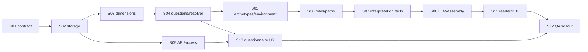

# E19: Astrotype Career Report

## Статус

⬜ Не начато — целевой контракт подготовлен, текущий Career считается legacy baseline

## Цель

Создать персональный профессиональный отчёт на основе уже рассчитанной натальной карты и ответов пользователя. Отчёт должен объяснять профессиональную механику человека — рабочий стиль, решения, мотивацию, лидерство, среду, классы ролей и траектории — а не назначать профессию по одному астрологическому фактору.

## Канонический источник

- Design/architecture: [`../../design/astrotype_career_report.md`](../../design/astrotype_career_report.md)
- SRS: [`../../SRS/SRS-E19-career-report.md`](../../SRS/SRS-E19-career-report.md)

При расхождении короткого Story с продуктовым смыслом источником истины является SRS вместе с design-документом. Формулы, DTO и миграции должны быть зафиксированы тестами до production rollout.

## Продуктовая формула

```text
Natal Chart
→ evidence-backed Astrological Factors
→ deterministic Career Dimensions
→ Control Questions
→ Profile Resolver
→ Career Archetypes + Work Environment
→ Role Families + Career Paths
→ curated Interpretation Facts
→ modular LLM narrative
→ Career Report
```

LLM не получает сырую натальную карту и не вычисляет scores, архетипы, роли или карьерные траектории. Она превращает заранее рассчитанный, ограниченный и evidence-backed объект в связный текст.

## Пользовательская ценность

Career Report отвечает не «кем вам стать», а:

- как пользователь решает задачи и принимает решения;
- какие условия усиливают или снижают эффективность;
- какой баланс автономии, структуры, риска и взаимодействия ему подходит;
- как разделяются лидерский потенциал и желание управлять людьми;
- какие классы ролей и карьерные переходы согласуются с профилем;
- где вывод подтверждён многими сигналами, а где требует осторожной формулировки.

## MVP scope

### Вход

- готовая Astrotype v2 `NatalChart` и связанные persisted facts/evidence;
- версия scoring/reference rules;
- 8–12 обязательных контрольных вопросов;
- ответы пользователя и контекст: текущая деятельность, опыт, цель изменения карьеры.

### 12 Career Dimensions

1. Leadership
2. Analytical Thinking
3. Systems Thinking
4. Communication
5. Creativity
6. Structure
7. Autonomy
8. Risk Tolerance
9. People Orientation
10. Innovation
11. Long-Term Focus
12. Execution

### Выход

1. Профессиональный профиль
2. Рабочий стиль
3. Сильные стороны
4. Принятие решений
5. Лидерство и влияние
6. Оптимальная рабочая среда
7. Условия риска/снижения эффективности
8. Top-3 профессиональных архетипа
9. Семейства ролей
10. Карьерные траектории

## После MVP

- Adaptive Questions.
- Entrepreneurship, Competition, Learning Orientation, Influence, Adaptability и расширенный Decision Making.
- Более точный role matching.
- CV, skills, образование, текущая должность и опыт как отдельный consent-based слой.
- Career Change, Leadership Profile, Entrepreneurship Profile, Team/Manager Compatibility.
- Career Timing только после отдельной фичи транзитов; не входит в натальный MVP.

## Вне области работ

- Прямая формула «планета/знак → профессия».
- Гарантии трудоустройства, дохода или профессионального успеха.
- Диагностика личности, психического здоровья или профпригодности.
- Использование соционики, MBTI или Model A в Career v1.
- Автоматический анализ CV/соцсетей без отдельного согласия.
- Самостоятельное вычисление астрологических или карьерных фактов LLM-моделью.
- Перезапись базовой натальной карты, Self-отчёта или исторических Career-версий.
- Синхронное ожидание полного narrative в одном HTTP-запросе.

## Текущий implementation gap

В репозитории уже есть legacy product `career`, цена `career_full`, synchronous `/reports/generate`, v1 rules/resolver и простой Career reader. Этот путь:

- использует legacy `ChartSnapshot`/ruleset `career/v1`, а не нормализованный v2 Career pipeline;
- не содержит 12 версионированных dimensions с независимыми evidence/confidence;
- не собирает обязательные контрольные ответы и contradictions;
- ожидает готовый ответ за 30 секунд;
- не предоставляет durable generation/status lifecycle;
- не соответствует целевому layered report contract.

Legacy baseline не закрывает ни одну Story E19. Его нельзя расширять как скрытый compatibility path: необходимо либо явно мигрировать, либо выключить после rollout.

## Доступ и монетизация

Career — специализированный отчёт. Целевой доступ должен использовать единую account-level policy E8: активный Plus для всех не-basic отчётов. Текущий one-time SKU `career_full` — зафиксированное расхождение, которое нужно решить в S01 до реализации checkout/entitlement. Нельзя одновременно обещать две конфликтующие модели доступа.

## Критерии приёмки Feature

- [ ] Career использует существующую v2 натальную карту и не пересчитывает её без изменения birth data/engine version.
- [ ] Все 12 MVP dimensions рассчитываются детерминированно по нескольким независимым сигналам.
- [ ] Каждый score имеет evidence, confidence, scoring version и объяснимый breakdown.
- [ ] Контрольные вопросы versioned; ответы пользователя отделены от астрологических сигналов.
- [ ] Profile Resolver сохраняет подтверждения, противоречия и предпочтения, не «исправляя» ответы пользователя.
- [ ] Top-3 archetypes, environment, anti-environment, role families и paths строятся детерминированно.
- [ ] Роли сначала определяются как классы; профессии приводятся только как примеры с уровнем соответствия.
- [ ] LLM получает только curated interpretation facts и section contract, не raw chart и не полный unrestricted payload.
- [ ] Отчёт доступен с `deterministic_ready`; narrative загружается по секциям асинхронно.
- [ ] Web reader и PDF используют один persisted report payload и одинаковый порядок секций.
- [ ] Backend ownership и Plus-access policy покрывают create/read/status/regenerate/PDF.
- [ ] Исторические версии, вопросы/ответы, scores, evidence и prompt/scoring versions сохраняются.
- [ ] Anti-generic, contradiction, evidence, overclaim и profession-prescription validators проходят.
- [ ] Staging smoke доказывает полный questionnaire → deterministic → narrative → reader/PDF flow.

## Stories

| ID  | Story                                                                                         | Статус       |
| --- | --------------------------------------------------------------------------------------------- | ------------ |
| S01 | [Зафиксировать product/access/migration contract](./S01-product-access-migration-contract.md) | ⬜ Не начато |
| S02 | [Добавить Career storage и versioned schemas](./S02-storage-domain-schemas.md)                | ⬜ Не начато |
| S03 | [Построить factor и Career Dimension engine](./S03-factor-dimension-engine.md)                | ⬜ Не начато |
| S04 | [Реализовать контрольные вопросы и Profile Resolver](./S04-questions-profile-resolver.md)     | ⬜ Не начато |
| S05 | [Рассчитать archetypes и рабочую среду](./S05-archetypes-work-environment.md)                 | ⬜ Не начато |
| S06 | [Реализовать role matching и карьерные траектории](./S06-role-matching-career-paths.md)       | ⬜ Не начато |
| S07 | [Собрать Interpretation Facts и quality gates](./S07-interpretation-facts-quality-gates.md)   | ⬜ Не начато |
| S08 | [Добавить modular LLM narrative и assembly](./S08-llm-narrative-assembly.md)                  | ⬜ Не начато |
| S09 | [Добавить async Career API и access enforcement](./S09-api-async-access.md)                   | ⬜ Не начато |
| S10 | [Создать questionnaire/product UX](./S10-questionnaire-product-ux.md)                         | ⬜ Не начато |
| S11 | [Создать Career reader и PDF](./S11-report-reader-pdf.md)                                     | ⬜ Не начато |
| S12 | [Закрыть QA, observability, migration и rollout](./S12-qa-observability-rollout.md)           | ⬜ Не начато |

## Порядок реализации



## Зависимости

- V2-E2 database foundation.
- V2-E3 natal chart adapter.
- V2-E5 facts/evidence.
- V2-E6 synthesis/outline patterns.
- V2-E7/V2-E15 modular real-provider LLM runtime.
- V2-E10 async API/status lifecycle.
- E6 billing lifecycle and E8 report access policy.
- E10 birth-data refinement for safe regeneration when natal inputs change.

## Документационная готовность

Feature готова как контракт для поэтапной разработки, но не как runtime. Каждая Story остаётся открытой до кода, тестов и указанного smoke evidence.
