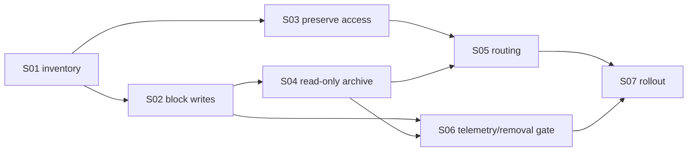

# E20: Безопасное отключение legacy Career v1

## Статус

⬜ Не начато

## Цель

Сделать target E19 Career Report единственным контуром создания и развития карьерных отчётов, не лишив ранее купивших Career пользователей доступа и не уничтожив существующие legacy-артефакты. Legacy Career v1 переводится из параллельного генератора в ограниченный read-only compatibility path, после чего удаляется только по отдельному подтверждённому data/removal gate.

## Проблема

Сейчас под именем `career` сосуществуют три разных контракта:

1. target E19 Career Report: `/api/v1/career/*`, questionnaire, durable generation lifecycle, новый reader и PDF;
2. grandfathered entitlement `product="career"`, который даёт ранее купившим пользователям доступ к target E19;
3. legacy generic report flow: `/api/v1/reports/*`, `reports.product="career"`, ruleset `career/v1`, старый reader `/report/{profileId}?product=career` и generic PDF.

Target E19 не зависит от legacy renderer или ruleset, однако legacy entitlement остаётся активной частью access policy, а generic API всё ещё позволяет напрямую создать Career v1. Простое удаление всего `reports`-модуля сломает Self Report; простое удаление `career` entitlement лишит grandfathered-пользователей доступа; удаление legacy rows без инвентаризации приведёт к потере исторических отчётов.

## Целевой результат

```text
Active Plus entitlement ───────┐
                               ├─> target E19 Career API/reader/PDF
Legacy career entitlement ─────┘

Existing legacy Career row ───────> read-only legacy reader/PDF
New legacy Career generation ─────> 410 Gone + target E19 entrypoint
Legacy Career mutation/refresh ────> forbidden
```

## Канонические документы

- [Workflow и границы контуров](./WORKFLOW.md)
- [SRS-E20](../../SRS/SRS-E20-legacy-career-retirement.md)
- [E19 Career Report](../E19-career-report/FEATURE.md)
- [E19 product/access contract](../E19-career-report/S01-product-access-migration-contract.md)
- [E19 rollout and QA](../E19-career-report/S12-qa-observability-rollout.md)

## Scope

### Входит

- production-safe инвентаризация `reports.product="career"`, legacy deep links и grandfathered entitlements;
- запрет новой Career v1-генерации через generic `/reports/generate`;
- запрет refresh/regenerate/version mutation существующих legacy Career rows;
- сохранение ownership-protected read-only JSON/PDF для существующих rows на переходный период;
- сохранение `product="career"` как grandfathered access grant к target E19;
- удаление legacy Career entrypoints из активной навигации и понятный переход в новый Career flow;
- метрики использования compatibility path и формальный removal gate;
- staged rollout, rollback и production evidence.

### Не входит

- удаление generic `reports`-модуля, поскольку он обслуживает Self Report;
- изменение target E19 scoring, questionnaire, narrative, reader или PDF;
- автоматическое удаление существующих legacy Career rows;
- отзыв grandfathered Career-доступа;
- миграция legacy payload в target E19 payload без отдельного доказанного mapping contract;
- удаление `career/v1` rules до блокировки всех write paths и подтверждения отсутствия runtime consumers.

## Неподвижные инварианты

1. Target E19 никогда не читает legacy `reports.report_data` как fallback.
2. Legacy report ID не принимается target endpoint `/api/v1/career/reports/{report_id}`.
3. Grandfathered entitlement и legacy report row — разные сущности; наличие или отсутствие одной не изменяет другую.
4. Чтение legacy Career не запускает rule engine, regeneration, version increment или payload overwrite.
5. Existing legacy rows не удаляются миграцией этой Feature.
6. Generic Self Report продолжает работать без изменения API и поведения.
7. Любое окончательное удаление compatibility reader/PDF требует production census, observation window и отдельного одобрения.

## Критерии приёмки Feature

- [ ] Target E19 остаётся единственным поддерживаемым write/generation flow для Career.
- [ ] `POST /api/v1/reports/generate` с `product="career"` возвращает стабильный retirement response и не создаёт/не изменяет `reports` rows.
- [ ] Existing `reports.product="career"` доступны владельцу в read-only JSON/PDF режиме и не регенерируются при чтении.
- [ ] Legacy Career deep link не создаёт новый v1-отчёт; при отсутствии legacy row направляет пользователя в `/products/career`.
- [ ] Grandfathered entitlement `product="career"` продолжает давать доступ к target E19 create/read/PDF flow.
- [ ] Target E19 endpoints не возвращают legacy payload и не принимают legacy report IDs.
- [ ] Generic Self Report generation/reader/narrative/PDF не имеют регрессий.
- [ ] Production census фиксирует количество legacy rows, владельцев, grandfathered grants и фактических compatibility reads без раскрытия персональных данных.
- [ ] Метрики и логи разделяют blocked legacy writes, legacy reads/PDF и target E19 operations.
- [ ] Stage smoke покрывает Plus, grandfathered Career, existing legacy row, missing legacy row и forbidden legacy write.
- [ ] Production rollout имеет rollback evidence и observation window; удаление данных не выполняется.
- [ ] Final removal gate сформулирован отдельно и не считается выполненным только из-за отсутствия UI-ссылок.

## Stories

| ID  | Story                                                                                    | Статус       |
| --- | ---------------------------------------------------------------------------------------- | ------------ |
| S01 | [Инвентаризировать runtime consumers и production data](./S01-runtime-data-inventory.md) | ⬜ Не начато |
| S02 | [Отключить legacy Career write/generation paths](./S02-disable-legacy-writes.md)         | ⬜ Не начато |
| S03 | [Сохранить grandfathered access к target E19](./S03-grandfathered-access.md)             | ⬜ Не начато |
| S04 | [Зафиксировать read-only compatibility для старых rows/PDF](./S04-read-only-archive.md)  | ⬜ Не начато |
| S05 | [Очистить UI entrypoints и deep-link routing](./S05-entrypoints-routing.md)              | ⬜ Не начато |
| S06 | [Добавить telemetry, migration decision и final removal gate](./S06-removal-gate.md)     | ⬜ Не начато |
| S07 | [Провести QA, stage и production rollout](./S07-qa-rollout.md)                           | ⬜ Не начато |

## Порядок реализации



## Зависимости

- E19 Career Report target API, reader, PDF and rollout contracts.
- E8 account-level report access policy.
- E6 entitlement/payment lifecycle.
- Generic Self Report `/api/v1/reports` runtime.
- Production database and telemetry access for aggregate census.

## Риски

| Риск                                        | Защита                                                                      |
| ------------------------------------------- | --------------------------------------------------------------------------- |
| Grandfathered users lose access             | Separate entitlement regression matrix against target E19                   |
| Historical reports mutate during read       | Explicit no-refresh branch plus DB before/after assertions                  |
| Generic Self Report breaks                  | Product-scoped guards and full reports regression suite                     |
| Hidden client still calls legacy generation | Structured `410`, telemetry, stage observation and source/runtime inventory |
| Old rows are deleted prematurely            | No destructive migration in E20; final deletion requires separate approval  |
| Legacy row is mistaken for target report    | Negative cross-boundary API tests using seeded legacy IDs                   |

## Definition of Done

Feature может быть закрыта только после выполнения всех Stories, stage evidence и production observation window. Перевод Career v1 в read-only считается завершением E20; физическое удаление rows и compatibility endpoints является отдельным последующим решением, если removal gate это разрешит.
