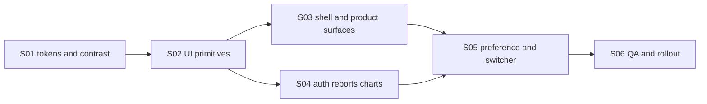

# E21: Цельная светлая тема Astrotype

**Цель (SMART):** реализовать и включить не позднее завершения E21 цельную светлую тему для всех активных web-поверхностей Astrotype, без чисто-белого фона и частичной инверсии: 100% маршрутов из матрицы покрытия используют семантические токены, основной текст проходит WCAG 2.1 AA, переключение `light/dark/system` не вызывает вспышки неверной темы, а визуальные проверки проходят на ширинах 390, 820 и 1440 px.

## Статус

🟡 Реализовано локально; CI и staging rollout ожидаются

В текущей локальной ветке semantic migration, selector и browser gates завершены. Публичный staging baseline пока остаётся на прежнем dark-lock release; E21 не считается выпущенной до green CI, authenticated staging smoke и rollback drill из S06.

## Проблема

Существовавшая светлая тема меняла только часть CSS-переменных. Значительная часть экранов продолжала использовать жёстко заданные тёмные фоны, светлый текст и полупрозрачные белые границы. Результат был слишком белым, неоднородным и местами нечитаемым.

E21 не должна «инвертировать» текущий дизайн. Она должна создать отдельную, спокойную светлую композицию в визуальном языке Astrotype: тёплая слоновая кость, приглушённый каменный фон, фиолетовые и золотые акценты, мягкая глубина и достаточный контраст.

## Дизайн-направление

### Эмоциональная цель

Светлая тема должна ощущаться как дневная версия той же системы: спокойная, тёплая, редакционная и собранная. Она не должна выглядеть как белая административная панель или стандартный SaaS-шаблон.

### Базовая палитра-кандидат

Окончательные значения фиксируются в S01 после contrast-проверки.

| Семантика        | Кандидат                 | Назначение                                  |
| ---------------- | ------------------------ | ------------------------------------------- |
| Canvas           | `#E9E4DC`                | Общий тёплый фон, не чистый белый           |
| Surface          | `#F5F1EA`                | Основные карточки и панели                  |
| Elevated surface | `#FBF8F2`                | Поповеры, модальные окна, поднятые карточки |
| Primary text     | `#201B2F`                | Основной текст                              |
| Muted text       | `#675F72`                | Вторичный текст                             |
| Border           | `rgba(55, 44, 78, 0.16)` | Спокойные разделители                       |
| Royal violet     | `#5B3FD6`                | Основной интерактивный акцент               |
| Accessible gold  | `#9A6A12`                | Текстовые золотые акценты на светлом фоне   |
| Error            | `#B93636`                | Ошибки и destructive actions                |

Чистый `#FFFFFF` не используется как фон страницы. Допустим только как локальный highlight с низкой площадью и подтверждённым контрастом.

## Зависимости

- [V2-E18 Product surface redesign](../E16-v2-e18-product-surface-redesign/FEATURE.md)
- [V2-E11 Web responsive reader](../E16-v2-e11-web-responsive-reader/FEATURE.md)
- [Frontend SRS](../../SRS/SRS-FRONTEND.md)
- [E21 SRS](../../SRS/SRS-E21-light-theme.md)
- `frontend/src/app/globals.css`
- `frontend/src/providers/theme-provider.tsx`
- `frontend/src/app/layout.tsx`
- `frontend/src/components/ui/`

## Scope

- Семантическая двухтемная система токенов для canvas, surfaces, typography, borders, controls, states, charts и overlays.
- Удаление жёстко заданных theme-sensitive цветов с активных пользовательских поверхностей.
- Полное покрытие shell, auth, dashboard, products, billing, settings, reports, charts, dialogs, loading/error/empty states.
- Переключатель `light/dark/system` только после прохождения completeness gate.
- Корректная инициализация темы до hydration без FOUC.
- Локальное сохранение несекретной theme preference.
- Визуальные, accessibility и responsive regression gates.
- Поэтапный staging rollout с возможностью мгновенного возврата к принудительной тёмной теме.

## Out of scope

- Ребрендинг или изменение типографической пары Astrotype.
- Перекомпоновка информационной архитектуры страниц, не необходимая для темы.
- Backend-профиль темы и синхронизация между устройствами.
- Новая система уведомлений или пользовательское меню.
- Изменение содержания отчётов, расчётов и billing-логики.
- Автоматическая генерация палитры из одного цвета.

## Матрица обязательного покрытия

| Группа        | Маршруты/поверхности                                                                          |
| ------------- | --------------------------------------------------------------------------------------------- |
| Public        | `/`, not-found                                                                                |
| Auth          | `/login`, `/register`, `/forgot-password`, `/reset-password`, `/verify`, `/auth/callback`     |
| Shell         | header, desktop sidebar, tablet rail, mobile drawer, overlays                                 |
| Account       | `/dashboard`, `/settings`, `/billing`, `/subscriptions`                                       |
| Products      | `/products/self`, `/products/love`, `/products/child`, `/products/career`                     |
| Reports       | `/report/v2/[profileId]`, `/products/career/report/[reportId]`, loading/locked/error states   |
| UI primitives | button, input, card, select, dialog, tooltip, badge, skeleton, toast/popover where used       |
| Data visuals  | natal chart, socionics legacy surface while active, infographics, progress and status visuals |

## Критерии приёмки

- [x] Светлая тема не содержит плоского белого canvas и сохраняет визуальную идентичность Astrotype.
- [x] Все строки матрицы покрытия проверены; нет смешения тёмных и светлых участков.
- [x] Theme-sensitive стили выражены через семантические токены или документированные product-accent tokens.
- [x] В активных поверхностях нет необоснованных жёстких `bg-[#...]`, `text-[#...]`, `border-white/...` и dark-only rgba.
- [x] Обычный текст и интерактивные элементы соответствуют WCAG 2.1 AA; focus ring видим в обеих темах.
- [x] Charts и инфографика различимы не только по цвету и читаемы в обеих темах.
- [x] `light`, `dark` и `system` корректно сохраняются и применяются до hydration без вспышки другой темы.
- [x] Theme switcher имеет понятные русские labels, keyboard support и отражает текущий режим.
- [x] Скриншотные сценарии пройдены на 390, 820 и 1440 px в обеих темах.
- [x] На каждой проверяемой ширине отсутствует горизонтальный overflow.
- [ ] Frontend tests, ESLint, Prettier, TypeScript и production build проходят.
- [ ] Staging smoke выполнен в обеих темах по ключевым маршрутам.
- [ ] Переключатель включён только после полноты покрытия; rollback возвращает принудительную тёмную тему без отката данных.

## Stories

| ID  | Story                                                                                             | Статус       |
| --- | ------------------------------------------------------------------------------------------------- | ------------ |
| S01 | [Определить семантические токены и контрастный контракт](./S01-theme-foundation.md)               | ✅ Завершено |
| S02 | [Перевести UI primitives на семантические токены](./S02-component-token-migration.md)             | ✅ Завершено |
| S03 | [Перевести shell и продуктовые поверхности](./S03-shell-and-product-surfaces.md)                  | ✅ Завершено |
| S04 | [Перевести auth, отчёты, charts и граничные состояния](./S04-reports-charts-auth.md)              | ✅ Завершено |
| S05 | [Вернуть выбор light/dark/system без hydration flash](./S05-theme-preference-and-switcher.md)     | ✅ Завершено |
| S06 | [Добавить visual/accessibility gates и безопасный rollout](./S06-visual-accessibility-rollout.md) | 🟡 Rollout   |

## Порядок реализации



## Стратегия тестирования

1. TDD-контракт запрещает возвращать switcher до завершения token migration.
2. Static audit выявляет hard-coded theme-sensitive colors в активных каталогах.
3. Component tests проверяют состояния controls в light/dark.
4. Browser tests проверяют theme initialization, persistence, system preference и отсутствие overflow.
5. Screenshot baselines покрывают ключевые поверхности и три viewport-класса.
6. axe/contrast checks дополняются ручной проверкой charts, disabled, hover, focus, error и overlays.
7. Staging rollout проходит canary сначала без switcher, затем с включённым switcher.

## Verification commands

```bash
cd frontend
npm test
npx eslint .
npx prettier --check .
npx tsc --noEmit --pretty false
npm run build
```

Browser gates:

```bash
cd frontend
npx playwright test tests/e2e/theme.spec.ts
npx playwright test tests/e2e/theme-visual.spec.ts
npx playwright test tests/e2e/theme-accessibility.spec.ts
```

## Rollback

Rollback не требует изменений БД. При обнаружении неполного покрытия:

1. вернуть root lock `className="dark"` + `forcedTheme="dark"`;
2. скрыть switcher;
3. оставить новые семантические токены в коде;
4. зафиксировать проблемные маршруты в S06 и повторить visual matrix до re-enable.
