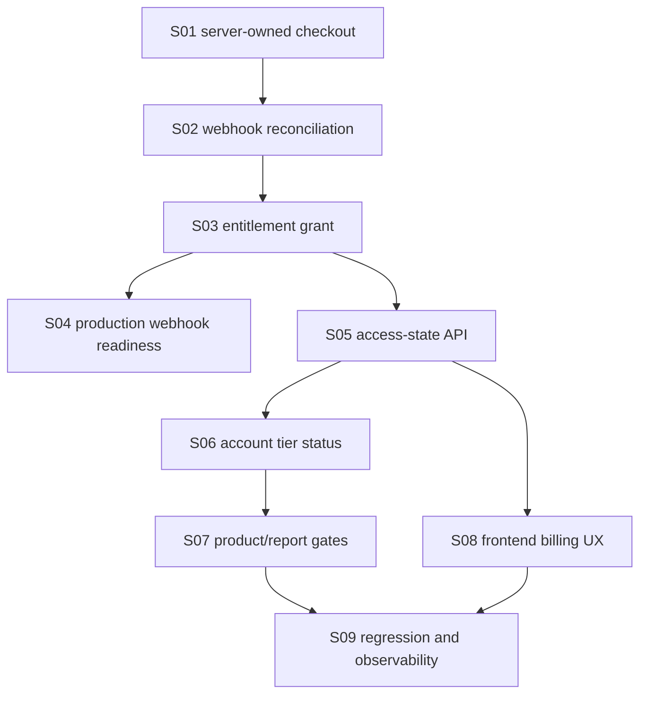

# E6: Billing & subscriptions — YooKassa payment confirmation

## Status

🟡 Частично реализовано

## Goal

Turn the audited payment-confirmation architecture in `docs/architecture/current-payment-confirmation-flow.md` into an implementation contract for billing, payment reconciliation, entitlement activation, account access state and frontend payment UX.

This feature answers one core question: Astrotype must treat a user as paid only after backend-confirmed YooKassa reconciliation, not after a browser redirect back from checkout.

## Source architecture

- Current audit: `../../architecture/current-payment-confirmation-flow.md`
- Account tier target: `../../architecture/account-tier-role-foundation.md`
- SRS: `../../SRS/SRS-E6-billing-subscriptions.md`

## Current implementation baseline

Already implemented and covered by `backend/tests/unit/test_payments.py`:

- server-owned checkout creation through `POST /api/v1/payments`;
- local `payments` row created before YooKassa checkout;
- YooKassa provider adapter can create and fetch provider payments;
- webhook endpoint exists at `POST /api/v1/payments/webhooks/yookassa`;
- webhook body is stored in `payment_webhooks`;
- backend fetches canonical YooKassa payment object before activation;
- reconciliation validates provider payment id, amount, currency and metadata;
- success requires `status == "succeeded"` and `paid == true`;
- successful payment grants an active product entitlement;
- duplicate webhook delivery does not duplicate entitlement.

Still missing or not fully wired:

- production webhook registration/readiness proof;
- access-state API for billing/frontend;
- frontend polling/refresh after `/billing?checkout=return`;
- account-tier `free`/`plus` update after confirmed payment;
- backend report/product gates that consistently use entitlements;
- user-visible billing status tied to backend state.

## Scope

- Checkout creation contract.
- YooKassa webhook reconciliation.
- Payment state transitions.
- Entitlement activation.
- Billing/access-state API.
- Frontend billing return and pending/success/failure states.
- Account-tier status update to `plus` as status-only, without feature restrictions.
- Report/product entitlement checks in later gated slices.
- Regression tests and production smoke checklist.

## Out of scope

- Changing YooKassa merchant pricing outside the server-owned catalog.
- Trusting return URLs, browser state, query params, or frontend flags as payment proof.
- Allowing frontend to provide amount/currency/description/commercial metadata.
- Introducing Free/Plus feature restrictions before the dedicated gating story.
- Replacing YooKassa with another PSP.
- Storing full payment card data.

## Payment proof rule

A client is paid only when the backend has reconciled the canonical YooKassa payment object server-to-server and persisted local success state:

```text
canonical_yookassa.status == "succeeded"
canonical_yookassa.paid == true
payments.status == "succeeded"
payments.paid_at IS NOT NULL
```

For product access, an active entitlement must also exist:

```text
entitlements.user_id = current user
entitlements.product = requested product
entitlements.status = "active"
entitlements.source_payment_id = confirmed payment id
```

The browser return from YooKassa is only a UX signal. It must trigger status refresh, not activation.

## Acceptance criteria

- [x] Checkout API accepts only product identifier and return URL from frontend.
- [x] Backend owns amount, currency, description and commercial metadata.
- [x] Local payment row is created before provider checkout is created.
- [x] YooKassa webhook is stored before processing.
- [x] Webhook processing fetches the canonical provider payment object server-to-server.
- [x] Reconciliation rejects amount/currency/metadata mismatches.
- [x] `succeeded` without `paid=true` does not activate access.
- [x] Confirmed successful payment stores `paid_at` and grants an entitlement.
- [ ] Production webhook URL is configured and verified against live YooKassa delivery.
- [ ] Billing/access-state API returns `free`, `checkout_pending`, `plus_active`, `payment_failed`, or `plus_inactive`.
- [ ] Frontend refreshes backend billing/access state after returning from YooKassa.
- [ ] Backend-confirmed payment upgrades account tier to `plus` as status-only.
- [ ] Free/Plus status does not restrict functionality until separate gating is enabled.
- [ ] Report/product endpoints use backend entitlement checks where paid access is required.
- [ ] Regression tests cover checkout, webhook reconciliation, entitlements, access-state API and frontend status UX.
- [ ] Production smoke proves one test payment creates both a succeeded payment and the expected access record.

## Stories

| ID  | Story                                                                                  | Status             |
| --- | -------------------------------------------------------------------------------------- | ------------------ |
| S01 | [Server-owned checkout creation](./S01-server-owned-checkout-creation.md)              | ✅ Реализовано     |
| S02 | [YooKassa webhook reconciliation](./S02-yookassa-webhook-reconciliation.md)            | ✅ Реализовано     |
| S03 | [Payment success state and entitlement grant](./S03-payment-success-entitlement.md)    | ✅ Реализовано     |
| S04 | [Production webhook readiness](./S04-production-webhook-readiness.md)                  | ⬜ Не начато       |
| S05 | [Billing access-state API](./S05-billing-access-state-api.md)                          | ⬜ Не начато       |
| S06 | [Payment-to-account-tier status update](./S06-payment-to-account-tier-status.md)       | ⬜ Не начато       |
| S07 | [Report and product entitlement gates](./S07-report-product-entitlement-gates.md)      | ⬜ Не начато       |
| S08 | [Frontend billing return and status UX](./S08-frontend-billing-return-status-ux.md)    | ⬜ Не начато       |
| S09 | [Payment confirmation regression and observability](./S09-regression-observability.md) | 🟡 Частично готово |

## Implementation order



## Verification commands

Current implemented backend slice:

```bash
./backend/.venv/bin/python -m pytest backend/tests/unit/test_payments.py -q
```

When access-state/account-tier/gating stories are implemented, extend verification with targeted tests for the changed modules, for example:

```bash
./backend/.venv/bin/python -m pytest backend/tests/unit/test_payments.py backend/tests/unit/test_authorization*.py -q
./backend/.venv/bin/ruff check backend/app/modules/payments backend/app/modules/authorization backend/tests/unit/test_payments.py
```

Frontend billing UX verification:

```bash
cd frontend
node scripts/check-billing-ux.mjs
npx eslint src/app/\(dashboard\)/billing/page.tsx src/components/billing src/lib/api/payments.ts
npx tsc --noEmit --pretty false
```

Production smoke checklist is defined in `S04-production-webhook-readiness.md` and must be run with YooKassa test credentials before live reliance.
