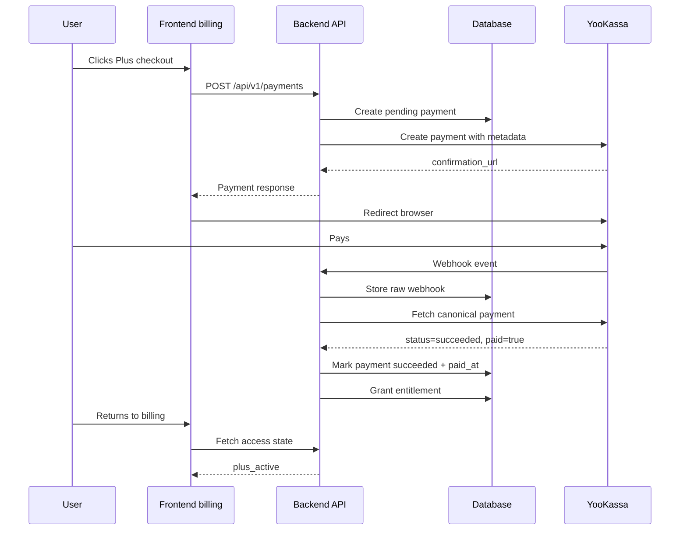
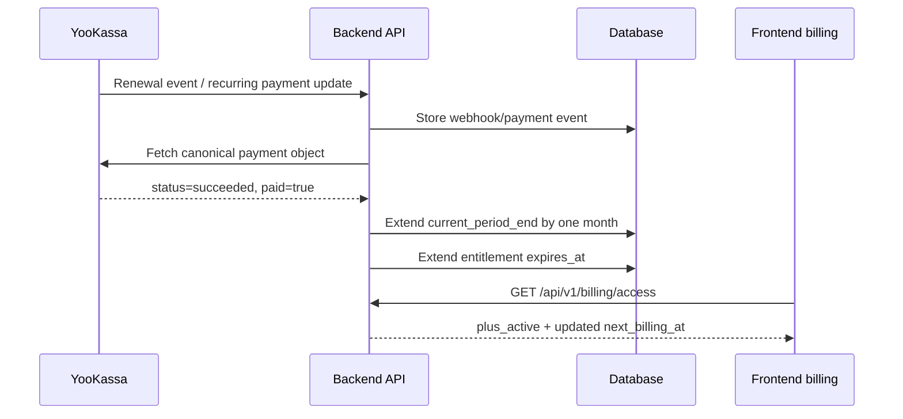

# E6 workflow: how payment confirmation works

## Status

🟡 Частично реализовано

## Purpose

This workflow explains the payment-confirmation path from the user's click on `/billing` to backend-confirmed access activation.

## User-facing scenario

1. User opens `/billing`.
2. User clicks the Plus checkout CTA.
3. Frontend asks backend to create a payment.
4. Backend creates a local payment row and asks YooKassa for a confirmation URL.
5. Browser redirects to YooKassa.
6. User completes or cancels payment on YooKassa.
7. YooKassa sends a webhook to Astrotype backend.
8. Backend fetches the canonical provider payment from YooKassa and reconciles it.
9. If and only if the provider object is successful and paid, backend marks local payment succeeded and activates access.
10. User returns to `/billing?checkout=return`; frontend must refresh backend access state and show the result.

## What proves payment

Payment is proven by backend reconciliation with YooKassa:

```text
YooKassa webhook/event -> backend fetches provider payment -> backend validates provider object -> backend updates local state
```

The following do not prove payment:

- return URL visit;
- query params on `/billing`;
- frontend component state;
- user-visible success copy;
- webhook body alone without provider fetch and validation.

## Happy path



## Pending path

If YooKassa has not delivered or finalized the webhook yet:

- local payment remains `pending` or `processing`;
- entitlement is not granted;
- frontend should show `checkout_pending` or “Проверяем оплату”;
- frontend may poll backend access state for a short bounded period.

## Failure/cancel path

If YooKassa returns `canceled`, mismatch, failed provider fetch, or `succeeded` without `paid=true`:

- access is not activated;
- entitlement is not granted;
- account tier remains unchanged;
- frontend should show a neutral retry state, not a fake success.

## Idempotency

Repeated webhook delivery must be safe:

- raw events can be recorded for audit;
- the same source payment must not create duplicate entitlements;
- already-confirmed payment state must remain stable.

## User-visible states

| State              | Meaning                                        | User copy direction                                   |
| ------------------ | ---------------------------------------------- | ----------------------------------------------------- |
| `free`             | No confirmed Plus access                       | “Базовый статус аккаунта”                             |
| `checkout_pending` | Payment attempt exists, not confirmed yet      | “Проверяем оплату. Это может занять немного времени.” |
| `plus_active`      | Confirmed payment/account access is active     | “Plus активен”                                        |
| `payment_failed`   | Latest attempt failed/cancelled/mismatched     | “Оплата не завершена. Можно попробовать ещё раз.”     |
| `plus_inactive`    | Previous Plus is no longer active, if expiring | “Plus сейчас не активен”                              |

## Current implementation frontier

The local implementation now covers backend confirmation, access-state API, account-tier status, frontend return-state UX, and first v2 self-report entitlement gates.

The remaining non-local production proof is YooKassa merchant-cabinet webhook registration plus a deployed HTTPS smoke run. The checklist is in `../../implementation/payment-confirmation-production-smoke.md`.

---

## Target monthly SaaS workflow

Status: target contract, not current implementation.

For a full SaaS model, Astrotype Plus is a monthly account subscription with explicit period control.

### Initial subscription path

1. User opens `/billing`.
2. User chooses monthly `Astrotype Plus`.
3. Frontend calls `POST /api/v1/subscriptions/checkout` with `plan_code='astrotype_plus_monthly'`.
4. Backend creates a subscription shell in `checkout_pending` / `incomplete` state.
5. Backend creates a local payment attempt and provider checkout.
6. User pays in YooKassa.
7. Backend reconciles provider payment server-to-server.
8. If successful and paid, backend sets:
   - `subscriptions.status='active'`;
   - `current_period_start=paid_at`;
   - `current_period_end=paid_at + 1 month`;
   - `users.account_tier='plus'` as display/status cache;
   - product entitlements with `expires_at=current_period_end`.
9. Frontend reads billing access and shows `Plus активен до <date>`.

### Renewal path



Renewal failure does not extend the period. If the current period has already ended, access becomes `past_due` or `plus_expired` depending on the configured policy.

### Cancellation path

1. User clicks cancel/manage subscription.
2. Backend calls provider cancellation or records a cancellation request only after provider confirmation/reconciliation.
3. Subscription becomes `cancel_scheduled` with `cancel_at_period_end=true`.
4. Plus remains active until `current_period_end`.
5. At period end, subscription becomes `plus_expired` / `cancelled`, account tier returns to `free`, and paid APIs lock.

### User-visible monthly states

| State | Meaning | Required UI direction |
| --- | --- | --- |
| `free` | No active monthly subscription | Offer monthly Plus |
| `checkout_pending` | Initial payment not confirmed | Checking payment, no fake success |
| `plus_active` | Paid period is active and renewal is enabled | Show active-until and next billing date |
| `cancel_scheduled` | Renewal disabled, paid period still active | Show active-until and no next charge |
| `past_due` | Renewal failed and policy is unresolved | Ask user to update payment |
| `plus_expired` | Paid period ended | Lock paid APIs and offer reactivation |
| `plus_suspended` | Provider/legal block | Explain support/retry path safely |

### Monthly workflow invariants

- `Plus активен` must always be backed by `current_period_end > now`.
- Billing UI must show when Plus ends.
- A browser return from YooKassa still does not prove payment.
- A successful initial payment creates one paid month, not lifetime Plus.
- A successful renewal extends exactly one billing interval.
- Cancellation stops future billing but does not erase the paid period.
