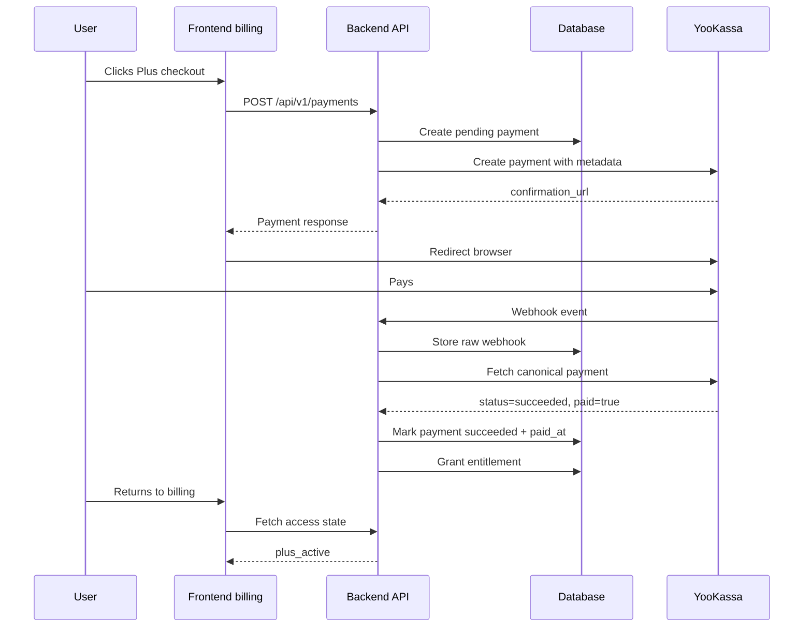

# E6 workflow: how payment confirmation works

## Status

🟡 Частично реализовано

## Purpose

This workflow explains the payment-confirmation path from the user's click on `/billing` to backend-confirmed access activation.

## User-facing scenario

1. User opens `/billing`.
2. User clicks the Plus checkout CTA.
3. Frontend asks backend to create a payment.
4. Backend creates a local payment row and asks YooKassa for a confirmation URL.
5. Browser redirects to YooKassa.
6. User completes or cancels payment on YooKassa.
7. YooKassa sends a webhook to Astrotype backend.
8. Backend fetches the canonical provider payment from YooKassa and reconciles it.
9. If and only if the provider object is successful and paid, backend marks local payment succeeded and activates access.
10. User returns to `/billing?checkout=return`; frontend must refresh backend access state and show the result.

## What proves payment

Payment is proven by backend reconciliation with YooKassa:

```text
YooKassa webhook/event -> backend fetches provider payment -> backend validates provider object -> backend updates local state
```

The following do not prove payment:

- return URL visit;
- query params on `/billing`;
- frontend component state;
- user-visible success copy;
- webhook body alone without provider fetch and validation.

## Happy path



## Pending path

If YooKassa has not delivered or finalized the webhook yet:

- local payment remains `pending` or `processing`;
- entitlement is not granted;
- frontend should show `checkout_pending` or “Проверяем оплату”;
- frontend may poll backend access state for a short bounded period.

## Failure/cancel path

If YooKassa returns `canceled`, mismatch, failed provider fetch, or `succeeded` without `paid=true`:

- access is not activated;
- entitlement is not granted;
- account tier remains unchanged;
- frontend should show a neutral retry state, not a fake success.

## Idempotency

Repeated webhook delivery must be safe:

- raw events can be recorded for audit;
- the same source payment must not create duplicate entitlements;
- already-confirmed payment state must remain stable.

## User-visible states

| State              | Meaning                                        | User copy direction                                   |
| ------------------ | ---------------------------------------------- | ----------------------------------------------------- |
| `free`             | No confirmed Plus access                       | “Базовый статус аккаунта”                             |
| `checkout_pending` | Payment attempt exists, not confirmed yet      | “Проверяем оплату. Это может занять немного времени.” |
| `plus_active`      | Confirmed payment/account access is active     | “Plus активен”                                        |
| `payment_failed`   | Latest attempt failed/cancelled/mismatched     | “Оплата не завершена. Можно попробовать ещё раз.”     |
| `plus_inactive`    | Previous Plus is no longer active, if expiring | “Plus сейчас не активен”                              |

## Current gaps

The backend confirmation core exists. The user-visible lifecycle is not complete until the access-state API and frontend return-state UX are implemented.
