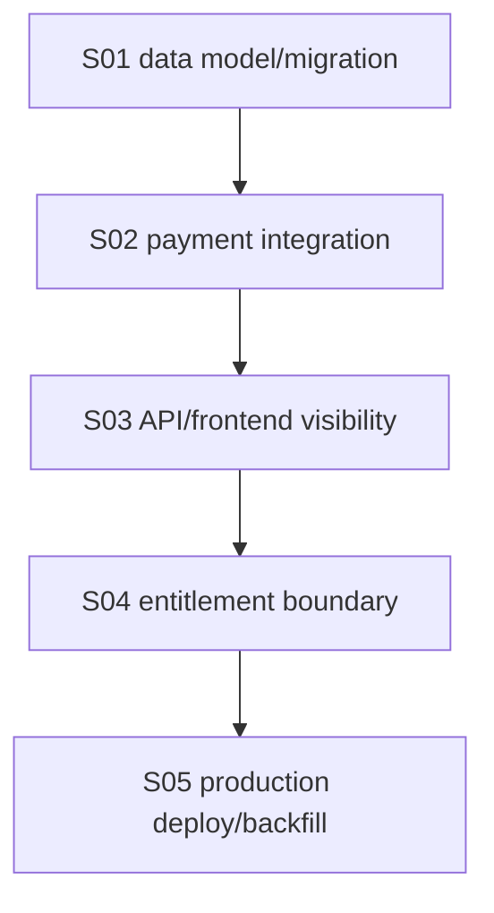

# E7: Account tier role foundation

## Status

🟡 Audit reopened: S01/S02/S04 gaps and automatic webhook smoke remain open

## Goal

Turn `docs/architecture/account-tier-role-foundation.md` into an implementation contract for account-level Free/Plus status, payment-to-tier upgrade, current-user visibility, and the safety boundary between tier display and entitlement-based authorization.

This feature answers one product/platform question: Astrotype may show a user as Free or Plus, but access to paid products must be proven by backend-confirmed payment and active entitlements, not by frontend state or by `account_tier` alone.

Successor policy: `../E8-account-level-report-access/FEATURE.md` defines the target report matrix—basic report for every authenticated account, all other reports only with active Plus. E7 remains the implemented tier foundation and does not claim that E8 gating is already shipped.

## Source architecture

- Architecture: `../../architecture/account-tier-role-foundation.md`
- SRS: `../../SRS/SRS-E7-account-tier-role-foundation.md`
- Consolidated audit: `./AUDIT-discrepancies.md`
- Payment confirmation flow: `../../architecture/current-payment-confirmation-flow.md`
- Related billing feature: `../E6-billing-subscriptions/FEATURE.md`

## Current implementation baseline

Implemented in `main`:

- `users.account_tier` exists in the current codebase with default `free`.
- Successful backend-reconciled YooKassa payment upgrades the account tier to `plus`.
- Failed, cancelled, mismatched, or unpaid payment events do not upgrade the tier.
- `/users/me` and billing access state expose `account_tier` in the current codebase.
- Free/Plus tier is status-oriented; paid content gates use entitlements.

Production deployed/backfilled on 2026-09-02:

- production source deployed to `/opt/astrotype` with `.deploy-sha = f17a23a3a2df05fedc4fe0057873277e95826f4f`;
- backend/worker/frontend containers rebuilt and restarted;
- Alembic reached `d3e4f5a6b7c8`;
- production database has non-null `users.account_tier` for all users;
- public `GET /api/v1/billing/access` returns auth error for unauthenticated requests instead of 404;
- existing paid users `fixemer90@gmail.com` and `balthier90@mail.ru` were backfilled to `plus` from succeeded payment + active `self` entitlement.

Still open after the 2026-09-26 re-audit:

- enforce the documented `free`/`plus` allowed-value invariant;
- add the missing replay/direct-service regression tests;
- make entitlement access safe when one user has several rows for the same product;
- prove one fresh YooKassa payment through normal automatic webhook delivery.

## Scope

- Account-tier data model and migration.
- Account-tier service boundary.
- Payment success integration.
- Current-user and billing-access API exposure.
- Frontend display/status consumption without frontend-only paywall behavior.
- Entitlement-vs-tier boundary documentation and regression tests.
- Production deploy/migration/backfill runbook for existing paid users.

## Out of scope

- Admin/RBAC permission checks based on `plus`.
- Report-type access classification and gating; this is owned by E8 and still must not rely on `account_tier` alone.
- Subscription expiry/renewal lifecycle.
- Trial/family/past_due/cancelled tier states.
- Retrofitting historical payments into roles without an audited backfill.
- Frontend-only paid access decisions.

## Product rule

```text
account_tier = account/commercial status
entitlement = product access proof
```

The first tier implementation must not silently become the authorization boundary.

Allowed:

```text
show status: Free / Plus
read tier in /users/me or /billing/access
upgrade tier after backend-confirmed payment
```

Not allowed:

```text
return paid report content because account_tier == plus
hide API data only in frontend while backend still returns it
mark payment successful from return_url/query params
```

## Acceptance criteria

- [x] `users.account_tier` exists in code with default `free`.
- [x] Existing users are preserved and defaulted/backfilled safely by migration.
- [ ] Database/application boundaries reject account-tier values outside `free` and `plus`.
- [x] `AccountTierService` is the named service boundary for tier updates.
- [x] Backend-confirmed YooKassa `succeeded + paid=true` upgrades tier to `plus`.
- [x] Failed/cancelled/mismatched/unpaid payment events do not upgrade tier.
- [x] Replayed webhook remains idempotent.
- [ ] Regression tests execute repeated successful webhook/tier-upgrade calls and prove idempotence.
- [x] Current-user or billing-access API exposes `account_tier`.
- [x] Frontend can display status/access state without treating tier alone as a paywall.
- [x] Paid report/product authorization uses active entitlements, not tier alone.
- [ ] Entitlement authorization remains stable when a user has multiple rows for the same product.
- [x] Production deploy applies the account-tier migration.
- [x] Existing production paid users are audited/backfilled only by confirmed succeeded payment + active entitlement.
- [ ] Production smoke proves a new paid checkout upgrades the expected account tier through normal automatic webhook delivery.

## Stories

| ID  | Story                                                                                                | Status                                |
| --- | ---------------------------------------------------------------------------------------------------- | ------------------------------------- |
| S01 | [User tier data model and migration](./S01-user-tier-data-model-migration.md)                        | 🟡 Allowed-value enforcement missing  |
| S02 | [Payment-to-tier service integration](./S02-payment-to-tier-service-integration.md)                  | 🟡 Replay regression evidence missing |
| S03 | [Tier visibility in APIs and frontend status](./S03-tier-visibility-api-frontend.md)                 | ✅ Verified and deployed              |
| S04 | [Tier vs entitlement authorization boundary](./S04-tier-entitlement-authorization-boundary.md)       | 🟡 Multi-entitlement safety missing   |
| S05 | [Production deploy, migration and paid-user backfill](./S05-production-deploy-migration-backfill.md) | 🟡 Automatic webhook smoke pending    |

## Implementation order



## Verification commands

Current local code/docs slice:

```bash
cd backend
./.venv/bin/python -m pytest tests/unit/test_payments.py tests/unit/test_auth_service.py tests/unit/test_dependencies.py -q
./.venv/bin/ruff check app/modules/users app/modules/auth app/modules/authorization app/modules/payments app/modules/billing tests/unit/test_payments.py
./.venv/bin/python -m mypy .

cd ../frontend
node scripts/check-billing-ux.mjs
npx eslint src/app/\(dashboard\)/billing/page.tsx src/lib/api/payments.ts
npx tsc --noEmit --pretty false
```

Production verification must use `S05-production-deploy-migration-backfill.md` after deploy.
