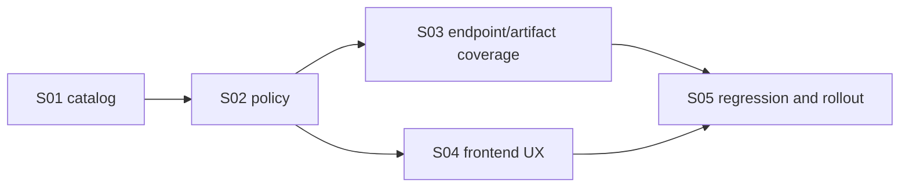

# E8: Account-level report access

## Status

⬜ Не начато — target contract documented

## Goal

Implement one consistent account-level report policy across backend and clients: the basic Astrotype natal report is available to every authenticated account, while every other report requires active Plus access.

## Product rule

```text
Free -> basic report
Plus -> basic report + all other reports
```

The backend, not frontend visibility, owns this decision. `account_tier` may be displayed but does not replace active subscription/entitlement verification for Plus-only reports.

## Source documents

- Architecture: `../../architecture/account-levels-report-access-policy.md`
- SRS: `../../SRS/SRS-E8-account-level-report-access.md`
- Account tier foundation: `../E7-account-tier-role-foundation/FEATURE.md`
- Billing/subscription feature: `../E6-billing-subscriptions/FEATURE.md`
- Monthly Plus contract: `../../architecture/monthly-plus-subscription-contract.md`

## Current implementation gap

Current v2 report routes check the `self` entitlement and can lock the Self report for Free accounts. The target policy requires the canonical basic report to bypass paid entitlement checks after authentication, while retaining backend checks for every Plus-only report operation.

Documentation defines the target; no E8 story is complete until code and tests prove it.

## Scope

- Canonical report catalog and `basic` / `plus_only` classification.
- Migration/alias decision for current `self` and `self_full` identifiers.
- Backend policy for create, generate, read, status, segments, calculation layer, regenerate and PDF/export.
- API locked metadata without protected payload leakage.
- Frontend account-level matrix, labels and upgrade UX.
- Regression tests, migration safety and rollout smoke.

## Out of scope

- Anonymous report access.
- More than one free/basic report type.
- Changing natal report content or LLM generation quality.
- Deleting historical reports on downgrade or expiry.
- Treating `account_tier` alone as active subscription proof.
- Silently converting historical lifetime-like purchases into expiring subscriptions.

## Acceptance criteria

- [ ] Exactly one canonical report type is classified as `basic`.
- [ ] Every other current and future report type defaults to `plus_only`.
- [ ] Free and Plus accounts can create, generate, read, regenerate and export the basic report.
- [ ] Free accounts cannot access Plus-only report payloads through direct API/artifact routes.
- [ ] Active Plus accounts can use every enabled Plus-only report.
- [ ] Expired/inactive Plus accounts retain basic-report access and lose Plus-only access without data deletion.
- [ ] `account_tier='plus'` alone cannot bypass active-access checks.
- [ ] Frontend labels the basic report as available to every account and other reports as Plus-only.
- [ ] Web, Android/PWA and optional desktop clients consume the same backend policy result.
- [ ] Existing report rows, profiles and generated artifacts survive catalog/migration changes.
- [ ] Read-after-expiry behavior for previously generated Plus-only reports is explicitly decided before rollout.

## Stories

| ID  | Story                                                                                            | Status       |
| --- | ------------------------------------------------------------------------------------------------ | ------------ |
| S01 | [Define report catalog and access classes](./S01-report-catalog-access-classes.md)               | ⬜ Не начато |
| S02 | [Implement backend report access policy](./S02-backend-report-access-policy.md)                  | ⬜ Не начато |
| S03 | [Apply policy to every report operation and artifact](./S03-report-operation-policy-coverage.md) | ⬜ Не начато |
| S04 | [Implement account-level report UX](./S04-frontend-account-level-report-ux.md)                   | ⬜ Не начато |
| S05 | [Add regression, migration and rollout proof](./S05-regression-migration-rollout.md)             | ⬜ Не начато |

## Implementation order



## Verification

Docs-only contract verification:

```bash
git diff --check -- docs/architecture/account-levels-report-access-policy.md docs/features/E8-account-level-report-access docs/SRS/SRS-E8-account-level-report-access.md
```

Implementation verification targets are defined in each Story. Do not mark this Feature complete from documentation-only checks.
