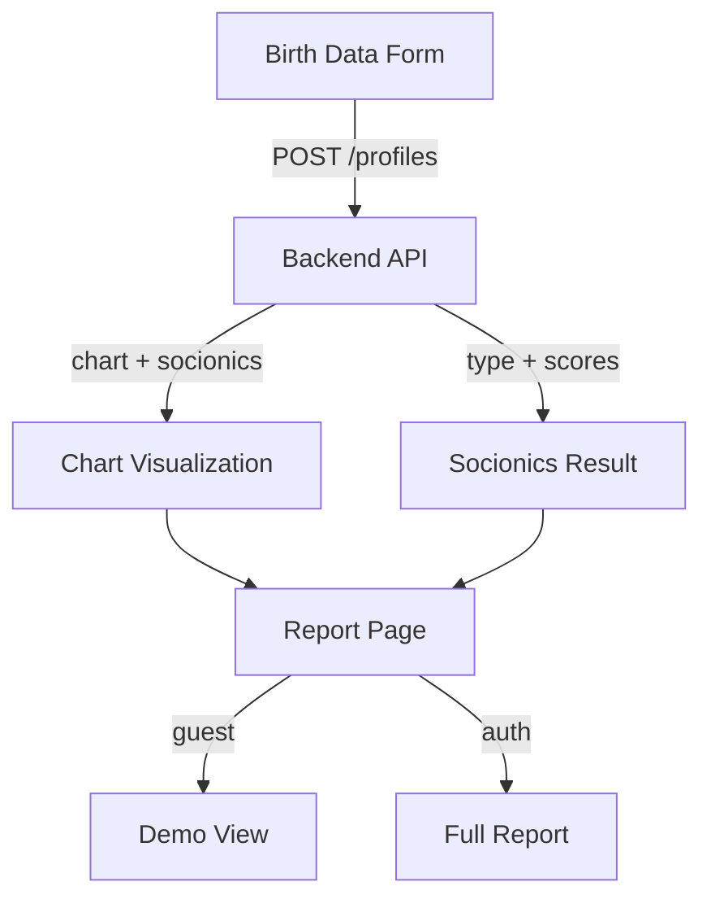

# Feature E9: Frontend — Self Report

## Цель

Первая кликабельная страница продукта: пользователь вводит данные рождения, получает натальную карту и соционический тип с интерпретацией. Это MVP-путь "ввёл дату → увидел результат".

## Зависимости

- `E3` (Chart Engine) ✅ — карта считается
- `E4` (Rules & Content) 🟡 — socionics.py с Model A готов, YAML-правила и шаблоны待定
- `E2` (Identity) 🟡 — авторизация через JWT

## Критерии приёмки

- [ ] Форма ввода: дата, время, место рождения с геокодингом
- [ ] Карта отображается: планеты в знаках/домах, аспекты
- [ ] Соционический тип: топ-3 с scores и Model A breakdown
- [ ] Функциональный профиль: 8 функций (Se/Si/Ne/Ni/Fe/Fi/Te/Ti) с визуализацией
- [ ] Адаптивный дизайн (mobile-first)
- [ ] Авторизация: гость видит демо, авторизованный — полный отчёт

## Stories

| ID | Описание | Статус |
|---|---|---|
| S01 | [Birth Data Form: форма ввода даты/времени/места с геокодингом и валидацией](S01-birth-data-form.md) | ⬜ Не начато |
| S02 | [Chart Visualization: отображение натальной карты (планеты, дома, аспекты)](S02-chart-visualization.md) | ⬜ Не начато |
| S03 | [Socionics Result: топ-3 типа, scores, Model A breakdown, функциональный профиль](S03-socionics-result.md) | ⬜ Не начато |
| S04 | [Report Page: сборка страницы отчёта из компонентов формы, карты, результата](S04-report-page.md) | ⬜ Не начато |
| S05 | [Auth Integration: гостевой доступ (демо) + полный доступ для авторизованных](S05-auth-integration.md) | ⬜ Не начато |

## Архитектура

## Технологический стек

- Next.js 15 + React 19
- Tailwind CSS 4 + shadcn/ui
- TanStack Query для API calls
- Zustand для состояния формы
- Recharts или custom SVG для визуализации функций
