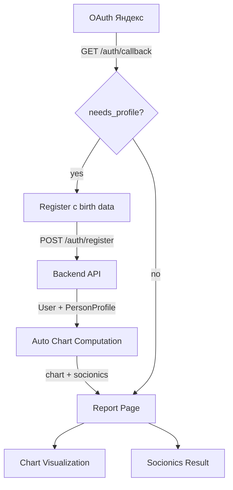

# Feature E9: Frontend — Self Report

## Цель

Первая кликабельная страница продукта: пользователь регистрируется с полными данными рождения, получает натальную карту и соционический тип. Это MVP-путь "зарегистрировался → увидел результат".

## Зависимости

- `E3` (Chart Engine) ✅ — карта считается
- `E4` (Rules & Content) 🟡 — socionics.py с Model A готов, YAML-правила и шаблоны待定
- `E2` (Identity) ✅ — авторизация через JWT + OAuth Яндекс

## Критерии приёмки

- [x] Регистрация собирает всё: email, password, дата, время, место рождения
- [x] OAuth через Яндекс с получением birthday
- [x] Карта отображается: планеты в знаках/домах, аспекты
- [x] Соционический тип: топ-3 с scores и Model A breakdown
- [x] Функциональный профиль: 8 функций (Se/Si/Ne/Ni/Fe/Fi/Te/Ti) с визуализацией
- [ ] Адаптивный дизайн (mobile-first) — требует тестирования
- [ ] Report Page: реальные данные из API (сейчас placeholder)

## Stories

| ID | Описание | Статус |
|---|---|---|
| S01 | [Auth Screens: login, register с birth data, OAuth callback, geocoding](S01-auth-screens.md) | 🟡 В процессе |
| S02 | [Chart Visualization: отображение натальной карты (планеты, дома, аспекты)](S02-chart-visualization.md) | ✅ Готово |
| S03 | [Socionics Result: топ-3 типа, scores, Model A breakdown, функциональный профиль](S03-socionics-result.md) | ✅ Готово |
| S04 | [Report Page: сборка страницы отчёта из компонентов карты и результата](S04-report-page.md) | 🟡 В процессе |

## Архитектура

## Технологический стек

- Next.js 15 + React 19
- Tailwind CSS 4 + shadcn/ui
- TanStack Query для API calls
- Zustand для состояния формы
- Custom SVG для визуализации (ChartWheel, FunctionRadar)
