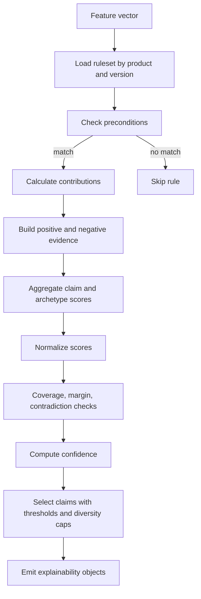
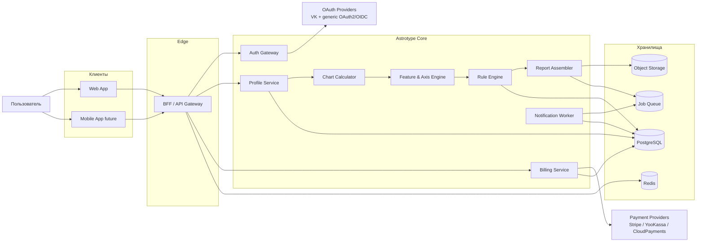
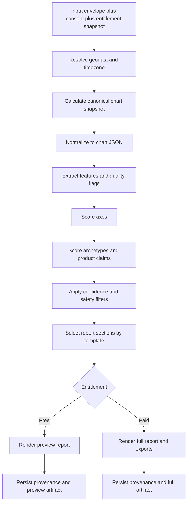

# Спецификация бизнес-логики и доменных правил Astrotype

## Резюме для руководства

Astrotype разумно проектировать не как четыре разрозненных продукта, а как единое rule-driven ядро с четырьмя продуктовыми пакетами правил: **Astrotype Self**, **Astrotype Love**, **Astrotype Child** и **Astrotype Career**. Базовая логика уже задана правильно: пользователь вводит данные рождения, платформа строит канонический snapshot карты, извлекает объяснимые признаки, считает архетипы и доменные claims, а затем собирает персональный отчет. Критично сохранить именно эту последовательность: детерминированный расчет и explainable scoring — первичны, narrative layer — вторичен и не должен изобретать новые утверждения вне доказательной базы. fileciteturn0file0

Для всех четырех продуктов рекомендую одинаковый скелет бизнес-логики: **input envelope → chart snapshot → normalized features → axes → archetypes/claims → confidence → report assembly → entitlement-aware rendering**. Это позволяет выносить вариативность не в код ветвлений, а в versioned-конфигурации: rule packs, archetype catalogs, report templates, consent policies, paywall matrices и provider adapters. Такой подход прямо поддерживает ваши требования о масштабируемости, отсутствие хардкода и AI-friendly документации. fileciteturn0file0

Для аутентификации следует использовать единый Auth Gateway с **Authorization Code flow**, **PKCE**, обязательной проверкой `state` и строгим совпадением `redirect_uri`; **implicit flow** и **resource owner password credentials grant** использовать не следует, а для native/mobile клиентов вход должен идти через внешний browser/user-agent, а не через embedded webview. Если используется OIDC, ID Token нужно валидировать по `iss`, `aud` и подписи; refresh tokens для public clients должны быть sender-constrained или использовать rotation. citeturn31view0turn31view1turn31view3turn4view0turn4view1turn4view3turn4view5turn33view2turn37view2

Для подписок и paywall-логики нужен серверный ledger и **webhook-first** подход: клиентский redirect никогда не должен сам по себе открывать доступ. Stripe предоставляет полнофункциональный lifecycle для subscriptions, invoices, retries и receipts; ЮKassa — idempotence, сохранение способа оплаты для автоплатежей, webhook-уведомления и чеки по 54‑ФЗ; CloudPayments — рекуррентные планы, HMAC-валидацию уведомлений, `X-Request-ID`, онлайн-чеки и собственную retry-модель. Privacy baseline должен строиться на lawful basis, transparency, data minimization, storage limitation, design/default safeguards, records of processing и breach procedures; если сервис ориентируется на пользователей в ЕС, GDPR может применяться и к компании вне ЕС. citeturn16view0turn17view0turn17view1turn17view2turn23view0turn24view1turn25view0turn25view2turn26view0turn21view0turn22view0turn22view1turn22view2turn22view4turn28view0turn35view0turn29view1turn30view1turn30view2turn29view4

В этом отчете я фиксирую конкретную рабочую спецификацию, но помечаю как **unspecified** следующие вещи: точные веса скоринга, окончательный каталог архетипов, выбранную библиотеку/эфемериды для расчета карты, финальную юрисдикцию, коммерческие цены и точные VK-specific scopes/endpoints. Все они должны жить во внешней конфигурации и иметь собственное versioning, а не быть зашиты в код.

## Продуктовый контур и функциональные спецификации

Ниже — предложенная продуктовая спецификация поверх общего deterministic engine. Для всех продуктов действует общее правило качества данных: если время рождения отсутствует или недостоверно, движок не должен «угадывать» дома/ASC-зависимые утверждения; вместо этого он выключает соответствующие rules, снижает confidence и явно сообщает об ограничении точности. Это согласуется с исходной концепцией explainable, deterministic scoring и научно честной подачи результата. fileciteturn0file0

| Продукт | Кто использует | Обязательные входы | Ключевые вычисляемые признаки | Основной результат | Free-уровень | Paid-уровень |
|---|---|---|---|---|---|---|
| **Astrotype Self** | Один пользователь | Дата рождения, место рождения; время — желательно | Базовые оси личности, доминирующие паттерны, сильные/теневые зоны | Личный профиль, архетипы, сильные стороны, зоны напряжения, рефлексия | Короткий preview, 2–3 claims, teaser-архетипы | Полный отчет, evidence-view, PDF, история версий |
| **Astrotype Love** | Пара или один инициатор пары | Два профиля рождения; relation context | Совместимость темпа, конфликтные векторы, стиль близости, коммуникация | Парный отчет, strengths/frictions, рекомендации по взаимодействию | Короткий pair preview, 1–2 strengths, 1 tension teaser | Полный pair report, shared workspace, PDF, сценарии общения |
| **Astrotype Child** | Родитель/опекун | Профиль ребенка, guardian context, возрастная группа | Ритм регуляции, чувствительность, стиль поддержки, переходы/рутина | Caregiver-oriented report, support guide, routine hints | Краткая support summary | Полный guide, возрастные рекомендации, printable routines |
| **Astrotype Career** | Один пользователь | Профиль рождения; optional work context | Role affinity, decision style, ambiguity tolerance, collaboration style | Карьерные роли, рабочая среда, anti-patterns, growth map | 1 role cluster + teaser claims | Полный career map, team-fit, environment-fit, PDF |

**Astrotype Self.** Поток пользователя: ввести профиль рождения → получить deterministic preview → увидеть прозрачное предупреждение о quality level → при наличии entitlement открыть полный отчет. Доменные входы: `birth_date`, `birth_time`, `birth_time_accuracy`, `birth_place`, `timezone_resolved`, optional `language`, optional короткие self-tags, которые не меняют core score, а только помогают выбрать секции отчета. Ключевые вычисляемые признаки: базовые оси, доминирующие паттерны, интенсивность структурности/спонтанности/чувствительности/экспансии, а также top-N архетипов. Стартовый каталог Self-архетипов разумно взять таким: **Стратег, Творец, Исследователь, Опора, Дипломат, Катализатор, Наставник, Строитель**; families claims — identity, strengths, shadow, stress style, relational style, reflection prompts. Пример product-rule: если `axis.logic >= 0.70` и `feature.earth_emphasis >= 0.60`, увеличить `archetype.builder` и `claim.self.structure_strength`; пример scoring snippet: `self.builder = 0.40*axis.logic + 0.35*feature.earth_emphasis + 0.25*feature.saturn_order`. Free-уровень должен давать teaser без сохранения в себе иллюзии полноты; paid открывает полный narrative, evidence-trail, экспорт и сохранение artifacts.

**Astrotype Love.** Поток: инициатор создает pair-workspace → добавляет свой профиль и второй профиль → получает preview pair-dynamics → после подтверждения entitlement открывает полный pair-report. Если второй взрослый участник не подтвердил участие, безопасный режим — **локальный черновик**: отчет создается для инициатора, но без публичного share-link и без долговременного collaborative access. Входы: `subject_a_profile`, `subject_b_profile`, `relationship_type`, optional `relationship_stage`, optional `goals`, optional `known_tensions`. Ключевые признаки: **communication sync**, **friction polarity**, **closeness/autonomy balance**, **repair style**, **decision asymmetry**, **tempo gap**. Стартовый love-catalog: **Инициатор связи, Хранитель близости, Миротворец, Катализатор пары, Прагматик союза, Искатель свободы**; claim families — attraction, communication, boundaries, rituals, conflict, repair. Пример rule: если `pair.tempo_gap <= 0.20` и `pair.dialogue_complement >= 0.65`, поднять `pair.communication_sync`; пример scoring snippet: `love.communication_sync = 0.45*tempo_match + 0.30*dialogue_complement - 0.25*conflict_polarity`. Я бы **не делал** единственный «магический процент совместимости» главным продуктовым объектом; важнее показывать многомерную карту пары. Free-уровень — одна сильная сторона и одна зона трения; paid — детальная структура взаимодействия, shared report и action plan.

**Astrotype Child.** Поток: родитель/опекун создает child-workspace → вводит профиль ребенка и возрастную группу → получает support-oriented preview → unlock полного guide по подписке или product entitlement. Это должен быть **не диагностический** продукт: он не ставит диагнозы, не типологизирует ребенка «навсегда», не делает прогнозов медицинского или образовательного характера, а лишь выдает caregiver-oriented hypotheses и поддерживающие практики; такой тон соответствует исходной установке на научную честность и отказ от «предсказаний» как абсолютных истин. fileciteturn0file0 Входы: `child_profile`, `guardian_relation`, `age_band`, optional `current_concerns`, optional `routine_context`. Ключевые признаки: **need for predictable routine**, **novelty tolerance**, **sensory sensitivity**, **transition load**, **social readiness**, **soothing style**. Стартовый child-catalog: **Исследователь, Наблюдатель, Ритм-стабилизатор, Творческий экспериментатор, Социальный связующий, Бережный адаптер**; claim families — regulation, routine, transitions, environment, socialization, caregiver prompts. Пример rule: если `child.sensitivity >= 0.75` и `child.transition_load >= 0.60`, поднять `claim.child.predictable_routine_helpful`; пример scoring snippet: `child.regulation_support = 0.50*sensitivity + 0.30*transition_load + 0.20*sleep_risk`. Free-режим — мягкий summary и 2–3 поведенческих подсказки; paid — полный support guide, возрастные варианты и printable routine cards.

**Astrotype Career.** Поток: пользователь вводит профиль → optionally отвечает на короткий work-context survey → получает role preview → открывает полный map of work styles. Важно, чтобы survey не ломал deterministic core: он должен работать как **calibration layer**, а не как скрытая вторая модель. Входы: `subject_profile`, optional `industry`, `role_level`, `team_size`, `preferred_work_mode`, `motivation_tags`. Ключевые признаки: **systemizing**, **ambiguity tolerance**, **execution rhythm**, **influence style**, **leadership readiness**, **collaboration mode**, **environment fit**. Стартовый career-catalog: **Системный архитектор, Аналитик, Оператор, Фасилитатор, Предприниматель, Исследователь, Наставник, Продюсер**; claim families — strengths at work, ideal environment, team role, anti-patterns, growth edge. Пример rule: если `career.logic >= 0.70`, `career.ambiguity_tolerance >= 0.55` и `feature.house10_focus >= 0.60`, поднять `career.system_architect`; пример scoring snippet: `career.system_architect = 0.35*logic + 0.25*ambiguity_tolerance + 0.25*house10_focus + 0.15*saturn_structure`. Free-уровень — один role-cluster и teaser; paid — полный role map, team-fit, environment-fit и guidance по развитию.

Для всех четырех продуктов полезно держать общий принцип формулировки результата: не «ты есть X навсегда», а «в текущей системе правил у тебя выражен паттерн X с confidence Y, потому что сработали правила A, B и C, при этом есть counter-evidence D». Именно это делает продукт одновременно пользовательски понятным, юридически осторожным и AI-friendly для документации и дальнейшей разработки. fileciteturn0file0

## Доменная модель, скоринг и каталог правил

Домен нужно строить так, чтобы **score** и **confidence** были независимыми сущностями. `score` отвечает на вопрос «насколько выражен паттерн», а `confidence` — «насколько надежно он вычислен на имеющихся данных и в данном ruleset». Это напрямую поддерживает объяснимую, deterministic модель, которую вы хотите. fileciteturn0file0

| Сущность | Ключевые атрибуты | Связи и назначение |
|---|---|---|
| **UserAccount** | `user_id`, `status`, `locale`, `created_at` | Владелец workspace, подписок, consent records |
| **IdentityLink** | `provider`, `provider_subject_id`, `claims_snapshot`, `linked_at` | Связь аккаунта с VK/generic OAuth2/OIDC provider |
| **ConsentRecord** | `consent_id`, `subject_ref`, `purpose`, `legal_basis`, `granted_at`, `revoked_at`, `evidence` | Основание обработки по конкретной цели |
| **SubjectProfile** | `subject_id`, `birth_date`, `birth_time`, `birth_time_accuracy`, `birth_place`, `timezone`, `profile_type` | Базовый объект для Self, Love, Child, Career |
| **PairProfile** | `pair_id`, `subject_a_id`, `subject_b_id`, `relationship_type`, `sharing_mode` | Только для Love; хранит pair-context |
| **GuardianLink** | `guardian_user_id`, `child_subject_id`, `relation_type`, `verified_state` | Только для Child |
| **ProductContext** | `product_code`, `context_json`, `questionnaire_answers` | Career context, relation goals, child concerns |
| **ChartSnapshot** | `chart_snapshot_id`, `engine_version`, `ephemeris_version`, `normalized_chart_json` | Каноническое представление расчета |
| **FeatureVector** | `feature_schema_version`, `features_json`, `quality_flags` | Нормализованные признаки для rule engine |
| **RuleSetVersion** | `product_code`, `semver`, `effective_from`, `flags`, `template_refs` | Версия правил и порогов |
| **RuleEvaluation** | `run_id`, `rule_id`, `activated`, `contribution`, `evidence_json` | Трассировка применений правил |
| **ClaimArtifact** | `claim_id`, `section`, `score`, `confidence`, `evidence_refs`, `counter_evidence_refs` | Единица explainability |
| **ReportArtifact** | `report_id`, `product_code`, `report_schema_version`, `template_version`, `rendered_json`, `pdf_ref` | Версионированный итог отчета |
| **Subscription** | `subscription_id`, `plan_code`, `state`, `current_period_end` | Коммерческая оболочка доступа |
| **EntitlementGrant** | `grant_id`, `subject_scope`, `feature_scope`, `active_from`, `active_to` | Истинный источник решения «что открыто» |
| **PaymentEvent** | `provider`, `provider_event_id`, `type`, `status`, `raw_payload_ref` | Локальный ledger и webhook history |
| **AuditEvent** | `event_type`, `actor`, `target`, `occurred_at`, `metadata` | Security/compliance trail |

**Расчетный контракт** я бы фиксировал так. Сначала каждая feature нормализуется в диапазон `[0..1]` или дискретный enum. Потом rule engine считает вклад отдельного правила:

`contrib_r = w_r × match_r × q_input × q_rule`

где `w_r` — вес правила, `match_r` — степень срабатывания правила, `q_input` — качество входных данных, `q_rule` — reliability multiplier самого правила. Затем claim- или archetype-score агрегируется:

`score_k = clamp((bias_k + Σ support_r − λ × Σ counter_r) / max_possible_k, 0, 1)`

Здесь `support_r` — позитивные вклады, `counter_r` — контрдоказательства, `λ` — коэффициент штрафа за противоречие. Важно, что **контрдоказательства не теряются**: они идут не только в confidence, но и в evidence-trail. Точные коэффициенты `w_r`, `bias_k`, `λ` и `max_possible_k` должны считаться **unspecified business parameters** и версионироваться отдельно от кода.

**Confidence-модель** разумно сделать четырехфакторной:

`confidence = 0.35*q_input + 0.30*q_coverage + 0.20*q_margin + 0.15*q_consistency`

где `q_input` зависит от точности времени рождения и полноты контекста; `q_coverage` — доля веса активированных правил к весу eligible rules; `q_margin` — насколько top claim отделен от ближайшего конкурента; `q_consistency` — насколько мало внутреннего конфликта между активированными rules. Практически это дает полезные коды причин: `MISSING_BIRTH_TIME`, `LOW_RULE_COVERAGE`, `HIGH_CONTRADICTION`, `LOW_MARGIN`, `PAIR_CONTEXT_MISSING`, `GUARDIAN_UNVERIFIED`.

```yaml
rule_id: career.system_architect.v1
product: career
status: active
version: 1.0.0
effective_from: 2026-01-01
depends_on:
  - feature.axis.logic
  - feature.ambiguity_tolerance
  - feature.house10_focus
conditions:
  all:
    - fact: feature.axis.logic
      op: gte
      value: 0.70
    - fact: feature.ambiguity_tolerance
      op: gte
      value: 0.55
    - fact: feature.house10_focus
      op: gte
      value: 0.60
effects:
  archetype.system_architect: 0.18
  claim.career.system_design_strength: 0.14
confidence_adjustments:
  - when:
      fact: quality.birth_time
      op: lt
      value: 0.50
    delta: -0.08
counter_rules:
  - career.high_spontaneity_low_structure.v1
evidence:
  template_key: ev.career.system_architect
  show_basis_features:
    - feature.axis.logic
    - feature.ambiguity_tolerance
    - feature.house10_focus
flags:
  feature_flag: career_role_model_v1
localization:
  locale: ru-RU
```

```json
{
  "claim_id": "career.system_design_strength",
  "section": "career_roles",
  "score": 0.77,
  "confidence": {
    "value": 0.73,
    "label": "medium_high",
    "reason_codes": ["GOOD_MARGIN", "HIGH_COVERAGE"]
  },
  "message_template": "Сильна роль системного проектировщика: вам легче работать там, где много структуры, зависимостей и правил.",
  "basis": [
    {
      "rule_id": "career.system_architect.v1",
      "feature": "feature.axis.logic",
      "value": 0.81,
      "contribution": 0.18
    },
    {
      "rule_id": "career.system_architect.v1",
      "feature": "feature.house10_focus",
      "value": 0.66,
      "contribution": 0.14
    }
  ],
  "counter_evidence": [
    {
      "rule_id": "career.high_spontaneity_low_structure.v1",
      "feature": "feature.spontaneity",
      "value": 0.62,
      "contribution": -0.05
    }
  ],
  "provenance": {
    "chart_engine_version": "chart-1.3.0",
    "feature_schema_version": "features-2.1.0",
    "ruleset_version": "career-1.0.0",
    "template_version": "career-ru-1.2.0",
    "build_sha": "abcdef1"
  }
}
```

Шаблон evidence-trail должен быть first-class объектом, а не побочным логом. Идеально, если любой claim в UI можно раскрыть до ответа на четыре вопроса: **какие факты использованы**, **какие правила сработали**, **какие были контрдоказательства**, **какая версия движка это посчитала**. Это снимает сразу три риска: недоверие пользователя, сложность отладки и невозможность безопасно обновлять rulesets.



## Архитектура исполнения, сборка отчетов и масштабирование

Базовое модульное разбиение уже просматривается в исходной концепции: **Auth**, **Chart Calculation**, **Feature Extractor**, **Archetype Scorer**, **Text/Explanation Generator**, **Report Builder**, **Payment/Subscription**, **Data Storage** и **Admin/Analytics**. Ниже я перевожу это в C4-контур, но с важной оговоркой: на старте это может быть один **modular monolith + workers**, а не преждевременный zoo из микросервисов. fileciteturn0file0



В проде эти контейнеры стоит делать **stateless/share-nothing**: данные, которые должны жить дольше одного запроса или job-run, не должны оставаться в памяти процесса или локальной файловой системе. Sticky sessions лучше не использовать; веб-процессы должны быстро стартовать, корректно завершаться, а worker jobs — быть reentrant/idempotent, чтобы безопасно переживать рестарты и масштабирование. citeturn32view0turn32view1

Источник истины я бы держал в **PostgreSQL**. Он покрывает account data, consent records, profiles, ledger, grants, rule evaluations и report metadata. **Redis** нужен для короткоживущего cache, distributed locks, rate limits и dedupe по webhook/job. **Object Storage** — для JSON/PDF-артефактов и possibly signed download links. **Queue** — для рендеринга отчетов, e-mail delivery, webhook reprocessing, reconciliation jobs и purge workflows. Никакой отдельный vector DB для baseline-версии не нужен: он противоречит идее minimal/no runtime AI и добавляет ненужную operational complexity.



Runtime AI лучше держать **off by default**. Допустимый компромисс — optional asynchronous narrative post-processor, который только перефразирует уже отобранные claims и evidence, но не может добавить ни новый факт, ни новое правило, ни новое численное значение. Core path должен оставаться rule-first: никаких скрытых embeddings, никаких LLM в scoring loop, никаких «semantic overrides» поверх deterministic result. Это полностью соответствует исходной идее проекта. fileciteturn0file0

AI-friendly документация в этой архитектуре — это не «описание для ассистента в prose», а **machine-readable contracts**. Минимальный набор артефактов я бы заложил такой:

```text
/docs/product/self.md
/docs/product/love.md
/docs/product/child.md
/docs/product/career.md
/docs/domain/entities.md
/docs/domain/scoring.md
/docs/domain/consent.md
/rules/self/*.yaml
/rules/love/*.yaml
/rules/child/*.yaml
/rules/career/*.yaml
/schemas/report.schema.json
/schemas/rule.schema.json
/schemas/entitlement.schema.json
/adr/*.md
/fixtures/golden/*.json
```

Именно такое дерево делает AI Driven Development полезным: модели могут помогать писать код, тесты, миграции и документацию **по формальным контрактам**, но продовая логика при этом остается прозрачной и воспроизводимой. Хардкод в таком контуре должен быть запрещен как класс: rules, thresholds, sections, archetype labels, localization strings, provider configs, receipt policies и feature flags должны жить вне application code.

## Аутентификация, биллинг и модель доступов

Внутри платформы нужен единый **identity contract**, общий для VK и всех future OAuth2/OIDC providers: `authorize`, `callback`, `refresh`, `logout`, `link`, `unlink`. Для web и mobile оптимальный базовый паттерн — **Authorization Code + PKCE**, не использовать implicit grant, не использовать password grant, валидировать `state` и точный `redirect_uri`, а если провайдер говорит по OIDC — еще и валидировать `iss`, `aud` и подпись ID Token. Для future mobile app авторизация должна идти через внешний браузер/user-agent, а не внутри встроенного webview. Где доступно discovery/metadata, provider endpoints лучше подтягивать из metadata, а не хардкодить вручную; права токена стоит ограничивать минимально необходимым scope. Для VK это означает не «особый» auth path, а provider adapter поверх того же внутреннего контракта, с VK-specific endpoints/scopes в конфиге. citeturn31view0turn31view1turn31view3turn4view0turn4view1turn4view5turn33view2turn37view1turn37view2

Серверная сессия должна быть **первичного домена**, а не «передачей провайдерского токена на фронт и обратно». Provider tokens лучше хранить только на backend-side и по возможности не дольше, чем это нужно для link/unlink и profile sync. Для public clients refresh tokens должны быть либо sender-constrained, либо использовать rotation; для native clients это особенно важно. citeturn33view2turn33view3

Ниже — рекомендуемая коммерческая модель. Она исходит из практики: у частей Astrotype отчет статичен или квазистатичен, поэтому чистая подписка без recurring value будет слабой. Повторяемая ценность должна быть не в «новой натальной карте», а в workspace-функциях: history, pair-space, child-space, rerender on latest rules, exports, mobile sync.

| Тир | Состав | Основные entitlements | Ограничения |
|---|---|---|---|
| **Free** | Preview всех продуктов | Preview-отчеты, 1 self-profile, teaser claims, методология | Нет full report, PDF, pair sharing, saved child/career workspaces |
| **Personal** | Полный **Self** + **Career** | Full reports, PDF, history, rerender latest rules, saved profiles | Love и Child только в preview |
| **Family** | Полный **Self** + **Love** + **Child** | Pair-workspace, guardian dashboard, exports, family library | Career только в preview |
| **All Access** | Все четыре продукта | Full access everywhere, exports, rerender latest, future mobile sync, priority queue | Цены и SLA — unspecified |

Дополнительно я бы **рекомендовал** поддержать разовый product unlock как отдельный SKU, потому что часть пользователей будет хотеть купить один полный отчет без recurring commitment. Это не ломает подписочную модель, а снижает трение на первом платеже и уменьшает churn-давление на продукт.

Paywall-логика должна работать так: сначала генерируется deterministic preview; затем пользователь инициирует checkout; backend создает локальный `BillingIntent`; после redirect UI показывает `pending`; доступ открывается **только** после верифицированного provider event; entitlement materialize-ится в `EntitlementGrant`; затем API уже само решает, какие sections открыть. Для failed payment и renewals пригодна локальная state machine: `pending → active → grace → past_due | canceled | unpaid`. Stripe прямо описывает states `incomplete`, `active`, `past_due`, `unpaid`, `canceled`, а также рекомендует ориентироваться на события вроде `invoice.paid`, `invoice.payment_failed` и `invoice.payment_action_required`; эту модель удобно взять как внутренний reference model для всех провайдеров. citeturn16view0turn17view0

| Провайдер | Модель recurring | Подтверждение и webhook pattern | Retry/ошибки | Чеки/receipts | Когда выбирать |
|---|---|---|---|---|---|
| **Stripe** | Нативные subscriptions, invoices, entitlements-like lifecycle | HTTPS webhook, подпись, быстрый `2xx`, async events | Smart Retries или custom retries | Payment receipts и paid invoices | Глобальный рынок, mature subscription lifecycle |
| **ЮKassa** | Сохранение способа оплаты и merchant-driven автоплатежи | Уведомления по HTTPS/TLS 1.2+, `200 OK`, проверка IP/статуса объекта | Поведение renewal управляется вашей логикой вокруг saved payment method | 54‑ФЗ чеки через ЮKassa | РФ, локальные способы оплаты и фискализация |
| **CloudPayments** | Provider-managed recurrent plan или token recurring | Basic Auth API, HMAC headers, JSON ack, X-Request-ID | Повтор через сутки, отмена после трех неудач подряд | Онлайн-чеки и online fiscal flow | РФ, если нужен готовый договорной recurring plan |

Практически это означает следующее. **Stripe** дает полноценный lifecycle подписки: при создании subscription может использоваться `default_incomplete`, initial invoice имеет ограниченное окно на оплату, success подтверждается `invoice.paid`, failed renewals можно обрабатывать через Smart Retries и соответствующие webhook events. **ЮKassa** строит автоплатеж на сохраненном способе оплаты: пользователь соглашается на привязку, вы храните `payment_method_id`, а дальше сами создаете повторные платежи без повторного ввода реквизитов; webhook endpoint должен отдавать `200`, иначе уведомления продолжают доставляться до 24 часов. **CloudPayments** позволяет запускать план рекуррентных платежей, повторяет неудачную попытку через сутки и после трех неудач подряд переводит подписку в terminal state; входящие уведомления проверяются по HMAC, а API поддерживает идемпотентность через `X-Request-ID`. citeturn16view0turn17view0turn17view1turn24view1turn25view0turn25view1turn25view2turn22view0turn22view1turn22view4

Для карточных данных safest-path — вообще не принимать PAN/CVV на стороне Astrotype. Stripe предлагает prebuilt checkout/payment UI; CloudPayments прямо рекомендует ограничивать доступ к карточным данным, использовать виджет/iframe или tokenization checkout и не логировать полный номер карты и CVV. В домене Astrotype должны жить только `provider_customer_id`, `payment_method_ref`, masked display fields и billing state, но не первичные карточные реквизиты. citeturn38view0turn38view1turn36view1turn36view3

Receipt/fiscal-паттерн тоже должен быть абстрагирован. Stripe умеет автоматически отправлять payment/refund receipts и itemized receipts для invoice/subscription payments; ЮKassa может формировать чеки по 54‑ФЗ и передавать данные в налоговую; CloudPayments поддерживает онлайн-чеки и отправку покупателю. Обязательность этих чеков зависит от юрисдикции, а она у вас пока unspecified, поэтому в спецификации лучше держать отдельный `ReceiptService` и не смешивать его с `BillingService`. citeturn17view2turn26view0turn22view2

## Безопасность, приватность, тестирование и эволюция

С GDPR-like точки зрения **точные дата/время/место рождения**, account identifiers и generated profile outputs — это персональные данные, а производимые платформой profile outputs подпадают под понятие **profiling**. Для компаний вне ЕС это тоже не «чужая» тема: GDPR распространяется и на контролеров вне Союза, если они предлагают услуги лицам в Союзе или мониторят их поведение. citeturn28view0turn30view3

Lawful basis нужно назначать **по purpose**, а не «один раз на весь аккаунт». Для **Self** и **Career** это чаще всего consent и/или contract — в зависимости от того, как именно вы продаете доступ. Для **Love** persistent storage чужого взрослого профиля, введенного не самим субъектом данных, — наиболее рискованный сценарий; тут лучше делать режим локального черновика до invite/confirm или документировать отдельное основание обработки, а также помнить про обязанности информирования, когда данные получены не от самого data subject. Consent должен быть доказуемым, отделимым от прочих условий и отзываться так же легко, как давался; privacy notice должен раскрывать цели, правовое основание, сроки хранения, получателей и права пользователя. citeturn35view0turn29view1turn30view0

Для **Child** нужна отдельная guardian model. GDPR отдельно регулирует детское согласие для информационных сервисов: базовое возрастное правило — 16 лет, но государства-члены могут опустить порог не ниже 13, а контролер должен прилагать разумные усилия для проверки parental authorization. Даже если продукт де-факто работает через родителя, разумно применять более строгий baseline: отдельный `GuardianLink`, более короткую retention policy, отсутствие публичных share-links, отключенный direct marketing и максимально мягкий, не диагностический tone of voice. Для **Career** нужно отдельно зафиксировать продуктовый запрет: отчет нельзя использовать как единственное основание для найма, увольнения, повышения, понижения или иной decision, которая вызывает юридический или аналогично значимый эффект; в такой зоне уже включаются требования о safeguards и human intervention. citeturn30view0turn29view3turn30view3

Privacy-by-design и security-by-default здесь не абстракция, а прямое требование архитектуры. GDPR требует appropriate technical and organisational measures, в том числе pseudonymisation/encryption, минимизацию по умолчанию, ограничение доступности и регулярное тестирование эффективности мер безопасности; при data breach есть well-known 72-hour benchmark для уведомления authority, когда он применим; а records of processing activities в реальной SaaS-конфигурации почти наверняка будут обязательны или, как минимум, крайне желательны с точки зрения доказуемости compliance. citeturn30view1turn30view2turn29view4

| Контур данных | Что хранится | Рекомендуемый базовый срок | Событие удаления/сужения | Особые ограничения |
|---|---|---|---|---|
| **Self** | Профиль рождения, chart snapshot, feature vector, report artifact | До удаления пользователем или 24 месяца неактивности | User delete / account closure / inactivity policy | Share-link optional, not public by default |
| **Love** | Два adult-profile ref, pair context, pair report | Пока pair-space активен; затем 12 месяцев неактивности | Revoke by either party / pair unlink | До подтверждения второго участника — локальный черновик |
| **Child** | Child profile, guardian link, caregiver report | Короче остальных: 12 месяцев неактивности или удаление guardian | Guardian delete / failed re-verification / inactivity | No public links, stricter export defaults |
| **Career** | Work-context answers, role scores, report | До удаления пользователем или 12 месяцев неактивности | User delete / inactivity policy | Employer sharing off by default |
| **Billing/Audit** | Payment refs, receipts refs, consent logs, audit events | По legal/accounting retention, срок unspecified | После истечения обязательных сроков | Никогда не хранить raw card data |

Сроки в таблице — это **рекомендуемая product policy**, а не универсальная норма права. Они должны корректироваться с учетом accounting law, налоговой отчетности, legal hold и договора с PSP. Но даже при любой локальной адаптации над ними должны доминировать принципы **data minimisation**, **storage limitation** и **right to erasure**. citeturn35view0turn29view2

Тестовый контур я бы строил в шесть слоев. Во-первых, **unit tests** для feature transformers, score formulas, confidence logic и rule parser. Во-вторых, **integration/contract tests** для OAuth callback, token refresh, webhook verification, provider sandboxes и receipt flows. В-третьих, **golden-master fixtures**: анонимизированные профили с эталонными outputs, по которым проверяется, что новый ruleset не ломает старые ожидания без осознанного решения. В-четвертых, **rule simulation CLI**, который умеет прогонять старую и новую версию правил на одном и том же fixture-наборе и показывать diff по scores, confidence и claims. В-пятых, **snapshot tests** на report templates, чтобы локализация и layout не ломали смысл. В-шестых, **safety fixtures** для Child и Career, чтобы недопустимые wording patterns, overclaiming и скрытые диагнозы/decision-like формулировки не проходили в релиз.

Миграции и versioning лучше вести отдельными потоками: `chart_engine_version`, `ephemeris_version`, `feature_schema_version`, `ruleset_version`, `template_version`, `entitlement_matrix_version`, `provider_adapter_version`. Любой `ReportArtifact` должен хранить полный provenance tuple плюс `build_sha`. Правильная стратегия обновления не «пересчитать все молча», а **dual-run and compare**: новая версия rule pack прогоняется в тени на golden-set; если delta превышает бизнес-порог, создается ADR, где фиксируются причина, ожидаемый эффект и migration plan. Paid artifacts лучше считать **immutable by default**: если ruleset изменился, старый купленный отчет остается старой версией, а новый пересчет создает новый artifact.

Минимальный набор ADR, который я бы заложил сразу: **Auth model and provider registry**, **Billing abstraction and provider choice**, **Report immutability policy**, **Consent and retention model**, **Child safety boundaries**, **Career non-decision-use policy**, **Optional runtime AI policy**. Если эти решения будут письменно зафиксированы рано, платформа останется AI-friendly для разработки, но rule-first, audit-friendly и масштабируемой в проде. fileciteturn0file0